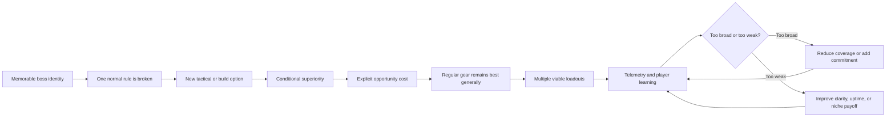

# Designing Boss-Tied Unique Items That Stay Relevant Without Power-Creeping the Gear Ladder

## Executive summary

A max-level-relevant boss unique should not be designed as a permanently superior item. It should be designed as a **persistent option**: an item that remains worth owning, remembering, and occasionally equipping because it changes what the player can do, when they can do it, or how they construct a build. Its value should come primarily from **optionality, mechanics, and context**, while ordinary tiered, rare, crafted, or raid gear retains the highest broadly applicable numerical efficiency.

This distinction resolves the apparent contradiction in “always useful but never mandatory.” “Always useful” should mean that the item retains a discoverable use case at maximum progression—not that it should remain equipped continuously. “Never mandatory” means that it must not dominate most builds, most encounters, and most progression states simultaneously. Path of Exile’s developers have explicitly identified the danger: Crystallised Omniscience became attractive to a wide variety of elemental builds and reduced itemization diversity because it supplied both penetration and the resistances that would otherwise compete with attribute stacking. Conversely, Grinding Gear Games has also described the opposite failure, where many uniques became so underwhelming that finding one was no longer exciting. citeturn15view0turn15view1

The strongest general pattern is:

> **Break exactly one normal equipment or combat rule, grant a conditional advantage for doing so, and charge an explicit cost in ordinary stat efficiency, flexibility, uptime, or risk.**

This resembles Last Epoch’s stated division between power uniques and mechanic-changing uniques, with the latter forcing a choice between raw stats and mechanical capability. It also aligns with Diablo IV’s original itemization goal that items should support and enhance a class rather than entirely define it, and with Blizzard’s rejection—during development—of an item quality that would simply invalidate other qualities. citeturn9search1turn1search0

The recommended performance envelope is asymmetric:

| Measure | Recommended starting target |
|---|---:|
| Performance versus excellent regular gear in ordinary content | 90–98% |
| Performance in the unique’s intended situation | 105–115% |
| Performance in its deliberately unfavorable situation | 75–92% |
| Broad endgame adoption among eligible characters | 5–25% |
| Adoption inside its intended niche build | 25–55% |
| Maximum acceptable adoption in a broad archetype before investigation | Approximately 60% |
| Contribution of a utility unique to total sustained damage | Usually below 10–15% |
| Contribution of a build-defining unique | Potentially much higher, but only with a 15–30% opportunity cost elsewhere |

These are design guardrails, not universal empirical constants. Exact values are **unspecified** because the requested platform, combat duration, number of equipment slots, trading model, death penalty, and party structure are unspecified.

Boss provenance should reinforce identity and acquisition—not excuse excessive power. Diablo IV’s endgame bosses were introduced as target-farming sources for specific uniques, while Realm of the Mad God associates high-end forge recipes with characteristic dungeons and bosses. Such provenance makes the boss memorable and gives players an intelligible pursuit, but rarity alone cannot safely balance an item that is compulsory after it drops. citeturn2search6turn10search7

The report’s central recommendations are therefore:

1. Keep regular gear best at unconditional numerical performance.
2. Give boss uniques narrow but legible superiority windows.
3. Scale effects from character progression sublinearly, rather than copying the full gear ladder.
4. Balance generality and power inversely: the more situations an effect covers, the weaker it must be.
5. Use deterministic acquisition safeguards for functional uniques, while preserving rare cosmetic, perfect-roll, or variant chases.
6. Test dominance by build and encounter—not merely by global equip rate.
7. Rebase defensive chassis or base item level when expansions advance, but avoid repeatedly inflating the unique effect.
8. Treat rapid swapping, hidden multipliers, universal resource solutions, and reward-amplifying gear as high-risk designs.

## The design target: principles, metrics, and player psychology

### What “always useful” should mean

An item remains useful at maximum level when at least one of the following remains true:

- It solves a recurring encounter problem more efficiently than regular gear.
- It enables a build or rotation that cannot otherwise exist.
- It changes positioning, targeting, resource flow, defense, or party coordination.
- It creates a specialized farming, practice, accessibility, or information function.
- It is an optimal swap for a clearly bounded phase, without becoming a compulsory repetitive swap for every damage cycle.
- It offers a horizontal alternative whose value does not depend directly on its original item level.

Realm of the Mad God provides a particularly clear model. DECA has described tiered weapons as the normalized progression line while UT weapons are intended to be “out-of-the-norm” alternatives. More recently, tiered Summoner abilities were standardized around Wisdom scaling, while different UT maces were allowed to scale from different character attributes. This creates an evergreen distinction based on build shape rather than merely on higher base numbers. citeturn0search0turn10search10

A useful formal test compares a unique \(u\) with the best reasonably attainable regular item \(r\) in context \(c\):

\[
L_c = \frac{P_u(c)-P_r(c)}{P_r(c)}
\]

where \(P\) is a multidimensional performance score covering damage, survival, control, mobility, resource stability, party contribution, or completion probability.

A healthy unique normally satisfies:

\[
\exists c_t : L_{c_t} > \epsilon
\]

for at least one meaningful target context \(c_t\), while also satisfying:

\[
\sum_c w_c L_c \leq 0
\]

across the player’s full expected content mix. In plain English, the item wins somewhere important but does not win everywhere in aggregate.

The value of \(\epsilon\) should exceed ordinary run-to-run noise. Five percent may be sufficient in a deterministic MMO rotation; ten or fifteen percent may be needed in a highly variable action game. The appropriate value is **unspecified** without combat-variance data.

### What “never mandatory” should mean

An item becomes functionally mandatory when several forms of dominance overlap:

- **Performance dominance:** it provides a significant output or survival gap.
- **Coverage dominance:** the advantage applies in most relevant encounters.
- **Build dominance:** it supports many unrelated builds rather than one deliberate niche.
- **Slot dominance:** no regular item in the same slot can compensate through different stats.
- **Acquisition dominance:** content is tuned as though players already possess it.
- **Social dominance:** groups, rankings, or community guides treat the item as an admission requirement.
- **Convenience dominance:** it removes so much friction—resource costs, immunities, positioning, or failure risk—that declining to use it feels irrational.

A practical monitoring score is:

\[
M = A \times C \times G \times F
\]

where:

- \(A\) is eligible-character adoption, normalized from zero to one.
- \(C\) is the share of relevant content where the unique is superior.
- \(G\) is the normalized performance gap over the strongest regular alternative.
- \(F\) is the combined acquisition, respec, and social friction of playing without it.

No single threshold works across genres, but the multiplication is useful because an item with high adoption but almost no performance gap may be popular rather than mandatory, while a low-drop item with a very large gap and broad coverage can be mandatory even before global adoption becomes high.

Path of Exile’s 3.19 balance explanation is an unusually explicit example: Crystallised Omniscience was changed not merely because it was powerful, but because it had become the ideal choice across too large a variety of builds and reduced diversity in the rest of the equipment system. Melding of the Flesh was similarly given an additional maximum-resistance penalty after it outcompeted other forms of elemental mitigation in well-equipped builds. citeturn15view1

### The psychological contract

A well-designed unique supports three important player experiences:

**Autonomy:** The player chooses a different strategy rather than following an obvious upgrade arrow.

**Competence:** The player learns when the unique is valuable and executes around its trigger, positioning constraint, resource cycle, or drawback.

**Identity and relatedness:** Boss provenance, visible effects, trading value, party coordination, and recognizable playstyles make the acquisition socially meaningful.

Research applying self-determination theory to games found that autonomy, competence, and relatedness independently predicted enjoyment and intended future play in multiplayer contexts. The same research found particularly strong relationships between autonomy and enjoyment. This supports designing uniques as understandable strategic choices rather than opaque numerical obligations. citeturn7view0turn8view1

Rarity can make drops emotionally salient, but it is not a substitute for design quality. Experimental work on randomized rewards found that rarer loot-box rewards produced greater reported value, arousal, and reward response. That makes rarity a powerful presentation and anticipation tool, but it also means that flooding the unique category with unusable items degrades the signal players have learned to associate with the drop presentation. citeturn6search7

Grinding Gear Games encountered exactly that signal problem: it reported that many uniques had become underwhelming, that drop volume had been increased partly to preserve occasional exciting finds, and that the resulting abundance further devalued the average unique drop. Its response combined reduced unique-drop volume with substantial reworks intended to make items more distinctive. citeturn15view0

### Metrics that distinguish popularity from compulsion

Global equip rate is insufficient. A rigorous telemetry package should include:

| Metric | Interpretation |
|---|---|
| Eligible equip rate | Adoption among characters that could rationally use the item |
| Build-conditional equip rate | Whether one optional build uses it or an entire class requires it |
| Encounter-conditional equip rate | Whether it is a deliberate specialist tool |
| Slot replacement rate | How often a superior regular item is declined because the unique effect is too valuable |
| Counterfactual performance gap | Estimated result if the same player substitutes best available regular gear |
| Unique contribution share | Portion of damage, healing, mitigation, or control attributable to the unique |
| Swap frequency | Whether the item creates healthy preparation or repetitive compulsory micro-swapping |
| Build entropy | Whether viable build diversity is rising or collapsing |
| Clear-rate delta | Effect on completion probability, not merely training-dummy output |
| Group exclusion correlation | Whether parties reject players who lack the item |
| Acquisition-adjusted adoption | Adoption after accounting for how many players actually own it |
| Stash persistence | Whether max-level players retain the item even when it is not equipped |
| Tooltip comprehension | Whether players can correctly predict the effect and drawback |
| Regret rate | How often players describe the item as necessary, useless, or punishing to replace |

Build entropy can be expressed as:

\[
H=-\sum_i p_i \ln(p_i)
\]

where \(p_i\) is the share of endgame characters using build \(i\). A unique that increases its own adoption while increasing \(H\) may be enabling diversity. A unique that increases adoption while sharply reducing \(H\) is likely centralizing the metagame.

## How uniques remain exciting after ordinary gear outgrows them

### Situational superiority

The safest evergreen unique grants a large benefit only when a recognizable condition is present:

- Stationary or highly mobile enemies
- Dense packs or isolated bosses
- Enemies with armor, barriers, adds, projectiles, or repeated telegraphs
- Burst phases separated by downtime
- Encounters where cleansing, displacement, interruption, or mobility matters
- Solo versus party play
- High-risk modes such as permadeath, hardcore, or limited revives

The condition should be common enough that the item remains worth keeping but narrow enough that it does not define the default loadout. A useful target is that the item’s advantage applies during 10–35% of endgame playtime, although the appropriate range is genre-dependent.

Conditional power also needs a positive trigger. Bungie’s retrospective on Destiny 2’s Celerity perk is instructive: the perk was extremely powerful when it activated, but its trigger depended on the player’s teammates being dead, which felt like betting against the team; Bungie also found it effectively useless outside a narrow activity set. High theoretical magnitude could not compensate for a demoralizing condition and negligible practical coverage. citeturn9search7

### Explicit tradeoffs

A unique should usually lose part of the standard slot budget. Common costs include:

- Lower armor, attack, life, or primary attributes
- Missing resistance or accuracy coverage
- Reduced reliability
- Narrower range or projectile geometry
- Resource consumption
- Delayed activation
- An action requirement
- A maximum stack or duration
- Vulnerability during the payoff
- Exclusion of another tag, skill family, pet, aura, or item effect
- A requirement to redistribute stats elsewhere

Last Epoch’s developers described this directly: mechanic-changing uniques force players to choose between mechanical power and raw stats. Path of Exile frequently uses the same structure, such as Melding of the Flesh combining a powerful resistance transformation with substantial penalties. citeturn9search1turn15view1

The cost must be visible and commensurate. Hidden costs create trap items; cosmetic costs do not balance combat power; and negligible drawbacks such as losing an irrelevant stat do not create a genuine choice.

### Sublinear scaling

An evergreen unique should participate in character growth without mirroring the entire tier ladder. The safest methods are:

\[
E(x)=E_{\max}\frac{x}{x+k}
\]

or:

\[
E(x)=E_0+a(x^\gamma-x_0^\gamma), \qquad 0<\gamma<1
\]

The first is a saturating curve. The second grows sublinearly. Both preserve the feeling that a more developed character uses the item better while preventing the unique effect from compounding every new tier of attack, critical damage, haste, and vulnerability.

Realm of the Mad God’s modernized ability system offers a useful precedent: standard abilities can scale from the class’s expected stat, while different UT abilities can select alternative scaling stats. That makes the unique respond to progression but creates a different optimization problem rather than simply multiplying the best existing stat. citeturn0search1turn10search10

Other safe scaling anchors include:

- Character level, with a cap reached before the final gear tier
- The lower of two stats
- Defensive investment rather than offensive investment
- Base skill value rather than fully modified damage
- Number of distinct tags or elements, with diminishing returns
- Encounter duration, capped before indefinite fights
- Missing health, but with a floor preventing permanent low-health abuse
- Party diversity rather than party size
- Boss stagger, interrupt, or telegraph events rather than every hit

### Randomized compatibility rather than randomized magnitude

Watcher's Eye in Path of Exile is a useful model for long-lived boss loot. It is tied to the Elder encounter, and its modifiers interact with specific aura choices. The item therefore creates many possible compatibility outcomes rather than one universal fixed package. Grinding Gear Games has repeatedly adjusted individual modifier values while retaining the combinatorial structure. citeturn3search13turn3search31

The important distinction is:

- **Magnitude randomness:** the same universally best effect rolls from weak to overwhelmingly strong.
- **Compatibility randomness:** different rolls are valuable to different builds.

Compatibility randomness spreads demand and creates discovery. Magnitude randomness concentrates demand on a perfect version and may make lesser drops feel defective.

A good boss unique can therefore roll two or three modifiers from separate thematic pools, provided that:

1. No combination bypasses the intended opportunity cost.
2. Interactions are tagged and testable.
3. The tooltip shows eligible skills or systems.
4. The rarest roll is not required for a baseline build to function.
5. Trade pricing does not become the only practical acquisition route.

### Build-defining effects

A build-defining unique is acceptable when it creates an **optional new build**, not when it repairs a hole in the class’s default kit.

Healthy build-defining effects include:

- Turning a support skill into a damage source
- Making a defensive stat power a pet or retaliation build
- Converting projectiles into orbiting hazards
- Replacing resource generation with cooldown management
- Allowing two normally incompatible skill tags to interact
- Changing a melee ability into a ranged but slower pattern
- Permitting an unusual minion composition
- Converting overhealing into utility rather than raw damage

Unhealthy build requirements include:

- The class cannot maintain its resource without the unique.
- The class’s intended elemental skills do not function together without it.
- Every competitive build needs its resistance, immunity, cooldown, or movement solution.
- Encounter tuning assumes the unique’s survivability.
- The unique carries both the enabling mechanic and best-in-slot conventional stats.

Diablo IV’s early philosophy was that uniques should be thematic build-around items with fixed affixes, but that overall itemization should still allow rare, legendary, magic, skill-tree, and stat choices to matter. The same design update explicitly removed a planned Mythic category because Blizzard did not want an item quality that invalidated all others. citeturn1search0turn2search3

### Non-stat and knowledge bonuses

A boss unique can remain relevant without raising combat output at all. Examples include:

- Revealing the boss’s randomized phase order
- Marking the safest location for a recurring mechanic
- Opening an optional shortcut after a qualifying kill
- Recording personal damage taken by mechanic
- Allowing practice against one learned boss attack
- Converting excess boss materials into a selectable side reward
- Adding a cosmetic transformation during the encounter
- Providing a group ping or telegraph enhancement
- Preserving one consumable charge on a successful no-hit phase
- Unlocking a thematic crafting option rather than giving direct power

These designs are particularly appropriate in games with permadeath, high repair costs, long raids, or complex telegraphs. Their principal risk is social compulsion: an information or shortcut item can become mandatory for the party if one wearer benefits everyone. Party-wide versions should therefore either be baseline unlocks after discovery or offer convenience rather than substantial clear-rate gains.

### Upgradeable chassis, fixed identity

A boss unique may become unusable because its armor, weapon damage, sockets, or item level fall too far behind even when its special effect remains attractive. The solution is often to upgrade its **chassis**, not its rule-breaking effect.

Possible implementations include:

- Infuse the unique with a max-tier regular item to copy only its base armor or damage.
- Let the unique use the current season’s standard upgrade track.
- Normalize base stats to the player’s level while keeping affixes fixed.
- Allow one ordinary affix to be replaced or rerolled.
- Add a capped number of enchantment slots shared with regular gear.
- Create awakened versions that add compatibility rather than another damage multiplier.

Realm of the Mad God has expanded enchantment and rarity systems to equipment broadly, including UT items, and describes item-specific awakened enchantments as effects that can be balanced around particular items. This illustrates how an old item can receive a current-system chassis without every unique being converted into a larger raw-stat package. citeturn10search0turn10search3turn10search5

World of Warcraft has used a related approach for trinkets: Blizzard shifted more power into primary stats and less into a fixed proc so that the item’s value would scale more predictably with item level. The principle is useful even outside WoW—put progression-sensitive power in standardized, auditable components and preserve the unique effect as the distinctive component. citeturn4search8

## Failure modes and case studies

### Universal efficiency disguised as uniqueness

The most dangerous item solves several ordinary gearing problems at once. It may supply damage, defense, resource stability, stat conversion, and resistance coverage while also enabling a build.

**Case: Crystallised Omniscience, Path of Exile.** Grinding Gear Games reported that the amulet was adopted across a wide variety of builds. Attribute stacking provided offense through elemental penetration while the item also supplied elemental resistances, removing a normal competition for suffixes and reducing itemization diversity. GGG reduced both benefits so it could remain powerful without being ideal for so many elemental builds. citeturn3search0turn15view1

**Lesson:** A unique may compress one gearing problem, but should not compress multiple independent constraints. If an item converts attributes into offense, it should not also solve the resistances that attribute gear displaces.

### One unique sits above a weak regular ladder

A unique can become mandatory even without extravagant mechanics when the baseline item class is undertuned.

**Case: Enforcer, Realm of the Mad God.** DECA stated that many players regarded Enforcer as the only useful UT katana choice, while other UTs and STs had been balanced close to a weak tiered baseline. The response was not merely to nerf Enforcer; it included raising the baseline damage of the weapon class and reducing the gap between Enforcer and alternatives. citeturn10search2turn10search14

**Lesson:** Before changing a dominant unique, determine whether it is overpowered or merely the only item attached to a healthy underlying weapon model. Nerfing the unique without fixing the ladder can leave the entire category unsatisfying.

### Swap optimization turns a niche effect into mandatory labor

Swap items can enrich encounter preparation, but effects with instant activation and no commitment often turn into repetitive optimal-play requirements.

**Case: Alchemist Assassin set weapon, Realm of the Mad God.** DECA described a prior nerf prompted by the weapon providing too much damage when used as a consistent optimal-DPS swap. After the nerf, the dagger and ability saw little play, producing the common oscillation from compulsory swap to near-obsolescence. citeturn10search1turn0search11

**Lesson:** Add commitment rather than merely reducing magnitude. Suitable controls include a short attunement period, shared cooldown, effect ramp, minimum equipped duration, or a payoff that depends on actions taken while the item is equipped.

### Percentage escalation destroys the ordinary item ecosystem

Large multiplicative bonuses can make entire categories of items irrelevant even when nominal build diversity remains.

**Case: Diablo III class sets.** Official Season 16 notes show six-piece bonuses being tuned in the thousands or tens of thousands of percent, including increases such as 3,000% to 10,000%, 5,600% to 20,000%, and 13,000% to 60,000% for supported abilities. Blizzard simultaneously buffed the “no set” Legacy of Nightmares option to preserve an alternative. citeturn11search0

This is not a single boss-unique example, but it is a critical system-level warning. Once a set or unique supplies orders-of-magnitude multipliers, regular item decisions become subordinate to activating the multiplier. Future content then has to be balanced around those packages, encouraging another round of numerical escalation.

**Lesson:** The unique should alter the function or circumstances of an ability; the regular ladder should supply most of its scalable magnitude.

### Encounter loot becomes an encounter admission requirement

Boss loot can produce a circular dependency: players need the raid gear to perform optimally in the raid that awards it.

**Case: Shards of Domination, World of Warcraft.** The system used raid armor sockets and matching shards to activate powerful location-specific bonuses. Blizzard later increased shard drop rates, broadened which raid pieces could activate bonuses, and disabled the system in the next raid, other dungeon content, and PvP. Blizzard’s later explanation for disabling the bonuses in a subsequent season emphasized that leaving them active would create tuning pressure and uneven interaction with newer tier sets. citeturn4search1turn4search5turn14search10turn14search15

**Lesson:** Boss-tied bonuses should help players approach new strategies, not become part of the assumed tuning floor for the same progression track. Content-local power is safe only when acquisition is fast, deterministic, and equalized.

### Excessive generality overwhelms alternative defenses

**Case: Melding of the Flesh, Path of Exile.** GGG stated that the jewel had outcompeted other forms of elemental mitigation for well-itemized builds. The item already carried a resistance penalty, but its positive effect remained sufficiently general that the penalty was inadequate; an additional maximum-resistance cost was added. citeturn15view1

**Lesson:** A drawback must tax the same optimization axis that the unique benefits. Losing ordinary resistance was not enough when the item’s purpose was to enable unusually high maximum resistances.

### Low-uptime effects become theoretical rather than practical value

**Case: Celerity, Destiny 2.** Bungie explained that the perk’s active effect was extremely powerful but depended on teammates being dead, felt bad because it rewarded a failure state, and was useless outside a narrow group of activities. citeturn9search7

**Lesson:** Situational does not mean nearly unavailable. Healthy triggers emerge from player planning or encounter recognition—not from hoping for teammates to fail.

### The unique category becomes vendor trash

**Case: Path of Exile’s campaign uniques.** GGG’s 3.19 notes said that many uniques were underwhelming on discovery and that the category’s increased drop volume had further devalued average drops. The studio reduced the number of uniques dropping and reworked numerous items toward more distinctive mechanics. Some were removed from the drop pool entirely. citeturn15view0

**Lesson:** A unique does not need to remain endgame equipment, but it must have a clear lifecycle role: leveling accelerator, build enabler, specialist swap, collectible, crafting input, or evergreen utility. Items with no audience and no timing window dilute the rarity signal.

### Rarity used as a balance mechanism

Very low drop rates suppress observed adoption but do not make an item non-mandatory. They instead produce a population divided between owners and non-owners.

Path of Exile’s developers have stated that very rare items should justify their scarcity and that high-tier boss uniques should be balanced upward when they are not commensurate with their source. Diablo IV later added boss-based target farming for specific uniques. These practices can make boss rewards appropriately desirable, but rarity should follow power and specialization decisions—not compensate for universal dominance. citeturn3search19turn2search6

### Failure-mode matrix

| Failure | Player-facing symptom | Likely telemetry | Preferred correction |
|---|---|---|---|
| Universal efficiency | Every build uses the item | High adoption and high content coverage | Remove one solved constraint |
| Weak base ladder | One unique is the only acceptable item | Dominance limited to one slot or weapon class | Buff/restructure the ladder |
| Compulsory swapping | Players carry and activate it every cycle | Very high swap frequency, short equip duration | Add attunement or shared cooldown |
| Multiplier escalation | Ordinary stats barely matter | Unique/set contributes most total output | Move magnitude back to ordinary gear |
| Encounter admission requirement | Groups demand the boss item | Group exclusion and clear-rate gap | Deterministic acquisition or lower tuning dependency |
| Trigger starvation | Item looks powerful but is never active | Low proc uptime and low completion impact | Broaden trigger, reduce peak |
| Vendor trash | Unique drops are ignored | Low pickup, equip, trade, and stash rates | Assign a role, rework, or remove |
| Rarity masking dominance | Owners always use it; others cannot obtain it | Near-100% owner adoption | Reduce generality before increasing supply |

## Boss-unique pattern library across four illustrative zones

Because no setting, class structure, equipment slots, encounter duration, economy, or platform was specified, the following zones and items are original, platform-agnostic prototypes. Each item is deliberately designed to violate **exactly one** common rule. Names, numerical values, slot types, and boss mechanics are illustrative and otherwise unspecified.

### Ember Citadel

The Ember Citadel’s boss identity is pressure, delayed explosions, and controlled exposure. Its uniques reward timing and risk management rather than unconditional damage.

**Cinderclock Blade — the profitable miss.**  
**Rule broken:** A missed attack produces no offensive value.  
The blade deals approximately 12% less direct sustained damage than a current-tier weapon. A deliberate attack that does not hit an enemy leaves a Cinder Echo at the endpoint for four seconds. The next direct hit detonates up to two echoes for area damage based only on the weapon’s base damage. Echoes cannot critically strike or trigger on-hit effects. The intended behavior is to pre-position damage during boss invulnerability, movement, or add transitions rather than attacking continuously. Balancing knobs are direct-damage penalty, echo cap, duration, detonation radius, base-damage coefficient, and prohibition of secondary triggers. Comparable design ideas include unusual Realm of the Mad God firing patterns and Path of Exile trigger effects, but the exact mechanic is original. Its principal risk is animation-cancel or macro abuse. citeturn0search0turn10search14

**Ashen Hourglass — the banked cooldown.**  
**Rule broken:** Cooldown abilities cannot accumulate an extra use beyond their normal charge limit.  
After remaining in combat without casting the linked ability for a specified period, the item stores one “afterimage” charge. The charge casts the ability at 55–70% effectiveness and cannot generate resources or trigger further resets. The item has weaker standard cooldown reduction than current-tier regular gear. It encourages players to bank power for a vulnerability phase, recovery emergency, or add wave. Knobs include bank time, reduced-effect coefficient, allowed ability tags, resource generation lockout, maximum stored charge, and whether death or encounter reset clears the bank. The high-risk interaction is with abilities whose value comes from immunity or control rather than damage.

**Furnace Mantle — defense becomes stagger.**  
**Rule broken:** Damage prevented by armor has no offensive output.  
A small, capped portion of recently mitigated boss damage charges the wearer’s next interruptible heavy attack with stagger. Raw armor and health are lower than on an equivalent regular chest. Damage from allies, self-damage, environmental floors, and trivial enemies does not charge the effect. The intended behavior is to reward tanks or close-range players for surviving specific telegraphed attacks, then choosing when to convert that defensive success into encounter control. Knobs include charge source filters, rolling time window, maximum stagger, mitigation coefficient, armor deficit, and boss-specific stagger resistance. Risk is high if the stagger bypasses scripted phase timing.

### Drowned Archive

The Drowned Archive emphasizes projectiles, cleansing, positioning, and control. These items are mostly specialist survival or coordination tools.

**Undertow Greaves — movement through projectiles.**  
**Rule broken:** Enemy projectiles remain collidable during movement abilities.  
During the middle portion of a dodge or dash, the wearer can pass through non-beam projectiles without destroying them. For one second afterward, outgoing damage is reduced and another dodge cannot begin. The greaves have lower movement speed than normal max-tier boots. The item promotes deliberate traversal of projectile walls rather than permanent invulnerability. Knobs are phase duration, post-dash damage penalty, eligible projectile tags, dash cooldown, stamina cost, and whether contact effects still apply. The major risk is encounter invalidation, so beams, arena boundaries, grab attacks, and explicitly unphaseable projectiles must remain excluded.

**Reliquary of the Second Tide — overhealing becomes cleanse.**  
**Rule broken:** Healing beyond maximum health is wasted.  
A fraction of personal overhealing fills a meter; at full meter, the next eligible debuff is cleansed automatically or through an explicit activation. The item does not produce a barrier and grants less maximum health or healing power than regular jewelry. It encourages healers and self-sustain builds to time surplus healing before debuff-heavy phases. Knobs include overhealing conversion rate, meter decay, cleanse whitelist, activation method, internal cooldown, and whether allied healing counts. Because it does not convert healing into damage or extra effective health, it avoids stacking multiple rule violations.

**Anchor of the Last Page — a boss can be micro-staggered.**  
**Rule broken:** Bosses are completely immune to hard control outside their standard break system.  
Successfully interrupting a specifically marked cast applies a 0.15–0.3 second micro-stagger, once per long internal cooldown. It never cancels unmarked signature attacks, never extends existing stagger, and provides no damage bonus. The item sacrifices ordinary offensive stats. The intended behavior is to create a rare rescue tool for dangerous interrupt checks without replacing the encounter’s main control system. Knobs include marked-cast list, stagger duration, cooldown, group stacking rule, stat penalty, and immunity during transitions. Risk is high because even a short delay can alter scripting or speedrun timings.

### Verdant Engine

The Verdant Engine focuses on alternative scaling, minions, and elemental adaptation. These are build-oriented designs with lower broad utility.

**Mycelial Crown — scale from the lowest secondary stat.**  
**Rule broken:** Equipment effects scale from the character’s primary or highest offensive stat.  
The crown’s spore burst scales from the lowest of three selected secondary stats. Its own conventional affixes are modest. Players are encouraged to build a balanced stat profile rather than maximize a single multiplier. Knobs include which stats qualify, normalization between differently valued stats, exponent, cap, burst frequency, and whether temporary buffs count. The design follows the general logic of Realm of the Mad God UT abilities scaling from alternative attributes, but uses the lowest-stat condition to impose a meaningful build cost. citeturn10search10

A safe formula is:

\[
D_{\text{spore}}=B\left(1+\alpha \sqrt{\min(s_1,s_2,s_3)}\right)
\]

where the square root limits late-game acceleration.

**Rootbound Bell — a minion scales from defense.**  
**Rule broken:** Summoned units inherit primarily offensive character statistics.  
The bell summons a stationary root guardian whose taunt strength, pulse radius, or ally protection scales from the wearer’s armor and resistance investment; its damage remains intentionally low. Equipping the bell reduces the player’s personal block or dodge. The intended behavior is to create a defensive minion-support build rather than another damage pet. Knobs include inherited defensive coefficients, pulse interval, taunt immunity rules, guardian duration, personal defense penalty, and maximum simultaneous guardians. Risk is moderate unless taunt can override boss targeting or trivialize positional mechanics.

**Prism Sap — damage type adapts after commitment.**  
**Rule broken:** A skill’s damage type remains fixed after the build is assembled.  
After three consecutive hits with the same eligible skill, the sap converts subsequent damage to a different element selected by a deterministic encounter condition—for example, the element least recently used by the player. Conversion carries a 15–25% base-damage loss and resets when the skill changes. It encourages hybrid ailment, resistance-exploitation, or mechanic-matching builds without automatically selecting the mathematically weakest enemy resistance. Knobs include hit requirement, conversion rule, loss percentage, reset time, eligible skills, ailment transfer, and whether conversion applies before or after other modifiers. Automatic “choose enemy’s weakest resistance” is specifically avoided because it would erase encounter and build knowledge.

### Astral Ossuary

The Astral Ossuary’s rewards provide information, routing, and economic flexibility. These are non-stat or metagame uniques and therefore have unusual social and economy risks.

**Graveglass Lens — hidden encounter information becomes visible.**  
**Rule broken:** Randomized boss modifiers and phase orders remain hidden until revealed by combat.  
At the encounter entrance, the lens reveals one upcoming randomized phase, attack variant, or elemental alignment. It has no offensive affixes and occupies a meaningful equipment slot or loadout token. The intended behavior is preparation in hardcore, permadeath, or high-cost attempts. Knobs include how much information is revealed, whether the result is individual or party-wide, equip-lock timing, slot cost, and whether the revealed information concerns only the next phase. Risk is low if it improves planning but does not increase rewards or shorten the encounter substantially.

**Key of the Unwalked Hall — equipment changes route topology.**  
**Rule broken:** Equipment cannot open a combat-area shortcut.  
After the wearer defeats a marked optional elite, the key opens one predetermined shortcut or recovery room. The shortcut never skips the final boss or required progression reward; it reduces traversal or offers an alternate hazard profile. The item supplies little or no combat power. The intended behavior is to create a farming, accessibility, or speedrun option with an earned in-run condition. Knobs include elite difficulty, time saved, whether the route changes reward quantity, group benefit, and equip-lock point. Risk becomes high if one wearer saves enough time that organized groups require it.

**Star-Eater’s Ledger — equipment changes reward conversion.**  
**Rule broken:** Equipped combat gear does not alter post-boss reward processing.  
Once per boss kill, the wearer may convert one non-unique, non-premium reward into a fixed quantity of boss crafting material. It does not increase unique drop chance or total expected power value. The ledger sacrifices a combat slot and must be equipped before the pull. It is intended for players who already own the boss’s common gear and want predictable crafting progress. Knobs include conversion rate, excluded reward classes, equip-lock timing, daily or weekly cap, tradability, and whether conversion affects party loot. Risk is high because even expected-value-neutral reward gear can become socially mandatory for efficient farming.

### Comparison of the proposed uniques

| Zone | Unique | Rule broken | Core mechanic | Situational use | Primary balancing knobs | Risk |
|---|---|---|---|---|---|---|
| Ember Citadel | Cinderclock Blade | Misses have no value | Misses leave capped delayed echoes | Mobile or invulnerable bosses | Base DPS loss, echo cap, duration, no proc chaining | Medium |
| Ember Citadel | Ashen Hourglass | Cooldowns cannot exceed normal charge limits | Banks one reduced-strength cast | Burst windows and emergencies | Bank time, effectiveness, trigger exclusions | High |
| Ember Citadel | Furnace Mantle | Mitigation has no offense | Prevented boss damage charges stagger | Tank-counterattack windows | Source filter, stagger cap, armor deficit | High |
| Drowned Archive | Undertow Greaves | Projectiles remain collidable during movement | Dash briefly phases through projectiles | Projectile walls and repositioning | Phase frames, post-dash penalty, exclusions | High |
| Drowned Archive | Reliquary of the Second Tide | Overhealing is wasted | Overhealing charges a cleanse | Debuff-heavy encounters | Conversion rate, whitelist, cooldown, decay | Medium |
| Drowned Archive | Anchor of the Last Page | Bosses ignore hard control | Marked interrupts cause micro-stagger | Rescue during selected casts | Cast whitelist, duration, cooldown, stacking | High |
| Verdant Engine | Mycelial Crown | Effects scale from primary/highest stat | Proc scales from lowest selected stat | Balanced-stat builds | Stat set, exponent, cap, proc frequency | Medium |
| Verdant Engine | Rootbound Bell | Minions scale mainly from offense | Defensive stats power a control/support minion | Tank-support and solo safety | Inheritance rate, taunt rules, personal cost | Medium |
| Verdant Engine | Prism Sap | Skill damage type is fixed | Repeated use causes deterministic conversion | Hybrid-element and mechanic matching | Conversion loss, hit threshold, reset logic | Medium |
| Astral Ossuary | Graveglass Lens | Boss information remains hidden | Reveals one upcoming encounter variable | Hardcore and costly attempts | Information depth, party sharing, slot cost | Low |
| Astral Ossuary | Key of the Unwalked Hall | Gear cannot alter map routing | Optional elite opens a shortcut | Farming, accessibility, speedruns | Time saved, elite cost, reward neutrality | Medium |
| Astral Ossuary | Star-Eater’s Ledger | Combat gear cannot alter reward processing | Converts one common reward into materials | Deterministic boss crafting | Conversion value, exclusions, caps, equip lock | High |

## Implementation and live-operations notes

### Separate the chassis budget from the unique-effect budget

Each item should have two budgets:

\[
B_{\text{total}} = B_{\text{chassis}} + B_{\text{unique}}
\]

The chassis budget contains:

- Base weapon damage or armor
- Primary and secondary stats
- Sockets
- ordinary affixes
- upgrade-track access

The unique budget contains:

- Rule-breaking effect
- trigger reliability
- coverage
- scaling
- party impact
- interaction potential

A normal max-tier item spends nearly all of its budget on the chassis. A mechanic-changing unique should spend less on the chassis and more on the effect. When a new expansion increases ordinary item power, designers can raise \(B_{\text{chassis}}\) toward the new tier without automatically increasing \(B_{\text{unique}}\).

A recommended baseline is:

\[
B_{\text{chassis, unique}}=(0.70\text{ to }0.92)B_{\text{regular}}
\]

The exact fraction depends on the effect’s coverage. A unique that works in nearly every encounter should be near the lower end; a narrow information tool can sit near the upper end.

### Budget conditional effects by expected value

For a unique bonus of magnitude \(b\), effective uptime \(u\), success probability \(s\), and content coverage \(c\):

\[
V_{\text{effect}} = b \times u \times s \times c
\]

Designers often overvalue \(b\) and underestimate losses in \(u\), \(s\), or \(c\). This produces Celerity-like effects that look extraordinary in a tooltip but contribute little in real play. Conversely, a nominally modest effect with near-perfect uptime and universal coverage may be dominant.

A further multiplier should account for player control:

\[
V_{\text{experienced}}=V_{\text{effect}}(0.5+0.5a)
\]

where \(a\) represents how deliberately the player can activate the effect. This is not a physical law; it is a useful weighting model. Controlled triggers generally feel more valuable and support competence better than random triggers with the same average output.

### Use sublinear or bounded stat scaling

Safe patterns include:

**Saturating scaling**

\[
E(x)=E_{\max}\frac{x}{x+k}
\]

**Logarithmic scaling**

\[
E(x)=E_0+a\ln\left(1+\frac{x}{k}\right)
\]

**Lowest-stat scaling**

\[
E(s_1,\ldots,s_n)=E_0+a\left(\min_i s_i\right)^\gamma
\]

**Two-stat harmonic scaling**

\[
E(x,y)=E_0+a\frac{2xy}{x+y}
\]

The harmonic form rewards investing in both stats and is dominated by the lower one. It is useful for hybrid uniques because maximizing one stat alone cannot produce maximum effect.

Avoid:

\[
E \propto \text{weapon damage}\times\text{critical multiplier}\times\text{vulnerability}\times\text{attack speed}
\]

unless the unique replaces rather than supplements ordinary damage. Effects that inherit every multiplicative system are highly vulnerable to future power creep.

### Cap interaction surfaces

Every unique should have a machine-readable interaction specification:

- Eligible damage sources
- Eligible skills and tags
- Whether copied casts can trigger further copies
- Whether effect damage can critically strike
- Whether it applies on hit, on cast, or on damage
- Whether pets, clones, echoes, and party members inherit it
- Snapshot versus dynamic stat evaluation
- Internal cooldown
- Per-target and global caps
- Whether swaps preserve accumulated state
- Whether the effect survives death, zone transition, or unequip

A useful safety rule is:

> A proc generated by a unique should not trigger the same unique or another unrestricted copy effect unless the loop is deliberately modeled and capped.

This is particularly important because modern games continuously add new skills, runes, aspects, enchantments, and subclasses. Diablo IV patch notes repeatedly contain fixes for unique interactions, automatic casts, runes, and skill classifications, demonstrating how quickly the interaction surface expands. citeturn2search0turn13search0

### Rarity and drop tuning

Boss-tied uniques should be divided into acquisition classes:

| Class | Function | Recommended acquisition |
|---|---|---|
| Tactical utility | Useful swap or encounter tool | Moderate random drop plus deterministic token path |
| Build-enabling | Required for an optional build | Strong bad-luck protection or target crafting |
| Broad chase | Powerful but not required | Low drop rate, tradable where appropriate |
| Perfect-roll chase | Same function, stronger optimization | Rare modifier combination or high-roll variant |
| Cosmetic/prestige | No material power | Very rare drop acceptable |
| Knowledge or routing item | Convenience/accessibility | Achievement, quest, or guaranteed first-clear variant |

The per-kill probability needed to give probability \(q\) of at least one drop within \(N\) independent clears is:

\[
p=1-(1-q)^{1/N}
\]

For example, a 50% cumulative chance by 20 kills implies approximately 3.4% per kill. A nominal 3% drop is not “three percent of players receive it”; repeated attempts substantially change ownership.

Purely random drops are dangerous for build-enabling items. Better systems include:

- A drop plus a boss-currency fallback
- A first-kill fragment
- Increasing personal drop weight after unsuccessful clears
- Duplicate conversion
- Account-wide unlock followed by character-specific crafting
- A selectable reward after a long achievement chain
- Trade combined with binding after modification

Diablo IV’s targetable boss unique pools and Realm of the Mad God’s item forge illustrate two ways to preserve boss identity while reducing completely uncontrolled acquisition. citeturn2search6turn10search7turn10search12

Rarity should not be increased to compensate for excess power. The correct order is:

1. Define the item’s niche and performance envelope.
2. Ensure non-owners can complete relevant content.
3. Select acquisition time based on how essential the function is.
4. Add rare variants, perfect rolls, visual treatments, or trade value for long-term chase.

### Drop-table health

Measure the boss’s reward table as a portfolio, not item by item.

Recommended indicators include:

- Probability that a kill yields something useful to the killer
- Probability that a unique drop has at least one plausible endgame use
- Duplicate disappointment rate
- Expected kills to first functional unique
- Expected kills to a chosen unique
- Value concentration in the single best drop
- Share of boss runs motivated by only one item
- Trade-value inequality among drops
- Number of unique archetypes served by the table

A boss table becomes unhealthy when nearly all expected value is concentrated in one mandatory unique and every other unique is perceived as a failed roll.

World of Warcraft’s decision to give “Very Rare” raid items a separate drop chance in addition to normal boss loot is one way to reduce direct competition between chase items and ordinary progression drops. This does not solve balance by itself, but it prevents the chase item from consuming the entire normal-loot budget. citeturn4search3

### Tooltip and UI clarity

A unique tooltip should answer five questions without requiring an external simulator:

1. **What normal rule changes?**
2. **What triggers the effect?**
3. **What does not trigger it?**
4. **What is the cost?**
5. **What is the maximum or cooldown?**

Recommended format:

> **Rule Break — Banked Time**  
> After 8 seconds in combat without using your linked Ultimate, store one Afterimage. Your next Ultimate also casts an Afterimage at 60% effect. Afterimages cannot generate resources, reset cooldowns, or create other Afterimages. Maximum one stored.  
> **Tradeoff:** −18% Ultimate damage from ordinary affixes.

Tooltips should explicitly distinguish:

- Additive versus multiplicative
- Base damage versus total modified damage
- Player-only versus party-wide
- Per-target versus global cooldown
- Current value versus maximum possible value
- Effect duration versus lockout duration
- “Cast,” “hit,” “damage,” and “kill”
- Boss exceptions
- Whether swaps reset stored state

Realm of the Mad God’s developers have acknowledged that complex UT abilities can require large amounts of tooltip information and have continued working to present all relevant mechanics compactly. Diablo IV has likewise issued numerous fixes for inaccurate or incomplete tooltip and interaction displays. citeturn10search13turn2search0

Use advanced-detail expansion rather than hiding information. The default tooltip can explain behavior; an expanded view can show coefficients, tag eligibility, caps, and formulas.

### Testing methodology

Testing should proceed through four layers.

**Static budget tests** compare the unique with regular gear at several progression points: first acquisition, mid-endgame, max level, perfect regular gear, and future-tier projections.

**Scenario tests** evaluate at least:

- Single stationary target
- Mobile target
- Dense adds
- Short burst encounter
- Long sustained encounter
- High-defense enemy
- High incoming-damage encounter
- Solo play
- Small group
- Large group
- Content where the trigger is absent
- Content where the trigger is nearly permanent

**Interaction tests** use automated combinatorial coverage across skill tags, pets, copied casts, cooldown resets, damage conversion, critical effects, and item swapping.

**Player tests** measure whether players can identify when the item is useful, whether the drawback changes their build, and whether they understand why a regular item may be preferable.

Key release gates should include:

- No infinite or superlinear trigger loop
- No universal resource or defense bypass
- No compulsory sub-second swapping
- No boss phase skip outside intentional thresholds
- No more than one rule-breaking category
- At least one competitive regular alternative
- Correct tooltip prediction in player comprehension tests
- Acceptable performance under projected next-tier stats

### Live telemetry and intervention triggers

Investigate an item when any of the following persists after the discovery period:

- More than roughly 60% adoption across multiple unrelated endgame builds
- More than roughly 80% adoption among owners in a broad class
- More than a 10–15% performance advantage across the majority of endgame content
- A sharp decline in rare or crafted-item use in the same slot
- Extremely high swap frequency with very short equipped durations
- A substantial completion-rate gap after controlling for player skill and total gear
- Group listings regularly requiring the item
- A build becoming nonfunctional without it
- Near-zero use despite meaningful ownership
- High trade price combined with near-universal owner adoption
- A large gap between tooltip expectation and observed effect contribution

Again, these thresholds are recommended starting alarms, not universal balance laws.

### Power-creep mitigation

The preferred order of intervention is:

**Reduce coverage before reducing identity.** Make the effect apply to fewer tags, encounters, or targets while retaining its memorable rule break.

**Increase commitment before lowering payoff.** Require the item to remain equipped, build stacks, consume a resource, or alter a rotation.

**Remove conventional efficiency.** Lower ordinary stats, sockets, resistance coverage, or secondary benefits.

**Introduce a same-axis cost.** An exceptional defense should cost defense elsewhere; an attribute conversion should not also solve the displaced resistance burden.

**Cap secondary interactions.** Prevent copied casts, pets, or triggered damage from recursively inheriting the effect.

**Rebase the ladder.** If the unique is dominant because its entire weapon class is weak, repair the class rather than destroying the unique. Realm of the Mad God’s Enforcer and katana changes illustrate this distinction. citeturn10search2

**Rework dead items mechanically.** Raising a vendor-trash item from 80% to 95% of regular output may still leave it irrelevant. A mechanical role is usually more durable than another small numerical increase. Path of Exile’s broad 3.19 unique rework replaced several ordinary modifiers with more distinctive effects. citeturn15view0

**Use content-specific disabling only as a last resort.** It solves immediate tuning problems but damages trust in evergreen ownership. World of Warcraft’s disabling of Domination Shards prevented them from distorting later content, but it also demonstrates that temporary or borrowed systems are not genuinely evergreen uniques. citeturn4search5turn14search15

### Nerf and rework policy

Because boss uniques may require substantial farming, balance changes should minimize perceived confiscation.

A robust policy includes:

- Advance explanation of the problem being solved
- Separate changes to coverage, magnitude, and acquisition
- Free respecs or build migration when an enabling item changes
- Deterministic exchange into a comparable new version
- Preservation of cosmetic or collection status
- Refund of item-specific upgrade materials
- Temporary target-farming increase after a major rework
- No reliance on undocumented interaction changes
- Public post-change metrics where practical

Avoid swinging directly from mandatory to unusable. DECA’s description of the Alchemist Assassin weapon—first too valuable as an optimal swap, then rarely played after its nerf—is a concise example of the cost of magnitude-only corrections. citeturn10search1

## Final design rules

A boss-tied unique is healthy when the player can finish the sentence:

> “I use this item when **this situation or build condition** occurs, because it lets me **break this one normal rule**, but I give up **this clear and meaningful part of ordinary gear power**.”

It is unhealthy when the sentence becomes:

> “I use it because it has the best numbers, solves several unrelated constraints, and everyone is expected to own it.”

The regular gear ladder should answer, “How powerful is my character under ordinary rules?” The boss unique should answer, “What unusual strategy becomes possible because I defeated this boss?”

That division of labor allows both systems to remain valuable. Tiered and crafted gear provide dependable progression, optimization, and future upgrade space. Boss uniques provide memory, identity, experimentation, encounter mastery, and build invention. The unique stays relevant not by remaining numerically ahead of every later tier, but because no later tier reproduces the single rule it was designed to break.