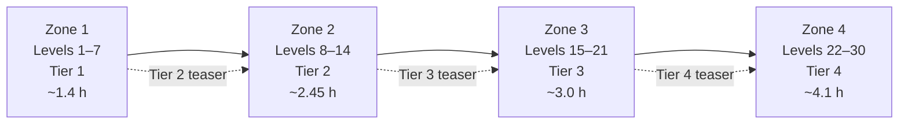

# Pacing Gear Tiers and Experience Across a Four-Zone Action RPG

## Executive summary

For a roughly 30-level action RPG divided into four sequential zones, the most robust pacing model is **not** a single global “drop rate.” It is a two-stage system:

\[
P(\text{tier }t\text{ item from encounter }e)
=
P(\text{equipment roll}\mid e,z)
\times
P(t\mid \text{equipment roll},\ell,z)
\]

The first term controls **loot volume**; the second controls **tier composition**. Keeping them separate allows designers to increase the reward of elites and bosses without flooding the game with obsolete tiers, and to change a zone’s identity without changing the number of objects on the ground.

The principal recommendations are:

| Design variable | Recommended baseline |
|---|---:|
| Journey | Levels 1–30, approximately 11 hours |
| Zone brackets | Levels 1–7, 8–14, 15–21, 22–30 |
| Primary gear tier | One new tier per zone |
| Meaningful upgrade cadence | Every 35–50 minutes in Zones 1–3; every 50–70 minutes in Zone 4 |
| Upgrade cadence in levels | Roughly every 1.5–2 levels early/midgame; 2–2.5 levels late |
| Minor progress signal | Crafting material, useful affix, or sidegrade every 8–15 minutes |
| Normal-enemy equipment chance | 5–7% |
| Elite equipment chance | 30–40% |
| Miniboss reward | One guaranteed equipment roll; 20% chance of a second |
| First-clear zone boss | Two equipment rolls plus one guaranteed current-tier, class-relevant candidate |
| Current-zone tier share | Approximately 58–67% of equipment drops |
| Next-tier teaser | Approximately 4–5% near the end of the preceding zone |
| Drought protection | Escalate after 75 minutes; force a strong candidate by approximately 90 minutes |
| XP requirement curve | Approximately 12% geometric growth per level |
| Target time per level | 6 minutes initially, rising to about 35 minutes near level 30 |

The recommended tier curve is a **hybrid logistic-onset/exponential-retirement model**, combined with a discrete zone-entry multiplier. Logistic onset allows a few exciting early sightings; exponential retirement prevents old tiers from consuming the loot budget indefinitely; the zone multiplier makes entering a new region immediately legible.

The comparative evidence points in the same direction. *Diablo II* gates item bases through item quality level, treasure classes, monster level, and area level rather than directly through character level, while its normal-arc XP requirements use a strongly geometric schedule and level-difference penalties to keep players near appropriately leveled content. citeturn17view0turn17view1turn17view2 *Realm of the Mad God* organizes progression spatially: rookie regions accelerate players toward level 20, Adept regions supply Godlands-level opposition, and Veteran biomes supply high-end rewards such as Wine Cellar-tier equipment. citeturn18view6turn16search2 *Last Epoch*, *Grim Dawn*, and *Path of Exile 2* all show developers deliberately moving reward probability away from undifferentiated regular enemies and toward rare enemies, bosses, first-clear guarantees, explicit rarity thresholds, or higher-quality drop composition. citeturn14search2turn14search1turn18view3

No published study establishes a universal “correct” number of minutes between ARPG upgrades. The proposed cadence is therefore an engineering target, not a psychological constant. It is derived from session-length coverage, equipment-slot turnover, and research showing that perceived competence predicts enjoyment and future play, while excess visual clutter and greater choice uncertainty increase search or decision burden. citeturn15search2turn15search13turn16search0turn16search1

## Scope, assumptions, and analytical framework

### Assumptions

The recommendations assume:

| Dimension | Working assumption |
|---|---|
| Mode | Primarily single-player or instanced personal loot |
| Party play | Optional; XP and loot should not require competitive pickup behavior |
| Equipment slots | Eight meaningful slots |
| Item scale | Small-number game: upgrades are easy to compare and usually alter primary values by single- or low-double-digit percentages |
| Combat difficulty | Moderate; ordinary enemies are expected to die in groups, with elites and bosses acting as reward punctuation |
| Session length | Unspecified; analysis covers 30-minute, one-hour, and two-hour sessions |
| Campaign duration | Approximately 10–12 hours for a first completion |
| Zone structure | Strictly sequential, with little sequence breaking |
| Crafting | Present but supplementary; it repairs near-misses rather than replacing drops |
| Trading | Absent or non-dominant during the campaign |
| Death penalty | No substantial XP loss during the 30-level journey |
| Replay/endgame | Outside the core model; late-zone systems may lead into endgame |

The four equipment tiers in this report are **campaign power bands**, not necessarily visible rarity colors. A Tier 3 magic item could be stronger than a Tier 2 rare item, but its base-stat budget, affix ceiling, or required level belongs to the third campaign band.

### Separate quantity, tier, relevance, and quality

A useful full model is:

\[
P_{e,t,s,q}
=
q_e(z)\;p_t(\ell,z)\;r_s(c,z)\;a_q(t,\ell,z)
\]

where:

- \(q_e(z)\) is the probability that encounter type \(e\) creates an equipment roll;
- \(p_t(\ell,z)\) is the conditional probability that the equipment belongs to tier \(t\);
- \(r_s(c,z)\) is the probability that its slot or archetype is relevant to class \(c\);
- \(a_q(t,\ell,z)\) is the distribution of affix quality or rarity within that tier.

This decomposition is critical. Raising \(q_e\) creates more inspection work. Raising \(p_t\) improves the age of the loot. Raising \(r_s\) improves usability. Raising \(a_q\) improves the chance that an already relevant item is actually an upgrade.

A system can therefore feel unrewarding even with many drops. For example:

\[
0.35
\times 0.60
\times 0.25
\times 0.20
=
1.05\%
\]

An elite with a 35% equipment chance, 60% current-tier share, 25% chance of the relevant slot, and 20% chance of a sufficiently strong roll produces only about a **1.05% chance of one specific-slot meaningful upgrade candidate**. The tuning response should usually be smarter relevance or quality—not several times more screen clutter.

### Definitions used in the recommendations

A **candidate** is an item worth opening the comparison panel for. A **meaningful upgrade** is recommended to mean one of the following:

- approximately 8–12% improvement in primary damage under the player’s current build;
- approximately 6–10% improvement in effective survivability;
- resolution of a visible resistance, resource, or speed deficiency;
- a new skill interaction or build-enabling property whose value is not captured by raw stats.

Those percentages are proposed production thresholds, not findings from the cited psychology literature. Their purpose is to prevent tiny numerical increments from being counted as full reward events.

A **felt upgrade cadence** is the interval between items that the player actually equips or meaningfully crafts—not the interval between colored beams, rare labels, or inventory pickups.

## Evidence from benchmark action RPGs

Published drop tables are incomplete for most commercial ARPGs. The table below distinguishes official observations from analytical reconstructions; reconstructed curves describe the likely pacing shape rather than claiming access to internal telemetry.

| Game | Observable pacing mechanism | Quantitative evidence | Curve interpretation |
|---|---|---|---|
| *Realm of the Mad God* | Spatial biome progression plus a level-20 transition into harder regions | Rookie-region XP was doubled in public testing, and enemies received a 50% class bias so players would reach level 20 better prepared. Adept regions contain Godlands-tier opposition; Veteran regions include Wine Cellar-tier equipment. citeturn18view6turn16search2 | Strong step function by geography, with gear progression continuing after the character-level cap |
| *Diablo II* Normal | Item eligibility through item quality level, treasure classes, monster level, and dungeon level; boss-quality spikes | Lower-quality drops decline as monster or area level rises. XP-to-next rises about 25% per level from levels 10–27, then about 9% per level from 27–30. citeturn17view0turn17view2 | Hard eligibility gates overlaid with probabilistic rarity; piecewise-geometric XP |
| *Last Epoch* | Level thresholds, rarity transformation, and reward concentration on uncommon enemies | Circle of Fortune examples include 35% double enemy drops, 50% more-likely Exalted affixes, doubled T7 affixes, and a 25% conversion of eligible level-44-plus rares to Exalted. A later patch made magic enemies drop 205% more items and rare enemies 520% more than regular enemies while reducing regular-enemy drops. citeturn18view0turn14search2 | Threshold plus multiplicative quality transformation; reward shifted to salient encounters |
| *Grim Dawn* | Explicit rarity-unlock milestones and level-scaled removal of low-value output | Rares begin around level 8, Epics around 12, sets around 20, and Legendaries around 50. Later loot scaling reduced Common and single-affix items as level rose and increased rare-quality output. citeturn14search1turn19view1 | Stepwise eligibility followed by increasing quality density |
| *Path of Exile 2* | Tiered rare/magic composition, boss guarantees, and rarity-based removal of low-quality outcomes | Patch 0.2.0g made Tier 2 rares four times as common, Tiers 3–5 rares 30% more common, and Tier 2-plus magic items about five times as common; most unique campaign monsters gained a first-kill guaranteed rare. citeturn18view3 | Quality-density curve with deterministic first-clear safety nets |

### Realm of the Mad God

*Realm of the Mad God* is unusual because character leveling ends early while item and stat progression continue. Its reworked world explicitly distinguishes rookie, Adept, and Veteran regions. During testing, rookie XP was doubled, rookie enemies gained a 50% class bias to loot, and the stated intent was to deliver players to level 20 with better stats and equipment before they entered Adept regions. The same developer update described equipment power levels, with Tier 14 weapons beginning at a power value of 200, and used total equipment power to direct players toward suitable quests. citeturn18view6

The released Realm Rework places Godlands-grade enemies and stat-potion dungeons in Adept biomes, while Veteran biomes provide high-level rewards including Wine Cellar-tier equipment. citeturn16search2 This is effectively a **geographic step curve**:

\[
P(t\mid z)=
\begin{cases}
\text{low-tier dominated}, & z=\text{Rookie}\\
\text{mid-tier dominated}, & z=\text{Adept}\\
\text{high-tier dominated}, & z=\text{Veteran}
\end{cases}
\]

A useful normalized reconstruction—not an official drop table—is:

| Progress band | Low tier | Mid tier | High tier | Endgame tier |
|---|---:|---:|---:|---:|
| Early rookie | 90% | 10% | 0% | 0% |
| Late rookie | 60% | 35% | 5% | 0% |
| Adept | 15% | 65% | 20% | 0% |
| Veteran | 3% | 17% | 60% | 20% |

The design lesson is that **zone identity can substitute for a long level curve**. Players learn that moving inward or entering a named high-risk biome changes the reward band. The 50% class bias is also notable: it improves useful-drop frequency without multiplying total loot volume. citeturn18view6

### Diablo II Normal difficulty

*Diablo II* separates player level from drop eligibility more strongly than many later ARPGs. Its official item documentation explains that lower-quality items become less common as monster level or dungeon level rises, and its treasure-class structure governs which item bases may appear. Character level itself does not simply command the game to drop the next equipment tier. citeturn17view2

This creates a layered curve:

\[
P(\text{base }i)
=
P(TC_i\text{ selected}\mid m,a)
\times
P(q_i\le m)
\times
P(\text{quality roll})
\]

where \(m\) is monster level, \(a\) is area level, \(TC_i\) is the item’s treasure-class eligibility, and \(q_i\) is its quality level.

An analytical Normal-difficulty reconstruction is:

| Campaign segment | Approximate character band | Dominant item behavior |
|---|---:|---|
| Early Act I | 1–8 | Very small eligible base pool; rapid replacement of starting items |
| Late Act I / Act II | 8–17 | Larger normal-base pool; magic affixes increasingly matter |
| Act III | 17–23 | More bases and affixes become eligible; low-quality output recedes |
| Act IV | 23–27 | Stronger normal bases and boss-quality concentration |
| Act V | 27–35+ | Broad normal-base pool; transition preparation for Nightmare |

These character bands are an interpretive playthrough model, not Blizzard-prescribed act levels. The important transferable principle is the combination of **hard base-item eligibility** and **soft quality probability**. A newly eligible base creates a visible tier transition, while magic, rare, set, and unique rolls continue to provide variance inside that tier.

The Normal-arc XP schedule is highly instructive. Official XP-to-next requirements rise from 14,429 at level 10 to 134,378 at level 20 and 640,765 at level 27. That is almost exactly 25% growth per level from levels 10–27. Growth then falls to approximately 9% per level through level 30, where the next-level requirement is 829,810. citeturn17view0

\[
R_{\ell+1}\approx
\begin{cases}
1.25R_\ell, & 10\le \ell<27\\
1.09R_\ell, & 27\le \ell<30
\end{cases}
\]

The game also regulates leveling location. Below level 25, monsters within five levels grant full XP; rewards decline beyond that band, reaching only 5% for monsters at least ten levels below and 2% for monsters at least ten levels above. citeturn17view1 Thus, an exponential requirement curve does not alone determine time per level: enemy XP growth and level-difference multipliers counterbalance it.

### Last Epoch

*Last Epoch* demonstrates three useful mechanisms.

First, it can transform an otherwise lower-quality result rather than merely adding more items. Circle of Fortune rewards have included a 50% increase to the likelihood of Exalted affixes, doubled Tier 7 affix frequency, and a 25% chance for an item that would drop Rare above level 44 to become Exalted. citeturn18view0 Mathematically:

\[
P(E)
=
P(E_{\text{base}})
+
P(R_{\text{eligible}})\,c
\]

where \(c=0.25\) for the cited rare-to-Exalted conversion example. This is easier to tune than adding another independent loot explosion because it upgrades composition while largely preserving object count.

Second, the game concentrates rewards on enemies whose visual and combat salience justify attention. In the 2025 *Tombs of the Erased* patch, magic enemies were set to drop 205% more items than regular enemies and rare enemies 520% more, while regular enemies dropped less often. The same patch corrected a bug that caused rare-item rates to spike around level 51 and then decrease as area level rose. citeturn14search2 That bug is a cautionary example: a rarity curve should be tested for monotonicity around every threshold.

Third, the 1.0 item-faction redesign explicitly reduced baseline drop rates because faction systems were adding quantity and quality. citeturn19view2 This illustrates a general accounting rule:

\[
\text{Total reward budget}
=
\text{baseline}
+
\text{encounter bonus}
+
\text{system bonus}
+
\text{player investment}
\]

Every new modifier must either consume existing budget or intentionally increase campaign acceleration.

### Grim Dawn

*Grim Dawn* provides unusually readable rarity milestones. Its official item guide states that Rare items begin around level 8, Epic items around level 12, set items around level 20, and Legendary items around level 50. Bosses and hero monsters are emphasized as reliable Epic sources, while one-shot chests guarantee an Epic. citeturn14search1

That structure can be represented as stepwise eligibility:

\[
P(q,\ell)=0\quad \text{for }\ell<L_q
\]

followed by a smooth post-threshold increase:

\[
P(q,\ell)
=
M_q\left(1-e^{-k_q(\ell-L_q)}\right),
\qquad \ell\ge L_q
\]

The step communicates a milestone; the smooth ramp avoids making the newly unlocked rarity immediately routine.

Crate’s development updates also show active manipulation of quality density. One update raised Rare-affix, Epic, and Legendary rates on higher difficulties, increased double-affix frequency from level 55 onward, and reduced duplicate problems in Epic tables. citeturn19view0 A later patch adjusted overall loot scaling so Common and single-affix items declined with player level while Rare output increased with difficulty. citeturn19view1

The transferable lesson is that obsolete output should not remain a fixed percentage forever. As comparison complexity rises, the system should retire low-information items.

### Path of Exile and Path of Exile 2

Grinding Gear Games’ GDC presentation describes *Path of Exile* as using procedural generation, deep systems, and multiple overlapping axes of randomness to sustain long-term engagement. citeturn15search1 For a short campaign, however, overlapping randomness must be constrained: several independent low-probability checks can turn a superficially generous drop rate into a long upgrade drought.

*Path of Exile 2* patch 0.2.0g is a useful quantitative intervention. Tier 2 rare items became four times as common, Tiers 3–5 became 30% more common, and Tier 2-plus magic items became roughly five times as common. The patch also removed many low-level modifiers from higher-tier items and gave nearly all unique campaign monsters a first-kill guaranteed rare. citeturn18view3 This changed both terms in the reward equation:

\[
\text{candidate rate}
=
\text{drop count}
\times
\text{tier probability}
\times
\text{modifier relevance}
\]

The official *Ruthless* mode offers the opposite experiment: item quantity and magic/rare/unique rates are massively reduced so that an ordinary ring or rare item can become a major event. citeturn15search3 The contrast demonstrates that “meaningfulness” is relative to scarcity, but scarcity appropriate to an optional long-tail mode would be dangerous in an 11-hour campaign unless deterministic safeguards prevent dead builds.

## Gear-tier curve models and zone transitions

### Candidate mathematical forms

#### Step functions

The simplest model assigns a fixed tier vector to each zone:

\[
p_t(z)=\pi_{z,t}
\]

Example:

\[
\pi_2=(0.34,0.62,0.04,0)
\]

for Zone 2.

Advantages are readability, predictable content identity, easy QA, and stable balancing. The disadvantage is a visible cliff: two adjacent enemies on opposite sides of a loading boundary can have abruptly different loot distributions.

Step functions are especially appropriate when zones are strongly authored, sequential, and visually distinct.

#### Exponential retirement

Old tiers can be retired with:

\[
w_t(\ell)
=
b_t e^{-\lambda(\ell-L_t)}
\qquad \ell\ge L_t
\]

A half-life formulation is often easier to tune:

\[
w_t(\ell)=b_t2^{-(\ell-L_t)/h}
\]

where \(h\) is the number of levels required to halve the tier’s weight.

For a seven-level zone, \(h=2.5\)–3.5 levels works well. It allows the preceding tier to remain visible early in a zone but prevents it from dominating the final third.

#### Logistic onset

A new tier can enter smoothly through:

\[
o_t(\ell)
=
\sigma(k(\ell-L_t))
=
\frac{1}{1+e^{-k(\ell-L_t)}}
\]

Here \(L_t\) is the nominal introduction level and \(k\) controls transition sharpness. A value near \(k=1.0\)–1.3 produces a transition over approximately four levels.

Logistic onset is useful when players may be one or two levels ahead or behind the intended path. It avoids the feeling that one additional XP point suddenly changes the entire world’s item table.

#### Hybrid onset and retirement

The recommended continuous form is:

\[
w_t(\ell)
=
b_t
\sigma\!\left(k(\ell-L_t)\right)
\exp\left[
-\lambda\max\left(0,\ell-(L_t+7)\right)
\right]
\]

\[
p_t(\ell)
=
\frac{w_t(\ell)}
{\sum_j w_j(\ell)}
\]

Recommended parameters for four tiers are:

\[
L_t\in\{1,8,15,22\},
\qquad
k=1.1,
\qquad
\lambda=0.28
\]

The onset term introduces a tier; the exponential term retires it after its intended zone.

The models should not be treated as mutually exclusive. Production systems commonly use hard eligibility gates, a zone-specific table, and smooth within-zone weighting simultaneously—as seen conceptually in *Diablo II*’s treasure-class eligibility plus probabilistic quality rolls and *Grim Dawn*’s rarity milestones plus changing drop composition. citeturn17view2turn14search1turn19view1

### Reconstructed continuous curve

Using the recommended hybrid formula produces the following conditional tier shares. Percentages are conditional on an equipment item already having been generated.

| Player level | Tier 1 | Tier 2 | Tier 3 | Tier 4 |
|---:|---:|---:|---:|---:|
| 4 | 98.8% | 1.2% | 0.0% | 0.0% |
| 7 | 80.0% | 20.0% | 0.0% | 0.0% |
| 10 | 38.7% | 61.0% | 0.3% | 0.0% |
| 14 | 13.0% | 69.6% | 17.4% | 0.0% |
| 18 | 4.1% | 29.4% | 65.7% | 0.8% |
| 21 | 1.8% | 12.8% | 68.4% | 17.1% |
| 25 | 0.6% | 4.1% | 29.5% | 65.8% |
| 29 | 0.2% | 1.7% | 12.1% | 85.9% |

This unmodified curve provides substantial previews near zone ends. For a strictly sequential game, a modest zone-entry shock should be layered on top so that the new zone becomes immediately recognizable.

### Zone-entry shock

At entry to Zone \(z\), apply multiplicative factors before renormalizing:

\[
\tilde p_t
=
p_t
\times
m_{z,t}
\]

A suitable transition vector is:

| Tier relationship | Entry multiplier |
|---|---:|
| Current zone tier | 2.0–2.8× |
| Previous zone tier | 0.55–0.75× |
| Two tiers old | 0.20–0.40× |
| Next zone tier | 0.15–0.25× until final third of zone |

This creates a **shock-then-settle** pattern:

1. The previous zone’s final third introduces the next tier at 4–5%.
2. The new zone immediately raises it to roughly 45–55% at entry.
3. It reaches 60–70% after one or two levels.
4. The next tier starts teasing during the final one or two levels.

The zone’s first miniboss should then guarantee one current-tier roll. This is not intended to guarantee a direct upgrade; it guarantees that the player sees the zone’s new equipment language.

The probability of seeing at least one item of tier \(t\) after \(n\) equipment drops is:

\[
P(\ge1)=1-(1-p_t)^n
\]

At a 4% teaser rate, ten equipment drops give:

\[
1-0.96^{10}=33.5\%
\]

Thus, roughly one third of players see the next tier before crossing the boundary. At a 60% current-tier rate, three equipment drops give:

\[
1-0.4^3=93.6\%
\]

Almost every player recognizes the new tier after only a few drops.

### Recommended production step table

For a small game, a discrete table is easier to maintain than evaluating the continuous equation at runtime. The continuous model should be used as a design and interpolation tool; the following rounded values can be shipped directly.

| Zone and level band | Tier 1 | Tier 2 | Tier 3 | Tier 4 |
|---|---:|---:|---:|---:|
| Zone 1, levels 1–7 | 95% | 5% | 0% | 0% |
| Zone 2, levels 8–14 | 34% | 62% | 4% | 0% |
| Zone 3, levels 15–21 | 5% | 33% | 58% | 4% |
| Zone 4, levels 22–30 | 1% | 4% | 28% | 67% |

These are **zone-average conditional probabilities**. Within each zone, the old-tier share should be higher in its opening third and the next-tier teaser higher in its closing third.

A more granular implementation can use:

| Zone phase | Two tiers old | Previous tier | Current tier | Next tier |
|---|---:|---:|---:|---:|
| Opening third | 5% | 43% | 51% | 1% |
| Middle third | 2% | 29% | 66% | 3% |
| Closing third | 1% | 20% | 74% | 5% |

Zone 1 omits nonexistent older tiers; Zone 4 redirects the next-tier share into Tier 4, special items, or endgame-preview materials.

## Felt-upgrade cadence and loot readability

### Why candidate cadence matters more than item count

Research based on self-determination theory found that perceived competence, autonomy, and relatedness predict game enjoyment and intentions for future play; competence and autonomy also relate to intuitive interaction and post-play outcomes. citeturn15search2turn15search13 A well-timed equipment upgrade can support competence because the player can connect a comprehensible choice to an observable improvement.

The research does not imply that every reward increases retention. Visual-clutter research using action-game scenes found that clutter harmed search performance and altered visual-search behavior, including for experienced players. citeturn16search0turn16search9 Hick’s law similarly relates response time to the number or uncertainty of alternatives, although actual game decisions are richer than laboratory button-choice tasks. citeturn16search1

The design implication is:

\[
\text{Reward value}
\ne
\text{number of items}
\]

A better campaign reward system generates fewer but more legible candidates, uses strong silhouettes or beams only for high-information drops, and routes ordinary obsolete items into currency or automatic salvage. This is consistent with *Grim Dawn* reducing Common and single-affix output at higher levels, *Last Epoch* moving drops toward magic and rare enemies, and *Path of Exile 2* increasing tier quality and removing low-level modifiers rather than merely multiplying every object. citeturn19view1turn14search2turn18view3

### Recommended cadence

The proposed campaign should provide:

| Progress event | Target interval |
|---|---:|
| Useful resource, crafting input, or visible incremental gain | Every 8–15 minutes |
| Plausible equipment candidate | Every 15–25 minutes |
| Meaningful equipped upgrade, Zones 1–3 | Every 35–50 minutes |
| Meaningful equipped upgrade, Zone 4 | Every 50–70 minutes |
| Build-changing or memorable “hero” item | Two to four times during the campaign |
| Guaranteed anti-drought candidate | By 75–90 minutes without an upgrade |

Over an approximately 11-hour campaign, this yields roughly 14–18 meaningful upgrades. With eight equipment slots, that is enough to replace most slots once or twice and important offensive slots more often, without forcing every slot to churn in every zone.

At the recommended leveling speed, the corresponding level cadence is:

| Campaign portion | Levels per meaningful upgrade |
|---|---:|
| Levels 1–7 | 1.2–1.8 |
| Levels 8–21 | 1.5–2.0 |
| Levels 22–30 | 2.0–2.5 |

The first zone should be faster because starting items have low specificity and comparisons are simple. Late upgrades can be less frequent because each item must satisfy more build constraints, but late droughts should be bounded.

### Session-length coverage

Treat meaningful upgrades as approximately Poisson-distributed with mean interval \(I\) hours. This is a simplification; production systems with pity mechanics will have lower variance. For a session of length \(S\):

\[
E[N]=\frac{S}{I}
\]

\[
P(N\ge1)=1-e^{-S/I}
\]

| Mean hours per upgrade | 30-minute session: expected / chance of ≥1 | One-hour session: expected / chance of ≥1 | Two-hour session: expected / chance of ≥1 |
|---:|---:|---:|---:|
| 0.50 h | 1.00 / 63% | 2.00 / 86% | 4.00 / 98% |
| 0.67 h, about 40 min | 0.75 / 53% | 1.49 / 78% | 2.99 / 95% |
| 0.75 h, 45 min | 0.67 / 49% | 1.33 / 74% | 2.67 / 93% |
| 1.00 h | 0.50 / 39% | 1.00 / 63% | 2.00 / 86% |

A 40–45-minute mean is a useful compromise. Approximately half of 30-minute sessions contain an upgrade, roughly three quarters of one-hour sessions contain one, and more than 90% of two-hour sessions contain one. Because an actual game uses bosses, quests, and pity logic rather than a memoryless Poisson process, it can improve these session probabilities without increasing the long-run average.

### Drought protection

Track **time or eligible encounters since the last meaningful upgrade**, not merely time since the last rare item.

One implementation is:

\[
B(d)=
\begin{cases}
1, & d<45\text{ min}\\
1+0.02(d-45), & 45\le d<75\\
1.6+0.06(d-75), & 75\le d<90\\
\text{guaranteed candidate}, & d\ge90
\end{cases}
\]

where \(B(d)\) multiplies current-tier relevance or affix quality, not raw item quantity.

The protection should preferably trigger on a visible elite, miniboss, quest chest, or boss. Hidden correction is less likely to make the reward feel arbitrary if the game delivers it through an encounter that already carries narrative and visual importance.

Reset the counter only when the player equips an item that passes the meaningful-upgrade test, crafts such an item, or deliberately rejects a clearly signaled equivalent sidegrade. Do not reset it for unusable rares.

## XP pacing and recommended level schedule

### Common XP curve shapes

#### Linear XP-to-next

\[
R_\ell=a+b\ell
\]

A linear requirement is easy to explain and tune. If enemy XP per minute stays roughly constant, time per level rises linearly. If enemy XP rises with zones, leveling may instead accelerate unintentionally.

Linear curves fit games where stat gains per level are modest and zones provide most progression. Their disadvantage is that they often feel mechanically flat across a full campaign.

#### Geometric or exponential XP-to-next

\[
R_\ell=ar^{\ell-1}
\]

Geometric curves are conventional because enemy XP can increase by a similar factor, keeping time per level controllable while allowing large absolute numbers. *Diablo II* demonstrates a pronounced piecewise-geometric form: XP-to-next grows approximately 25% per level through much of its level-10-to-27 Normal arc, before shifting to about 9% growth around levels 27–30. citeturn17view0

The danger is opacity. A high requirement multiplier without matching enemy-XP growth creates sudden grind walls.

#### Flat within each zone

\[
R_\ell=C_z
\qquad \ell\in z
\]

This makes every level in a zone take approximately the same amount of raw XP. Zone boundaries then increase the requirement.

Advantages are predictable zone budgeting and easy content planning. Disadvantages are sharp entry cliffs, farming exploits near boundaries, and a “sawtooth” experience if the first level of each new zone suddenly slows.

#### Time-targeted hybrid

The recommended approach separates the visible XP requirement from the actual time target:

\[
R_\ell
=
5\cdot
\operatorname{round}
\left(
\frac{100(1.12)^{\ell-1}}{5}
\right)
\]

Then set zone enemy and quest XP so that:

\[
\text{XP per minute at level }\ell
=
\frac{R_\ell}{T_\ell}
\]

where \(T_\ell\) is the desired minutes to level.

This produces clean, steadily rising requirements while allowing time per level to reset slightly downward at each zone entry. The reset gives players an immediate sense of momentum in a new environment.

### Recommended time profile

| Zone | Level transitions | Target time | Design purpose |
|---|---:|---:|---|
| Zone 1 | 1→8 | 84 minutes | Fast onboarding and rapid build establishment |
| Zone 2 | 8→15 | 147 minutes | Stable core loop and first sustained build choices |
| Zone 3 | 15→22 | 182 minutes | Deeper encounter patterns and increasing item specificity |
| Zone 4 | 22→30 | 245 minutes | Build completion, capstone encounters, final tier |
| Total | 29 level transitions | 658 minutes, about 11.0 hours | Full campaign |

This is intentionally back-loaded, but not purely exponential in time. Zone 4 is long enough to establish Tier 4 as a meaningful band rather than awarding it immediately before the finale.

### Sample XP-per-level schedule

“XP to next” is the requirement from the current level to the following level. Level 30 is the campaign cap.

| Current level | Zone | XP to next | Target minutes |
|---:|---:|---:|---:|
| 1 | 1 | 100 | 6 |
| 2 | 1 | 110 | 8 |
| 3 | 1 | 125 | 10 |
| 4 | 1 | 140 | 12 |
| 5 | 1 | 155 | 14 |
| 6 | 1 | 175 | 16 |
| 7 | 1 | 195 | 18 |
| 8 | 2 | 220 | 18 |
| 9 | 2 | 250 | 19 |
| 10 | 2 | 275 | 20 |
| 11 | 2 | 310 | 21 |
| 12 | 2 | 350 | 22 |
| 13 | 2 | 390 | 23 |
| 14 | 2 | 435 | 24 |
| 15 | 3 | 490 | 23 |
| 16 | 3 | 545 | 24 |
| 17 | 3 | 615 | 25 |
| 18 | 3 | 685 | 26 |
| 19 | 3 | 770 | 27 |
| 20 | 3 | 860 | 28 |
| 21 | 3 | 965 | 29 |
| 22 | 4 | 1,080 | 27 |
| 23 | 4 | 1,210 | 28 |
| 24 | 4 | 1,355 | 29 |
| 25 | 4 | 1,520 | 30 |
| 26 | 4 | 1,700 | 31 |
| 27 | 4 | 1,905 | 32 |
| 28 | 4 | 2,130 | 33 |
| 29 | 4 | 2,390 | 35 |

Total abstract XP is 21,450. The absolute scale is arbitrary; only ratios and earned-XP rates matter.

### Enemy-level efficiency band

A short 30-level game should use a gentler version of *Diablo II*’s level-difference regulator. *Diablo II* grants full XP within a five-level band for sub-25 characters and sharply reduces XP far outside it. citeturn17view1 For a four-zone campaign, a narrower but less punitive form is preferable:

| Enemy level relative to player | XP multiplier |
|---:|---:|
| −3 to +3 | 100% |
| −4 | 85% |
| −5 | 65% |
| −6 or lower | 35%, tapering to 10% |
| +4 | 90% |
| +5 | 75% |
| +6 | 55% |
| +7 or higher | 35%, tapering to 15% |

This discourages farming trivial zones and prevents sequence breaking from becoming an efficient leveling strategy, while still letting skilled players challenge slightly higher-level enemies.

At each zone entry, an arrival quest or first landmark should award approximately 15–20% of the next level. That reduces the chance that the player enters a visually new region and sees no immediate movement on the XP bar, but it does not skip the first combat-learning interval.

## Integrated four-zone specification

### Zone-level reward plan

| Zone | Levels | Primary tier | Tier mix | Meaningful upgrades | Major reward beats |
|---|---:|---|---|---:|---|
| Zone 1 | 1–7 | Tier 1 | 95% T1, 5% T2 | 4–5 | Starter weapon replacement, first defensive item, first build-affix item, boss Tier 1 smart drop |
| Zone 2 | 8–14 | Tier 2 | 34% T1, 62% T2, 4% T3 | 4–5 | Entry miniboss T2 guarantee, midpoint targeted slot, boss T2 hero candidate |
| Zone 3 | 15–21 | Tier 3 | 5% T1, 33% T2, 58% T3, 4% T4 | 3–4 | First strong synergy item, one defensive check reward, boss Tier 3 smart drop |
| Zone 4 | 22–30 | Tier 4 | 1% T1, 4% T2, 28% T3, 67% T4 | 3–4 | Early T4 anchor, build-completion item, pre-final defensive reward, finale reward |
| Campaign | 1–30 | Four tiers | Progressive retirement | 14–18 | Two to four memorable hero items |

Old tiers should retain utility through salvage, crafting, sockets, or rare build-specific affixes. Otherwise their residual probabilities become pure comparison noise.

### Encounter loot table

The following values are starting points for an eight-slot, small-number system.

| Encounter | Equipment-roll rule | Tier selection | Relevance and quality rule |
|---|---|---|---|
| Normal enemy | 6% chance of one roll | Zone tier table | 75% class/archetype relevance in solo play |
| Champion or magic enemy | 18% chance of one roll | Current tier weighted 1.15× | Minimum one useful affix if equipment drops |
| Elite or rare enemy | 35% chance of one roll | Current tier weighted 1.35× | 50% chance to target one of three weakest slots |
| Miniboss | One guaranteed roll; 20% second roll | Current tier weighted 1.5× | Guaranteed class relevance |
| Optional challenge chest | One guaranteed roll | Current or next tier; next tier capped at 8% | Higher variance, no upgrade guarantee |
| Zone boss, repeat | Two guaranteed rolls | Current tier weighted 1.5× | At least one class-relevant roll |
| Zone boss, first clear | Two rolls plus one smart roll | Smart roll is current tier | Smart roll targets weak slot and clears minimum quality floor |
| Campaign final boss | Three rolls plus one hero roll | Tier 4 | Hero roll may be build-changing or endgame-facing |

At the Zone 2 average mix, a normal enemy’s absolute Tier 2 equipment probability is:

\[
0.06\times0.62=3.72\%
\]

An elite’s equivalent probability before its additional weighting is:

\[
0.35\times0.62=21.7\%
\]

This makes the elite visibly more important without requiring a shower of items.

### Sample slot and affix logic

After selecting the tier, choose the slot through a mixed random/smart model:

\[
P(s)
=
(1-\alpha)P_{\text{uniform}}(s)
+
\alpha P_{\text{need}}(s)
\]

Recommended \(\alpha\):

| Source | Smart-slot weight \(\alpha\) |
|---|---:|
| Normal enemy | 0.10 |
| Champion | 0.20 |
| Elite | 0.50 |
| Miniboss | 0.60 |
| First-clear boss smart roll | 0.85 |
| Drought-protection reward | 1.00 |

A need score can be:

\[
N_s
=
\max\left(
0,
\frac{B_{\text{expected}}(\ell,t)-B_s}
{B_{\text{expected}}(\ell,t)}
\right)
\]

where \(B_s\) is the equipped item’s normalized power and \(B_{\text{expected}}\) is the expected power for the player’s level and zone.

The smart system should not always generate a strict upgrade. It should target the weak slot and ensure a plausible affix family, leaving room for roll variance and player choice.

### Tier power budgets

For small numbers, each new tier should produce a clear but not overwhelming base-stat step.

| Tier | Nominal level band | Base-stat index | Maximum ordinary affix rank | Typical full-item gain over prior tier |
|---|---:|---:|---:|---:|
| Tier 1 | 1–7 | 100 | Rank 2 | Baseline |
| Tier 2 | 8–14 | 118 | Rank 3 | 15–22% |
| Tier 3 | 15–21 | 139 | Rank 4 | 15–22% |
| Tier 4 | 22–30 | 164 | Rank 5 | 15–22% |

The base index uses approximately 18% growth per tier:

\[
B_t=100(1.18)^{t-1}
\]

The actual equipped-character increase is smaller because only one slot changes at a time. If eight equal-value slots contribute to a broad power measure, an 18% improvement in one slot changes the whole equipment contribution by roughly:

\[
\frac{0.18}{8}=2.25\%
\]

Weapons, abilities, and major defensive pieces can have larger slot weights, producing the recommended 8–12% felt combat improvements for important upgrades.

### Operational acceptance criteria

The system should be instrumented against distributions, not only averages.

| Metric | Target |
|---|---:|
| Median time to first non-starter weapon | 10–15 minutes |
| Median time to first current-zone-tier item after entry | Under 10 minutes |
| 90th percentile time to first current-zone-tier item | Under 20 minutes |
| Median time between meaningful upgrades, Zones 1–3 | 35–50 minutes |
| 90th percentile upgrade drought without pity | Under 75 minutes |
| Hard maximum drought with pity | Approximately 90 minutes |
| Share of dropped equipment inspected | 30–50% early; 15–30% late |
| Share of inspected equipment equipped or crafted | 8–15% |
| Obsolete items among visible high-salience drops | Under 10% |
| Current-tier share of equipment drops | 58–67% zone average |
| Next-tier preview share | 4–5% in final zone third |
| First-clear boss current-tier candidate | 100% |

The key telemetry distinction is between **drop**, **inspect**, **compare**, **equip**, and **retain for at least ten minutes**. An item that is briefly equipped only to trigger a tutorial or test an affix should not be counted the same as a durable upgrade.

The resulting campaign rhythm is:

\[
\text{new zone}
\rightarrow
\text{quick tier recognition}
\rightarrow
\text{several readable upgrades}
\rightarrow
\text{increasing specificity}
\rightarrow
\text{next-tier teaser}
\rightarrow
\text{boss guarantee}
\]

This combines the strongest properties of the comparison games: *Realm of the Mad God*’s geographic reward identity, *Diablo II*’s eligibility and XP controls, *Grim Dawn*’s explicit rarity milestones and retirement of low-value output, *Last Epoch*’s concentration of rewards on salient enemies and quality transformation, and *Path of Exile 2*’s use of first-clear guarantees and modifier-quality culling. citeturn18view6turn17view1turn17view2turn14search1turn19view1turn14search2turn18view0turn18view3