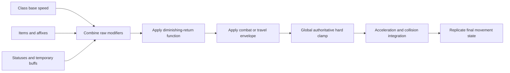
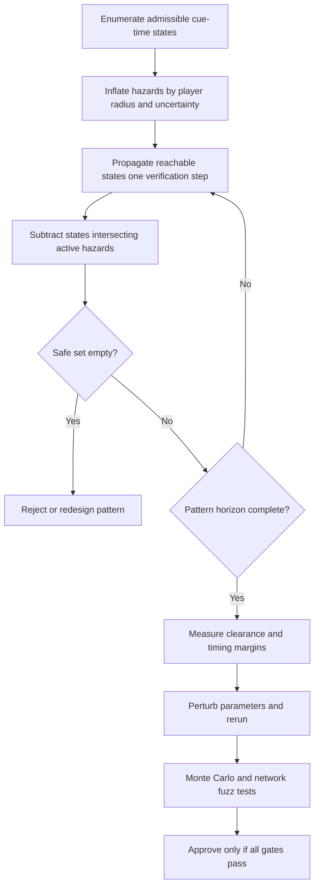

# Movement-Speed Itemization in Movement-Based Dodge Games

## Executive summary

Movement speed in dodge-centric shooters is rarely balanced as an ordinary linear stat. The strongest precedents instead use one or more containment mechanisms: small permanent increments, encounter-specific caps, nonstacking temporary boosts, separate travel and combat speeds, or a precision mode that gives the player a second control scale. The evidence is clearest in *Enter the Gungeon*, which exposes modest-to-large speed bonuses but explicitly reduced the maximum speed of an encounter modifier in boss fights and later added an option for faster movement only outside combat. *Nuclear Throne* limits ordinary speed progression to a single small mutation while also offering the inverse lever—slowing enemy bullets. Classic *Touhou* design largely avoids loot-driven speed variance and gives each shot type separate focused and unfocused speeds. *Realm of the Mad God* permits more speed variation, including equipment bonuses and a much larger temporary Speedy effect, but its class “speed cap” is a base-stat progression cap rather than a clearly documented universal final-velocity ceiling. citeturn21search13turn14search1turn16search0turn17search2turn19view4

For the proposed game, where every pattern must be demonstrably dodgeable at the slowest class’s base speed, the recommended sustained **combat-speed envelope is 100%–140% of that slowest base speed**. Class base speeds should occupy no more than **100%–115%**, ordinary speed items should grant roughly **5%–10% of the slowest base speed**, major items **10%–15%**, diminishing returns should begin once total itemization reaches **+20%**, and an absolute combat hard cap should be enforced at **140%**. A separate out-of-combat travel cap of approximately **175%** can make traversal pleasant without changing encounter timing.

The recommended diminishing-return function is:

\[
F(x)=
\begin{cases}
x,&x\leq 0.20\\[4pt]
0.20+\dfrac{x-0.20}{1+\dfrac{x-0.20}{0.20}},&x>0.20
\end{cases}
\]

where \(x\) is the raw summed speed bonus expressed as a fraction of the slowest base speed. Final sustained speed is:

\[
v_{\text{combat}}
=
\min\left(1.40B,\;v_{\text{class}}+B\,F(x)\right)
\]

where \(B\) is the slowest class base speed. This converts a raw +30% build to +26.7% effective, +50% to +32%, and +100% to +36%, while the hard cap catches temporary buffs, rounding, future content, and unintended stacking.

A speed cap alone is insufficient. High movement speed increases displacement per simulation tick, magnifies prediction and reconciliation errors, can tunnel through thin collision geometry, and can cross multiple projectile boundaries between discrete samples. Unity’s official documentation explicitly notes that low-frequency physics permits tunneling and jitter and that continuous collision detection exists to calculate impacts between physics timesteps; Unreal’s network-movement documentation similarly shows why high movement magnifies client prediction, server correction, and smoothing demands. citeturn15view5turn15view6turn15view7

“Provably dodgeable” must be defined over complete state sets, not demonstrated by a designer successfully dodging a pattern from a convenient position. The correct condition is: **for every admissible player state at the beginning of the telegraph, there exists a legal control sequence that remains outside all hazard volumes for the pattern’s full horizon**. Patterns with randomized branches require the stronger condition that a safe control exists for every allowed branch after accounting for when the branch becomes observable. Verification should use deterministic time-expanded reachability, collision-shape inflation, sequence-level safe-set propagation, and adversarial parameter perturbations, followed by large-scale fuzz testing.

## Scope, evidence, and terminology

This report assumes an unspecified platform and engine. Numerical recommendations therefore use normalized speed relative to the slowest class rather than pixels, tiles, or engine units. Where games publish absolute values, those values are included, but units from different engines are not directly comparable.

The source hierarchy is:

| Evidence tier | Sources used | Interpretation |
|---|---|---|
| Primary | Developer patch notes, Steam developer announcements, GDC material, Unity and Unreal documentation, official game manuals | Strongest evidence for intended design or implementation |
| Near-primary | Official community-maintained wikis and data extracted from current game files | Strong numerical evidence, but not necessarily a developer design statement |
| Secondary | Specialist community documentation and historical wikis | Used where developers do not publish formulas or exact values |
| Analytical derivation | Percent conversions, collision inequalities, cap formulas, and verification procedures in this report | Recommendations or calculations, not claims about an existing game |

*Realm of the Mad God* is an appropriate anchor because its original GDC postmortem describes it as a web-based free-to-play MMO combined with a “bullet-hell-shooter,” permadeath, and unusually counterintuitive design choices. The talk is useful for the archetype and product context, although it does not document the current speed formula or a global speed ceiling. citeturn15view3

Three different concepts must not be conflated:

**Base speed** is the speed available before equipment or temporary modifiers. In a class-stat game, this might mean either the level-one value or the fully progressed class value.

**Stat cap** is a limit on permanent progression. A class may stop gaining or consuming speed-stat upgrades at this point while equipment can still increase the final stat.

**Velocity hard cap** is the maximum effective movement rate after all equipment, statuses, synergies, and multipliers. Most examined games do not publicly document one.

A fourth concept, an **encounter-local cap**, limits a specific effect only in a specific context. *Enter the Gungeon*’s reduced Adrenaline Rush maximum in boss fights is an example: it proves that the developers capped a speed-producing mechanic where encounter integrity mattered, but it does not establish a universal player-speed cap. citeturn21search0turn21search13

Absence of documentation is not proof that an internal clamp does not exist. The comparison below therefore distinguishes “no documented universal cap found” from “uncapped.”

## Comparative findings

### Cross-game comparison

| Game or model | Documented reference speed | Documented cap | Typical speed bonuses | Bonus as percentage of reference | Design interpretation |
|---|---:|---|---:|---:|---|
| *Realm of the Mad God*, Wizard | SPD 17 at level one; SPD 50 class maximum. Using the longstanding community formula, approximately 5.27 and 7.73 tiles/s respectively | SPD 50 is the Wizard’s permanent class-stat cap, **not a documented final-velocity cap** | T1 ring +3 SPD; T6 +10; T7 +11 | At maxed Wizard speed: approximately +2.9%, +9.7%, and +10.6% movement velocity | Ordinary equipment increments are moderate; status effects and multi-item enchantment builds create the larger excursions |
| *Enter the Gungeon* | Base movement speed 7 | No numeric universal cap documented; Adrenaline Rush’s maximum was specifically reduced in boss fights | Shotgun Coffee +1.2; Bionic Leg +1.5; Gungine +2.25 while held; Super Meat Gun +1.5 while held | +17.1%, +21.4%, +32.1%, and +21.4% | Individual upgrades can be large, but some are conditional or weapon-held; encounter-specific capping is used |
| *Nuclear Throne* | Most mutants 4; Plant 4.5 | No universal player-speed cap documented | Extra Feet +0.5 | +12.5% for a normal mutant; +11.1% for Plant | Sparse itemization constrains variance structurally rather than through elaborate cap math |
| Classic *Touhou* model | Character/shot-type dependent; separate focused and unfocused speeds | Fixed authored values rather than a loot cap | No conventional repeatable speed-item stack in the classic model | Not meaningfully comparable | Two-speed control lets the author balance macro repositioning and micro-dodging separately |
| Recommended model | Slowest class \(B=100\%\) | Soft cap begins at 120%; sustained global hard cap 140% | Minor +5%–10% of \(B\); major +10%–15%; raw builds may exceed +40% before diminishing returns | Effective sustained range generally 100%–135%, never above 140% | Preserves item value while bounding collision, control, network, and encounter assumptions |

The *Realm of the Mad God* Wizard data and ring values above come from Realm.wiki, an unofficial database generated from current game data: Wizard speed begins at 17 and has a listed maximum of 50; speed rings grant +3 at T1, +10 at T6, and +11 at T7. citeturn19view0turn19view1turn19view2turn19view3turn19view4 The velocity conversions use the historically documented formula:

\[
v_{\text{RotMG}}=4+5.6\left(\frac{\mathrm{SPD}}{75}\right)
\]

in tiles per second. That formula is community documentation inherited from the historical Realm documentation rather than a current DECA-published specification, so it should be treated as a strongly established working formula, not as a newly confirmed official contract. citeturn19view5

For a maxed-speed Wizard at SPD 50:

| Equipment | Final SPD | Calculated speed | Increase over SPD 50 |
|---|---:|---:|---:|
| None | 50 | 7.733 tiles/s | — |
| T1 speed ring | 53 | 7.957 tiles/s | 2.90% |
| T6 speed ring | 60 | 8.480 tiles/s | 9.66% |
| T7 speed ring | 61 | 8.555 tiles/s | 10.62% |

The important mathematical feature is the formula’s nonzero intercept. A +10 SPD increase is not a universal +13.3% movement increase; its percentage effect depends on the starting stat. At SPD 75, the same +10 produces approximately +7.8% movement velocity. This is a useful itemization technique: additive stat gains naturally become smaller percentages as a build becomes faster, even before applying an explicit soft cap.

DECA’s 2025 equipment-rarity update adds a second containment mechanism. It places enchantments into incompatible categories so that mutually conflicting or redundant modifiers cannot freely roll together, and it introduced decimal stat values such as +2.6 Speed to give designers more granular control over stacked equipment. The displayed player stat still rounds to a whole number, but the underlying fractional allocation lets the developer temper a “perfect” four-piece build without making a single modifier feel negligible. citeturn19view7

This approach is valuable but has an edge case: if the final displayed or functional stat rounds upward, several apparently fractional modifiers can cross integer boundaries unexpectedly. Balance tests must therefore enumerate post-rounding outcomes, not merely sum tooltip decimals.

### Enter the Gungeon

The official wiki documents a base movement speed of 7 and several meaningful bonuses: Shotgun Coffee adds 1.2, Bionic Leg 1.5, Gungine 2.25 while held, and Super Meat Gun 1.5 while held. These correspond to approximately +17%, +21%, +32%, and +21% of base speed. citeturn14search0turn21search1turn21search2

These are larger per-item percentages than the ordinary high-tier RotMG speed-ring examples. The system contains them through context and opportunity cost:

* Some bonuses require holding a particular weapon, so the player exchanges weapon choice for mobility.
* Item acquisition is run-limited rather than a permanent character progression system.
* Dodge rolling provides a separately authored avoidance mechanic, meaning raw walking speed is not solely responsible for every dodge.
* A challenge modifier with escalating speed, Adrenaline Rush, received a reduced increase rate and lower maximum specifically during boss fights. The patch did not publish the numeric ceiling, but the localized restriction is direct evidence that excessive speed was considered encounter-sensitive. citeturn21search13

The Advanced Gungeons & Draguns update also added an option to increase movement speed **outside combat**. This is perhaps the cleanest precedent for a travel/combat split: traversal can be accelerated without shortening telegraph windows or changing the geometry of bullet patterns. citeturn14search1

### Nuclear Throne

Current specialist documentation lists most mutants at a pre-friction speed value of 4, Plant at 4.5, and Extra Feet as +0.5. That makes Extra Feet a +12.5% increase for most characters and +11.1% for Plant. The same source notes that these are code-level speed figures before friction, so they should not be interpreted as world units per second. citeturn16search0

The more important design lesson is structural scarcity. Extra Feet is one mutation choice rather than one member of a broad family of stackable boots, rings, affixes, consumables, and set bonuses. A system can avoid difficult cap behavior simply by keeping the number of speed-producing sources very small.

*Nuclear Throne* also provides the inverse stat lever: Euphoria makes enemy projectiles 20% slower while leaving enemy movement unchanged. citeturn16search0 Slowing hostile projectiles is not mathematically identical to accelerating the player:

\[
v_{\text{player}}'=1.25v_{\text{player}}
\quad\not\equiv\quad
v_{\text{bullet}}'=0.8v_{\text{bullet}}
\]

They produce the same player-to-bullet speed ratio only in simple open-space interception. They differ around walls, moving enemies, aimed fire, contact hazards, arena timers, and player acceleration. Nevertheless, projectile slowdown can provide a strong “mobility” reward without increasing collision displacement, camera movement, or network correction.

The game’s official Steam updates also expose how closely simulation rate and gameplay are coupled. The 2025 tenth-anniversary update added support for 60+ frames per second while retaining 30 FPS support, illustrating why modernized timing must preserve game behavior across simulation and rendering rates rather than simply doubling per-frame motion. citeturn14search15

### Touhou as a control-model contrast

Touhou is relevant primarily because it avoids the itemization problem. Danmakufu documentation, reflecting standard Touhou player construction, describes separate focused and unfocused movement speeds and explicitly notes that balancing the pair is difficult. A translated *Perfect Cherry Blossom* manual likewise categorizes characters by both normal and focused movement speed. citeturn17search2turn17search13

This design separates two mobility needs:

| Mode | Primary purpose | Desired behavior |
|---|---|---|
| Unfocused | Cross-screen repositioning, item collection, escaping broad threats | High translational speed |
| Focused | Threading narrow projectile gaps and making small corrections | Low gain, visible/legible hitbox, reduced overshoot |

For the proposed game, copying this literally would introduce an important proof obligation. If the focus mode reduces a slow class below the stated proof speed \(B\), then \(B\) is no longer the real minimum speed. Either all patterns must be verified at the focus speed, or the precision mode must change acceleration/input gain while preserving a maximum attainable speed of at least \(B\).

## Failure modes when speed is insufficiently bounded

### Collision tunneling and skipped hitbox states

With discrete collision, an object is tested at a sequence of positions separated by:

\[
d_{\text{tick}}=\frac{v}{f_{\text{sim}}}
\]

where \(v\) is speed and \(f_{\text{sim}}\) is the authoritative simulation frequency.

If a player travels farther in one tick than a thin wall, projectile diameter, trigger region, or safe-lane width, the engine can observe the player on one side in tick \(n\) and the other side in tick \(n+1\) without ever observing overlap. Unity’s documentation identifies this as tunneling, states that lower physics frequencies can cause objects to pass through one another, and describes continuous collision detection as a predictive calculation for collisions occurring between physics timesteps. citeturn15view5turn15view6

For dodge games, the bug can occur in both directions:

| Failure | Player-visible result |
|---|---|
| Hazard missed between samples | Player appears to pass through a projectile or laser without damage |
| Safe gap missed between samples | Player is considered overlapping one of two adjacent projectiles even though a continuous path visually passed through the gap |
| Thin blocker skipped | Player crosses walls, pits, doors, arena boundaries, or one-way gates |
| Trigger skipped | Encounter phases, pickups, checkpoints, or environmental transitions fail to activate |
| Multiple boundaries crossed | Damage order, invulnerability consumption, and knockback source become nondeterministic |

Swept or continuous collision addresses the first geometric problem but does not automatically solve all gameplay semantics. A sweep can report several contacts in one tick; the game still needs a deterministic policy for earliest impact, simultaneous bullets, piercing hazards, invulnerability frames, and whether collision after knockback is evaluated during the remaining fraction of the tick.

A conservative engine-independent requirement is:

\[
\frac{v_{\max}}{f_{\text{sim}}}\leq 0.25L_{\min}
\]

where \(L_{\min}\) is the smallest gameplay-relevant collision thickness or clearance margin. Equivalently:

\[
f_{\text{sim}}\geq\frac{4v_{\max}}{L_{\min}}
\]

This quarter-feature rule is a recommendation, not an industry standard. When it cannot be met, player movement and all lethal projectiles should use swept collision against exact or conservatively inflated shapes.

### Projectile overlap and discrete fairness errors

Suppose two bullets leave a nominal safe gap \(G\), the player has collision diameter \(D_p\), and each bullet contributes collision radius \(r_b\). The usable centerline clearance is approximately:

\[
C=G-D_p-2r_b
\]

A gap is geometrically valid only when \(C>0\). It is dynamically usable only when the player can enter, remain within, or cross that interval given acceleration, input delay, and the pattern’s closing velocity.

At high player speed, the safe interval may occupy fewer than one or two input samples. The gap is technically large enough, yet analog-stick quantization or keyboard input causes repeated overshoot. Thus increasing speed can make a pattern easier in reachability terms but harder in control terms. This is one reason a precision mode or input-response curve is preferable to allowing unlimited walking speed.

Another edge case is “shotgunning”: a player moving rapidly toward a spawning radial volley can enter the ring before adjacent projectiles have separated enough to reveal the intended gaps. Conversely, a fast player moving away from an expanding ring may remain between bullets much longer than expected. Pattern verification must include relative motion, not just static gap width.

### Server tick rate, prediction, and rubber-banding

In a networked game, the local client generally predicts movement immediately, packages position, input, velocity, and acceleration information, and sends movement records to the server. The server reproduces or evaluates the movement and can issue corrections when the authoritative result differs. Unreal’s official documentation describes this cycle and notes that client rendering can occur at 240 Hz while replicated movement arrives at only 30 Hz, requiring interpolation to avoid visible teleportation. citeturn15view7

As speed rises, the spatial magnitude of every timing error rises approximately linearly:

\[
e_{\text{latency}}\approx v\Delta t
\]

At 8 units/s, 100 ms corresponds to 0.8 units of travel; at 16 units/s it corresponds to 1.6. The consequences include:

* Larger server corrections and more visible rubber-banding.
* Disagreement over which side of a projectile or wall the player occupied.
* Client-visible dodges that the server rejects.
* Increased advantage from delayed or manipulated movement packets.
* Greater reconciliation error when a speed buff begins or ends between acknowledged moves.
* More severe camera and animation interpolation artifacts.

An authoritative dodge game should transmit speed-modifier state or deterministic item identifiers as part of the movement command history. Applying a buff only as a replicated final speed risks the client replaying old inputs under the wrong movement parameters.

### Animation, camera, and effects desynchronization

If animation distance is authored for a fixed speed, uncapped movement produces foot sliding, truncated turns, and pose transitions that lag behind collision. If movement is driven by root motion instead, a speed item can conflict with the animation’s encoded displacement. Unreal’s documentation notes that movement not represented through the expected replicated movement path can be interpreted by the server as an error and corrected. citeturn15view7

Additional visual failures include:

| System | High-speed edge case |
|---|---|
| Camera follow | Camera lag exposes unrendered space or conceals incoming hazards at the leading edge |
| Particle trails | Emitters become visibly segmented because emission is frame-based rather than distance-based |
| Footsteps/audio | Step frequency no longer matches ground distance |
| Motion blur | Bullet silhouettes and telegraphs become harder to read |
| Sprite facing | Direction changes faster than animation state transitions |
| Screen-edge spawning | Player reaches enemies or projectiles before their intended introduction |
| Streaming | The player outruns room activation, navmesh loading, or entity replication |

Speed caps should therefore be treated as contracts between design, collision, rendering, networking, and content streaming—not merely as balance values.

## Keeping patterns fair across speed ranges

### Author to the minimum speed, validate the full range

If \(B\) is the slowest class base speed, every mandatory displacement should be feasible at \(B\), including acceleration and direction changes. For a required escape distance \(D\), a naive lower bound is:

\[
T_{\text{move}}\geq\frac{D}{B}
\]

A practical telegraph must also include perception, input, acceleration, and uncertainty:

\[
T_{\text{telegraph}}
\geq
T_{\text{recognition}}
+
T_{\text{input}}
+
T_{\text{network}}
+
T_{\text{acceleration}}
+
\frac{D}{B}
+
T_{\text{margin}}
\]

As starting design budgets rather than universal human-factors constants, simple single-direction threats should usually provide at least **250–300 ms of readable pre-motion telegraph** before the required movement interval begins. Arena-crossing attacks or attacks requiring route selection should generally expose their destination **500–700 ms** in advance. Playtesting may justify shorter values for highly rehearsed endgame content, but formal verification should not subtract assumed expert reaction from the physical movement window.

Telegraphs should communicate the future occupied region, not only the source animation. The general telegraphing principle is that a player asked to dodge must first be able to understand that damage is coming and what response is being requested. citeturn20search2 For moving walls, delayed lasers, expanding rings, and rotating beams, the most useful cue is therefore a ground projection, lane highlight, ghost projectile, or other preview of the hazard’s future geometry.

### Preserve paths rather than merely lowering damage

A pattern is unfair when all exits are temporarily cut off, even if each individual projectile is slow. DECA’s 2026 RotMG public-testing notes provide direct examples of topology- and timing-based corrections: Forax tides were changed so they no longer completely blocked paths, while Katalund’s oxygen-restoring gas was accelerated because new fights attempted to box players in and players still needed consistent access to oxygen. citeturn15view4

This suggests a stronger design invariant than “there is a visible gap”:

\[
\text{Every admissible state must retain a reachable safe component.}
\]

A visually open lane is not sufficient if it closes before the slow class can enter it. Likewise, a safe zone is not valid if the preceding attack sequence can leave the player on the wrong side with no viable route.

### Snapshot aiming and constrain tracking

Aimed volleys should generally snapshot the player’s position or velocity at a clearly signaled moment. Continuous tracking throughout the windup disproportionately penalizes slow characters because they cannot create angular separation, while very fast characters may cause the emitter to rotate violently or produce overlapping trajectories.

Recommended targeting modes are:

| Targeting mode | Fairness treatment |
|---|---|
| Position snapshot | Lock target at the end of a visible aim cue |
| Velocity prediction | Show the predicted intercept or freeze prediction 150–250 ms before firing |
| Continuous beam tracking | Cap angular velocity and provide a guaranteed outrun condition at \(B\) |
| Homing projectile | Limit turn rate and lifetime; prove an escape or interception path at \(B\) |
| Player-speed-scaled aim | Avoid unless the telegraph and proof model use the same authoritative speed |

Scaling bullet speed directly with player movement speed is usually counterproductive. It makes mobility rewards feel ineffective, creates abrupt difficulty changes when equipment is swapped, and can invalidate patterns during temporary buffs. It is safer to keep core projectile kinematics fixed and use optional density, score, reward, or encounter pacing to challenge high-speed builds.

### Separate traversal, combat, and precision control

The strongest combined pattern from the comparison is a three-envelope system:

| Envelope | Recommended maximum | Activation |
|---|---:|---|
| Precision control | Maximum not below \(B\); reduced input gain or acceleration | Player-held control |
| Sustained combat | 140% of \(B\) | Any hostile projectile, enemy aggro, damaging field, or encounter timer active |
| Out-of-combat travel | Approximately 175% of \(B\) | No nearby active hazard or combat state |

The *Enter the Gungeon* out-of-combat speed option demonstrates the travel/combat separation, while the Touhou focused/unfocused model demonstrates separate macro- and micro-control scales. citeturn14search1turn17search2

The transition from travel to combat speed must not itself cause a death. Suitable implementations are:

1. Suppress travel mode before an encounter’s telegraph begins.
2. Ramp down over approximately 200–300 ms while preventing hostile collision during that same introductory interval.
3. Preserve current velocity but clamp subsequent acceleration, provided the verifier models the maximum residual stopping distance.
4. Never spawn an immediately lethal hazard merely because a player crossed the combat boundary at travel speed.

### Do not assume faster is monotonically easier

In an ideal holonomic point-mass model, a faster player can imitate a slower player by choosing a lower input magnitude. Real games often violate this assumption:

* Keyboard movement may have only zero or full magnitude.
* Acceleration or minimum movement speed may prevent exact imitation.
* Movement animations or grid snapping may impose discrete steps.
* High-speed camera motion may reduce hazard visibility.
* Collision responses may add uncontrollable sliding.
* Speed buffs may also alter dodge distance or invulnerability timing.
* Narrow safe zones may be easy to overshoot.
* A debuff or precision mode can change speed during a pattern.

Accordingly, every pattern must be tested at **all discontinuity points**: slowest base, every class base, soft-cap threshold, hard cap, each temporary-buff boundary, and immediately before and after modifiers expire.

## Recommended cap architecture

### Normalized speed budget

Let the slowest class base combat speed be:

\[
B=1.00
\]

Recommended content budgets are:

| Source | Raw bonus recommendation | Notes |
|---|---:|---|
| Slowest class base | 100% of \(B\) | Formal design baseline |
| Faster class base | 105%–115% of \(B\) | Keep class identity without widening encounter assumptions excessively |
| Minor item or affix | +5%–7% of \(B\) | Noticeable in side-by-side testing; safe to place on several slots |
| Standard dedicated speed item | +8%–10% of \(B\) | Comparable to upper ordinary RotMG ring effects |
| Major or conditional item | +10%–15% of \(B\) | Should carry an opportunity cost or activation condition |
| Temporary sustained buff | Raw +20%–30% | Passes through diminishing returns and global cap |
| Extreme proc or “Speedy” effect | Raw +40%–50% | Effective result should still stay below 140% combat cap |
| Out-of-combat travel boost | Up to 175% of \(B\) | Disabled before hostile timing begins |
| Dash or committed movement skill | Up to 160%–200% instantaneous velocity | Treat as a separate swept movement ability, not ordinary walking speed |

The ordinary item targets are intentionally lower than many *Enter the Gungeon* individual bonuses but close to the high-tier RotMG ring effect and Nuclear Throne’s Extra Feet. RotMG’s +10 to +11 SPD rings yield roughly +8%–11% movement depending on starting stat, Nuclear Throne’s Extra Feet gives +11%–12.5%, and Gungeon’s common dedicated bonuses can exceed +17%. citeturn19view2turn19view3turn16search0turn21search1 Because the proposed requirement is formal slow-class dodgeability across every pattern, the lower end is the safer default.

### Soft cap and hard cap

Use raw speed-item bonus \(x\), expressed as a fraction of \(B\). The recommended response is linear through +20%, then rationally diminishing toward +40%:

\[
F(x)=
\begin{cases}
x,&x\leq s\\[6pt]
s+\dfrac{x-s}{1+\dfrac{x-s}{h-s}},&x>s
\end{cases}
\]

with:

\[
s=0.20,\qquad h=0.40
\]

The sustained combat result is:

\[
v_{\text{combat}}
=
\min
\left(
1.40B,\;
v_{\text{class}}+B\,F(x)
\right)
\]

Representative outcomes for a class whose base is \(B\):

| Raw item bonus | Effective item bonus | Final speed |
|---:|---:|---:|
| +10% | +10.0% | 110.0% of \(B\) |
| +20% | +20.0% | 120.0% |
| +30% | +26.7% | 126.7% |
| +50% | +32.0% | 132.0% |
| +100% | +36.0% | 136.0% |
| Arbitrarily large | Approaches +40% | Hard-clamped at 140% |

For a faster class with \(v_{\text{class}}=1.15B\), the global cap still applies. A raw +30% item build would mathematically produce approximately \(1.417B\) and therefore be clamped to \(1.40B\). This is preferable to applying “140% of each class base,” which would allow a 115%-base class to reach 161% of the slowest class’s speed.

The hard cap should be applied **after** all additive bonuses, multiplicative bonuses, statuses, set effects, environmental modifiers, and network reconciliation. Applying it earlier allows later multipliers to escape the bound.

### Modifier ordering and stacking rules

A robust order is:

\[
\text{Class base}
\rightarrow
\text{raw additive item budget}
\rightarrow
\text{diminishing returns}
\rightarrow
\text{context multiplier}
\rightarrow
\text{global cap}
\]

Avoid independently multiplicative speed items. Three ×1.15 effects produce:

\[
1.15^3=1.521
\]

or +52.1%, even though each tooltip appears modest. Convert ordinary item multipliers into a shared raw-bonus pool before diminishing returns.

Use incompatibility tags similar in spirit to RotMG’s enchantment categories: one dedicated movement modifier per item, no simultaneous flat-speed and percentage-speed affix in the same category, and at most one exceptional movement proc active at a time. DECA’s category system was expressly designed to control which enchantments can roll together, while decimal modifiers provide more granular tuning across four equipment pieces. citeturn19view7

Recommended stacking edge rules are:

| Edge case | Recommended rule |
|---|---|
| Buff gained while already capped | Preserve duration and UI feedback, but no velocity above cap |
| Two temporary buffs | Use highest exceptional buff, or combine in raw pool before diminishing returns |
| Slow plus speed buff | Apply slows to the post-item target but enforce the game’s actual minimum proof speed |
| Equipment swap during attack | Recompute immediately and verify both pre- and post-swap trajectories |
| Rounding | Perform calculations in fixed-point or deterministic high precision; round only for display |
| Network correction | Reapply authoritative modifier history before replaying saved inputs |
| Knockback | Separate from voluntary-speed cap, but use swept collision and its own maximum displacement bound |
| Conveyor or moving floor | Verify total world-space speed, not only player-relative movement |
| Diagonal input | Normalize vectors so diagonal speed does not exceed cardinal speed |
| Analog stick | Map magnitude monotonically and preserve a stable low-gain precision region |

### Acceleration and stopping distance

Patterns must be authored against acceleration, not merely top speed. For constant acceleration \(a\), the time and distance needed to reach speed \(v\) are:

\[
t=\frac{v}{a},
\qquad
d=\frac{v^2}{2a}
\]

A reasonable starting response envelope is:

* Reach 90% of target walking speed in **120–180 ms**.
* Reverse direction in **180–250 ms**, including deceleration.
* Stop from combat cap in **80–140 ms** unless inertia is a deliberate mechanic.
* Keep slowest and fastest classes’ normalized acceleration close enough that speed, rather than hidden responsiveness, remains the primary mobility distinction.

A precision control should preferably reduce acceleration and stick/keyboard gain while keeping the maximum reachable speed at least \(B\). For example:

\[
v_{\text{precision target}}
=
\max(B,\;0.70v_{\text{current target}})
\]

This lets a +40% capped build operate near its base speed for micro-dodging without creating a new sub-\(B\) movement state that invalidates the proof baseline.

## Verification and testing methodology

### Formal dodgeability definition

Let:

* \(S_0\) be the set of admissible player states when the attack becomes readable.
* \(U\) be the set of legal inputs.
* \(f\) be the exact movement transition function, including acceleration and collision.
* \(H_t\) be the union of lethal hazard volumes at time \(t\).
* \(T\) be the pattern horizon.

An isolated deterministic pattern is dodgeable when:

\[
\forall s_0\in S_0,\;
\exists u_{0:T}
\quad
\text{such that}
\quad
s_{t+1}=f(s_t,u_t)
\;\land\;
\operatorname{shape}(s_t)\cap H_t=\varnothing
\quad
\forall t\in[0,T]
\]

This quantifier order matters. Demonstrating one safe starting point proves only:

\[
\exists s_0,\exists u_{0:T}
\]

which is much weaker.

For attacks with random branches \(w\), the requirement depends on when randomness is revealed. If the branch is selected after the player commits and is not telegraphed, the robust condition becomes:

\[
\forall s_0,\exists \pi,\forall w
\]

where \(\pi\) is a policy that reacts only to information already shown to the player. Hidden random branches that require contradictory early movement are not provably fair, even if each branch is separately dodgeable with foreknowledge.

Reachability analysis is the appropriate conceptual framework because it identifies states from which collision can or cannot be avoided over a future horizon. Hamilton–Jacobi reachability research formalizes this use of forward-looking safe and unsafe state sets, although a two-dimensional dodge game can usually use a much simpler deterministic grid or graph solver than the high-dimensional methods used in robotics. citeturn20academia28turn20academia30

### Time-expanded verifier

Use a deterministic verifier that runs the shipping movement and collision code, or a bit-equivalent reference implementation.

Recommended solver settings are:

| Parameter | Recommendation |
|---|---|
| Verification timestep | At least 120 Hz, or half the runtime collision timestep, whichever is finer |
| Spatial resolution | No larger than one-eighth of player collision diameter |
| Direction/velocity state | Include velocity components when acceleration or inertia exists |
| Collision geometry | Inflate each hazard by player radius using a Minkowski-sum equivalent |
| Initial positions | Sample or cover every legally reachable cue-time position, not only arena center |
| Initial velocity | Include all velocities reachable from the preceding pattern |
| Modifier states | Test every class base, item breakpoint, cap boundary, buff-expiry frame, and slow state |
| Pattern sequencing | Propagate the surviving safe set into the next attack rather than resetting |
| Numerical policy | Deterministic fixed-point where feasible; otherwise define conservative rounding |

A grid alone can produce false positives around corners or narrow diagonals. Candidate safe trajectories should therefore be replayed using exact continuous collision against the production shapes.

### Sequence-level proof

Isolated-pattern verification is insufficient. Pattern A may be dodgeable from the left half of the arena and Pattern B from the right half while their sequence leaves no time to transition.

Maintain a reachable safe set across the complete encounter:

\[
R_{t+1}
=
\left\{
f(s,u):
s\in R_t,\;
u\in U
\right\}
\setminus H_{t+1}
\]

If \(R_t\) becomes empty at any time, the sequence is impossible under the modeled conditions.

The designer must also define \(S_0\). “Every pattern is dodgeable from every point in the arena” may be impossible for attacks that begin near walls or require crossing the boss. More practical contracts include:

* Every state reachable after the preceding mandatory attack.
* Every position outside a clearly telegraphed pre-attack exclusion zone.
* Every state with at least a specified minimum clearance from an arena boundary.
* Every state allowed by the encounter’s own positioning constraints.

The contract must be visible in content-authoring tools; otherwise designers will unknowingly prove different assumptions for different attacks.

### Robustness margins

A mathematical path with zero clearance is not production-safe. Re-run every proof under conservative perturbations:

| Perturbation | Recommended initial test |
|---|---:|
| Player movement speed | −5% from stated \(B\) |
| Player hitbox radius | +10% |
| Projectile or hazard radius | +5% |
| Telegraph duration | −100 ms |
| Hazard activation | One authoritative tick earlier |
| Input application | One tick later |
| Acceleration | −10% |
| Braking effectiveness | −10% |
| Network uncertainty | p99 one-way latency plus jitter and one server tick |
| Frame hitch | One missed render frame; simulation remains authoritative |
| Modifier expiration | Expire one tick before and one tick after nominal time |

For networked collision, inflate the tested hazard or player radius by an uncertainty term:

\[
r_{\text{uncertainty}}
=
v_{\max}
\left(
T_{\text{one-way,p99}}
+
T_{\text{jitter,p99}}
+
\frac{1}{f_{\text{server}}}
\right)
+
r_{\text{interpolation}}
\]

This does not mean the visible hitbox should literally be enlarged by that amount. It means the proof should reserve equivalent clearance unless the networking model includes favor-the-player lag compensation.

### Runtime collision and tick tests

At each supported simulation rate, log:

\[
d_{\text{tick}}=\frac{v_{\max}}{f_{\text{server}}}
\]

and compare it against the thinnest wall, projectile diameter, trigger, and intended gap. Unity’s documentation provides the underlying engineering rationale: smaller fixed timesteps improve accuracy and stability at greater CPU cost, while larger timesteps increase tunneling and jitter; continuous collision is a more expensive safety net for between-step impacts. citeturn15view5turn15view6

The test matrix should include:

| Test | Pass condition |
|---|---|
| High-speed wall approach | No penetration or side-switch without a reported sweep contact |
| Two-projectile gap | Collision result identical across supported render rates |
| Buff activation mid-tick | Client and server derive the same end position |
| Buff expiration at cap | No one-frame overspeed or backward correction |
| Diagonal movement | Magnitude equals cardinal target speed |
| Moving platform plus player | Total displacement respects collision and streaming constraints |
| Knockback plus speed item | Deterministic earliest-contact resolution |
| Multiple simultaneous bullets | Stable hit selection and invulnerability consumption |
| Low server rate stress | No missed hazards; correction remains within visual tolerance |
| Frame hitch | Fixed-step catch-up does not produce duplicated damage or uncontrolled CPU escalation |

Unity warns that multiple fixed updates can accumulate when the main thread falls behind, potentially creating a “spiral of doom”; this matters in bullet-heavy encounters because extra projectile and collision work can trigger exactly the catch-up load that makes timing less stable. citeturn15view6

### Automated fuzzing and telemetry

Formal reachability should be complemented, not replaced, by randomized testing. For each pattern revision:

* Run at least **100,000 randomized initial states and modifier combinations** in a headless simulation.
* Bias sampling toward walls, corners, projectile intersections, speed-cap thresholds, and buff start/end frames.
* Use an adversarial search objective that minimizes clearance rather than merely counting deaths.
* Replay failures deterministically from a seed.
* Record minimum clearance, latest viable input time, number of distinct safe routes, and safe-set area over time.
* Compare results at 30, 60, 120, and uncapped rendering rates while keeping the authoritative simulation fixed.

The most useful production metric is not simply “bot survived.” Track the **minimum robustness margin**:

\[
M
=
\min_t
\operatorname{distance}
\left(
\text{player shape}_t,
H_t
\right)
\]

A pattern can pass binary verification yet have \(M\) close to zero across nearly all solutions. Such a pattern is formally possible but operationally brittle. A reasonable shipping target is at least **0.25 player radii of clearance** on one robust route after the perturbation suite, with more margin for introductory or latency-sensitive encounters.

Human testing remains necessary for telegraph recognition, visual occlusion, camera behavior, and input ergonomics. Bots know exact collision boundaries and activation times; players do not. The release gate should therefore require both a nonempty robust reachable set and a human-readable telegraph whose visual timing agrees with the authoritative collision timing.

The central philosophy is:

\[
\boxed{
\text{Author at }B,\;
\text{reward up to roughly }1.30B,\;
\text{soft-limit above }1.20B,\;
\text{never exceed }1.40B\text{ in sustained combat}
}
\]

This envelope is broad enough for speed items to feel meaningful, comparable to the permanent bonuses seen in the examined games, and narrow enough that collision sampling, network error, camera framing, and pattern geometry can be validated against a stable technical contract.