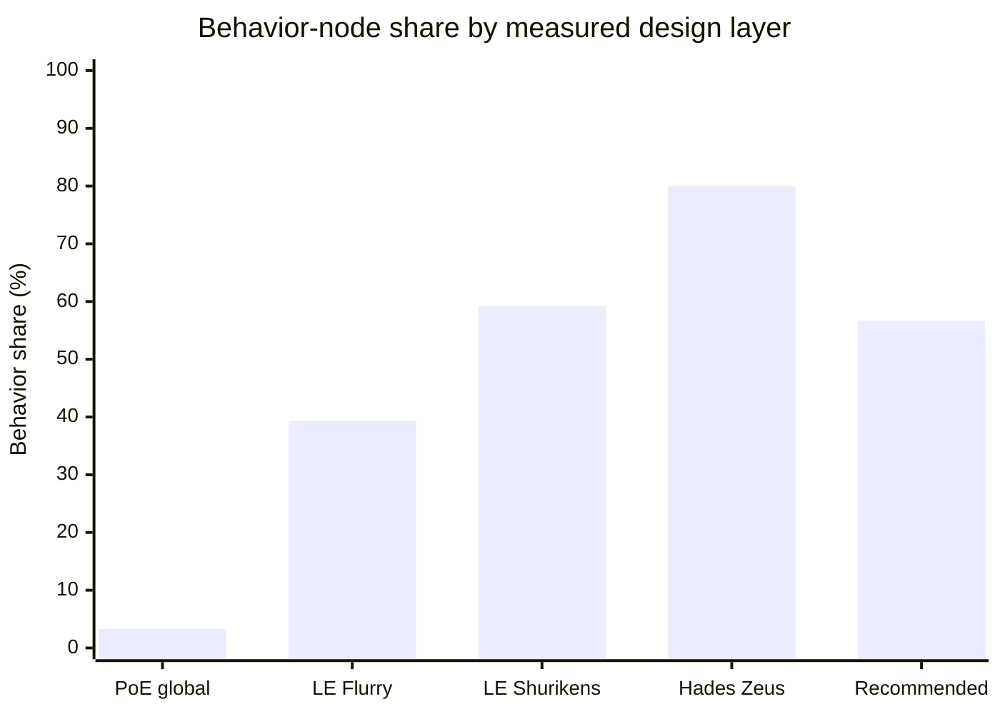
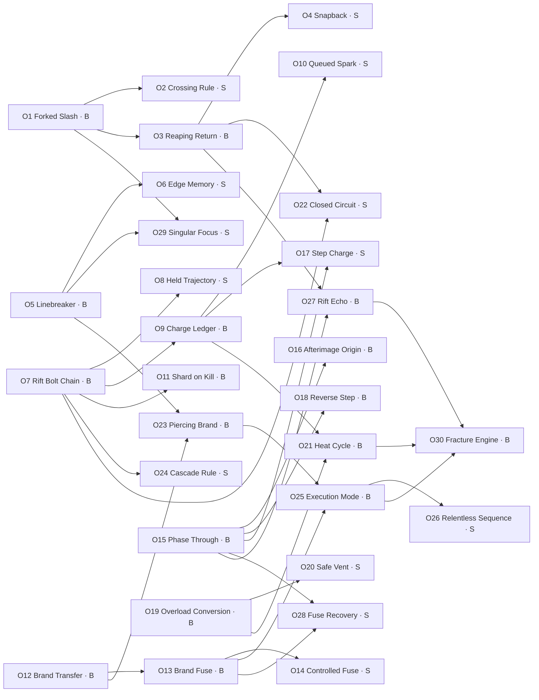

# Designing Three Behavior-First Class Skill Trees for an Action RPG

## Executive summary

A behavior-first skill tree should make a character **play differently**, not merely produce larger numbers. The most useful precedents occupy different points on that spectrum. *Path of Exile* uses a sparse layer of highly consequential keystones inside an enormous routing-and-scaling tree; *Last Epoch* places transformations directly inside compact, skill-specific trees; and *Hades* concentrates behavior changes into mutually exclusive ability slots and cross-god synergies. Grinding Gear Games explicitly describes keystones as passives that fundamentally change play by altering game rules, while *Last Epoch* gives each specialized skill a natural 20-point budget for its own tree, and *Hades* allows only one boon in each core Attack, Special, Cast, Dash, and Call slot. citeturn18search0turn18search2turn19search0

For a tree of approximately 30 named nodes, the recommended center point is **17 behavior nodes and 13 support nodes**, or roughly **57% behavior to 43% support**. A practical acceptable range is **15–18 behavior nodes**. Below that range, the tree tends to become a numeric optimization puzzle with a few mandatory transformations. Above it, interaction complexity, incompatibility handling, tooltip burden, and balance-state count rise sharply.

The number of behavior nodes present in the tree is less important than the number a completed build actually combines. For experienced ARPG players, **three key behavior nodes are enough to establish a recognizable archetype**, while **four or five orthogonal behavior nodes can produce a strongly differentiated build**. Three binary transformations yield eight theoretical configurations; five yield 32. A more deliberately structured system—one of three delivery modes, one of three cadence modes, and two of four interaction mechanics—produces \(3 \times 3 \times \binom{4}{2}=54\) theoretical packages before viability filtering.

The essential design rule is therefore:

> **Spend complexity on orthogonal changes to targeting, cadence, resource flow, hit consequences, and skill relationships—not on multiple nodes that all solve “deal more damage.”**

All three blueprints in this report use exactly **30 nodes**, split **17 behavior / 13 support**. None grants a new active ability or a flat percentage/stat increase. The support nodes instead improve routing, reliability, sequencing, recovery rules, state retention, and compatibility.

## Evidence from the reference games

### Classification method and audit assumptions

For this report, a node is classified as **behavior-modifying** when it changes at least one of the following:

| Behavioral axis | Qualification |
|---|---|
| Input | Hold versus tap, channeling, recast, directional modifier, timing window |
| Delivery | Cone, line, orbit, ground placement, return, chain, pierce, homing |
| Cadence | Third-hit cycle, delayed release, burst sequence, alternating mode |
| Resource model | Mana becomes life, cooldown becomes charges, hits restore uses |
| State machine | Marks, stored projectiles, heat, stance, fuse, prepared attack |
| Hit consequence | Knockback, immobilization, status transfer, delayed detonation |
| Skill relationship | One existing ability triggers, redirects, primes, or relocates another |
| Damage identity | Element conversion or restrictions that change gearing and interactions |
| Defensive model | Evasion becomes armor, recovery changes source, shield applies elsewhere |

A **support node** may still alter moment-to-moment rules, but it does not introduce a new primary play pattern. It makes an existing pattern more usable, legible, reliable, or connectable. Pure damage, critical chance, penetration, speed, range, duration, resistance, and recovery magnitudes are support/numeric even when they are strong.

This is intentionally stricter than many game databases. For example, “chance to bleed” is counted as behavior only when the ailment opens a distinct state or interaction branch; otherwise it is support. Conversely, turning a projectile into a returning chakram is behavior even if the node also contains large numeric adjustments.

Exact current subtotals are not equally available from all publishers. The *Path of Exile* official tree reports **1,325 total passive skills**, but does not expose a convenient current subtotal for ordinary-tree keystones. The report therefore uses an estimated **44 regular-tree keystones in version 3.29**, manually excluding Atlas, Timeless Jewel, cluster-jewel, item-only, and removed keystones. That estimate should be treated as an audit assumption rather than an official count. The 3.29 patch added Bitter Frost, Roiling Tempest, and Voracious Flame, each coupling a strong elemental rule with a “cannot deal non-[element] damage” restriction. citeturn18search0turn1view2turn20search4

For *Last Epoch*, named nodes were counted from the official March 2026 Rogue skill-tree documentation. Node ranks were not expanded into separate nodes: a five-rank node counts as one named node. For *Hades*, the Zeus pool is counted from the published boon list, and the core-slot matrix is a conceptual design count—eight core Olympians multiplied by five exclusive ability slots—not a claim about the total number of unique boon records. citeturn18search1turn19search0

### Path of Exile: sparse, high-impact rule changes

*Path of Exile* separates keystones from ordinary passives and notables. Its official description says keystones alter game rules, usually with both an advantage and a disadvantage. Necromantic Aegis, for example, removes shield properties from the player and gives them to minions. This “gain a new operating rule, surrender an old assumption” structure is the clearest model for identity anchors. citeturn18search0

Representative behavior patterns include:

| Node pattern | Concise example | Behavioral effect |
|---|---|---|
| Accuracy/critical rewrite | Resolute Technique | Attacks cease missing, but critical attacks are removed from the build’s possibility space. |
| Resource substitution | Blood Magic; Eldritch Battery | Skill payment moves to a different defensive or life resource, changing gearing and sustain priorities. |
| Defense conversion | Iron Reflexes; Ghost Reaver; Zealot’s Oath | One defensive or recovery system is redirected into another. |
| Critical-state rewrite | Elemental Overload | Critical hits become an activation condition rather than a direct critical-damage strategy. |
| Ailment topology | Crimson Dance; Voracious Flame | The number, duration, or stacking model of damage-over-time effects changes. |
| Elemental lock | Avatar of Fire; Bitter Frost; Roiling Tempest | The build gains a specialized elemental rule while losing access to other damage types. |
| Ownership transfer | Necromantic Aegis | Equipment behavior is reassigned from the character to minions. |
| Damage source delegation | Ancestral Bond | Damage responsibility shifts toward totems, altering action economy and skill selection. |

The main lesson is not that every node should resemble a keystone. It is that a small set of nodes should be describable as **rules**, not merely as bonuses. The disadvantage also matters: without a meaningful opportunity cost, a behavior node becomes a mandatory upgrade rather than an archetype choice.

The danger is binary dominance. A keystone can appear to offer a trade-off while its downside is functionally irrelevant to the build that selects it. In that situation, the node is not a choice between playstyles; it is a build tax or an automatic inclusion. Community discussion around keystone layouts has long highlighted how downstream benefits, item interactions, or easy downside bypasses can make supposedly transformative decisions less optional than they appear. citeturn22search10

### Last Epoch: transformations embedded in compact skill trees

*Last Epoch* provides up to five skill-specialization slots, and specialized skills naturally level to 20, creating a relatively constrained point budget per skill. This makes it closer to the requested 30-node design than *Path of Exile’s* global tree. citeturn18search2

The official Flurry tree demonstrates several kinds of transformation in one skill. Boundless Blows makes Flurry channeled and introduces a per-second mana cost. Crescendo redistributes output toward the third strike. Fusillade replaces every sixth bow arrow with Multishot. Shockwave causes melee strikes to produce Force Waves. Vile Tactics assigns different ailments and resistance-shred effects to the first, second, and third strikes. citeturn21view0turn21view1turn21view2turn21view3

Shurikens is even more behavior-dense. Acrobatics adds a backflip and a cooldown; Blade Shield makes the projectiles orbit the character; Chakram replaces multiple shurikens with one returning projectile; Deadly Aim converts the cone into a straight line and permits repeated hits on one target; Ricochet adds target-to-target bouncing; and Throwing Star changes the forward cone into an all-around release. citeturn19search1turn21view2

Those examples illustrate an important hierarchy:

1. **Mode transformations** such as Chakram or Blade Shield establish the build’s identity.
2. **Topology modifiers** such as Ricochet, pierce, and all-around targeting establish encounter behavior.
3. **Interaction nodes** such as ailment sequencing or triggered waves connect the mode to the wider build.
4. **Support nodes** such as range, duration, penetration, and damage make the selected mode viable.

Community analyses show why point topology matters as much as node count. One comparison counted 27 named nodes in both Fireball and Lightning Blast, but 91 total ranks to fill Fireball versus 70 for Lightning Blast. Under a simplified equal-cost assumption, a 20-point build could reach approximately 5.93 Fireball nodes or 7.71 Lightning Blast nodes. The analysis is not a balance proof, but it correctly identifies a hidden design variable: **a 30-node tree may offer only six meaningful selections if ranks and path taxes consume the budget**. citeturn22search0

Community criticism of generic damage nodes provides the complementary warning. Players may perceive low-impact numeric nodes as “dead weight,” especially when they do not lead to a transformation or meaningful interaction. Other community responses note that stepping-stone nodes can serve balance and pathing purposes, but the debate itself shows that designers must make the purpose of support nodes visible. citeturn22search3

### Hades: exclusive slots and cross-system synergies

In *Hades*, an Attack, Special, Cast, Dash, or Call can hold only one corresponding core boon. A new god can offer to replace the existing boon in that slot. This makes the choice structurally different from an additive passive tree: selecting a new core behavior often means explicitly displacing the old one. citeturn19search0turn22search4

God identities are expressed behaviorally:

| God | Behavior language |
|---|---|
| Zeus | Chain lightning, repeated bolts, Jolted, extra lightning bursts |
| Poseidon | Knockback, wall collisions, secondary shoves |
| Athena | Projectile reflection and Deflect windows |
| Ares | Delayed Doom or persistent Blade Rift zones |
| Demeter | Chill, beam tracking, freeze-like thresholds |
| Dionysus | Stacking Hangover and persistent Festive Fog |
| Aphrodite | Weak, Charm, short-range Cast transformations |
| Artemis | Critical-event triggers, seeking projectiles, Cast interactions |

The Zeus list is especially illustrative. Lightning Strike adds chain lightning to Attack; Electric Shot turns Cast into bouncing chain lightning; Lightning Reflexes rewards a near-hit dash with a bolt; Static Discharge adds Jolted to lightning effects; Double Strike permits a repeated bolt; and Splitting Bolt adds another burst to all lightning effects. By contrast, High Voltage, Clouded Judgement, and Billowing Strength primarily alter area, gauge generation, or output and are classified here as support. citeturn19search0

Duo boons deepen the system through prerequisite-based combinations. There are 28 Duo boons shared across the eight core Olympians, one for every pair. Examples include Blizzard Shot, which makes a Cast move slowly, pierce, and emit shards; Curse of Longing, which makes Doom repeatedly affect Weak enemies; and Smoldering Air, which changes Call generation into an automatic but capped process. citeturn20search1turn20search8turn20search9

Supergiant’s patch history demonstrates that these behavioral networks require continued compatibility and offer-rate tuning, not merely damage tuning. Official patches adjusted Duo prerequisites, exchange-boon offering rates, Deflect interactions, Cast compatibility, tracking, and secondary knockback behavior in addition to ordinary power values. citeturn19search2turn19search3turn20search0

## Behavior-node taxonomy and measured ratios

### Catalog of behavior-changing node types

| Node type | What it changes | Path of Exile example | Last Epoch example | Hades example |
|---|---|---|---|---|
| Target shape | Cone, line, radial, ground zone | Point Blank changes the effective engagement profile by distance | Deadly Aim creates a line; Throwing Star fires around the player | Crush Shot becomes a wide short-range Cast |
| Projectile topology | Chain, pierce, return, orbit | Keystone-level projectile rules can redefine knockback or delivery constraints | Ricochet, Ethereal Blades, Chakram, Blade Shield | Electric Shot bounces; Blizzard Shot pierces and emits shards |
| Input mode | Tap, hold, channel, recast | Resource keystones can change sustainable casting patterns | Boundless Blows makes Flurry channeled | Calls and some Cast transformations alter hold/release cadence indirectly |
| Cadence | Every nth hit, alternating sequence, delayed event | Elemental Overload uses a recent-critical activation state | Crescendo, Fusillade, Vile Tactics | Doom delays damage; Zeus’ Call repeatedly strikes during its window |
| Resource conversion | What pays for or refreshes the ability | Blood Magic; Eldritch Battery | Channel cost, mana-on-hit, or cooldown introduced by Acrobatics | Smoldering Air automatically fills Call but caps usable gauge |
| Cooldown/charge model | Time-based recovery versus stored uses | Flask-charge and recovery keystones provide analogous global models | Acrobatics adds a cooldown; other trees convert skills into charge loops | Hermes frequently changes recharge and automatic recovery behavior |
| Damage conversion and tags | Damage identity and scaling ecosystem | Avatar of Fire; Bitter Frost; Roiling Tempest | Charged Steel converts Shurikens toward lightning | Gods replace the behavior and damage package occupying a core slot |
| Hit effects | Push, pull, immobilize, reflect, mark | Knockback and ailment keystones alter consequences of hits | Stagger immobilizes; Behind the Veil blinds | Poseidon knocks back; Athena Deflects; Zeus applies Jolted |
| Triggered sub-effects | Existing skill causes a secondary event | Ailment and totem rules create secondary damage ownership | Shockwave creates Force Waves; Kineticism creates a kill burst | Support Fire launches arrows after existing actions |
| Alternate mode | Skill becomes another form while retaining its action slot | Keystone clusters can transform an entire defense or offense model | Chakram and Blade Shield replace Shurikens’ normal delivery | Crystal Beam or Trippy Shot replaces default Cast behavior |
| Ownership/origin transfer | Effect emanates from another entity or location | Necromantic Aegis transfers shield effects to minions | Shadow and minion nodes can relocate or duplicate skill origins | Casts, fog zones, revenge effects, and Duo boons alter effect origin |
| State interaction | Apply, spread, consume, refresh, or transfer a state | Elemental Overload and ailment keystones create persistent conditions | Adrenaline Rush, Vile Tactics, ailment branches | Weak, Doom, Hangover, Chill, Jolted, and Duo prerequisites |

### Quantified comparison

The ratios below should not be treated as direct quality rankings. The systems use different denominators: *Path of Exile* is a global character-routing tree, *Last Epoch* is a single-skill tree, and the *Hades* samples are boon pools. The comparison shows **layering strategy**, not merely transformation density.

| Measured scope | Total named elements | Behavior | Support/numeric or other | Behavior share | Audit note |
|---|---:|---:|---:|---:|---|
| Path of Exile global passive tree | 1,325 | 44 assumed keystones | 1,281 | 3.3% | Conservative lower bound: only estimated regular-tree keystones counted as behavior; behavior-changing notables/masteries are therefore undercounted. |
| Last Epoch Flurry | 28 | 11 | 17 | 39.3% | Manual strict classification of official named nodes; ranks not expanded. |
| Last Epoch Shurikens | 27 | 16 | 11 | 59.3% | Mode, topology, conversion, status, and targeting nodes counted as behavior. |
| Last Epoch two-skill aggregate | 55 | 27 | 28 | 49.1% | Unweighted aggregate of Flurry and Shurikens. |
| Hades Zeus boon pool | 15 | 12 | 3 | 80.0% | Strictly the listed Zeus pool, not all boons in the game. |
| Hades core-slot matrix | 40 conceptual cells | 40 | 0 | 100% | Eight core Olympians × five exclusive core slots; deliberately excludes secondary support boons. |
| Recommended 30-node class tree | 30 | 17 | 13 | 56.7% | Center target; acceptable range approximately 50–60%. |

The official *Path of Exile* count and description support the global-tree denominator, while the *Last Epoch* counts come from the named Flurry and Shurikens entries in its official support documentation. The *Hades* denominator follows the five exclusive slots and the published Zeus list. citeturn18search0turn18search1turn19search0

### Recommended ratio

For a 30-node tree, **17 behavior / 13 support** is the strongest general-purpose starting point.

A useful internal composition is:

| Functional layer | Suggested count | Purpose |
|---|---:|---|
| Identity anchors | 3–4 | Alternate mode, input model, resource model, or major targeting transformation |
| Delivery and interaction behaviors | 8–10 | Chain, pierce, return, marks, status flow, cadence, skill-to-skill links |
| Bridge behaviors | 4–5 | Connect otherwise separate branches without defining a complete archetype alone |
| Support nodes | 12–14 | Reliability, pathing, recovery conditions, state retention, safety rules, compatibility |

A lower behavior ratio—roughly 10–13 of 30—makes balance easier and creates clearer progression, but often causes the transformation nodes to become mandatory while the rest of the tree determines only efficiency. A higher ratio—roughly 20–24 of 30—creates many exciting tooltips, but increases the number of interaction pairs that must be specified. With 17 behavior nodes there are already \(\binom{17}{2}=136\) possible pairs; with 22 there are 231. Not every pair interacts, but the testing and explanation burden grows in that direction.

Support nodes are therefore not undesirable filler. They provide controlled investment depth and allow two builds using the same anchor to differ in consistency, sequencing, or encounter preference. The requirement is that support nodes avoid being universal, context-free power. A support node should answer “**how do I sustain or connect this chosen behavior?**,” not “**why would any build decline more damage?**”

## Distinct builds from only a few behavior nodes

### Minimal node-count scenarios

Three behavior nodes are sufficient when each occupies a different axis. For example:

1. A delivery node changes a projectile from cone to orbit.
2. A cadence node causes every third use to reverse direction.
3. A state node makes returning hits consume a mark.

That combination changes positioning, rhythm, target selection, and sequencing. Adding seven generic damage nodes would not create the same degree of distinction.

| Key behavior nodes selected | Binary theoretical configurations | Expected visibly distinct configurations after overlap and dominance | Appropriate use |
|---:|---:|---:|---|
| 2 | 4 | 2–3 | Early tutorial fork or weapon specialization |
| 3 | 8 | 4–6 | Minimum viable archetype layer |
| 4 | 16 | 8–11 | Strong target for ordinary endgame builds |
| 5 | 32 | 14–20 | High-expression build with greater compatibility burden |

The “expected distinct” range is a design estimate, not an empirical industry constant. It assumes some combinations will be redundant, incompatible, or dominated.

A better tree does not make every behavior node independent. It creates **orthogonal choice sets**:

\[
\text{Distinct packages}
=
\text{delivery choices}
\times
\text{cadence choices}
\times
\text{resource choices}
\times
\text{interaction packages}
\]

For example:

\[
3\ \text{delivery modes}
\times 3\ \text{cadence modes}
\times 2\ \text{resource models}
\times \binom{4}{2}\ \text{interaction pairs}
=108
\]

That is a theoretical design-space count. If only one half of those combinations proves coherent and viable, the tree still supports 54 packages. In practice, many packages will share performance characteristics, so telemetry must test experiential rather than merely combinatorial distinctiveness.

### Illustrative build variants from five behavioral axes

Assume one base projectile skill and the following selectable behaviors: orbit, line, return, chain, charge conversion, third-hit cadence, mark, immobilize, and stored release.

| Build variant | Behavior-node package | Resulting play pattern | Primary distinction |
|---|---|---|---|
| Orbiting attrition | Orbit mode; mark on contact; mark spread; return-state refresh | Remain near enemies, maintain orbit contact, and circulate marks through a pack | Proximity and sustained spatial control |
| Rail execution | Line mode; pierce; delayed mark detonation; cooldown-to-charge conversion | Align enemies, bank charges, and release precise penetrating attacks | Aim discipline and burst timing |
| Pinball control | Chain; immobilize on second contact; chain refresh; no-repeat target rule | Manipulate enemy spacing so projectiles traverse the whole group | Encounter geometry |
| Rhythm breaker | Third-hit mode; returning third hit; stored release; mark consumption | Build a predictable cadence, then reposition for the return pass | Sequence execution |
| Mobile skirmisher | Backstep on cast; return projectile; catch-to-refill; chain from return path | Attack while retreating, then re-enter as the projectile returns | Movement and route planning |
| Single-target fuse | Line mode; repeated-hit permission; escalating fuse; manual early detonation | Commit attention to one target and decide when to cash out the fuse | Target commitment |
| Defensive interceptor | Orbit mode; projectile interception; stored hostile projectile; release on guard | Convert enemy projectile pressure into a controlled counter-window | Reactive defense |
| Utility relay | Mark transfer; chain; status transfer; ally-origin mode | Route debuffs and control effects through selected targets or allies | Team and state management |

The builds are distinct not because their damage coefficients differ, but because an observer could identify them from movement, targeting footprint, and action sequence.

### How many nodes should a completed build actually take?

For a 30-node tree with a 20-point investment budget, a useful target is:

| Selection category | Typical completed-build allocation |
|---|---:|
| Identity anchors | 1–2 |
| Other behavior nodes | 2–4 |
| Support nodes | 6–10 |
| Path/bridge nodes | 3–6 |
| Total | Approximately 14–20 points |

A typical build should therefore end with **three to five active behavior changes**, not 12–15. Too many simultaneous transformations make it difficult to determine why the skill behaves as it does, and they reduce the perceptual importance of each node.

The tree may contain 17 behavior nodes while a build uses only four because the remaining nodes represent alternative modes. This is healthy unused content: it is the source of alternate builds rather than filler.

## Common design traps and mitigations

| Trap | Failure pattern | Reference lesson | Mitigation |
|---|---|---|---|
| Dominant binary anchor | One transformation outperforms baseline and all alternatives, so its “choice” is automatic | Keystone downsides cease to matter when the chosen build naturally ignores them | Give each anchor an encounter weakness, input cost, resource obligation, or incompatibility that remains relevant |
| Mandatory quality-of-life node | A skill feels clumsy without one node, making that node a hidden tax | Cooldown, targeting, or projectile-speed nodes can become obligatory before a mode feels functional | Put minimum usability in the base skill; let nodes exchange one usable pattern for another |
| Path-tax illusion | Players spend several points that do not support the destination mode | Community comparison of Last Epoch trees shows rank and tier costs can sharply reduce reachable named nodes citeturn22search0 | Use one-point bridges, dual-purpose prerequisites, and short alternate paths |
| Dead branch after transformation | A mode invalidates nodes already purchased on its route | Last Epoch community feedback has documented Shurikens combinations that do not interact or are explicitly disabled citeturn19search4 | Mark suppressed nodes before purchase; reroute incompatible support; provide conversion rather than silent invalidation |
| Generic power dominates identity | Players skip interesting nodes because universal output is mathematically superior | Community debate identifies generic damage as potentially mandatory or flavorless when it competes directly with transformations citeturn22search1turn22search3 | Do not place unconditional output and behavior nodes in the same opportunity-cost tier |
| Multiplicative interaction explosion | Two harmless sidegrades combine into extreme output, control, or resource loops | Hades patches repeatedly changed Duo prerequisites and interactions, not only values citeturn20search0 | Define trigger ownership, repeat limits, target revisit rules, and recursive-trigger exclusions |
| Unclear inheritance | Players cannot tell whether a triggered sub-effect inherits tags, costs, ailments, or modifiers | Complex subskill and transformed-projectile systems frequently generate compatibility questions | Display inherited tags and excluded modifiers directly in the node preview |
| Weak audiovisual differentiation | Behavior changes mathematically but appears identical in combat | Hades and Last Epoch rely heavily on distinct projectile paths, zones, and timing to communicate transformations | Give every identity anchor its own silhouette, sound cue, trajectory preview, and state icon |
| False combinatorics | The tree technically permits many combinations, but only one path is viable | Counting configurations alone ignores dominated combinations | Measure pick entropy, pairwise behavioral distance, and performance-adjusted diversity |
| Support-node orphaning | Support nodes work with only one mode yet remain reachable from unrelated branches | Players spend points that appear relevant from wording but do nothing after conversion | Use mode tags such as `RETURN`, `ORBIT`, `CHAIN`, `GUARD`, and gray out nonfunctional nodes |
| Excessive exclusivity | Too many hard lockouts make the tree feel preassembled | Hades’ exclusive core slots create clarity, but replacement also discards the previous core behavior citeturn19search0 | Reserve hard exclusivity for identity anchors; use soft incompatibility or converted effects elsewhere |
| Balance by hidden penalty | A transformation secretly loses hit frequency, proc scaling, or inheritance | Players interpret undocumented compensation as a bug | State all compensation rules in the node, including trigger coefficients and repeat restrictions |
| Respec friction | Experimentation is punished before players understand interactions | Last Epoch supports skill respecialization but re-leveling and minimum-skill-level rules still shape experimentation citeturn18search2 | Permit free preview arenas, temporary loadouts, or immediate refunds for recently selected behavior nodes |

A particularly important mitigation is the **compatibility contract**. Every behavior node should have a compact specification covering:

| Contract field | Example |
|---|---|
| Replaces | “Replaces cone delivery with orbit delivery.” |
| Preserves | “Preserves on-hit effects and damage tags.” |
| Suppresses | “Additional-projectile nodes create orbit slots rather than simultaneous throws.” |
| Trigger rule | “Returning hits may trigger mark consumption once per cast.” |
| Recursion rule | “Triggered returns cannot create additional returns.” |
| Conflict rule | “Cannot coexist with Linebreaker; selecting either refunds the other.” |
| Visual rule | “Orbiting state uses a persistent ring and remaining-duration indicator.” |

This contract dramatically reduces ambiguity during implementation, balancing, testing, and tooltip writing.

## Recommended architecture and concrete tree blueprints

Each blueprint assumes the class already possesses the named base abilities. The nodes only modify those abilities. “Support” means the node reinforces, connects, or stabilizes a behavior; it does not grant flat statistics.

### Simple tree: Vanguard Circuit

**Existing abilities:** Cleave, Guard, Rush, Spear Throw, Rally  
**Design goal:** Immediately readable cause-and-effect, low interaction burden  
**Ratio:** 17 behavior / 13 support

| ID | Node | Type | Effect | Prerequisite |
|---|---|---|---|---|
| S1 | Split Arc | Behavior | Cleave becomes two narrow sweeps that cross at the aimed point instead of one broad sweep. | None |
| S2 | Follow-Through | Support | The second sweep occurs only when the first sweep contacts an enemy or destructible object. | S1 |
| S3 | Backhand Return | Behavior | Cleave’s second sweep travels from its endpoint back toward the character. | S1 |
| S4 | Precision Window | Support | A successful first sweep pauses combo decay until the returning sweep resolves. | S2 |
| S5 | Heavy Rhythm | Behavior | Every third Cleave becomes an overhead line attack rather than an arc. | None |
| S6 | Banked Beat | Support | A missed Cleave does not advance the third-hit sequence. | S5 |
| S7 | Returning Spear | Behavior | Spear Throw reverses at maximum travel or on terrain contact and returns along its path. | None |
| S8 | Catch and Release | Support | Catching the returning spear removes the wind-up from the next Spear Throw; failing to catch it removes this preparation. | S7 |
| S9 | Pinball Point | Behavior | The spear redirects to one nearby target after its first hit, then begins its return. | S7 |
| S10 | Ground Stake | Behavior | A spear that hits no enemy lodges in the ground; the next Rush may target the lodged spear as an endpoint. | S7 |
| S11 | Safe Recall | Support | When the return path is blocked, the spear reappears at the catch point without applying return-hit effects. | S7 |
| S12 | Mobile Guard | Behavior | Guard becomes a directional barrier that can move with the character but cannot rotate after being raised. | None |
| S13 | Riposte Gate | Behavior | A precisely timed Guard makes the next Cleave begin with its second sweep. | S12 |
| S14 | Guarded Advance | Support | Rush may begin while Guard is held; Guard remains fixed in its original facing until Rush ends. | S12 |
| S15 | Wide Brace | Support | Remaining stationary while Guard is raised gradually changes it from a narrow directional barrier into a broad frontal barrier. | S12 |
| S16 | Throughline | Behavior | Rush passes through the first enemy struck and ends at the next collision. | None |
| S17 | Hook Turn | Behavior | After passing through an enemy, Rush accepts one directional correction before continuing. | S16 |
| S18 | Momentum Carry | Support | If Rush ends without colliding, the character keeps moving into the wind-up of the next existing attack. | S16 |
| S19 | Collision Guard | Support | Colliding during a Guarded Advance ends Rush in the Guard state instead of the ordinary recovery state. | S14 and S16 |
| S20 | Echoing Rally | Behavior | Catching a returning spear repeats Rally at the catch position. | S7 |
| S21 | Quiet Command | Behavior | Rally no longer radiates from the character; it applies along the path of the next Cleave or Spear Throw. | None |
| S22 | Hold the Line | Support | A precisely timed Guard refreshes an active Rally path; waiting does not extend it. | S12 and S21 |
| S23 | Marked Arc | Behavior | The overhead Cleave marks its last target; a returning spear consumes the mark and immediately reverses again. | S5 and S7 |
| S24 | Rebound Stance | Behavior | Catching the spear changes the next Guard into a brief radial parry instead of a sustained frontal barrier. | S7 and S12 |
| S25 | Unbroken Route | Support | Beginning the sequence Cleave → Rush → Spear Throw pauses Cleave’s rhythm decay until the sequence succeeds or breaks. | S5 and S16 |
| S26 | Deliberate Catch | Support | Holding Guard prevents an automatic spear catch, allowing the player to reposition before receiving it. | S7 and S12 |
| S27 | Overrun | Behavior | Passing through an enemy with Rush prepares the overhead form of the next Cleave, without advancing its normal rhythm counter. | S5 and S16 |
| S28 | Anchored Guard | Support | Guard facing snaps toward a lodged spear when raised between the character and that spear. | S10 and S12 |
| S29 | Rally Relay | Behavior | A Rally path attached to a spear follows the outward path, redirection, and return instead of remaining fixed. | S20 and S21 |
| S30 | Disciplined Circuit | Behavior | Completing Guard → Cleave → Rush → Spear Throw rotates Cleave’s next delivery through broad arc, overhead line, and returning backhand. Breaking the sequence resets it. | S23, S24, and S27 |

**Expected builds:** shielded counterattacker, returning-spear skirmisher, third-hit rhythm fighter, mobile line-breaker, and Rally-path commander.

### Offense tree: Riftblade Fracture

**Existing abilities:** Arc Slash, Rift Bolt, Phase Step, Brand, Overload  
**Design goal:** High offensive expression through delivery, marks, charges, and sequencing  
**Ratio:** 17 behavior / 13 support

| ID | Node | Type | Effect | Prerequisite |
|---|---|---|---|---|
| O1 | Forked Slash | Behavior | Arc Slash becomes two narrow waves that diverge and reconverge at the aimed point. | None |
| O2 | Crossing Rule | Support | A target at the intersection is treated as struck by one combined segment, preventing accidental double resolution. | O1 |
| O3 | Reaping Return | Behavior | Arc Slash reverses at maximum range and travels back toward its origin. | O1 |
| O4 | Snapback | Support | Recasting Arc Slash recalls an outgoing wave immediately; recalled waves retain their return-hit identity. | O3 |
| O5 | Linebreaker | Behavior | Arc Slash becomes a narrow piercing line and loses its arc shape. | None |
| O6 | Edge Memory | Support | Linebreaker leaves a brief non-damaging trace that shows the path the next Rift Bolt will follow. | O5 |
| O7 | Rift Bolt Chain | Behavior | Rift Bolt redirects from its first target to another eligible target. | None |
| O8 | Held Trajectory | Support | Holding Rift Bolt displays and locks its initial path; release fires along the locked path. | O7 |
| O9 | Charge Ledger | Behavior | Rift Bolt’s cooldown becomes stored charges; charges refill only when a returning Arc Slash reaches its origin. | O3 and O7 |
| O10 | Queued Spark | Support | A Rift Bolt input made with no charge is retained and fires when the next charge returns, unless movement cancels it. | O9 |
| O11 | Shard on Kill | Behavior | If Rift Bolt kills its target before completing its route, its remaining route divides toward separate nearby targets. | O7 |
| O12 | Brand Transfer | Behavior | When a Branded enemy dies, its Brand moves to the nearest unbranded enemy that contributed to the encounter. | None |
| O13 | Brand Fuse | Behavior | Direct hits advance a visible fuse on the Brand; reaching the end causes the next direct hit to detonate it. | O12 |
| O14 | Controlled Fuse | Support | Echoes, damage-over-time ticks, and reflected effects cannot advance the Brand fuse. | O13 |
| O15 | Phase Through | Behavior | Phase Step may pass through enemies; the exit direction becomes the facing of the next Arc Slash. | None |
| O16 | Afterimage Origin | Behavior | The next Arc Slash begins at the departure point of Phase Step and travels toward the character’s new position. | O15 |
| O17 | Step Charge | Support | Passing through a Branded enemy with Phase Step restores the oldest missing Rift Bolt charge. | O9 and O15 |
| O18 | Reverse Step | Behavior | Holding the opposite movement direction swaps Phase Step’s start and endpoint logic, causing the character to emerge behind the selected origin. | O15 |
| O19 | Overload Conversion | Behavior | Overload loses its fixed cooldown and instead drains a heat meter while maintained; using Arc Slash and Rift Bolt fills heat. | None |
| O20 | Safe Vent | Support | Ending Overload voluntarily preserves its current heat position; forced termination empties the meter. | O19 |
| O21 | Heat Cycle | Behavior | Every third Rift Bolt may consume accumulated heat to become a returning projectile instead of ending at its last target. | O9 and O19 |
| O22 | Closed Circuit | Support | A returned or chained event cannot trigger another copy of the event that created it. | O3 and O7 |
| O23 | Piercing Brand | Behavior | Linebreaker carries a Brand through struck enemies and leaves it on the final enemy reached. | O5 and O12 |
| O24 | Cascade Rule | Support | Chaining Rift Bolts cannot revisit a target until every other eligible target in the current chain has been visited. | O7 |
| O25 | Execution Mode | Behavior | Detonating a fully fused Brand prepares the next Arc Slash as a single-target thrust; the prepared thrust cannot fork or return. | O13 and O23 |
| O26 | Relentless Sequence | Support | Missing with a prepared thrust retains the preparation until its visible timing window closes. | O25 |
| O27 | Rift Echo | Behavior | Phase Step reverses the direction of active returning Arc Slashes and returning Rift Bolts. | O3 and O15 |
| O28 | Fuse Recovery | Support | Detonating a Brand after stepping through its target restores Phase Step only if the fuse was advanced after the crossing. | O13 and O15 |
| O29 | Singular Focus | Support | Selecting Linebreaker suppresses Forked Slash’s geometry while preserving its prerequisite path; the interface previews the suppression before confirmation. | O1 and O5 |
| O30 | Fracture Engine | Behavior | Hitting a Brand through three different delivery events—direct, return, and chain—causes it to divide between its current target and one unbranded target. | O21, O25, and O27 |

**Expected builds:** fork-and-return clearing, charge-driven bolt caster, Brand execution specialist, Phase Step geometry build, and heat-cycle hybrid.

### Utility tree: Aegis Weaver Network

**Existing abilities:** Barrier, Pulse, Tether, Blink, Recall  
**Design goal:** Control, protection, redirection, and team utility without passive stat inflation  
**Ratio:** 17 behavior / 13 support

| ID | Node | Type | Effect | Prerequisite |
|---|---|---|---|---|
| U1 | Directional Barrier | Behavior | Barrier becomes a movable frontal plane instead of a stationary bubble. | None |
| U2 | Locked Facing | Support | Once raised, the Barrier retains its facing while the character moves until the ability is released. | U1 |
| U3 | Projectile Catch | Behavior | Enemy projectiles intercepted by Barrier are stored rather than destroyed; Pulse releases stored projectiles in its direction. | U1 |
| U4 | Safe Capacity | Support | When storage is full, the oldest captured projectile dissipates without triggering hit effects. | U3 |
| U5 | Escort Barrier | Behavior | Barrier attaches to a selected ally, minion, or escort objective instead of the caster. | None |
| U6 | Return Clause | Support | If its host becomes invalid or leaves tether range, Escort Barrier returns to the caster rather than ending. | U5 |
| U7 | Pulse Ring | Behavior | Pulse originates from the active Barrier instead of the caster. | None |
| U8 | Inward Pulse | Behavior | Pulse pulls eligible enemies toward its origin instead of pushing them away. | U7 |
| U9 | Status Relay | Behavior | Pulse removes one transferable harmful state from an ally inside it and applies that state to the first eligible enemy struck. | U7 |
| U10 | Clean Handoff | Support | Status Relay always selects the oldest eligible state and displays the selected state before Pulse resolves. | U9 |
| U11 | Tether Fork | Behavior | Tether divides from its first target to one additional eligible target. | None |
| U12 | Shared Burden | Behavior | The first control effect applied to either tethered target is delayed and attached to the tether; breaking the tether applies it to the breaker. | U11 |
| U13 | Elastic Tether | Support | Brief range violations stretch the Tether; it breaks only if separation continues through the displayed grace window. | U11 |
| U14 | Tether Swap | Behavior | Blinking onto a tether line swaps the caster’s position with the nearest tethered target. | U11 |
| U15 | Blink Anchor | Behavior | Blink endpoints snap to the nearest edge of an active Barrier when aimed through it. | None |
| U16 | Deferred Blink | Support | Holding Blink previews and reserves the endpoint; release executes it, while taking another action cancels the reservation. | U15 |
| U17 | Wake Passage | Behavior | After Blink, the active Barrier travels along the Blink path before settling at the endpoint. | U15 |
| U18 | Recall Path | Behavior | Recall returns the caster along the route traveled since activation rather than relocating instantly. | None |
| U19 | Breadcrumb Limit | Support | Recall preserves only the latest three direction changes and previews the retained route. | U18 |
| U20 | Escort Return | Support | Recall also retrieves an attached Escort Barrier; it never forcibly recalls the ally hosting it. | U5 and U18 |
| U21 | Pulse on Return | Behavior | Pulse resolves once from each retained turn in the Recall route, using the Barrier’s current facing. | U7 and U18 |
| U22 | Quiet Recall | Support | If any retained route segment is invalid, Recall stops at the last safe point instead of selecting an unpreviewed route. | U18 |
| U23 | Catch and Redirect | Behavior | Pulse sends stored hostile projectiles along an active Tether before releasing them toward enemies. | U3 and U11 |
| U24 | Shelter Chain | Behavior | Escort Barrier moves to the next tethered ally when its current host leaves the Tether network. | U5 and U11 |
| U25 | Stable Relay | Support | Shelter Chain cannot revisit a previous host until each other eligible host has been considered. | U24 |
| U26 | Emergency Partition | Support | If Shared Burden would transfer an incapacitating effect to a protected host, the relevant Tether breaks and discards its delayed state. | U5 and U12 |
| U27 | Control Loop | Behavior | Using Inward Pulse immediately before Tether Swap reverses the Tether’s pull direction after the swap. | U8 and U14 |
| U28 | Cleanse Window | Support | A harmful state carried along a completed Recall route expires at the endpoint if Status Relay does not transfer it. | U9 and U18 |
| U29 | Shared Geometry | Support | Barrier, Pulse, and Tether previews use the Barrier’s current facing and origin, making combined paths visible before activation. | U1, U7, and U11 |
| U30 | Aegis Network | Behavior | Barrier, Pulse, and Tether share one mobile origin; using any of them moves that origin to the ability’s endpoint for the next network action. | U23, U24, and U27 |

**Expected builds:** projectile interceptor, mobile escort defender, pull-and-swap controller, status-transfer support, Recall-route zoner, and cooperative Barrier network.

## Playtesting and validation plan

### Core metrics

The evaluation must measure whether builds **behave differently**, not only whether their damage differs.

| Metric | Definition | Suggested interpretation |
|---|---|---|
| Behavior-node adoption | Behavior nodes selected per completed build | Median should fall near three to five |
| Build entropy | Shannon entropy of observed node packages | Low entropy signals convergence even when many combinations are legal |
| Effective build count | \(e^H\), where \(H\) is build-package entropy | Easier to communicate than raw entropy |
| Pairwise behavioral distance | Composite distance across targeting heatmaps, sequence patterns, resource curves, and movement | Builds with different labels should separate visibly |
| Input-sequence divergence | Difference in action n-grams or transition matrices | Detects cadence and combo differences |
| Targeting-footprint overlap | Spatial overlap of hit locations relative to player and enemies | Separates orbit, line, cone, return, and zone builds |
| State occupancy | Time spent in Guard, heat, charge, mark, fuse, orbit, or prepared modes | Reveals whether selected mechanics meaningfully activate |
| Mechanic activation rate | Relevant events per encounter or minute | Very low activation indicates misleading or overconditional nodes |
| Node marginality | Performance and behavior change when one node is removed | Finds nodes that are either irrelevant or overwhelmingly dominant |
| Pick-rate concentration | Share of successful builds using each node or pair | High concentration identifies mandatory choices |
| Performance spread | Clear time, boss time, deaths, resource downtime, and objective success | Distinct behavior should not imply uncontrolled power spread |
| Comprehension error | Difference between predicted and actual node interaction in player tests | High error indicates tooltip or compatibility failure |
| Respec regret | Frequency and timing of rapid node removal | Useful signal for traps, unclear prerequisites, or dead interactions |
| Visual recognition | Observer ability to identify a build from combat footage | Direct test of experiential distinctiveness |

### Controlled experiments

#### Ratio experiment

Create three otherwise equivalent versions of one tree:

| Variant | Behavior | Support | Hypothesis |
|---|---:|---:|---|
| Support-heavy | 14 | 16 | Easier comprehension, lower build recognition, greater numeric convergence |
| Recommended | 17 | 13 | Best compromise between identity, viability, and testing burden |
| Transformation-heavy | 20 | 10 | Higher novelty and recognition, but more conflicts and balance variance |

Experienced players should create builds under identical point budgets and fixed gear. Compare effective build count, blind recognition, completion rate, tooltip errors, and performance variance.

#### Low-node skeleton test

Give players only three behavior selections and six support selections. Remove all damage scaling differences from the prototype. The test asks whether three nodes alone create recognizable play patterns. Repeat with four and five behavior selections.

A successful result would show:

| Test | Suggested target |
|---|---|
| Blind observer identifies build family from a short combat clip | At least 80% accuracy |
| Players correctly predict key node interactions before combat | At least 85% |
| Selected behavior mechanics activate in ordinary encounters | At least once in most encounters |
| Different build families remain near one another in standardized completion time | Within roughly 10–15% before final tuning |
| No non-root behavior node appears in nearly every successful build | Preferably below 65–70% adoption |
| Most nodes appear in at least one credible package | At least 90% of nodes used across the test cohort |

These are proposed development thresholds, not established cross-industry standards.

#### Behavioral swap test

Take a validated build and replace exactly one identity or topology node while leaving all support selections and coefficients unchanged. The swap should produce a measurable change in at least two behavioral dimensions—for example targeting footprint and movement pattern—without automatically producing a large performance swing.

Examples include replacing:

| Original | Replacement | Expected behavioral change |
|---|---|---|
| Return | Chain | Route planning becomes pack-connectivity planning |
| Orbit | Line | Close-range occupancy becomes alignment and spacing |
| Third-hit overhead | Channeled mode | Discrete rhythm becomes commitment-time management |
| Cooldown | Charges | Regular temporal pacing becomes resource banking |
| Knockback | Pull | Defensive spacing becomes grouping and setup |

#### Compatibility matrix test

For 17 behavior nodes, explicitly test all 136 unordered pairs, then prioritize triples involving identity anchors. Every pair should receive one of four implementation labels:

| Label | Meaning |
|---|---|
| Composes | Both mechanics operate as written |
| Converts | One mechanic changes how the other is expressed |
| Suppresses | One mechanic intentionally disables part of the other, visibly stated |
| Exclusive | The pair cannot be selected together |

“No specification” is not an acceptable fifth state.

#### No-number prototype

Temporarily normalize damage, status potency, and recovery across modes. Test only movement, targeting, cadence, resource availability, and encounter control. This reveals whether the tree’s apparent diversity survives after numeric incentives are removed.

A behavior-first tree has succeeded when players still prefer different builds under normalized output because those builds solve positioning, timing, risk, and encounter geometry differently.

### Final design recommendation

The three trees should launch from the following baseline:

| Parameter | Recommendation |
|---|---|
| Named nodes | 30 |
| Behavior/support split | 17 / 13 |
| Completed-build behavior selections | Usually 3–5 |
| Major identity anchors | 3–4 per tree |
| Hard-exclusive pairs | No more than 2–3 |
| Point ranks | Prefer one rank for behavior nodes; limited ranks for support |
| Path length to first identity change | No more than 2 prerequisite points |
| Interaction documentation | Explicit preserve/suppress/trigger/recursion contract |
| Balance philosophy | Sidegrades first; conditional compensation rather than universal output |
| Validation priority | Behavioral distance and comprehension before final damage tuning |

The reference games collectively support a layered approach. *Path of Exile* shows the value of rare, legible rule changes; *Last Epoch* shows how alternate modes, targeting changes, conversion, and triggered effects can coexist within one compact skill tree; and *Hades* shows how exclusive ability slots, prerequisites, and cross-system synergies create highly recognizable run identities. Their shared warning is that transformation density alone does not ensure choice: routing costs, hidden incompatibilities, universal power nodes, and trivialized drawbacks can collapse a large theoretical tree into a small practical metagame. citeturn18search0turn21view0turn21view2turn19search0turn20search1

The recommended 17/13 structure avoids that collapse by giving every tree enough transformations to support several archetypes while reserving enough support capacity to make those archetypes coherent, testable, and usable. Distinctiveness should be judged by what players aim at, when they act, where they stand, what state they maintain, and how their abilities connect—not by how many percentage bonuses appear in the build summary.