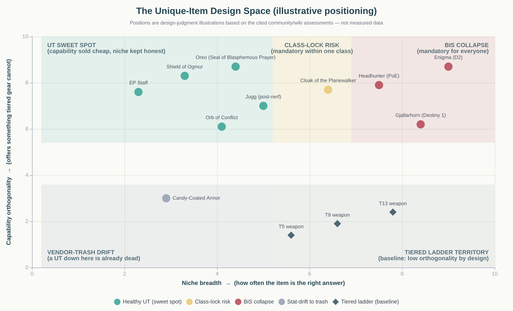
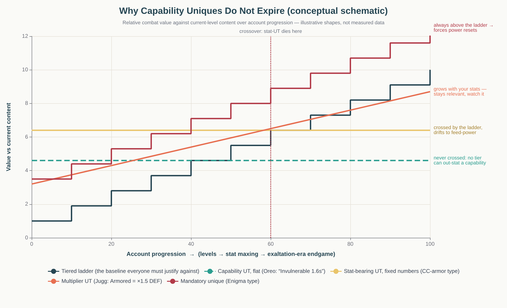
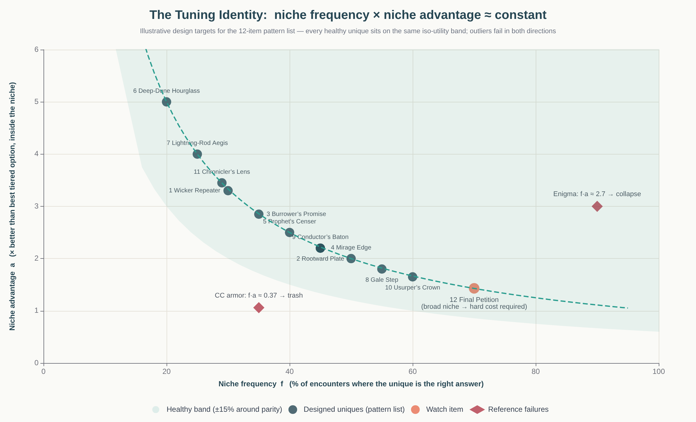
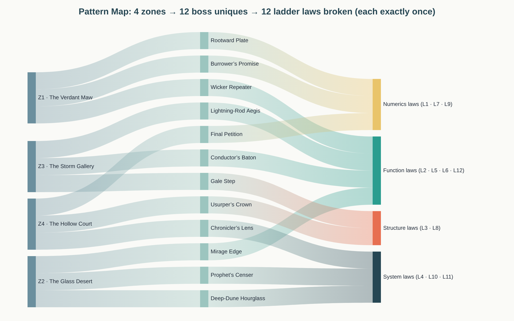

# Always Useful, Never Mandatory

## A Design Playbook for Boss-Tied Unique Items That Outlive the Gear Ladder

*A pattern language built from Realm of the Mad God's UT system and two decades of cross-genre evidence, ending in a concrete 12-unique / 4-zone pattern list in which every unique breaks exactly one rule.*

---

## TL;DR

A boss unique stays **useful forever but never mandatory** when it sells a **capability** (something no tier of the ladder can provide at any price) rather than **stats** (something the next tier always provides cheaper). The recipe: give the unique an **honest, slightly-below-tier chassis**, let it **break exactly one rule** of the gear system, attach a **legible cost that is always paid**, and anchor it to a **niche that really occurs in your content but is never universal**. The tuning identity is **niche frequency × niche advantage ≈ constant** across all uniques: a tool that is the right answer 25% of the time may be 4× better there; a tool that is the right answer 60% of the time may only be 1.6× better. Uniques collapse upward into best-in-slot when the effect is universal, costless, or class-defining (Enigma, Gjallarhorn); they collapse downward into vendor trash when their value is a fixed number the ladder eventually crosses (Candy-Coated Armor). The 12-item pattern list in §5 operationalizes this: four zones, three boss uniques each, and twelve "ladder laws" each broken exactly once.

---

## 1. The Equilibrium: What "Always Useful, Never Mandatory" Is Made Of

### 1.1 Utility is a different currency than power

Realm of the Mad God's own wiki defines the genre's archetype in one sentence: untiered items "break from the standard tier progression" and "usually fulfil a more specialised purpose," with the crucial rider that "certain UTs are weak, but others are among the most highly desired items in the game" [^13^]. Notice what that definition does *not* say. It does not say UTs are stronger. The entire UT category is built on the premise that an item can be **desirable for decades without ever being numerically superior** to the tiered alternative in its slot. RotMG's tiered ladder is steep and explicit — fourteen weapon tiers, fourteen armor tiers, seven ability and ring tiers — yet the items players hunt for years are overwhelmingly the ones that do something *the ladder structurally cannot*: grant Armored, grant Invulnerable, armor-break a boss, teleport [^20^][^61^]. The ladder sells numbers; uniques sell verbs.

Path of Exile's designers state the same principle as policy. In a 2013 design discussion, GGG's Mark (a developer) explained why uniques must sit below the best rares: "it's important that uniques aren't better than the very best possible rares — so they can be upgraded from," and when a bonus is too powerful for one item's budget, the answer is to "put it on a unique and add a drawback that balances it, so that the item as a whole still isn't better than the best possible rares" [^4^]. Two commitments fall out of that quote, and both are load-bearing for everything else in this report. First, **the tiered ladder is the baseline of value**, and a unique must always be arguable-against — the moment a unique is simply better, the slot is dead and the game's itemization shrinks by one slot. Second, **over-budget effects are purchasable with drawbacks**, not forbidden — the design space of uniques is precisely the space of effects you cannot afford honestly, paid for with costs the ladder never charges.

This is why the framing "power creep" is slightly wrong for uniques. Power creep is a disease of **one shared currency**: new cards or items become "strictly better" than old ones on the same axis, which Magic: The Gathering's designers treat as a definitional failure mode, since unchecked creep "negates the value of older cards" and "plays havoc with design space" [^23^][^35^]. A unique that pays a different currency — a capability, a constraint, a risk — cannot be strictly better than anything, because the comparison is never one-dimensional. The design goal for boss uniques is therefore not "strong but not too strong." It is **incommensurable**: always arguably the right tool, never obviously the only tool.

### 1.2 The five equilibrium conditions

"Always useful but never mandatory" sounds like a vibe; it is actually a checklist. A unique holds the equilibrium when five conditions are simultaneously true, and every documented collapse — in either direction — can be traced to exactly one of them failing. The first condition is **orthogonal capability**: the item's headline effect must be something the tiered ladder does not sell at any tier, because any value denominated in stats is a value the ladder will eventually match. The second is the **strictly-better test, inverted**: for every piece of content in the game, there must exist a plausible loadout in which the best *tiered* item beats the unique — if you can name a content type where the unique is unconditionally correct, you have found a mandatory item. The third is a **real but narrow niche**: the situation the unique answers must genuinely occur in shipped content (or the item is vendor trash on arrival) but must not occur everywhere (or the item is a checklist item).

The fourth condition is a **legible, always-paid cost**: the price of the rule-break must be visible on the tooltip and paid on every use — a stat penalty, a cooldown, a slot, a risk — because hidden or evadable costs are how uniques quietly become mandatory. Enigma's teleport was priced only in runes, an economic cost that disappears the moment a player owns the item; the in-combat cost was zero, and so the item became "the perceived 'must have' of all end-game builds," worn even by Sorceresses who already had Teleport natively [^28^][^29^]. The fifth condition is **no content gating**: no encounter, group requirement, or social norm may assume ownership. Destiny's Gjallarhorn failed this socially rather than mechanically — LFG posts literally read "Gjallarhorn Req.," and players without it "would be kicked from the activity," at which point the item is mandatory whether the designers tuned it to be or not [^27^]. A unique that becomes a ticket into content has left the equilibrium no matter what its numbers say.

There is a sixth, softer condition that separates RotMG's thriving UT culture from games where sidegrades rot in banks: **the swap-out economy must be cheap**. RotMG players carry multiple items per slot and swap mid-dungeon, and community best-in-slot guides are literally structured as lists of "situational swapouts" — Queen's Stinger "great against high-defence enemies," a second seal "for where buffing a team is more favourable" [^17^][^21^]. Swapping is what converts a narrow niche into a *carried* item: if inventory is painful or equipment locks in combat, only universally-good items justify their slot, and the equilibrium collapses toward the mandatory. The conditions are summarized below.

| # | Equilibrium condition | What it prevents | Evidence anchor |
|---|---|---|---|
| 1 | Orthogonal capability (sell verbs, not numbers) | Ladder obsolescence | UTs "fulfil a more specialised purpose" yet are "among the most highly desired" [^13^] |
| 2 | Inverted strictly-better test (tiered wins somewhere) | BiS collapse | PoE: uniques must stay below best rares "so they can be upgraded from" [^4^] |
| 3 | Real but narrow niche | Trash on arrival / checklist item | EP staff: devastating in specific boss windows, ~zero true range otherwise [^36^] |
| 4 | Legible, always-paid cost | Quiet mandatory creep | Enigma's cost was only economic → "most game-warping item" [^29^] |
| 5 | No content gating | Social mandatory | "Gjallarhorn Req." LFG posts [^27^] |
| 6 | Cheap swap-out economy | Only universal items get carried | RotMG guides organized as "situational swapouts" [^17^] |

Figure 1 maps the space these conditions carve out. The horizontal axis is **niche breadth** — how often the item is the right answer — and the vertical axis is **capability orthogonality** — how much of its value is something tiered gear cannot do. Healthy UTs cluster high-left: broad capability, narrow-to-medium niche. The failure cases occupy exactly the two corners the conditions predict: items with fixed-stat value sink into the vendor-trash drift no matter how niche they are, and items whose capability is both powerful and universally applicable drift right into BiS collapse. The Cloak of the Planewalker sits in the amber band between them — "a must-have swap-out for every Rogue" [^38^] — which is the honest boundary case: an item can be mandatory *within one class* and still healthy for the game, but that is a risk posture, not a comfort zone, and §3.1 returns to it.

---

## 2. The Numerics Problem: Staying Exciting When the Ladder Outgrows Them

### 2.1 Why capability value does not decay

The deepest fact about RotMG's UT system is its longevity. The Seal of Blasphemous Prayer — the "Oreo" — was added in **Build 100, July 2010**, and the wiki's 2025-era assessment still calls it "without doubt an excellent choice for a variety of use cases" [^21^]. Fifteen years of content power growth did not touch it, because its effect is a **binary capability**: Invulnerable for roughly a second and a half. A 1.6-second window of not-taking-damage is worth exactly as much against a level-20 boss as against an exaltation dungeon boss, because the threats scale on the same axis as the player's stats while the window scales on neither. This is the central mechanic of the "always useful" half of the equilibrium: **flat capabilities are invisible to inflation**. Tiered gear competes on a numbers axis where next year's tier is always bigger; a capability unique competes on an axis the ladder does not have.

Contrast the items whose value *is* a fixed number. The Candy-Coated Armor once boasted "the highest defense out of any heavy armor in the game" at the price of a DEX penalty — a classic trade. But the trade was denominated in defense points, and the ladder kept printing bigger ones: against the T14 Annihilation Armor, CC now "only gives +2 DEF in exchange for the -5 DEX penalty" and is "generally outclassed by the best tiered armor," surviving mostly as pet feed [^37^]. Nothing about the item changed; the world moved past its number. That is the vendor-trash mechanism in its purest form, and it is purely a **denomination error**: the unique's premium was a stat, so the ladder's slope became its expiry date. Figure 2 draws the four trajectories side by side.

Between the immortal flat capability and the doomed fixed stat sits the most interesting family: **multipliers**, which inherit longevity from the player's own growth. The Helm of the Juggernaut grants Armored — a **×1.5 effective-defense** multiplier — plus Berserk, and trades away the tiered helm's Speedy to do it [^20^]. Because Armored multiplies whatever defense the rest of the build provides, its absolute value rises as the player maxes defense, exalts, and upgrades armor; the item rides the ladder instead of racing it. RotMG's exaltation system — permanent, class-wide stat bonuses fed by endgame dungeon completions, the game's post-8/8 progression layer [^60^][^63^] — quietly raises the value of every multiplier unique forever, at no design cost. The design rule: if a unique must deal in numbers, **denominate them as percentages of the player's other investment**, never as flat points.

### 2.2 Scaling levers that keep uniques alive without raising the ceiling

Multipliers are not the only self-scaling lever. RotMG's healthiest UTs draw on four distinct longevity levers, and the pattern list in §5 assigns them deliberately. **Status exclusivity** is the strongest: Invulnerable and Armor Broken barely exist elsewhere in the game — Ogmur is "one of 2 practical items that Armor Break" — so the unique owns a whole verb [^21^][^61^]. **Proc and synergy surfaces** scale with the *system* rather than the player: the Oreo's invulnerability window is also documented as a trigger for on-hit proc items, and every new proc item the game ships makes the old unique subtly better without a single buff [^21^]. **Cooldown and uptime economies** stay meaningful because encounter design keeps producing moments that reward burst utility. And **player skill itself is a scaling axis**: the Oreo "requires precise timing, given its very short Invulnerability window," which means the item literally gets better as its owner does — a quality no stat stick can copy [^21^].

Two cautions belong here, because these levers are also how healthy items drift mandatory. Multiplier uniques erode when **content designers defensively design around them**: RotMG's own wiki notes that endgame bosses "deal massive damage shots, and often armor pierce," so "Armored is unlikely to help" there — the multiplier's niche was *narrowed by the content team*, which is a legitimate lever but a tax on the item's promise, and the Jugg was additionally nerfed from ×2 to ×1.5 defense in 2020 to keep it inside the equilibrium [^20^]. And synergy surfaces compound silently: every system you add (enchantments on tiered drops, set-tier items, forge blueprints [^13^][^5^]) multiplies the interactions a unique can have, so the balance question is never "is this unique fair today" but "what does this unique become after the next three systems ship." RotMG's answer has been periodic item rebalance passes that explicitly re-tune UTs against the tiered baseline, including whole-weapon-class reworks when a single UT — the Enforcer katana — became "the only useful UT choice" of its class [^5^].

### 2.3 The swap-out economy as the load-bearing social structure

Everything above assumes the player can *carry* the niche item, which is why the swap-out economy deserves to be called load-bearing. RotMG's eight inventory slots, soulbound-UT culture, and instant out-of-combat swaps produce a documented play pattern: carry the tiered item as default, swap the UT in for its window, swap back. The Jugg's wiki entry teaches the technique explicitly — "switch to the Jugg after using another helm, allowing you to stack both Armored and Speedy" — and the Ogmur entry inverts it, advising players to carry a tiered shield as the swap because "in most situations, keeping an enemy permanently stunned is more useful than armor breaking them" [^20^][^61^]. The unique and the tiered item are **each other's swap-outs**; neither is the slot's owner. That is the equilibrium rendered as moment-to-month play: the ladder provides the floor, uniques provide the spikes, and the player's bag is the load-bearing system that lets twelve niche items all be "worth farming" on one character.

Designers who want this culture have to pay for it in systems, not hope for it. Inventory and vault space must let a player hoard tools; equipping must be frictionless outside combat; loot must be **durable** — RotMG's permadeath makes lost UTs genuinely painful, which the Item Forge's blueprint system was built to soften by letting players re-craft dungeon UTs from that dungeon's materials [^5^]. Trade policy matters too: duping waves forced RotMG to make its rarest items soulbound and later to build a unique-item-ID anti-duping system, with tradeability restored tier-by-tier only once containment worked [^5^][^10^]. A swap economy cannot survive a market in which the correct number of every unique is "one, purchased once, forever" — some friction of ownership is, paradoxically, part of what keeps individual uniques exciting across years.

---

## 3. Failure Modes: The Two Collapses and the Diseases Around Them

### 3.1 Collapse upward — the unique becomes the endgame

The upward collapse has a recognizable anatomy, and it is almost never "the numbers were too big." Diablo II's Enigma granted **+1 to Teleport for any class** on a body armor, with no charges and no cooldown, alongside +2 all skills, 45% faster run/walk, level-scaling strength, and magic find [^24^][^28^]. Every one of its failure ingredients is instructive: the capability was **universal** (every class values repositioning), the in-combat cost was **zero** (the price was entirely economic — two rare runes — and vanished after acquisition), and the effect was **content-orthogonal in the worst way**, skipping the traversal gameplay itself. Contemporary assessment calls it "undisputedly the most game-warping item in Diablo II Resurrected," noting that "most builds use Enigma by default and the remaining ones would probably perform better if they switched over" [^29^]. That sentence is the definition of collapse: the strictly-better test has no surviving counterexample.

Gjallarhorn shows the same collapse executed by rarity plus social proof instead of stats. Its Wolfpack Rounds made it "one of the most overpowered weapons in Destiny," but the mandatory feeling came from the raid scene: "many of the LFG posts during Year 1 often included the phrase 'Gjallarhorn Req.'" [^27^]. Path of Exile's Headhunter — steal rare monsters' modifiers on kill — plays the role of the chase-unique that warps an entire endgame meta around clear speed, sitting permanently atop unique tier lists as a "game-changer" [^42^]. RotMG itself is not immune: the producer's letter admitted players considered Enforcer "the only useful UT choice" for katanas, which triggered a whole-class rebalance [^5^], and the Planewalker cloak is openly "a must-have swap-out for every Rogue" [^38^]. The pattern across all five cases: **collapse happens when the niche is secretly universal** — mobility, defense, and clear speed are always useful — or when the cost is paid somewhere other than in play.

The cures are as documented as the disease. Destiny hard-codes the opportunity cost into the slot system: "only one Exotic weapon and one Exotic armor can ever be equipped at any time," so every exotic competes with every other exotic before it competes with the ladder [^45^]. RotMG nerfs the specific numbers (Jugg's Armored cut from ×2 to ×1.5, durations and cooldowns re-tuned across patches [^20^]) and, crucially, lets **content push back** — armor-piercing endgame shots deliberately shrink Jugg's niche [^20^]. Guild Wars 2 took the most radical cure available: its chase-tier legendary equipment is **stat-identical to ascended gear**, selling convenience (stat-swapping, skins, account-wide availability) rather than power — "no powercreep, it stopped at Ascended" [^1^][^2^]. And PoE's own doctrine remains the cleanest articulation: if a bonus is worth more than one item's budget, charge more than one item's price — a visible drawback or a multi-slot cost — because an effect whose cost is undersized relative to its power is a mandatory item wearing a unique's clothes [^4^].

### 3.2 Collapse downward — the unique becomes vendor trash

The downward collapse is quieter and, in live games, far more common: the unique is a *worse tiered item with a story attached*. Candy-Coated Armor is the canonical RotMG specimen — its entire premium was a defense number, the ladder's T14 erased it, and the item's documented endgame is as pet feed [^37^]. Diablo III's launch-era legendaries failed at scale for the same reason: they were rare items with fixed flavor text and bad rolls, and the Loot 2.0 response is the genre's most famous trash-to-treasure repair — legendaries were rebuilt around **skill-altering properties** (Energy Twister traveling in a straight line, Seismic Slam's cost nearly halved) plus smart drops that stopped feeding players useless stats [^57^][^48^]. Blizzard's framing of the fix was that drops should tempt players "out of your comfort zone to try other things" [^53^] — i.e., a legendary's job is to propose a *play pattern*, exactly the capability doctrine stated from the other side.

Trash collapse has three root causes worth separating, because they have different cures. **Denomination error** (CC armor): the premium is a fixed stat; the cure is to convert the premium into a capability, a multiplier, or accept the item as intentionally early-game. **Niche fiction**: the situation the item answers does not actually occur in shipped content — RotMG's wiki is littered with UTs whose honest assessment is "outclassed," and the bow rework exists precisely because tiered bows' identity had collapsed, dragging their UTs down with them [^5^]; the cure is a content audit before the item ships, not a buff after. **Cost inversion**: the item's drawback is real but its benefit is fake — a severe penalty attached to a negligible perk — which produces the insulting category of *meme uniques* that players hold only as jokes. Some trash is deliberate (RotMG embraces joke reskins and seasonal novelties [^13^][^8^]), and that is fine — a game can afford mascot items — but a *boss* unique can never be allowed to land here, because the boss's loot table is a promise the fight makes to the player.

The honest asymmetry between the two collapses: upward collapse is a **balance emergency** (it eats other items' slots and eventually forces power resets — §3.3), while downward collapse is a **content emergency** (it eats the boss's prestige and the dungeon's replay value). RotMG's own telemetry-flavored evidence shows how seriously the second bites: the Item Forge was reworked specifically because top-tier items "can be acquired too easily without playing that much the dungeon they were designed for," with forging rules changed to require that dungeon's own UTs — the fix being to rebind item value to boss engagement [^5^]. A trash unique is not a neutral zero; it is negative boss identity.

### 3.3 The ladder diseases: squish treadmills, duping, and containment

Boss uniques do not exist in a vacuum; they live or die inside the ladder's macro-health, and the cautionary tale of record is World of Warcraft. WoW's raid-tier design required each new tier to feel like a clear upgrade, and compounding that requirement across expansions produced exponential item-level inflation — from ilvl 66 in vanilla to ilvl 1000 in Legion — until Blizzard had to reset the numbers with repeated **stat squishes** (Warlords of Draenor, Battle for Azeroth, Shadowlands, and a fourth in Midnight) [^25^][^26^]. The Squish is what a mandatory-unique economy looks like at the system scale: when every new reward must beat the old, the only long-run options are inflation and reset. Magic: The Gathering's R&D describes the same discipline from the other side — actively pushing some things up and others down each set so that perceived power rises while actual power "stays pretty even," because unchecked power "will eventually spiral out of control and indeed kill the game" [^23^]. Horizontal reward tracks — capability uniques, cosmetic/convenience prestige, GW2-style stat-capped legendaries [^1^], RotMG's permanent-but-flat exaltation bonuses [^60^] — are how a live game keeps selling progression without taxing its own ladder.

The second ladder disease is economic, and RotMG wrote the playbook by losing first: duplication exploits flooded the economy with top items, and the containment that followed — soulbound UTs, tiered tradeability, and eventually a per-item unique-ID system — is now load-bearing infrastructure for UT value [^5^][^10^]. Scarcity is part of a boss unique's promise ("cosmically rare" is the wiki's actual phrase for Ogmur [^61^]), and scarcity is a *systems* property before it is a drop-rate property: bind rules, forge rules, and anti-dupe telemetry all decide whether a rare item stays rare. The 12-item pattern list in §5 therefore specifies binding and acquisition alongside mechanics — an item's economy is part of its design, and Last Epoch's Legendary Potential system is the modern proof: a unique can be upgraded into a legendary only by destroying it together with an exalted item in the Eternity Cache, converting collection breadth into single-item power at a real, irreversible price [^40^]. That is opportunity cost denominated in *other uniques*, and §5.4 steals it deliberately.

---

## 4. The One-Rule-Break Doctrine

### 4.1 The twelve ladder laws

Everything above compresses into a working doctrine for authoring boss uniques: **a unique is an honest item that breaks exactly one rule**. To use it, first write down the rules your tiered ladder actually obeys — the implicit contract every T1-through-T14 item honors. For a RotMG-style four-slot bullet-hell ARPG, that contract has twelve articles, and they are worth codifying because they do double duty: they are simultaneously the ladder's balance guarantees and the menu of available rule-breaks. A unique that breaks none of them is a tiered item wearing a costume (vendor trash, §3.2); a unique that breaks two or more spends a novelty budget you can no longer price, and unpriceable items are the ones that become mandatory (§3.1).

| Law | Statement (what every tiered item obeys) | What breaking it buys | Principal break risk |
|---|---|---|---|
| **L1 Budget** | Total power budget is fixed by tier band | Raw over-budget stats | Strictly-better collapse |
| **L2 Singular Function** | An item does exactly one job | Two-job sequencing toys | Role crowding |
| **L3 Slot** | One item occupies exactly one slot | Multi-slot consolidation | Flexibility paradoxes |
| **L4 Resource** | Actives cost MP and obey cooldowns | Alternative fuel economies | Uptime abuse |
| **L5 Ballistics** | Weapons obey class range/arc/pattern conventions | Radical fire patterns | Point-blank degeneracy |
| **L6 Status Symmetry** | Items only use the standard status library | A bespoke status | Unbounded new mechanics |
| **L7 No-Downside** | Gear never reduces your stats | Above-cap stats, honestly priced | Trap items |
| **L8 Class** | An item only touches its own class's kit | Cross-class capabilities | The Enigma failure |
| **L9 Independence** | Value is self-contained | Conditional/scaling bets | Hidden synergies |
| **L10 Permanence** | Effects are unconditional within trigger | Charges and rationing | Feast-or-famine |
| **L11 Combat-Only** | Items affect combat, not information or economy | Information tools | Skill erosion |
| **L12 Role** | Gear doesn't grant another role's function | Role-bending group tools | Comp homogenization |

Two properties of this menu matter more than any single law. First, **each law protects a different player promise** — budget protects the ladder's meaning, ballistics protects class identity, combat-only protects the skill of reading fights — so the choice of which law to break is also the choice of which promise to renegotiate, and should be made deliberately per boss. Second, the menu is **closed**: twelve laws, twelve breaks, and §5 assigns each exactly once across the whole pattern list, which is not numerology but bookkeeping — if two uniques in the same zone break the same law, that law is effectively repealed in that content band and the zone's balance story collapses with it. Discipline about *which* rule breaks where is what keeps a 30-unique live game from becoming 30 overlapping exceptions.

### 4.2 Anatomy of a rule-break: chassis, break, cost, echo

A shippable boss unique has four parts, and the doctrine names them so they can be reviewed independently. The **chassis** is the honest item underneath: stats at or slightly below the tier band the boss replaces, so that if the rule-break were deleted the item would be merely decent — never a trap, never a steal. The **break** is the single law violated, stated in one sentence a player can repeat; RotMG's canonical breaks all pass this test ("fires ten shots in a ring around you" [^36^], "Armored instead of Speedy" [^20^], "Invulnerable for a blink" [^21^]). The **cost** is the always-paid price, and it must be denominated in play — stats, cooldown, slot, risk, friction — never only in acquisition, because acquisition costs are paid once and play costs are paid forever (§3.1's Enigma lesson [^29^]). The **echo** is the boss tie: the break should re-perform something the boss did to the player, so the drop reads as a mechanical souvenir of the fight and the dungeon's identity persists in the item.

The available costs sort into five families, and mixing them is allowed as long as they all attach to the *same* single break: **stat tax** (−SPD, −DEX — CC armor's honest price [^37^]), **resource tax** (MP, cooldown, charges — Conflict's 0.5s cooldown was literally tuned to make it attractive, and the ST Soul of the Bearer pays 50% more MP for a similar effect [^22^]), **slot tax** (forgoing another item, the Destiny exotic mutex made bespoke [^45^]), **friction tax** (sequencing, timing, positioning — the Oreo's precise-window demand [^21^]), and **risk tax** (HP costs, self-danger, exposure — EP's true-range-zero point-blank requirement [^36^]). Costs from different families still count as *one* cost if they all serve the same break; what the doctrine forbids is the second *break*, because that is where review stops being able to price the item.

### 4.3 The tuning identity: f × a ≈ k

The doctrine's quantitative half is a target, not a formula police: **niche frequency × niche advantage ≈ constant** across the unique roster. Estimate *f* as the share of a player's encounters where the unique is genuinely the right answer, and *a* as how much better it is than the best tiered option *inside* that niche; then tune so every unique lands near one iso-utility value *k*, inside a ±15% band. Items above the band are pre-mandatory; items far below are pre-trash. The identity is what legitimizes extreme effects: the Deep-Dune Hourglass in §5 can be 5× better than any tiered option during its nine seconds of slow-field *because* it answers maybe 20% of encounters and dies to a dead slot when dry — while the Usurper's Crown, usable almost everywhere, may only edge the two-slot alternative by a sliver. RotMG's balance history is this identity being enforced retroactively: when Conflict's uptime made it unattractive, DECA cut its cooldown to 0.5s to raise *a*; when Jugg's multiplier made it the default, they cut Armored to ×1.5 to lower it [^22^][^20^].

Figure 3 plots the pattern list against the band with Enigma and Candy-Coated Armor as the two reference failures — one floating at roughly f·a ≈ 2.7 in open water above the curve, one sunk beneath it at ≈ 0.37. Two operational notes. First, *f* is a **content property**, not an item property: it must be measured from shipped encounters (a "niche audit" counting how many boss phases, enemy types, and squad situations actually call for the effect), and re-measured every patch, because new dungeons silently re-tune every old unique — armor-piercing endgame shots cut Jugg's *f* without touching the item [^20^]. Second, *k* is a **design-taste constant**: raising it makes uniques feel mandatory-adjacent and exciting; lowering it makes the ladder feel primary. RotMG's feel sits at roughly "the best UTs are among the most desired items while losing the strictly-better test somewhere obvious" [^13^] — pick your *k* to reproduce that sentence, then hold it across zones so no zone's loot table implicitly outbids the others.

---

## 5. The Pattern List: 12 Boss Uniques Across 4 Zones

### 5.0 Structure: zones, bosses, and the souvenir principle

The pattern list assumes a RotMG-frame game: four equipment slots (weapon, ability, armor, ring), a steep 14-rung tiered ladder, a status library (Speedy, Armored, Invulnerable, Stunned, Armor Broken, and the like), and bosses with three-item unique drop pools. Each zone below has one signature boss and three uniques; each unique **breaks exactly one ladder law from §4.1**, each law is broken **exactly once** across the whole game, and each entry states its mechanic, its cost, its niche, why it can never become mandatory, its real-world precedent, and its live guardrail. The zones escalate in design intent: Zone 1 *teaches* sidegrading, Zone 2 *protects* uniques from the mid-game band where tiered gear starts to dominate, Zone 3 *expresses* skill and squad play, and Zone 4 *caps* the system with structural, irreversible costs.

The boss tie is not cosmetic. The doctrine's **souvenir principle** says a boss unique should let the player do to the world something the boss did to them: the Rootmother Chrysalis's radial spore bursts become the player's radial volley; the Tempest Conductor's lightning rods become the player's projectile-taunt; the Hollow King's tribute demands become the player's sacrifice-for-power. This is RotMG's own silent pattern — the Shatters' bosses drop the Bracer and Crown that echo the dungeon's themes, and realm encounters drop UTs bound to their identity, later reinforced by forge rules requiring a dungeon's UTs to craft its other UTs [^8^][^5^]. Echoes do three jobs at once: they make drops memorable, they tutorialize the item's niche (you just *felt* where it applies), and they keep each zone's loot table thematically fenced from the others.

| Zone | Boss (fight identity) | Zone design intent | Unique 1 | Unique 2 | Unique 3 |
|---|---|---|---|---|---|
| Z1 · The Verdant Maw | Rootmother Chrysalis (radial spore novas, rooting tendrils, add swarms) | Teach sidegrading and swap play | Wicker Repeater (weapon · L5) | Rootward Plate (armor · L7) | Burrower's Promise (ring · L9) |
| Z2 · The Glass Desert | The Mirage Sultan (twin images, sandstorm attrition, hourglass omens) | Resource-economy toys for the tier-dominant mid-game | Mirage Edge (weapon · L2) | Prophet's Censer (ability · L4) | Deep-Dune Hourglass (ring · L10) |
| Z3 · The Storm Gallery | The Tempest Conductor (lightning rods, gale pushes, resonance chains) | Skill-expression and squad tools | Lightning-Rod Aegis (armor · L12) | Gale Step (ability · L8) | Conductor's Baton (weapon · L6) |
| Z4 · The Hollow Court | The Hollow King (crown phases, all-seeing gaze, tribute demands) | Capstones with structural, irreversible costs | Usurper's Crown (armor+ring · L3) | Chronicler's Lens (ring · L11) | Final Petition (weapon · L1) |

All twelve uniques are **soulbound on pickup** (the RotMG S-tier posture, where the rarest items never become trade goods [^5^]), drop only from their zone's boss at chase-item rates, and are forge-raftable only from that dungeon's own materials — scarcity is part of the price (§3.3), and binding is what keeps the sacrifice mechanics in Zone 4 meaningful. Entries below give numbers in ladder-relative units ("~85% of tier" means 85% of the same-tier tiered item's relevant output) so the list survives whatever your actual stat scale is.

### 5.1 Zone 1 — The Verdant Maw (teach the concept)

**① Wicker Repeater — weapon — breaks L5 (Ballistics).** Instead of a forward volley, it fires a **10-bolt radial ring centered on the wielder**; per-bolt damage ~55% of the tier-equivalent weapon, and the ring's spread caps true range at roughly two tiles. *Cost:* exposure — the wielder must stand inside the enemy, and the weapon whiffs entirely against spread-out or ranged targets. *Niche:* add swarms, destructible objectives, and staggered or stationary boss phases. *Why never mandatory:* it loses the strictly-better test in open-field bossing by definition; its DPS only beats tiered when four or more bolts connect. *Precedent:* the Staff of Extreme Prejudice, RotMG's ten-shot radial staff with "practically 0" true range, which remains a beloved specialist for exactly these windows — Pentaract towers, crystals, staggered Oryx 3 — more than a decade after release [^36^]. *Guardrail:* never raise per-bolt damage to chase the tier; tune **bolt count and spread** if it underperforms, and track the share of shots landing ≥4 bolts.

**② Rootward Plate — armor — breaks L7 (No-Downside).** The highest-DEF armor in the game at its tier band (+~15% over the top tiered piece), at **−8 SPD and −5 DEX**. *Cost:* a dodge tax and a damage tax, paid every second it is worn. *Niche:* learning new fights, tank-forward builds, hold-your-ground phases, pet-face squads. *Why never mandatory:* bullet density punishes low speed, and the best tiered armor nearly matches its DEF with no penalty — the wiki's verdict on CC armor ("only +2 DEF" over T14 in exchange for the DEX loss, "generally outclassed") is exactly the fate this item is tuned to hover just above [^37^]. *Precedent:* Candy-Coated Armor itself, plus the Jugg's buff-trade structure [^20^]. *Guardrail:* cap the DEF edge at ~10–15% over the current top tier — **this is the item the ladder will eventually cross** (§2.1), so accept its drift into an early/mid-game comfort pick and never "fix" that by raising its numbers; its forever-value is the lesson it teaches (defense is a trade, not a free number).

**③ Burrower's Promise — ring — breaks L9 (Independence).** Grants **+1% weapon damage per 4 seconds without taking damage**, stacking to +20%; taking any hit resets the bonus to zero. Baseline: no stats at all. *Cost:* it is a bet on yourself — a dead slot the moment you get clipped, and actively bad in chip-damage content. *Niche:* flawless-play expression, kiting classes, low-density boss phases, speedrun flexing. *Why never mandatory:* its expected value scales with the *player's* dodge consistency, so it is simultaneously a new-player trap and a veteran trophy; no encounter can assume its uptime. *Precedent:* Risk of Rain 2's conditional items (Red Whip's out-of-combat speed [^56^]) and, as a safety pattern, RoR2's hyperbolic-stacking discipline — percentage effects must be capped or reciprocal so they never run away to certainty [^43^]. *Guardrail:* hard cap, full reset (not decay) on hit so the cost stays legible, and telemetry on uptime distribution by player skill band; if median uptime for top-decile players exceeds ~70%, the cap comes down.

### 5.2 Zone 2 — The Glass Desert (survive the tier-dominant mid-game)

**④ Mirage Edge — weapon — breaks L2 (Singular Function).** Alternating shots: odd shots fire a light **mark** dagger (~40% damage), even shots **detonate** all live marks for bonus damage. Two jobs — setup and payoff — each weaker than a dedicated tool, combining to roughly tier-level output when played perfectly. *Cost:* sequencing friction and whiff risk; raw hold-fire DPS is about half of tier, so mindless use is heavily punished. *Niche:* burst windows, priority-target swapping, players who want a weapon with a rhythm. *Why never mandatory:* tiered wins the brainless-DPS test everywhere; the edge only exists for players who enjoy the sequencing. *Precedent:* Borderlands' red-text weapons, whose entire design economy is one bespoke behavior per gun (the Bekah's shot that splits, then accelerates) [^39^]; within RotMG, the bow rework's two-job structure — a central shot carrying most damage plus armor-piercing side shots — shows a weapon-class version of the same budget thinking [^5^]. *Guardrail:* detonation scales off the marks' own damage, not total character stats (keeps the item self-contained), and never let marks persist through boss invulnerability phases.

**⑤ Prophet's Censer — ability — breaks L4 (Resource).** Casts cost **8% of max HP instead of MP**; no cooldown beyond the global cast gate. *Cost:* HP is the dangerous fuel — spam can kill the caster outright, and healer attention becomes the real resource. *Niche:* MP-starved builds, long attrition fights where MP regeneration gates ability uptime, WIS-dump loadouts, Quiet-heavy zones where MP is unreliable. *Why never mandatory:* when MP is plentiful (the default), tiered abilities are strictly safer for the same effect; the Censer only wins where the MP economy itself is the constraint. *Precedent:* Path of Exile's Blood Magic, cited by GGG as the model of one bonus reachable by multiple paths whose opportunity costs keep the choice interesting [^4^]; ability-slot UTs as capability carriers are the Oreo's home turf [^21^]. *Guardrail:* HP cost is a **percentage of max HP**, never flat (so gear can't trivialize it), and the cast must respect invulnerability windows so it cannot be made free by external effects; watch healer-pairing comps in co-op metrics.

**⑥ Deep-Dune Hourglass — ring — breaks L10 (Permanence).** Holds **3 charges per dungeon**; a charge slows all enemy projectiles within 4 tiles for 3 seconds. Recharges +1 per boss kill, refills on zone entry. *Cost:* rationing — a dry Hourglass is a dead ring, and the planning tax is real: charges spent in room two are not there for the boss. *Niche:* enrage phases, rescue moments, carving a gap through a bullet wall for the squad. *Why never mandatory:* nine total seconds of effect per dungeon loses the sustained-value test to any always-on tiered ring; it is a panic button, not a build piece. *Precedent:* Risk of Rain 2's charge-and-reset economies (Fuel Cell's equipment charges, Bandolier's kill-triggered cooldown resets [^43^]) — rationed power is a proven way to ship huge effects honestly. *Guardrail:* charges accrue per dungeon, never per unit time (prevents hoard-farming), show charges on the HUD, and the slow must not stack with itself from multiple wearers — group-wide multiplication of a strong control effect is how a niche ring becomes a raid requirement.

### 5.3 Zone 3 — The Storm Gallery (skill and squad expression)

**⑦ Lightning-Rod Aegis — armor — breaks L12 (Role).** Enemy projectiles within 5 tiles **curve gently toward the wearer**; stats are an honest tier-band heavy armor with zero further bonus. *Cost:* the wearer literally attracts bullets — a self-inflicted danger that makes the item a *liability* for the average solo player. *Niche:* coordinated squads (carve safe lanes for fragile classes), escort and objective fights, deliberate bullet-routing in dense patterns. *Why never mandatory:* its value is entirely intentional play — in the wrong hands it is worse than an empty slot, which is the strongest anti-mandatory property an item can have. *Precedent:* the documented emergent use of the Oreo's invulnerability "to act like a decoy to draw fire off a group of other players" [^21^], and Ogmur's existence as a group-DPS role item whose wiki entry frames it against a *swap-out* tiered shield rather than as a replacement [^61^]. *Guardrail:* homing strength stays below the threshold where dodged shots become undodgeable for the wearer; exempt "unroutable" shot types; audit griefing reports, since friendly-fire-by-proxy is a social cost as much as a balance one.

**⑧ Gale Step — ability (any class) — breaks L8 (Class).** A **4-tile blink toward the cursor**, 12-second cooldown, no invisibility, no invulnerability, and a 0.5-second attack lockout on landing; the item has no other stats. *Cost:* a full ability slot buys pure movement, the cooldown is punitive, and the lockout taxes DPS on every use. *Niche:* gap-crossing phases, escaping wall-ins, repositioning for burst windows. *Why never mandatory:* this is the list's deliberate confrontation with the Enigma failure — teleport for everyone became "the perceived 'must have'" precisely because its in-play cost was zero [^28^], and the Planewalker shows even a class-locked version drifts to "must-have swap-out" status [^38^]. Mobility is the single most collapse-prone capability in the genre, so every element of Gale Step's pricing is non-negotiable. *Guardrail:* never add damage, i-frames, or cooldown reduction to it in later patches; if cross-class equip rate exceeds ~60%, the cooldown rises — treat equip rate on a *movement* unique as the canary metric for the whole system.

**⑨ Conductor's Baton — weapon — breaks L6 (Status Symmetry).** Hits apply **Resonance** (a bespoke status, stacking to 5, decaying after 3 seconds without a hit); at 5 stacks, the wielder's next ability consumes the stacks for **+60% ability damage**. Base weapon damage ~85% of tier. *Cost:* ramp time, decay that punishes interrupted fights, and selfishness — only the wielder can read or cash the stacks. *Niche:* burst-window compositions, ability-centric classes, coordinated strike timing. *Why never mandatory:* sustained-DPS fights favor tiered, and because the status is selfish there is no group mandate to bring it; it loses the strictly-better test in every fight with forced disengage. *Precedent:* the genre's damage-amplify statuses — Borderlands' slag [^39^] and RotMG's own Curse/Armor-Broken family — with the crucial inversion that Ogmur's Armor Broken is *group-wide*, which is exactly why Ogmur is balanced by extreme rarity and a lost stun rather than by the effect itself [^61^]. *Guardrail:* keep Resonance selfish forever — a group-wide bespoke status is the support-item Enigma; cap stacks, keep decay aggressive, and never let a second Baton wielder refresh the first's stacks.

### 5.4 Zone 4 — The Hollow Court (capstones with structural costs)

**⑩ The Usurper's Crown — armor — breaks L3 (Slot).** Equips into **both the armor and ring slots simultaneously**, granting roughly **130% of a top-tier armor's stats** plus a modest all-resist; no ring may be worn. *Cost:* an entire slot of flexibility disappears — no utility ring, no ring swap-outs — and losing the item (permadeath) costs two slots at once. *Niche:* stat-consolidation builds, players who prefer one heavy chassis over modular options, minimalist loadouts. *Why never mandatory:* two honest slots beat it in total option value — the Crown's edge is consolidation, not sum; it cannot win the flexibility test. *Precedent:* PoE's design logic that bonuses worth more than one item's budget must charge more than one item's price (the argument GGG used against locking three slots for one effect) [^4^], and RotMG's ST sets, which bind four slots to a shared bonus and a class [^13^]. *Guardrail:* combined budget stays well below the two-slot sum (~130% is the cap, not the floor), and review it whenever a new ring ships — every strong ring release is a silent nerf to the Crown, which is precisely the intended dynamic.

**⑪ Chronicler's Lens — ring — breaks L11 (Combat-Only).** Zero combat stats. It surfaces the boss's **next attack name and telegraph two seconds early** as a UI element. *Cost:* a whole ring slot of stats — the DPS and survivability forgone are the entire price. *Niche:* learning new bosses, teaching squads, accessibility for players who struggle to read crowded screens, speedrun scouting. *Why never mandatory:* its value **decays with mastery** — veterans internalize patterns and unequip it — making it the rare item with a built-in self-limiting mechanism; no content can assume it because it changes nothing about the fight's numbers. *Precedent:* Diablo III's formal acceptance of non-combat value as a legitimate affix axis (the primary/secondary split in Loot 2.0 [^46^]) and GW2's proof that players will grind for pure convenience when it is honestly separated from power (legendaries as stat-identical QoL [^1^]). *Guardrail:* it reveals **intent, never the solution** — it says what is coming, not where to stand — it is disabled in the game's prestige/hard mode, and the design team should watch for training-wheels dependency in player surveys rather than in balance metrics.

**⑫ The Final Petition — weapon — breaks L1 (Budget).** The game's only over-budget item: **~150% of the tier band's power budget**, all of it generic (+damage, +rate of fire) — it grants **no new capability whatsoever**. Binding it requires **sacrificing two other boss uniques**, which are destroyed permanently, and the Petition itself is forever soulbound. *Cost:* the price is denominated in the unique system itself — collection breadth converted irreversibly into single-item power. *Niche:* the min-maxer's capstone; a sink for duplicates and unloved uniques; the chase item that gives Zone 1–3 drops a second life. *Why never mandatory:* generic stats are the one value type the ladder is guaranteed to eventually match — the item carries a built-in expiry date, and since it opens no capability, no encounter can ever be tuned around owning it. *Precedent:* Last Epoch's Eternity Cache, which destroys a unique and an exalted item to fuse them into a legendary [^40^], and PoE's rule that over-budget bonuses must be charged at over-slot prices [^4^]. *Guardrail:* this is the roster's designated **watch item** — budget capped below the *next* tier rung, per-patch equip-rate review, first in line at every balance pass. Chase economics are powerful and dangerous in equal measure (Headhunter and Mageblood define their games' aspirational meta [^42^]); the Petition is the exception that proves the doctrine, and it should be treated with the honesty that status demands.

---

## 6. Operating the System: Telemetry, Red Flags, and Tuning Levers

### 6.1 What to measure, and what the healthy numbers look like

The equilibrium is maintainable only if it is measured, and the good news is that every condition in §1.2 has an observable proxy. **Equip-rate share** per class and content band is the master metric: a healthy unique sits in the rough 15–45% band of its eligible class's playtime, because near-zero means the niche is fictional and sustained 60%+ means the item is quietly mandatory (mobility uniques get the tighter threshold, per §5.3). **Carry-vs-equip ratio** distinguishes the swap-out culture from genuine dominance: an item that is carried by 70% of players but equipped only 15% of the time is a *healthy* tool (RotMG's guides literally teach this pattern [^17^]), while rising equipped-time share is the early warning. **Niche-frequency audits** recompute *f* from shipped encounters each patch — the Jugg lesson is that content updates silently re-tune every old unique [^20^] — and **f·a tracking** flags items drifting off the parity band before the community does.

The remaining proxies guard the two failure modes from the other side. **Clear-rate deltas** — boss success with versus without each unique, matched by player skill band — catch content gating before the community turns it into an entry ticket: if any encounter shows a statistically meaningful ownership gap, either the encounter or the item is mis-tuned, and the encounter is usually the right thing to change, because balancing a fight around an owned item manufactures exactly the "Gjallarhorn Req." social dynamic that no tooltip can fix [^27^]. **Acquisition economics** — time-to-first-drop, forge usage, duplication telemetry — guard the scarcity promise that gives chase items their charge [^5^]. And **feed/sell/destroy rates** are the trash detector at the bottom of the ladder: a boss unique whose dominant interaction is being converted into pet food has failed §3.2's test regardless of what its equip rate says, because the number that matters for a boss drop is whether anyone *cares* that it dropped [^37^].

### 6.2 Tuning levers, in the order you should pull them

When a unique drifts, the instinct to "buff/nerf the numbers" is usually wrong, because the doctrine says the numbers were never the point. The lever order below is derived from RotMG's own published balance behavior across 2020–2025: they adjusted **uptime** (Conflict's cooldown to 0.5s [^22^]), **magnitude of the multiplier** (Armored ×2 → ×1.5 [^20^]), **the ladder underneath** (whole-class bow and katana reworks to give tiered gear its identity back [^5^]), and **the content's interaction with the niche** (armor-piercing endgame shots narrowing Jugg's window [^20^]) — almost never the capability itself. The capability is the item's identity; the day you nerf what the item *is*, you have deleted it and owe the boss a new drop.

| Priority | Lever | Use when | RotMG precedent |
|---|---|---|---|
| 1 | Uptime (cooldown, duration, charges) | Right capability, wrong frequency of use | Conflict cooldown cut to 0.5s to make it attractive [^22^] |
| 2 | Cost magnitude (stat tax, HP %, lockout) | Effect is fine but priced too cheaply | Oreo's historical −4 DEF trade; WisMod retunes [^21^] |
| 3 | Multiplier magnitude | Scaling item drifting ahead of the ladder | Jugg's Armored ×2 → ×1.5 [^20^] |
| 4 | Niche width via content | Item healthy, world moved | Armor-piercing endgame shots shrink Jugg's niche [^20^] |
| 5 | The tiered baseline | The *class*, not the unique, is broken | Bow rework; katana rebalance vs Enforcer [^5^] |
| 6 | Acquisition & binding | Economy, not gameplay, is the failure | Soulbound tiers, unique item IDs, forge rules [^5^] |
| 7 | The capability itself (last resort) | The break was a design mistake | — (no healthy precedent: redesign, don't shave) |

One final operational rule closes the loop: **never ship two uniques that break the same law in adjacent zones**, and never ship a new system (enchantments, sets, forge paths [^13^][^5^]) without an interaction audit against the law each existing unique breaks. Power creep in a unique ecosystem rarely arrives as a bigger number; it arrives as a *second exception* that silently stacks with the first. MTG's R&D keeps perceived excitement rising while holding real power flat by deliberately pushing some things up and others down every release [^23^]; the unique-roster equivalent is to rotate which *law families* each new zone stresses, so novelty keeps arriving without any single promise being renegotiated twice.

---

## 7. Cheat Sheet

| Principle | One-line form | Anchor case |
|---|---|---|
| Sell verbs, not numbers | Capability value is inflation-proof; stat value expires at the next tier | Oreo, July 2010 → today [^21^]; CC armor → pet feed [^37^] |
| Inverted strictly-better test | Tiered must win *somewhere* obvious, or the unique is mandatory | Conflict "always worse than Primal Arcana for DPS" [^22^] |
| f × a ≈ k | Broad niche → thin edge; narrow niche → huge edge | Fig. 3; Enigma at f·a ≈ 2.7 [^29^] |
| Cost must be paid in play | Economic costs vanish after acquisition; play costs are forever | Enigma's zero in-combat cost [^28^] |
| Mobility is the most dangerous break | Price it with cooldown + lockout + zero stats, or lose the game to it | Planewalker "must-have" [^38^]; Enigma [^29^] |
| The swap economy is load-bearing | Cheap carrying turns narrow niches into worth-farm items | "Situational swapouts" guides [^17^] |
| Break exactly one rule | Zero breaks = trash; two breaks = unpriceable | §4.1 law table |
| The boss is the brand | Unique = mechanical souvenir of the fight; bind acquisition to the dungeon | Forge rework [^5^] |
| Never gate content on a unique | Social gating counts as gating | "Gjallarhorn Req." [^27^] |
| Rebalance the ecosystem, not the item | Ladder reworks and content counters beat shaving the capability | Bow rework [^5^]; armor-piercing meta [^20^] |

Used together, the doctrine, the tuning identity, and the twelve-law menu turn "design a boss unique" from an act of taste into an act of bookkeeping with taste inside it: pick the boss's most memorable attack, find the ladder law it implies, break that law once on an honest chassis, price the break in play, and point the niche at a situation your content genuinely ships. RotMG's fifteen-year-old UTs prove the equilibrium is durable when it is respected [^21^]; the Enigmas and Gjallarhorns prove that every clause of it is load-bearing [^29^][^27^]. The twelve uniques in §5 are written to be argued with — each is one tuning pass away from either collapse, exactly like the real items they are modeled on — and that is the correct state for a pattern list to be in, because a boss unique nobody can argue about is already either mandatory or trash.

---

[^1^]: https://en-forum.guildwars2.com/topic/100911-ascended-vs-legendary-inquiry-aka-i-dont-get-it/
[^2^]: https://www.reddit.com/r/Guildwars2/comments/17356i9/power_of_legendary_gear/
[^4^]: https://www.pathofexile.com/forum/view-thread/648754
[^5^]: https://remaster.realmofthemadgod.com/?p=3018
[^8^]: https://www.realmeye.com/wiki/untiered-items-by-dungeon
[^10^]: https://www.reddit.com/r/RotMG/comments/6qo0xw/make_t1314_items_soulbound/
[^13^]: https://www.realmeye.com/wiki/equipment
[^17^]: https://umienjoyers.com/guides/best-in-slot/rogue
[^20^]: https://www.realmeye.com/wiki/helm-of-the-juggernaut
[^21^]: https://www.realmeye.com/wiki/seal-of-blasphemous-prayer
[^22^]: https://www.realmeye.com/wiki/orb-of-conflict
[^23^]: https://mtg.fandom.com/wiki/Power_creep
[^24^]: https://diablo.fandom.com/wiki/Enigma_Rune_Word
[^25^]: https://wowpedia.fandom.com/wiki/Stat_squish
[^26^]: https://warcraft.wiki.gg/wiki/Stat_squish
[^27^]: https://www.destinypedia.com/Gjallarhorn
[^28^]: https://www.wowhead.com/diablo-2/guide/enigma-runeword
[^29^]: https://www.rpgstash.com/blog/enigma-runeword-d2r-25
[^35^]: http://gunnarsonbag.blogspot.com/2018/09/the-third-sin-power-creep.html
[^36^]: https://www.realmeye.com/wiki/staff-of-extreme-prejudice
[^37^]: https://www.realmeye.com/wiki/candy-coated-armor
[^38^]: https://www.realmeye.com/wiki/cloak-of-the-planewalker
[^39^]: https://borderlands.fandom.com/wiki/Special_Weapon_Effects_(Borderlands_2)
[^40^]: https://maxroll.gg/last-epoch/resources/legendary-items-crafting-guide
[^42^]: https://overgear.com/guides/poe-2/best-unique-items/
[^43^]: https://riskofrain2.fandom.com/wiki/Item_Stacking
[^45^]: https://www.destinypedia.com/Exotic
[^46^]: https://diablo.fandom.com/wiki/Loot_2.0
[^48^]: https://www.diablowiki.net/Loot_2.0
[^53^]: https://www.abc.net.au/technology/articles/2014/03/06/3957969.htm
[^56^]: https://www.thegamer.com/risk-rain-2-best-items-stack/
[^57^]: https://one-quest.com/blog/diablo-iii-reaper-of-souls-review/
[^60^]: https://www.realmeye.com/wiki/exaltation
[^61^]: https://www.realmeye.com/wiki/shield-of-ogmur
[^63^]: https://store.steampowered.com/news/posts/?feed=steam_community_announcements&appids=200210&enddate=1603197752
