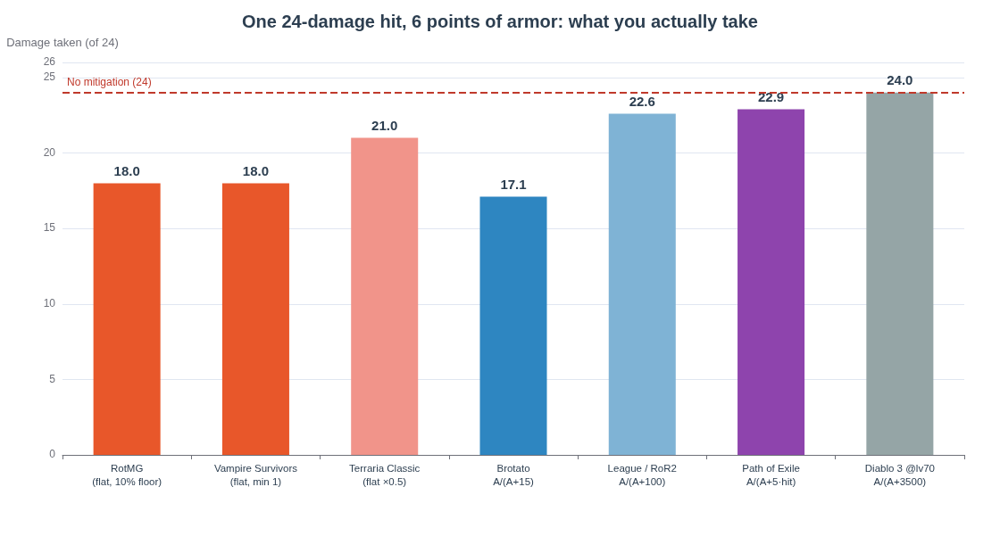
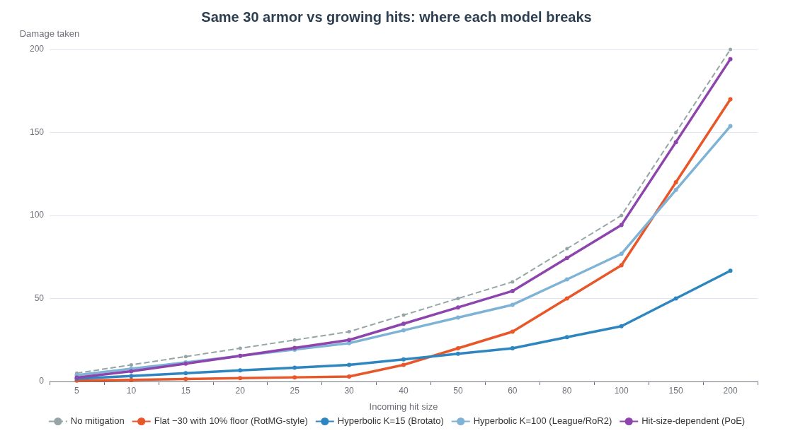
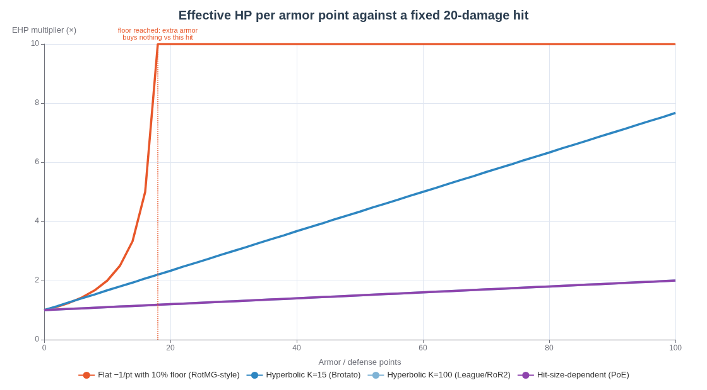

# Damage Mitigation Models in Top-Down ARPGs and Bullet-Hell Hybrids: A Design Survey for Small-Number Systems

**TL;DR** — Every mitigation system in the surveyed games reduces to three families. **Flat subtraction** (Realm of the Mad God, Vampire Survivors, Terraria) removes a fixed amount per hit and is the most legible model at double-digit numbers, but it collapses against big hits unless a minimum-damage floor is added. **Percentage reduction** comes in two sub-species — hyperbolic rating formulas of the form `A/(A+K)` (Diablo 3, League of Legends, Risk of Rain 2, Brotato) and direct capped percentages (Diablo 2's 50%-capped physical resistance, Hades II's Strength arcana) — and scales cleanly into huge numbers at the cost of tooltip opacity and fractional arithmetic at small ones. **Hybrids** layer the two (Risk of Rain 2, Terraria's endgame, Diablo 2), and their behavior is dominated by *ordering*: whether flat subtraction applies before or after the percentage. For a solo dev building a no-crit, no-evasion system where every number must fit on a tooltip, the evidence points to **flat subtraction with a published ~10% minimum-damage floor, integer math, subtractive armor penetration as the elite counter-stat, and at most one conditional percentage modifier** — the Realm of the Mad God core, hardened with Risk of Rain 2's one-shot protection as an optional relic.

---

## 1. The Model Taxonomy

### 1.1 Flat subtraction: every point of armor is literally one less damage

Flat subtraction is the oldest and most transparent model in the genre: each point of defense removes a fixed amount from every incoming hit, `final = raw − armor`, subject to a floor that prevents immunity. Realm of the Mad God states the rule in a single sentence — defense is "straight 1 point per 1 damage reduction, but caps at 90% of total damage," so a 55-damage projectile against 55 defense still lands for 5 (55 × 10% = 5.5, rounded down) and any defense past 50 buys nothing against that particular projectile [^13^]. Vampire Survivors uses the pure form with the harshest possible floor: each point of Armor reduces all incoming damage by 1, there is no upper limit on the stat, but a hit can never be reduced below 1 damage [^1^]. Terraria parameterizes the same idea by world difficulty, computing `net dmg = ⌊attack − def × factor⌋` where the factor is 0.5 in Classic, 0.75 in Expert, and 1.0 in Master mode, again with a hard minimum of 1 [^28^].

Designers reach for this model when two conditions hold: the game throws **many small, frequent hits** at the player (bullet-hell patterns, horde contact damage), and the design values **arithmetic the player can do in their head**. A community design discussion for Starbound captures the trade precisely: flat defense is "good at nullifying weaker attacks, while being near-useless against strong ones," which "makes armor very difficult to balance" — but, the same poster notes, "many players like being invulnerable to mobs that once gave them great trouble," which is itself a powerful progression fantasy [^15^]. Flat armor converts growth into *negation* rather than into abstract percentages: the moment a formerly threatening enemy starts hitting you for the floor value, you feel the armor working. That emotional payoff is why the model survives in RotMG, Vampire Survivors, and Terraria despite its known balancing hazards, and why Risk of Rain 2's Repulsion Armor Plate — "reduce all incoming damage by 5 (+5 per stack), cannot be reduced below 1" — remains one of the most popular defensive items in that game [^35^].

### 1.2 Percentage reduction: hyperbolic ratings and direct capped percentages

Percentage models reduce each hit by a fraction rather than a fixed amount, which makes them scale-symmetric: armor matters proportionally whether the hit is 20 or 20,000. The dominant engineering form is the **hyperbolic rating**, `damage taken = raw × K/(K + armor)`, equivalently `DR% = armor/(armor + K)`. Diablo 3 sets `K = 50 × attacker level` for armor (3,500 at level 70) and `K = 5 × attacker level` for resistances (350 at 70), so 10,000 armor against a level-70 attacker yields 10,000/13,500 ≈ 74% reduction [^5^][^8^]. League of Legends and Risk of Rain 2 use `K = 100`, meaning 100 armor halves physical damage [^31^][^34^]. Brotato uses `K = 15`, so 15 armor gives 50% reduction and each armor point raises effective HP by a constant 6.66% [^17^][^22^]. The crucial mathematical property is that **effective HP grows linearly with the rating**: every point of armor adds the same absolute amount of survivability as the last, which is why the League wiki states flatly that "by definition, armor does not give diminishing returns of effective health" even though the displayed percentage crawls [^31^].

The second sub-species is the **direct percentage with a hard cap**, where items or skills state an actual percentage rather than a rating. Diablo 2's "Damage Reduced by X%" (physical resistance) is the classic case: it behaves like the elemental resistances but is capped at 50%, a ceiling no effect can raise [^3^][^10^]. Hades II's Strength arcana is the modern readable version — while you have no Death Defiance charges, "you take −20%/−30%/−40%/−45% damage and deal +20%" [^57^]. When multiple direct percentages coexist, the genre-standard rule is **multiplicative stacking**, formalized in Diablo 3 as `DR_total = 1 − ∏(1 − DR_i)`: two 50% sources yield 75%, never 100% [^4^][^5^]. This rule exists for one reason — as one min-max guide puts it, "having additive % damage reduction would make it far too easy to make an invincible God toon" [^8^]. Multiplicative stacking keeps every source honest ("each source does exactly what it says on the tin") while making true immunity unreachable [^5^].

### 1.3 Hybrids and adjacent patterns: ordering, second health pools, and hard caps

Real games rarely ship a pure model; they ship a **pipeline**, and the pipeline's order of operations is itself a design decision with measurable consequences. Diablo 2 applies flat "Damage Reduced by X" *before* the percentage-based physical resistance, which quietly weakens the flat component (the percentage then cuts whatever remains) and lets strong flat rolls occasionally zero out small hits before the percentage even runs [^3^][^10^]. Risk of Rain 2 does the opposite: its hyperbolic armor applies first, and only then does the Repulsion Armor Plate subtract its flat 5 per stack from the remainder — making the flat layer disproportionately powerful against chip damage, since it shaves post-mitigation numbers that are already small [^38^]. Terraria's endgame pipeline is the most documented: banner and Warmth percentages first, then flat defense, then the additive percentage pool (Worm Scarf, Endurance, Frozen Turtle Shell), then multiplicative armor-set buffs, with the damage rounded down and floored at 1 after *every* step [^30^].

Three adjacent patterns complete the taxonomy. **Armor as a second health pool** — Hades gives elite enemies a yellow armor bar that grants immunity to stuns and knockback until depleted, and overkill damage on the breaking hit does not overflow into health [^16^]; Hades II hands the same construct to the player through Hephaestus boons such as Trusty Shield (+10 to +25 armor per location) and Security System (+75 to +150 for the first 7 seconds of an encounter), where armor functions as a secondary HP bar rather than a mitigation ratio [^24^][^20^]. **Hard damage caps** bound any single hit regardless of its size: Vampire Survivors' Crimson Shroud caps all incoming damage at 10 [^46^], and Risk of Rain 2's One-Shot Protection reduces any hit that would exceed 90% of your combined health to exactly 90%, checked after armor is applied [^33^]. Finally, **chance-based and hit-size-dependent defenses** — Diablo 2's Defense rating, which only lowers the chance to be hit and does not reduce damage at all [^45^][^37^], Halls of Torment's Block Strength (100% block chance only when it reaches 4× the incoming hit) [^18^], and Path of Exile's armour, whose percentage shrinks as the hit grows [^29^] — trade legibility for texture, and two of the three are direct violations of a "no evasion, everything on the tooltip" constraint, as Section 3.2 details.

---

## 2. Game-by-Game Survey

### 2.1 Bullet-hell and horde-survival games: flat cores with explicit escape hatches

The bullet-hell lineage converged on flat subtraction for a structural reason: in these games the player is hit **dozens of times per minute by individually small projectiles**, so per-hit flat armor has enormous leverage and reads instantly. RotMG is the archetype — defense subtracts 1 damage per point from every projectile with a 90% reduction cap per hit, armor-piercing weapons and enemy "Damaging" auras ignore defense entirely, and the status ecosystem manipulates defense directly: Armored raises DEF by 50% during damage calculation, Armor Broken zeroes it, and Exposed subtracts 20 (driving it negative so the victim takes *more* than base damage) [^7^][^49^]. The 90% cap is doing quiet but essential work: it guarantees every projectile in the game has a published minimum damage, so no player ever becomes literally immune to a boss pattern — Realmeye's defense chart is literally a table of "projectile damage / minimum damage / defense needed to reach that minimum" [^13^]. Vampire Survivors runs the same core with a floor of exactly 1 and no stat cap, then wraps it in binary defenses — Laurel's recharging shield charges with invulnerability frames, and the Crimson Shroud evolution capping every hit at 10 [^1^][^46^].

The survivors-likes that followed split into two camps. Brotato kept percentage readability by choosing a **tiny K**: its formula `1 − 1/(1 + armor/15)` means 15 armor = 50% reduction, 30 = 67%, 45 = 75% — anchor numbers a player can memorize — while retaining the EHP-linear property (+6.66% effective HP per point forever) and a minimum damage of 1 [^17^][^22^]. Halls of Torment went bespoke: a chance-based Block layer checked first (Block Strength equal to the hit gives 50% block chance; four times the hit gives 100%), then a piecewise Defense curve described as an "inverse hyperbolic effect + clipped linear effect" that yields 46% reduction at 40 Defense and switches to linear EHP growth of 4.17% per point above 100 Defense, with damage never reducible below 1 [^18^][^19^]. The contrast is instructive for a solo dev: Brotato's single clean formula is fully communicable in one tooltip line, whereas Halls of Torment's two-axis system (a chance mechanic plus a piecewise curve) is richer to optimize but effectively undocumented for the average player — the wiki formula had to be reverse-engineered and published as annotated plots [^18^].

### 2.2 The Diablo lineage: from evasion-in-disguise to multiplicative rating stacks

Diablo 2 is the cautionary tale about naming: its "Defense" stat (the number prominently printed on every armor piece) **does not reduce damage** — it is compared against the attacker's Attack Rating to determine the chance a physical hit lands at all, drops to zero while running, and does nothing against spells [^37^][^45^]. Wowhead's guide captures the universal player experience: "The more defense you have, the less enemy attacks hurt you, right? Actually, Defense's main role is that it increases the chance you won't get hit in the first place" [^45^]. Diablo 2's *actual* mitigation lives elsewhere: a capped (50%) percentage "Damage Reduced by X%" found on prestige uniques like Stormshield (35%) and Harlequin Crest (10%) [^9^], an uncapped flat "Damage Reduced by X" that applies *before* the percentage [^10^], elemental resistances capped at 75% (raisable to 95%), and percentage-then-flat Absorb layers that heal for the absorbed amount [^10^]. The system is a hybrid with four layers and a strict pipeline, and its flat-before-percentage ordering is exactly backwards from Risk of Rain 2's — which is why flat DR rolls in Diablo 2 are famously underwhelming except when stacked to degenerate levels.

Diablo 3 rebuilt mitigation as a pure rating system with explicit mathematics. Armor reduces *all* damage types via `armor/(armor + 50×attacker level)`, each of the six resistances uses `resist/(resist + 5×attacker level)`, melee classes carry a built-in 30% reduction, and every other item or skill percentage stacks multiplicatively [^5^][^11^]. The design intent was that every source is an independent "toughness multiplier" — 50% DR doubles toughness no matter what else you have — which makes builds comparable by multiplying a handful of published factors (the cited worked example reaches a ×47.61 toughness multiplier from six sources) [^5^]. The cost is twofold opacity. Internally, the hyperbolic form means the *displayed* percentage crawls upward while players feel diminishing returns that mathematically do not exist (the "golden ratio" discourse of balancing armor against resistances at 10:1 is entirely a community invention to navigate this) [^8^]. Externally, the endgame pairs this smooth mitigation curve with **exponentially scaling enemy damage** — Greater Rift monster damage compounds by 2.34% per tier while monster HP multiplies by 1.17 per tier [^64^][^65^] — producing the genre's most famous one-shot cliffs, examined in Section 4.3. Path of Exile, the lineage's other heir, deliberately made armour **hit-size-dependent**: its reduction follows `armour/(armour + 5×raw hit)` capped at 90%, so armour is "most effective in mitigating small hits (50% and better reduction for initial damage less than a fifth of the armour value) and least effective in mitigating very large hits (where its absolute reduction can at most be one fifth of the armour value)" [^29^].

### 2.3 Action roguelites and adjacent references: readability through architecture

Hades answers the mitigation question by mostly refusing it: Zagreus has no armor stat at all, and defense is expressed through *architecture* — dash invulnerability frames, the Shield of Chaos's directional Defend, and Death Defiance charges [^16^]. Where armor does appear, on elite enemies, it is a **yellow second health bar** that blocks stuns and knockback until broken, with no damage overflow on the breaking hit — a mitigation construct any player can read at a glance because it is literally drawn on the enemy [^16^]. Hades II then layered player-facing defense onto that vocabulary using three distinct, individually legible mechanics rather than one formula: armor as a secondary HP pool (Hephaestus's Trusty Shield, Security System, Heavy Metal) [^24^][^20^], a true flat per-hit reduction at tiny numbers (Tough Gain: "Damage per Hit: −1/−2/−3/−4") [^20^][^25^], a resource-conversion percentage (Brave Face: spend 10 Magick per damage point to resist up to 30% of any hit) [^20^], and a conditional readable percentage (Strength: −20% to −45% damage taken while no Death Defiance remains) [^57^]. Supergiant's approach demonstrates that a hybrid does not have to mean a complicated *formula* — it can mean several simple mechanics, each explaining itself in one clause.

The remaining reference points each contribute one load-bearing idea. Risk of Rain 2 shows that hyperbolic armor and flat subtraction **coexist best with the percentage applied first** — armor multiplies, then Repulsion Armor Plate subtracts 5 per stack with a floor of 1, making the flat layer a dedicated anti-chip mechanic whose value against damage-over-time ticks (each tick reduced separately) is immediately intuitive [^38^][^35^]. Risk of Rain 2 also ships the genre's canonical cliff remedy, One-Shot Protection, complete with a visible "danger zone" strip on the health bar and a curse mechanic that disables it — an object lesson in making a safety net *visible* [^33^][^41^]. Terraria demonstrates that flat defense can scale an entire game if you tune the factor per difficulty (0.5/0.75/1.0) and accept a documented multi-step hybrid pipeline for the endgame [^28^][^30^]. League of Legends, though not an ARPG, is the best-documented proof that `A/(A+100)` armor is EHP-linear ("every 1 point of armor adds 1% to the effective health pool") and the best-documented case study of players *refusing to believe it* — the "diminishing returns" misconception has persisted for over a decade despite the formula being public [^31^][^32^].

### 2.4 The consolidated survey table

The table below compresses Sections 2.1–2.3 into one reference. Reading it column by column is itself instructive: the "cap or floor" column shows that *no shipped flat-subtraction game trusts the raw formula* — every one of them bolts on a minimum-damage rule — while the "counter-mechanic" column shows that every game with meaningful defense also ships an explicit way to punch through it, because a defense stat that cannot be countered becomes a content gate.

| Game | Family | Actual mitigation rule | Cap / floor | Counter-mechanics shipped |
|---|---|---|---|---|
| Realm of the Mad God | Flat | DEF subtracts 1 dmg per point from **each projectile** [^13^][^7^] | Max 90% reduction per hit (min 10% dmg) [^13^] | Armor-piercing attacks; Armor Broken (DEF→0); Exposed (−20 DEF); Armored (+50% DEF) [^49^][^50^] |
| Vampire Survivors | Flat | Armor −1 dmg per point, all sources [^1^] | Min 1 dmg; no stat cap [^1^] | Laurel shield charges + i-frames; Crimson Shroud hard-caps hits at 10 [^54^][^46^] |
| Brotato | % (hyperbolic) | DR = `1 − 1/(1 + armor/15)`; EHP +6.66%/pt [^17^][^22^] | Min 1 dmg [^17^] | Negative armor (damage amplified) [^22^] |
| Halls of Torment | Hybrid (chance + %) | Block Strength = chance to fully negate (100% at 4× hit); Defense = piecewise hyperbolic+linear DR (46% at 40) [^18^][^19^] | Min 1 dmg [^18^] | Block and Defense are separate axes; enemies scale past both |
| Diablo 2 | Hybrid (flat→%) + evasion | "Defense" = chance to be hit, **not** mitigation [^45^]; flat "DR by X" applies before % "DR by X%" [^10^] | Physical DR% capped 50%; flat DR uncapped [^3^][^10^] | Amplify Damage/Decrepify lower DR%; defense →0 while running [^3^][^45^] |
| Diablo 3 | % (hyperbolic rating) | Armor: `A/(A+50×lvl)` all types; resist: `R/(R+5×lvl)`; all DR sources multiplicative [^5^][^11^] | Asymptotic, never 100% [^12^] | Enemy damage +2.34%/GR tier (compounding) [^64^] |
| Path of Exile | % (hit-size-dependent) | Armour DR = `A/(A + 5×raw hit)`, physical hits only [^29^] | DR cap 90%; never blocks more than A/5 [^29^] | Enemy slam design; "Overwhelm" pierce; DoTs ignore armour [^29^][^55^] |
| Hades (1 & 2) | Second HP pool (+ small flat/%) | Enemy armor = yellow HP bar + stun immunity, no overflow on break [^16^]; player armor in H2 = secondary HP via boons [^24^]; Tough Gain −1..−4/hit [^20^] | Armor bar itself is the cap | Strength arcana: conditional −20..−45% [^57^]; Brave Face: 10 Magick/dmg point, up to 30% [^20^] |
| Risk of Rain 2 | Hybrid (%→flat) + hard cap | Armor `×100/(100+A)` first, then Repulsion Armor Plate −5/stack [^34^][^38^] | Min 1 per hit [^33^]; OSP: one hit ≤ 90% combined HP, checked after armor [^33^] | Void Fog and Shrine of Blood bypass armor; curse disables OSP [^40^][^36^] |
| Terraria | Flat (difficulty-scaled) | `⌊atk − def×factor⌋`, factor 0.5/0.75/1.0 by mode [^28^] | Min 1 dmg [^28^] | Ichor (−15/−20 def), Broken Armor (−50%); endgame hybrid pipeline [^28^][^30^] |
| League of Legends | % (hyperbolic) | DR = `A/(A+100)`; EHP +1% of max HP per point [^31^] | Asymptotic | Armor penetration, armor reduction, Lethality [^31^] |

Two patterns in the table deserve emphasis before the quantitative sections. The first is that **the floor is the signature of a healthy flat system**: RotMG's 90% cap, Vampire Survivors' and Brotato's and Terraria's minimum-1, and Risk of Rain 2's minimum-1 all exist to answer the same question — "what stops defense from deleting content?" — and each game then *publishes* that answer in its wiki-facing mechanics [^13^][^1^]. The second is that the hyperbolic games cluster by their constant **K**, and K is really a readability dial: Brotato's K=15 puts the 50%-reduction anchor at 15 armor (reachable in a normal run, memorable, tooltip-sized), while Diablo 3's K=3,500 puts it at thousands of armor — correct for an item game with five-digit stats, useless for a double-digit one [^17^][^5^].

It is also worth noting what the table says about the user's stated constraints. The "no crit, no evasion" rule eliminates Diablo 2's Defense (chance-to-hit) and Halls of Torment's Block (chance-to-negate) outright — both are evasion-family mechanics whose displayed numbers (a Defense rating, a Block Strength) systematically *overstate* what the average player receives, because the outcome is Bernoulli rather than arithmetic [^45^][^18^]. And the "every number visible on the tooltip" rule puts hard pressure on Diablo 3's split-pane display (criticized even by its own community resources as "a convoluted way to display your damage reduction") and on Path of Exile's character sheet, which shows an *estimated* reduction whose assumptions Section 3.2 examines [^5^][^55^].

---

## 3. Behavior at Small, Readable Numbers

### 3.1 The 24-damage hit test: what six armor points actually do

To compare models on the user's home turf, consider the smallest non-trivial scenario: an enemy hits for **24**, the player has **6** points of armor/defense, and every system is evaluated by its own published formula. The results (chart below) diverge far more than the phrase "6 armor" suggests. Both flat systems land on the same clean integer — RotMG computes 24 − 6 = 18 (its 10% floor of 2.4 is not yet binding) and Vampire Survivors computes 24 − 6 = 18 with its floor of 1 equally inactive [^13^][^1^]. Terraria Classic halves the defense value and returns 21 [^28^]. Brotato's `24 × 15/21 = 17.14` must be rounded — and here the first readability crack appears, because Brotato's tooltip *rounds the displayed reduction to a whole percent while the engine uses the precise value*, and separately rounds enemy damage *before* armor applies, so the number you calculate from the tooltip is not always the number you take [^22^]. League/Risk-of-Rain-2-style `24 × 100/106 = 22.6` and Path of Exile's `24 × (1 − 6/126) = 22.9` both round to "about 23" — a 4–5% effect that is nearly invisible to the player, and Diablo 3's level-70 constant makes 6 armor literally worthless (`24 × 3500/3506 = 23.96`), because its formula is designed for armor values in the thousands [^29^][^5^].

| System (6 armor vs 24-damage hit) | Computation | Damage taken | Integer-legible? |
|---|---|---|---|
| RotMG (flat, 10% floor) [^13^] | max(24−6, 2.4) | **18** | Yes — exact |
| Vampire Survivors (flat, min 1) [^1^] | max(24−6, 1) | **18** | Yes — exact |
| Brotato (A/(A+15)) [^17^] | 24 × 15/21 | **17.1 → 17** | No — hidden rounding [^22^] |
| Terraria Classic (flat ×0.5) [^28^] | ⌊24 − 6×0.5⌋ | **21** | Yes — exact |
| League / RoR2 (A/(A+100)) [^31^] | 24 × 100/106 | **22.6 → 23** | No — 5.7% looks like noise |
| Path of Exile (A/(A+5·hit)) [^29^] | 24 × (1 − 6/126) | **22.9 → 23** | No — and % changes per hit size |
| Diablo 3 @ lv70 (A/(A+3500)) [^5^] | 24 × 3500/3506 | **23.96 → 24** | No — effect is 0.2%, invisible |

The structural lesson is that **flat subtraction is the only family whose per-point value survives contact with double-digit arithmetic**. One armor point in RotMG or Vampire Survivors is worth exactly "1 less damage, every hit, from every enemy," a sentence a child can verify by watching two consecutive hits. One armor point in any `A/(A+K)` system is worth "some fraction of a percent that depends on K, on the hit size (PoE), or on the attacker's level (D3)" — true statements that no honest tooltip can compress. Hades II's designers evidently ran this same calculation: when they wanted a per-hit mitigation boon at Hades-scale numbers they shipped Tough Gain's flat "−1/−2/−3/−4 per hit," not a rating formula [^20^][^25^].

### 3.2 Tooltip honesty: rounding rules, hidden denominators, and estimated percentages

Small-number systems amplify every discrepancy between what the UI states and what the engine computes, because a rounding difference of 0.5 damage is 2% of a 24-damage hit but an entire tier of a 5-damage hit. The surveyed games document four distinct failure patterns. **Silent rounding mismatches**: Brotato's tooltip rounds the armor percentage to the nearest whole number while damage is computed precisely, and incoming enemy damage is itself rounded *before* armor applies — so deducing the engine's behavior from the tooltip is impossible without the wiki [^22^]. **Estimate displays**: Path of Exile's character sheet shows an "estimated physical damage reduction" that assumes a particular hit size; because armour is hit-size-dependent, the estimate "is very possible" to be badly wrong against exactly the large hits the player cares about, as the game's own community puts it — "'Estimated' reduction from armour in the tooltip... will work very poorly in case of high physical damage hits — the oneshots you kinda want to protect yourself from" [^55^]. **Hidden denominators**: Diablo 3's `K = 50 × attacker level` ties your percentage to a number the tooltip rarely surfaces, and the details pane notoriously shows two numbers separated by a plus sign that "are not added together," a presentation Maxroll calls "quite a convoluted way to display your damage reduction" [^5^][^12^]. **Wrong-stat naming**: Diablo 2's Defense is the extreme case — the number on the armor piece describes evasion, not mitigation, a mismatch generations of players discovered only by being hit [^45^].

There is also a subtler, sociological readability failure that follows hyperbolic formulas even when they are displayed perfectly: players systematically misread the curved percentage as diminishing value. The League of Legends community has relitigated "armor has diminishing returns" for over a decade — one GameFAQs thread shows a player measuring 40→29%, 395→80%, 542→84% and concluding armor "fell off," followed by pages of corrections explaining that EHP grew linearly the whole time and that the real question was gold-efficiency against health [^32^]. Brotato's subreddit hosts the identical debate under the title "Diminishing returns on armor is a Myth!" [^21^]. A formula that generates a permanent, genre-wide misconception is, by the user's standard of "every number visible and understood," a failing formula — even though it is mathematically elegant. The genre's remediation is visible in RoR2 and Brotato wikis: both publish explicit "Armor → damage reduction → effective HP" tables so players can anchor on EHP instead of the misleading percentage [^22^][^34^].

---

## 4. The Three Failure Modes, Mapped to Models and Remedies

### 4.1 Armor becoming worthless at high tiers

Worthlessness has two distinct mechanical shapes. **Flat armor is outscaled by hit size**: because it removes a constant, its *percentage* value shrinks as enemy hits grow — 30 armor deletes a 20-damage hit down to the floor but removes only 30 of a 200-damage hit, and the EHP chart below shows the consequence starkly: against a fixed 20-damage hit, flat armor with a 10% floor reaches its ×10 EHP ceiling at 18 points and every further point buys literally nothing (against that hit), while Brotato's hyperbolic curve keeps growing linearly forever [^13^][^17^]. RotMG's own defense chart is a monument to this: "any additional defense won't matter" past the cap point for each projectile [^13^]. **Hit-size-dependent armor is outscaled by design**: Path of Exile armour's absolute reduction can never exceed one fifth of its value, so against the endgame's signature slam attacks armour is "least effective... where its absolute reduction can at most be one fifth of the armour value" — a GGG designer's own metaphor being "a full armour of steel will help you fend off a rain of prickles, but won't do you any good if you are hit by a train" [^29^][^55^].

The chart shows the crossover that governs endgame tuning: flat-with-floor is *dominant* below its comfort zone (it nearly zeroes everything under 33 damage at 30 armor) and decays to parity above it, while the hyperbolic models are hit-size-invariant by construction (Brotato always lets 33% through; League always 77%) and PoE slides between them, behaving exactly like League armor against small hits and converging to raw damage against large ones. The genre's remedies are consistent: **subtractive counters** that keep armor relevant by being readable (RotMG's Armor Broken/Exposed, League's Lethality and armor reduction, Terraria's Ichor) [^49^][^31^]; **floors** that bound the negation (Section 2.4); and, for rating systems, **EHP-linearity** so that armor never literally stops working even as the displayed percentage crawls [^31^][^22^]. The failed remedy is silent inflation of the armor stat itself, which leads directly into the second failure mode.

### 4.2 HP-sponge creep

HP-sponge creep is the degenerate equilibrium a game falls into when mitigation stops absorbing difficulty and the only remaining dial is enemy health. Diablo 3's Greater Rifts are the documented extreme: monster HP multiplies by 1.17 every tier — "Monster HP rises extremely fast through exponential scaling" — while monster damage compounds at +2.34% per tier, so by the push ceiling both axes are astronomically far from anything a tooltip can express, and Maxroll's advice is literally to play "2-3 Tiers below your realistic cap" because the exponential curve makes nearby tiers unrecognizable [^65^][^64^]. The sponge is not caused by mitigation being strong; it is caused by mitigation being *opaque and maxed*, so that remaining player skill expression is raw throughput against ballooning health bars. When armor is fully stacked and capped, the designer cannot raise incoming lethality without one-shotting everyone (Section 4.3), so HP is the only dial left.

The surveyed bullet-hell games mostly avoid this trap, and their avoidance is instructive. Flat-armor games keep enemies *lethal but thin*: because defense negates a fixed amount, the designer scales difficulty through **pattern density, projectile speed, and armor-piercing bullets** rather than through health pools — RotMG's answer to high-defense players was armor-piercing attacks and the Armor Broken status, not tenfold boss HP [^49^][^50^]. Hades deliberately makes its sponge *legible*: the yellow armor bar is a visible, countable second health pool with a guaranteed stun payoff on breaking, so even its "extra HP" reads as a mechanic rather than as bloat [^16^][^24^]. Vampire Survivors does permit true HP sponges — the Reaper is effectively one — but wraps them in special-kill mechanics (Crimson Shroud and Infinite Corridor dealing 1% of the Reaper's max health per proc) so the sponge is a puzzle, not a wall [^46^]. The design principle that emerges: **scale the enemy's damage expression (hit size, count, pierce), not its HP**, whenever you want armor to remain a live decision rather than a solved checkbox.

### 4.3 One-shot cliffs

A one-shot cliff is the point where the enemy-damage curve crosses the player's effective-HP curve discontinuously — everything below a threshold is survivable, everything above it is lethal in a single hit, and the player experiences the transition as unfair because nothing in the mitigation UI warned them it was coming. Diablo 3 manufactures cliffs structurally: smooth, asymptotic, multiplicative mitigation on the player side; exponential damage on the monster side — so at some Greater Rift tier "monsters' raw damage output can easily climb to a few millions in a single attack," and even 90%+ total mitigation fails in one hit [^4^][^64^]. Path of Exile manufactures them informationally: the armour estimate that reads 40%+ against trash collapses against the slam that actually kills you, because armour is weakest exactly where lethality is concentrated [^55^]. Flat systems manufacture them inversely: the player is effectively immortal to chip damage until a single hit exceeds `armor ÷ (1 − floor)`, at which point damage taken jumps from the floor to nearly full — the "trivial until lethal" step function.

The genre's remedies are all **explicit clamps on single-hit lethality**, and they are notably readable. Risk of Rain 2's One-Shot Protection reduces any post-mitigation hit exceeding 90% of combined health to exactly 90%, draws the protected region on the health bar as a "danger zone," and publishes its exceptions (Shaped Glass, ≥10% Curse disables it) [^33^][^36^]. Vampire Survivors' Crimson Shroud simply caps every incoming hit at 10 — the entire rule fits in seven words of tooltip [^46^][^53^]. Hades and Hades II use Death Defiance (an extra life restoring 40% on lethal damage) and Laurel-style recharging shield charges with brief invulnerability, converting the cliff into a resource [^60^][^54^]. What these share is that the *safety mechanism itself is a number the player can see*, which is precisely the property a one-shot cliff lacks. For the user's system this suggests the cliff should not be solved by more mitigation at all, but by one published sentinel rule in the Crimson-Shroud/OSP family.

---

## 5. Master Comparison Table

This is the centralized view the survey has been building toward. Each row is a model a solo dev could actually adopt, in rough order of tooltip cost. The "double-digit behavior" column assumes the user's regime — hits and armor values both under ~100 — and the remedies column cites the mechanism each surveyed game actually shipped for that failure mode.

| Model | Canonical rule | Why games pick it | At double-digit numbers | Signature failure modes | Standard remedies (as shipped) |
|---|---|---|---|---|---|
| **Flat subtraction (pure)** | `max(raw − A, 1)` | Total legibility; negation-as-progression; suits many-small-hits combat [^15^][^1^] | Perfect: 1 point = 1 damage, exact integers [^1^][^28^] | Worthless vs big hits; trivializes chip content; "immortal until lethal" steps [^13^][^15^] | Min-1 floor [^1^]; armor pierce/shred statuses [^49^]; scale patterns not HP |
| **Flat + proportional floor** | `max(raw − A, raw × 10%)` | Same as flat, but immunity is structurally impossible and min damage is publishable [^13^] | Perfect: 24-hit vs 6 armor = 18, exact [^13^] | Armor saturates per hit size (extra points buy nothing vs a given hit) [^13^]; cliff at `A/(1−floor)` | Per-projectile min-damage tables [^13^]; DEF→0 / −DEF statuses; armor-piercing bullets [^49^][^50^] |
| **Hyperbolic rating** `A/(A+K)` | `raw × K/(K+A)` | EHP-linear forever; never reaches 100%; scales to any magnitude [^31^][^5^] | Poor at small K-less values: 6 armor vs 24-hit = 22.6 (K=100); needs small K (Brotato 15) to read [^17^] | "Diminishing returns" misconception (permanent community confusion) [^32^][^21^]; invisible per-point value at big K [^5^] | Publish EHP tables, not just % [^22^][^34^]; penetration stats [^31^] |
| **Direct % with hard cap** | `raw × (1 − P%)`, P ≤ cap | Item text says exactly what it does ("take 35% less"); cap prevents immunity [^3^] | Good if P is round: −20%/−25%/−50% read fine; odd values (13%) produce fractions [^57^] | Stacking to cap makes the stat a solved checkbox; incentivizes one BiS item (Stormshield's 35%) [^9^] | Cap at 50% [^3^][^10^]; attach % to conditional states (no Death Defiance) [^57^] |
| **Multi-source multiplicative %** | `1 − ∏(1 − DRᵢ)` | Every source stays independently honest; immunity unreachable; build math = multiplying toughness factors [^5^] | Bad: products of fractions (×0.75 ×0.9 ×0.85) are untooltipable at small scale [^4^] | Exponential EHP → devs counter with exponential enemy damage → cliffs & HP sponges [^64^][^65^] | Toughness-multiplier framing [^5^]; limited DR source slots |
| **Hit-size-dependent armor** | `A/(A + 5·raw)`, cap 90% | Makes "many small hits vs few big hits" a real build axis; counters shotgun spam [^29^] | Misleading: same armor = 20% vs 24-hit, 9% vs 60-hit; tooltip must show an *estimate* [^55^] | Worthless exactly vs lethal slams; estimate-sheet distrust [^55^]; rounding "in the monster's favor" [^29^] | Flat % layering (endurance charges); player education via deaths [^55^] |
| **Armor as second HP pool** | Yellow HP bar, breaks, no overflow | Most readable possible — literally drawn on the unit; adds break payoff & stun windows [^16^] | Perfect: no formula at all [^24^] | Binary (no per-hit scaling); couples mitigation to stun-immunity [^16^]; overkill waste feels bad [^16^] | Break-stun reward [^16^]; temporary/location-scoped grants [^20^] |
| **Ordered hybrid (%→flat)** | `raw × K/(K+A)` then `−F`, min 1 | % handles scale, flat deletes chip; each layer has one job [^38^] | Good if both layers are small integers: "armor halves it, plate removes 5" [^38^] | Order bugs/confusion (D2 ships the opposite order, weakening flat) [^10^]; DoT-tick exploits [^38^] | Publish the pipeline [^33^]; flat-after-% only [^38^] |
| **Hard per-hit cap** | `min(post, cap)` or OSP 90% rule | Kills one-shot cliffs with a 7-word tooltip; converts lethality into a resource [^46^][^33^] | Perfect: "capped at 10" is exact at any scale [^46^] | Trivializes burst as a mechanic if common; interacts weirdly with %HP damage | Keep rare/build-defining [^46^]; visible danger-zone UI [^41^]; curse/exception list [^36^] |

Two meta-observations complete the picture. Every model that survives a full game lifetime ships with **its own counter-stat in the same design**: flat armor arrives with armor pierce and Armor Broken [^49^][^50^], rating armor with Lethality and armor reduction [^31^], capped percentages with resistance-lowering curses [^3^], and one-shot protection with Curse effects that disable it [^36^]. Defense and the ability to puncture defense are designed as a pair, and the puncturing mechanism is always *readable in the same units* as the defense it counters — a pierce of 4 means 4 fewer armor, not a hidden multiplier. And every model whose tooltip **understates** the truth (PoE's estimate, D2's Defense, D3's plus-sign pane) generates a permanent tax of player distrust and wiki dependence [^55^][^45^], while every model whose tooltip is the whole truth (VS armor, Crimson Shroud, RotMG defense) generates essentially none [^1^][^13^].

For the specific question of hybrid ordering, the table's eighth row deserves a final underline, because it is the cheapest mistake a solo dev can make. Risk of Rain 2's pipeline applies percentage first and flat second, which makes the flat layer a specialist against small post-mitigation hits — strong against rapid ticks, weak against slams, exactly the identity flat armor wants [^38^]. Diablo 2's pipeline applies flat first and percentage second, so the flat layer competes with the percentage on *big pre-mitigation numbers* and usually loses, relegating "Damage Reduced by 7" rolls to junk status unless stacked to degeneracy [^10^]. Same two ingredients, opposite order, opposite outcome: **flat-after-percentage is the hybrid that works**, and the reason is arithmetic — flat subtraction is most valuable precisely when the number presented to it is already small [^38^].

---

## 6. Recommendation for a No-Crit, No-Evasion, Fully Legible Stat System

### 6.1 The recommended core: flat subtraction with a published floor

Adopt the Realm of the Mad God core, stated to the player as one sentence of integer arithmetic: **`final damage = max(hit − Armor, ⌈hit × 10%⌉)`** — every point of armor removes one point of damage from every hit, and no hit is ever reduced below 10% of its size. This inherits the strongest evidence base in the survey: it is the only model that stays exact at double-digit numbers without rounding (Section 3.1), its floor makes immunity structurally impossible and lets you publish per-enemy minimum damage the way Realmeye's defense chart does [^13^], and its counter-design is forty years proven — armor-piercing projectiles and defense-shredding statuses in the same units as the stat itself [^49^][^50^]. Tune it per tier rather than globally: decide the *typical enemy hit* of each zone (say 12, then 20, then 30), and budget obtainable armor at roughly **0.4–0.6× that typical hit**, so a fully armored player shaves typical hits by half and stands near the floor against trash — powerful, legible, and never immune.

The known failure modes are then managed by construction rather than discovered in playtesting. Saturation (Section 4.1) is handled by the tier budget: armor sources stop dropping when the tier's comfort zone is reached, and the *next* tier's enemies use bigger hits, so old armor quietly falls back to parity instead of being power-crept by patch notes. The "immortal until lethal" step function is smoothed by the 10% floor (nothing is ever zero) and by Section 6.2's penetration stat on elites, which ensures at least some enemies in every pack ignore part of the player's armor [^49^]. HP-sponge creep is pre-empted by the scaling rule borrowed from the bullet-hell canon: **scale enemy hit size, projectile count, and pierce values — not enemy HP** — because in a flat system, enemy damage expression is what keeps armor a live decision [^50^]. If a boss needs to feel tanky, give it the Hades treatment — a visible yellow armor bar with a break-stun payoff — instead of an invisible HP multiplier [^16^].

### 6.2 Three dials that keep flat armor healthy at endgame

**Dial one: subtractive penetration.** Give elite affixes and boss patterns a "Pierce N" stat that subtracts from armor before mitigation: `final = max(hit − max(Armor − Pierce, 0), ⌈hit × 10%⌉)`. This is RotMG's armor-piercing bullet and League's Lethality translated into your units, and it preserves your core promise — the number is visible, integer, and stated in the same currency as armor [^50^][^31^]. Avoid percentage-based shred ("ignores 40% of armor") except as a rare debuff: it reintroduces fractions, and the flat alternative is strictly more readable while being tunable per enemy. RotMG's own status trio shows the complete vocabulary you need — pierce (ignores defense), break (sets it to 0), and expose (subtracts a flat chunk, possibly negative) [^49^].

**Dial two: one conditional percentage, in round numbers.** Flat armor cannot express "this relic makes you broadly tougher," so reserve exactly one percentage slot for that fantasy and follow Hades II's Strength template: a big round number on a legible condition — e.g., "while below 30% HP, take −25% damage" [^57^]. One source only, stated as a true percentage, applied *after* the flat subtraction (Risk of Rain 2 ordering, the ordering that works [^38^]), and if a second source ever ships, publish the multiplication rather than letting players discover it [^5^]. **Dial three: a rare per-hit cap as the cliff sentinel.** Ship one build-defining defensive relic in the Crimson Shroud / One-Shot Protection family — "no single hit deals more than 40% of your max HP" — and draw its threshold on the health bar the way RoR2 draws its danger zone [^33^][^41^]. Keep it rare: its job is to delete the one-shot cliff from the game's possibility space, not to be a general mitigation layer.

### 6.3 Tooltip and rounding specification — and when to graduate to a rating formula

A fully legible system needs its rounding rules published as confidently as its formulas, because the surveyed games show that silent rounding is where tooltips start lying (Section 3.2). Recommended spec: all incoming hit values are integers; mitigation is computed in integers; **the floor rounds up in the attacker's favor and the subtraction rounds down** — i.e., `final = max(hit − Armor, ceil(hit/10))` — so the player can never take less than the published minimum — the same publish-your-rounding discipline as RotMG's minimum-damage table (where 5.5 "rounds down to 5") and PoE's monster-favor rounding, though each game picks its own direction [^13^][^29^]. Then make every tooltip state its own arithmetic, in this style:

| Tooltip | Text |
|---|---|
| Iron Plate (armor) | **+4 Armor.** Each hit deals 4 less damage. No hit is reduced below 10% of its damage. |
| Enemy: Rats (hit 12) | Bites for **12**. *(With your 6 Armor: 6 per bite.)* |
| Enemy: Ogre (hit 60, Pierce 3) | Slams for **60**, **Pierce 3**. *(With your 6 Armor: 60 − 3 = 57.)* |
| Blood Oath (conditional %) | While below 30% HP, take **−25%** damage *(applies after Armor)*. |
| Guardian Idol (cap relic) | No single hit can deal more than **40%** of your max HP. |

Two closing caveats keep the recommendation honest. If your design drifts so that damage numbers inflate past roughly three digits — because items multiply, because you add %-damage stacking, because the game runs long — flat subtraction will strain, and the correct graduation is **not** Diablo 3's giant-K rating (invisible per-point value, attacker-level denominator [^5^][^12^]) but **Brotato's small-K hyperbola**: `DR = armor/(armor + 15)` with min damage 1, whose anchors (15 armor = half, 30 = two-thirds) are nearly as memorable as flat subtraction while retaining EHP-linearity and immunity-proofing [^17^][^22^]. And if you ever want a *zero-arithmetic* defensive axis alongside armor, copy Hades rather than Diablo: a visible second health bar that breaks, stuns, and does not overflow is the only defensive mechanic in the survey that requires no formula whatsoever [^16^][^24^]. Flat-with-floor for the everyday stat, round-number percentage for the conditional relic, a published cap for the cliff, penetration in armor's own units for the counter-play — that is the stack the evidence supports, and every rule in it fits on a tooltip.
