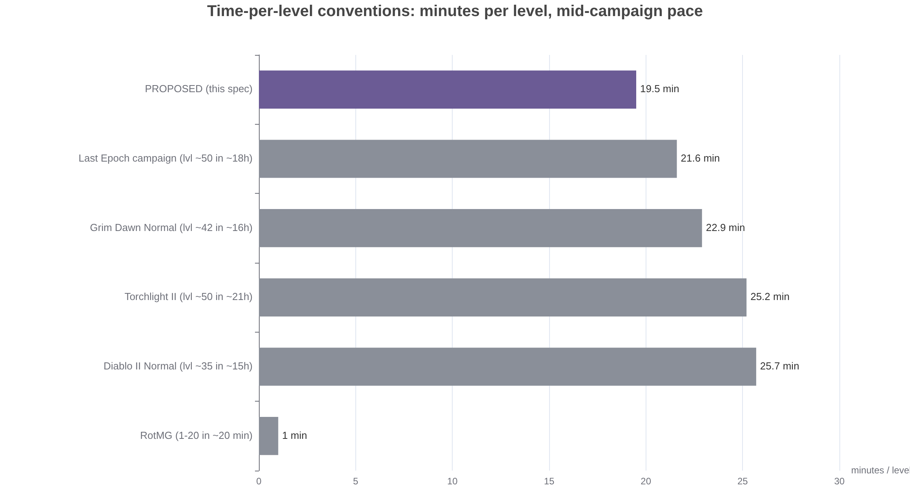
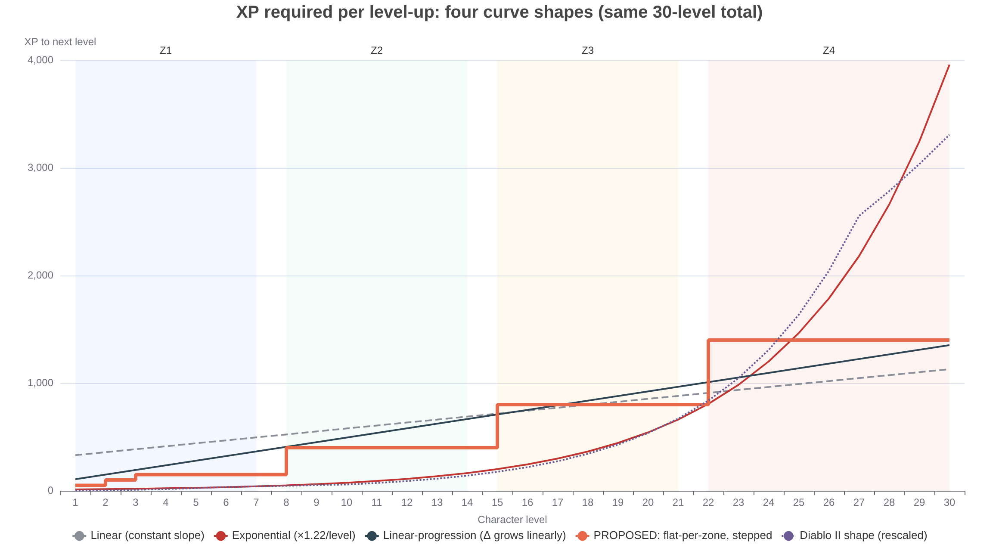
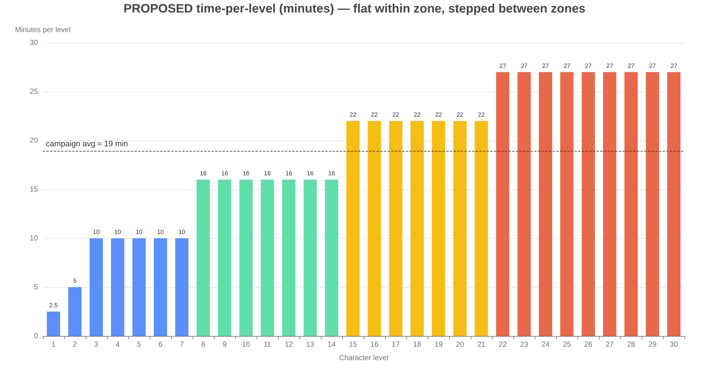
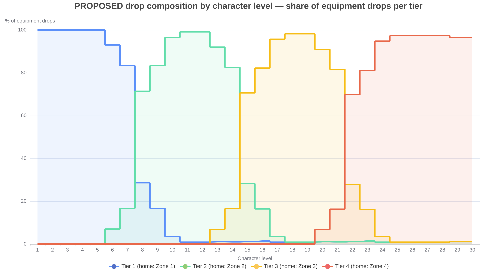
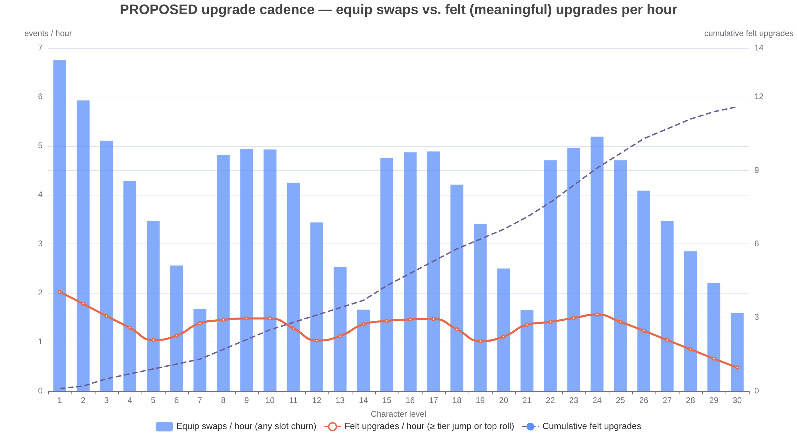
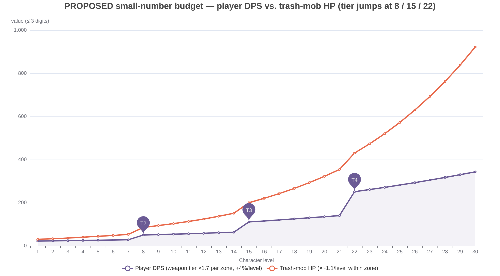

# Pacing Gear Tiers and XP Across a 30-Level, 4-Zone ARPG

*A deep-research design brief: how Realm of the Mad God, Diablo II (Normal), and modern indie ARPGs actually pace tier drops and leveling — distilled into a concrete, small-number specification for a game where each zone brackets ~7 levels and one gear tier.*

---

## Executive summary

Three findings fall out of the reference data. **First, nobody successful uses a single clean curve.** Diablo II's XP table is piecewise — exactly ×1.25 per level through the mid-game, then a linear-increment tail [^3^]; Realm of the Mad God runs a flat ~1 minute per level inside flat biomes [^5^]; Vampire Survivors and Halls of Torment both use linear-increment requirements with per-stage constants and milestone spikes [^115^][^84^]. The winning pattern for a zone-based structure is **flat-per-zone, stepped between zones**: hold XP-to-level and minutes-per-level constant inside a zone, and jump both by ~1.5–2.5× at each zone boundary, so the zone transition the player can already see on screen is matched by a transition they can feel in the reward math.

**Second, tier drops are shaped by availability curves, not flat rates.** RotMG uses "tier group drops" where monsters of a band drop one random item of their assigned tier [^47^], and Diablo II's Treasure Class system deliberately picks the top available tier *less often* than the tiers just below it [^11^]. For one tier per zone, the recommended drop composition per tier is: **0% until 2 levels before the tier's home zone, a 3–8% preview trickle, a ~30% entry ramp, a ~55% mid-zone plateau, ~40% late-zone with a ~15% next-tier preview overlapping, then a 12/6/2/0.5% legacy taper** in subsequent zones.

**Third, "felt upgrade" cadence targets an event every ~45–90 minutes, front-loaded.** Diablo III's post-launch history shows players tolerate ~1 major drop per 1–2 hours and revolt below that [^69^][^70^], while D3's own leveling era shipped 2–3 legendaries across 1–60 and was widely judged too scarce [^67^]. Layered under that, cheap *slot churn* (any equip swap) should land every 10–20 minutes so the inventory never feels dead between real upgrades. Because this game ships only four tiers, each tier step is deliberately chunky (×1.7 weapon damage), which means every plateau hit is automatically a felt event — the cadence budget below therefore plans on ~12 felt upgrades across the ~9.5-hour campaign, roughly one per 2.5 levels, with a pity backstop guaranteeing the floor. The full proposed spec for the 30-level / 4-zone campaign:

| Parameter | Zone 1 | Zone 2 | Zone 3 | Zone 4 |
|---|---|---|---|---|
| Levels (tier) | 1–7 (T1) | 8–14 (T2) | 15–21 (T3) | 22–30 (T4) |
| Minutes per level | 2.5–10 | 16 | 22 | 27 |
| XP per level-up | 50–150 | 400 | 800 | 1,400 |
| Trash-mob XP / HP | 3 / 30–53 | 9 / 85–151 | 18 / 200–354 | 31 / 430–922 |
| Weapon avg damage (tier) | 11 | 19 | 32 | 55 |
| Felt-upgrade gap target | 30–45 min | 45–60 min | 60–90 min | 90–120 min |
| Zone duration | ~1 h | ~1.9 h | ~2.6 h | ~4.1 h |

All combat numbers stay at or below three digits until bosses (which cap near four), preserving the readability regime in which a +1 remains legible [^68^]. The rest of this document derives each row from the reference games and gives the tuning machinery to hold it true in playtests: §2 audits the three reference arcs, §3 and §4 derive the XP and drop curves, §5 prices the upgrade cadence, §6 sets the number budget, §7 consolidates everything into the master spec, and §8 covers telemetry and the failure modes that have claimed shipped games.

---

## 1. Method and vocabulary

This brief triangulates from three named references plus adjacent indie titles: **Realm of the Mad God** (the extreme of small-number, fast-tier pacing), **Diablo II Normal difficulty** (the canonical 35–40-level, 10–20-hour campaign arc), and **modern indie ARPGs** (Last Epoch, Grim Dawn, Torchlight II, Chronicon), with Vampire Survivors and Halls of Torment as roguelite data points on in-run leveling curves [^5^][^2^][^31^][^27^][^109^][^48^][^115^][^84^]. Where hard figures exist — XP tables, weapon damage ranges, monster/area levels, drop-mechanic documentation — they are cited and used directly. Where only player-reported ranges exist (hours-to-finish, clear levels), the brief works from medians of reported runs rather than speedrun or completionist extremes, and says so. Everything labeled "proposed" or "recommended" is a derived design value computed from that evidence — the model's arithmetic is shown inline so any number can be challenged and re-derived, which is how the genre's own designers treat published curves anyway [^63^].

Three terms need precise definitions before the curves mean anything. A **gear tier** here is a RotMG-style bracket: a named generation of equipment whose base stats strictly dominate the previous generation (T2 Long Sword beats T1 Broad Sword), as opposed to Diablo II's softer normal/exceptional/elite base progression or Last Epoch's affix-tier system [^47^][^13^][^76^]. A **felt upgrade** is a drop that changes a decision or a visibly large number: a new tier piece, a same-tier piece with a top-20% roll, or an item enabling a build branch — empirically this means roughly **≥ +10–15% power in its slot**, the threshold below which players stop noticing swaps amid combat noise. **Small-number** means every frequently-seen combat value (hits, HP, XP awards) stays ≤ 3 digits, so differences of 1–5 units remain legible — the regime where players report that "+1 can make all the difference" [^68^].

---

## 2. What the reference games actually do

### 2.1 Realm of the Mad God: 14 tiers in 20 minutes

RotMG compresses the entire leveling journey into **levels 1–20, completable in roughly 20 minutes** — about one minute per level — with new players guided from beach to lowlands to the central "godlands" as they out-gear each band [^5^]. Equipment spans **14 weapon tiers (plus T0 starter), 14 armor tiers, and 7 ability and ring tiers**, and the world's loot is organized as "tier group drops": a given monster has a chance to drop one random item of its assigned tier group [^47^][^116^]. The endgame-adjacent godlands — recommended around level 15 — is where **tier-8 weapons, tier-9 armors, and tier-4 abilities/rings** drop, meaning a fresh character traverses roughly 8–9 weapon generations inside that single 20-minute arc [^28^]. The 2023 Realm Rework formalized this into a linearized map: a Rookie region whose explicit goal is "achieve level 20," then Adept and Veteran regions, with biomes labeled by recommended level bands (3+, 7+, 10+, 15+) [^59^][^50^].

The numbers themselves are astonishingly small and stay that way. The T0 Short Sword deals **45–90 damage (67.5 average)**; the T1 Broad Sword 60–105 (82.5); the T12 Sword of Acclaim 220–275 (247.5); T13 sits near ~262 average [^85^][^116^][^75^][^91^]. That is a **×3.9 spread across thirteen tiers — roughly +11% per tier** — with character HP capping at 670–770, defense at 25–40 (subtracting one damage point per point, capped at 90% reduction), and attack at 50–75 [^105^][^106^]. Tier steps on abilities are chunkier: the quiver line jumped from a 100-damage average at T0 to 1,625 at T7 across seven generations (~+49%/tier) [^19^]. Drop mechanics use independent per-item probability rolls, historically ~1% for chase UT items (older rates ran 1-in-50 to 1-in-100 on dungeon bosses), with recent endgame bosses going further and *guaranteeing* a top-tier weapon, armor, ability, and ring to individual players per run [^111^][^110^]. Notably, RotMG also throttles XP by source: god kills award reduced XP below level 7 and scale up to full value by level 16, an anti-rush device that keeps the flat per-minute pace honest [^5^].

The transferable lesson is **tier cadence density**. RotMG hands the player a new weapon generation every ~1.5–2 levels because its tiers are cheap (+11%) and its zones are minutes long. A 4-tier game cannot copy that literally — with only four generations, each must carry more power — but the *shape* transfers directly: tiers belong to places, monsters in a place hand out their place's tier, the next place's tier starts trickling in before you arrive, and a boss can simply guarantee the tier piece so bad luck never gates progress [^47^][^111^]. Two RotMG ideas transfer less obviously but are worth stealing. The asymmetric tier counts (14 weapon tiers against only 7 ability and ring tiers) show that slots need not march in lockstep — a small game can let weapons drive the tier fantasy while armor and accessories advance on half-steps. And the UT (untiered) layer proves a tiered spine tolerates off-spine chase items at ~1–2% without breaking, because chase items compete on *specialization*, not raw stats [^47^][^110^] — the exact role the §4.3 boss chase item plays here.

### 2.2 Diablo II Normal: the piecewise 35-level arc

Diablo II's Normal difficulty spans five acts with monster (area) levels running **1–43**: Act 1 tops out at 12 (Catacombs), Act 2 at 17 (Tal Rasha's Tombs), Act 3 at 25 (Durance of Hate), Act 4 at 28 (Chaos Sanctuary), and Act 5 at 43 (Throne of Destruction) [^4^][^9^][^97^]. Players typically finish Normal anywhere from level ~30 to ~40 — reported clears cluster around 32–38 — in **6 to 20+ hours** depending on class and thoroughness, a median pace of roughly **20–30 minutes per level** mid-campaign [^41^][^40^][^1^]. Two structural devices hold the arc together. The first is the **±5 rule**: monsters within five levels of the character award 100% XP, with the award collapsing to ~2–5% outside ±9, which softly pins the player to same-band content without hard walls [^3^][^9^]. The second is the XP table itself, which is *not* one curve: per-level requirements grow by exactly **×1.25 per level from the mid-teens to the high twenties** (e.g., 44,033 → 55,042 → 68,801 → 86,002 for levels 15→18), then shift to a **linear-increment tail** from level ~28 onward (a near-constant +60–75k added to each successive gap through the 30s) [^3^][^2^].

Item progression mirrors that structure through the Treasure Class system rather than explicit tiers. Every monster maps to weapon/armor TCs keyed to its level; the item level equals the monster level in Normal (champions +2, uniques +3), and crucially, **the top TC a monster can drop is chosen less often than the tiers just below it** — "this keeps players from finding the best gear all the time, and when something exceptional does drop, it won't get replaced immediately most of the time" [^11^][^96^][^20^]. The result is a sawtooth availability curve exactly like the one proposed in §4: each new base generation trickles in at low odds, becomes common as you move deeper, and is then displaced. Higher base generations are also time-gated: **exceptional items first appear in Act IV Normal**, elite items only in late Nightmare, and even runes are gated act-by-act (Act 2 Normal drops only El–Nef; Sol appears in Act 4; Shael/Dol in Act 5) [^13^][^12^][^21^][^23^].

On cadence, Normal Diablo II is generous in a way later entries were not. Weapon bases climb from the Short Sword's **2–7 damage (4.5 average)** through exceptional one-handers averaging 17–32 at required level 25, while leveling uniques span required levels 2 through 29 — Rixot's Keen at 2, Blood Crescent at 7, Skewer of Krintiz at 10, Griswold's Edge at 17, Culwen's Point at 29 — roughly one memorable handout every 3–5 levels [^95^][^104^][^98^]. Combined with constant magic/rare churn and gambling/vendor floors, the practical experience is an equip swap every several minutes and a power-relevant find every act or two, without any explicit pity system [^22^]. The arc's weaknesses are equally instructive: the ×1.25 exponential mid-section is what makes levels 20–28 feel like they stretch, and Blizzard's own later games moved to piecewise quadratics to sand that down [^66^].

### 2.3 Modern indie ARPGs: slower campaigns, engineered rarity

The indie generation standardized the **~20–25-minute-per-level campaign**. Torchlight II runs ~50 levels across four acts in a 17–25-hour first playthrough [^109^]; Grim Dawn's Normal campaign finishes around level 35–48 in 10–20 hours (with expansions, ~65–70), and its speed-leveling route for alts brackets Elite at ~30–70 and Ultimate at ~70–94 — a clean demonstration of zone-bracket thinking applied to difficulties [^27^][^29^][^26^]; Last Epoch's nine-chapter campaign delivers characters to ~50 (some finish at 54–55), with the alternate route abandoning the campaign entirely at level 30–35 for early Monoliths [^31^][^34^]. Chronicon is the cautionary counterweight: its four-act story is openly treated as a warm-up for the level-100 endgame, and a twinked alt can be power-leveled to 100 in five minutes — proof that if your curve allows it, players will delete your pacing [^48^].

On the loot side, the indie consensus is **tiered availability plus rarity layering plus smart-loot bias**. Last Epoch splits power across base items and affix tiers 1–7: magic/rare items cap at tier-5 affixes, Exalted items (which only start mattering in empowered endgame) carry tiers 6–7, and "smart loot" biases drops of class-specific slots toward the class being played [^76^]. This is the direct descendant of Diablo II's act-gated exceptional bases [^13^] fused with a soft targeting mechanism, and it maps cleanly onto a one-tier-per-zone design: the tier is the base, rarity and roll quality provide the within-zone chase, and smart-loot weighting keeps the drop stream relevant instead of fire-hosing the inventory with unusable generations.

The roguelite wing contributes the cleanest precedent for **flat-per-zone XP**. Vampire Survivors requires +10 XP more per level-up through level 20, then +13 through 40, then +16 beyond — piecewise-constant *increments* with deliberate milestone spikes (+600 at level 20, +2,400 at level 40, compensated by +100% growth during those levels) [^115^][^118^]. Halls of Torment parameterizes its XP requirement *per hall*: each stage carries its own constants (klinear 4→10 across six halls), and the linear term dominates at higher levels, producing steady, stage-scaled leveling inside a 20–30-minute run [^84^]. Both designs say the same thing: inside a bracket, keep the ask flat and predictable; put the curve's personality into the brackets' boundaries.

| Game | Journey | Pace (min/level) | Tier mechanism | Notable device |
|---|---|---|---|---|
| RotMG | 1–20, ~20 min [^5^] | ~1 | 14+1 weapon tiers; tier-group drops by monster band [^47^] | God XP scaled by level, full at 16 [^5^] |
| Diablo II Normal | 1–~35, ~10–20 h [^41^] | ~20–30 | TC-gated bases; exceptional from Act IV [^13^] | ±5 level = 100% XP band [^9^] |
| Torchlight II | 1–~50, 17–25 h [^109^] | ~25 | Base progression + sockets/gamble | 4 acts, ~12 lvls each [^109^] |
| Grim Dawn | 1–~42, ~16 h [^27^] | ~23 | Difficulty-bracketed gear (Elite 30–70) [^26^] | Veteran +10% XP toggle [^24^] |
| Last Epoch | 1–~50, ~15–20 h [^31^] | ~22 | Affix tiers 1–7, Exalted T6–7 [^76^] | Smart loot class bias [^76^] |
| VS / Halls of Torment | per-run, 20–30 min | ~0.5–2 | N/A (in-run traits) | Linear increments, per-stage constants [^115^][^84^] |

---

## 3. XP curve shapes: linear vs. exponential vs. flat-per-zone

### 3.1 The three canonical shapes, and why hybrids win

Design literature recognizes three families of XP thresholds. **Linear** curves add a fixed amount per level — trivially controllable, but they ignore the player's rising efficiency, so pacing is either too slow early or too fast late. **Exponential** curves multiply each threshold by a constant — they deliver the fast-early/slow-late feel but are notoriously coefficient-sensitive: too low reads flat, too high makes late levels unreachable. The third family, **linear-progression** (the *increment* grows linearly, making the requirement itself quadratic), is the usual compromise: easy early thresholds, steadily rising costs, and no hyperbolic blowup [^63^]. A recurring practical rule is that the curve is secondary to the *time* it encodes: decide how many minutes each level should take and how fast players earn XP at that point, then derive the threshold — "if every additional level allows you to gain experience twice as fast, and you need twice as much experience to level, every level will require the same amount of time" [^64^]. Veteran system designers therefore tend to pick an exponential *cost* curve for its catch-up and anti-power-level properties, then set monster XP so that expected kills-per-level — and thus the *felt* pace — is linear [^65^][^72^].

The reference games are all hybrids of these primitives. Diablo II runs an exact ×1.25 exponential through the leveling band players actually inhabit (≈15–27) and switches to a linear-increment tail around 28 [^3^]; Diablo III replaced its entire 1–60 table with seven hand-tuned piecewise quadratics [^66^]; Final Fantasy I's early polynomial flattens to linear late, which reads as constant-cost once XP-per-minute stops growing [^62^]; World of Warcraft's legacy formula multiplies a quadratic base by a monster-XP term and a scaling factor — again engineering *time per level*, not elegance [^66^]. The deeper reason hybrids win is perceptual: players never see the curve, they feel the relationship between effort and reward, and that relationship only needs to be locally consistent — early game fast, mid game structured, late game a controlled slowdown [^74^]. Even the MMO genre, which argues endlessly about total journey length, accepts the fast-early convention without controversy [^99^].

### 3.2 Time-per-level conventions

Measured mid-campaign pace clusters tightly across the genre once RotMG's arcade extreme is excluded: **~20–26 minutes per level** for D2 Normal, Torchlight II, Grim Dawn, and Last Epoch, versus **~1 minute per level** for RotMG's 20-minute journey [^41^][^109^][^27^][^31^][^5^]. Roguelites confirm the same instinct at run scale: Halls of Torment holds leveling steady inside each hall via per-stage constants [^84^], and Vampire Survivors holds the *increment* constant within 20-level bands [^115^]. The convention that emerges is not "a level every X minutes," but "**a level every X minutes, where X is constant inside a content bracket and steps up at the bracket boundary**" — exactly the structure a 4-zone game already has.

Two refinements matter at the edges. The first levels should be near-instant (D2 asks for 500 XP to level 2; RotMG reaches level 3 in 2–5 minutes): this is onboarding, not pacing, and it buys the right to slow down later [^3^][^5^]. The last levels of the campaign should not quietly balloon — D2's ×1.25 stretch through the 20s is precisely the era players remember as "the slog before Baal," and later games moved away from it [^66^]. If a late-campaign slowdown is wanted for drama, the genre's accepted tool is a **bounded step**, not compounding growth: Vampire Survivors' level-20/40 spikes (+600/+2,400 XP, offset by double growth during those levels) show how to make a milestone feel heavy without breaking the local rhythm [^115^].

### 3.3 Recommendation: stepped flat-per-zone

For a readable, small-number game with one tier per zone, the recommended shape is **flat-per-zone with bounded steps**: constant XP-to-level inside each zone, multiplying by ~2.2 at each boundary, with a two-level tutorial ramp at the start. One tier per zone is precisely the situation where smooth curves waste their advantages: the zone boundary is already the game's loudest beat (new visuals, new monsters, new tier), so aligning the XP step with it costs nothing and makes the escalation legible, while a smooth curve would blur the moment. The small-number constraint also favors constants — a player who can see that "this zone asks 400 a level and pays 9 a kill" can plan pulls and sessions in their head, the same mental arithmetic RotMG's flat biomes support [^5^]. The proposed table (levels 1–30) is:

| Zone | Levels | XP per level-up | Cumulative at zone end | Minutes per level | XP/hour (implied) | Trash-mob XP (≈45 kills/level) |
|---|---|---|---|---|---|---|
| Z1 | 1–7 | 50, 100, then 150 | 1,000 | 2.5 / 5 / 10 | ~900 | 3 |
| Z2 | 8–14 | 400 | 3,800 | 16 | ~1,500 | 9 |
| Z3 | 15–21 | 800 | 9,400 | 22 | ~2,180 | 18 |
| Z4 | 22–30 | 1,400 | 22,000 | 27 | ~3,110 | 31 |

The chart makes the trade-off visible. With all four curves normalized to the same 30-level total, the exponential (×1.22) is invisible early and explodes past 3,000 XP/level at the end — the D2 mid-game stretch, reproduced on a small canvas; pure linear starts too expensive and ends too cheap; linear-progression is the best smooth option and is the recommended fallback if stepped constants feel artificial. The **proposed stepped curve** does two things the smooth curves cannot: it makes the zone boundary *legible* (a new zone visibly asks more and pays more), and it makes per-level pacing inside a zone perfectly predictable for both the player and the designer tuning density. XP/hour still grows zone-over-zone (~1.4–1.7×), but it grows through *throughput* — density, multi-target skills, bigger pulls — which is the growth lever ARPG players enjoy, rather than through inflated per-kill numbers [^65^][^88^].

Three guardrails keep the stepped shape honest in production. **Tune kills-per-level, not XP numbers**: ~45 trash-kills per level (mob XP = requirement ÷ 45, rounded to readable integers — 3/9/18/31) keeps every award mentally checkable, and elites/bosses priced at 10× and 40× trash respectively slot into the same arithmetic [^88^]. **Enclose the zones with a soft XP band** so over- or under-leveled play self-corrects: D2's ±5 = 100% window with collapse beyond ±9 is the reference implementation, and RotMG's level-scaled god XP does the same job from the other direction [^9^][^5^]. **Hand-tune the table after playtests** — the genre's own guidance is explicit that computed curves are starting points to be corrected by hand, because time between thresholds matters as much as the thresholds themselves [^63^].

---

## 4. Drop-rate curves: tier availability relative to zone level

### 4.1 The shape the genre converged on

Neither RotMG nor Diablo II drops tiers at flat rates. RotMG assigns each monster band a tier group, so availability is a *step function of location*: the beach cannot give you a godlands tier, and the godlands will bury you in T8–T9 while you are still wearing T5 [^47^][^28^]. Diablo II's TC system is the same idea with finer teeth: the best generation a monster can produce is deliberately *less probable* than the generations just below, so the leading edge of your power is always a little bit lucky [^11^]. Both games also implement the **preview trickle**: D2's exceptional bases begin appearing in Act IV Normal, one act before they dominate Act V/Nightmare, and RotMG's biome whites and set-piece bosses seed next-band items ahead of the band itself [^13^][^12^][^33^]. The converged shape, expressed as a function of player level relative to a tier's home zone, is a **trapezoid**: zero far before home, a thin leading edge, a fast ramp, a plateau, then a decaying tail as later tiers displace it.

This shape does real psychological work, which is why it survives across 25 years of sequels. The preview trickle creates the "I found something I can't fully use yet" beat that pulls players into the next zone — D4's beta testers spontaneously cited low-level legendaries as exciting *because* they would be replaced quickly, which only works when replacement is scheduled [^69^]. The suppressed top of the availability curve (D2's top-TC penalty) keeps the plateau from feeling solved: if best-in-zone drops were the *most* common outcome, the tier would exhaust its interest in the first hour [^11^]. And the decaying tail is what keeps old zones from becoming loot noise — the reason D2 gates even runes by act is that a flat drop table teaches players to ignore 90% of what falls [^23^].

### 4.2 The proposed weight curve

For one tier per zone with ~7 levels per zone, define each tier's drop weight as a function of Δ = character level − (tier's home-zone start). Weights are relative; each kill's equipment drop is normalized across whichever tiers are eligible, so a weight of 55 at mid-zone against 40 of late-zone and 15 of incoming preview reads as "about 55% of what falls right now is the home tier." This is the D2 Treasure Class construction simplified to four rows: monsters consult a table, eligible tiers each put in their weight, and the RNG picks proportionally [^11^][^20^]. The recommended values, with the mid-zone plateau chosen so the home tier is *common but never above ~60%* of what falls:

| Δ (levels vs. home start) | Phase | Relative weight | Share of drops (mid-zone normalized) |
|---|---|---|---|
| −3 or earlier | sealed | 0 | 0% |
| −2 | preview trickle | 3 | ~3% |
| −1 | preview | 8 | ~8% |
| 0 to +1 | entry ramp | 30 | ~30% |
| +2 to +4 | mid-zone plateau | 55 | ~55% |
| +5 to +6 | late-zone (next tier previews at 8–15) | 40 | ~40% |
| +7 (one zone past) | legacy taper | 12 | ~12% of old-tier line |
| +8 | legacy | 6 | — |
| +9 | legacy | 2 | — |
| +10 or later | museum floor | 0.5 | — |

Read across a level, the composition always sums to 100%; read down a tier, each generation traces the same trapezoid displaced by one zone. Three properties are worth defending in design review. The **plateau caps near 55–60% rather than 90%+**: a third to a half of every zone's drops are *not* the current tier (they are previous-tier legacy, next-tier preview, and off-slot items), which is what keeps the tier chase alive for the zone's full two-plus hours and mirrors D2's below-max TC bias [^11^]. The **preview window is exactly two levels**: long enough that arriving with one pre-found piece of the new tier is a normal, delightful occurrence, short enough that a lucky player cannot enter the zone half-geared — D2's one-act exceptional preview is the same ratio (one bracket of five) [^13^]. The **0.5% museum floor** keeps a whisper of every old tier in the table forever, which costs nothing and occasionally produces the nostalgic low-roll that feeds crafting, alts, or vendor gold.

### 4.3 Guarantees, bias, and floors around the curve

The availability curve handles *composition*; three mechanisms should handle *luck*. A **pity backstop** tracks time-since-last-felt-upgrade per slot family and multiplies relevant weights after roughly twice the target gap — Diablo III's two-hour legendary pity timer is the genre's proof that invisible backstops prevent worst-case sessions without being felt [^70^]. **Smart-loot bias** tilts eligible drops toward the player's class and toward slots still wearing older tiers; Last Epoch ships exactly this for class-restricted slots [^76^], and RotMG's Oryx-3 precedent shows the terminal form of it, straight-up guaranteeing one of each top-tier slot per run [^111^]. A **vendor/gambling floor** priced in small numbers (a T2 weapon for ~400 gold when the zone pays ~50 gold per minute) guarantees the tier to the unluckiest player at the cost of engagement, the same role D2's shops and gambling play [^21^][^22^].

Bosses deserve a separate rule from trash. The reference pattern is that bosses are *tier anchors*: RotMG dungeon bosses carry the ~1% chase items and modern endgame bosses guarantee slot coverage [^110^][^111^], and D2's act bosses drop from the highest TC their level allows with quest-kill bonuses on first clear [^20^]. For this spec: each zone boss **guarantees one current-tier drop on first kill** (random slot), drops from the plateau weight table thereafter, and carries one signature chase item at ~2% — inside the 1–5% band that kept RotMG's UT economy alive for a decade of farming [^111^][^110^]. Positioning the guarantee on the *first* kill does double duty: it is the tier's ceremonial introduction (the player leaves the boss arena holding the new generation, which makes the zone boundary land as hard as the XP step does), and it caps worst-case luck at exactly one boss kill per zone — the player who somehow reached the arena without a single plateau hit is repaired automatically. Repeat-kill farming still pays the plateau rate plus the chase roll, so the boss stays worth revisiting without ever being mandatory.

---

## 5. "Felt upgrade" cadence: how often, in hours

### 5.1 Defining "felt" before scheduling it

A cadence target is meaningless until the upgrade threshold is defined, because players do not register every stat delta as an upgrade. The workable definition for a small-number game: an equip is **felt** when it grants **≥ +10–15% power in its slot** (a full tier step, a top-20% roll of the same tier, or a build-changing affix), while anything smaller is *churn* — satisfying inventory movement that should happen often but cheaply. The reference games sit on both sides of this line. RotMG's weapon tiers are only ~+11% each, which is why the game hands them out every couple of levels and why players replace them without ceremony [^85^][^116^][^75^]; Diablo II's base-generation jumps and leveling uniques are far chunkier, and the game's trickle rates are correspondingly slower [^98^][^11^]. With only four tiers in the whole game, this spec's tiers must be chunky by construction — the proposed ×1.7 weapon multiplier per tier makes every tier pickup a felt event by definition — so the cadence question reduces to: how often should (a) churn and (b) tier-or-top-roll events occur?

The empirical band for (b) comes mostly from Blizzard's long public argument with its players. In 2012, Diablo III players measured legendaries at one per 4–5 hours at high magic-find and found the game barren; Blizzard eventually added a hidden ~2-hour pity timer [^71^][^70^]. The 1–60 leveling era shipped roughly 2–3 legendaries across the entire journey and was judged far too scarce in Blizzard's own community surveys, with players explicitly noting that low-level legendaries are used for "just 10 or 15 levels at most" before a rare replaces them [^67^]. Reaper of Souls settled near one major drop per hour or better [^61^], and when Diablo IV's beta overcorrected downward, the player-stated floor was "at least one every 1–2 hours" [^69^]. **The defensible band for a felt upgrade is therefore one per ~45–90 minutes of active play**, faster in hour one (RotMG and D2 both front-load generosity during onboarding [^5^][^98^]) and slower near the cap, where the pity backstop, not the base rate, guarantees the floor [^70^].

### 5.2 Cadence targets per zone

Applying the band to the zone structure, with churn layered underneath: the early game runs hot (one felt upgrade per 30–45 minutes and an equip swap every ~10 minutes, because every slot is empty and every tier piece is new), each subsequent zone stretches the felt gap by roughly 30 minutes, and the final zone leans on the pity timer to hold one per ~2 hours worst-case. The deliberate stretch mirrors how the campaign itself stretches — §3's minutes-per-level steps mean Z4 takes four times longer than Z1, and a constant felt rate would make the finale feel more generous than the opener, inverting the escalation the tier structure is trying to build [^63^][^74^]. Stretching the gap also converts *which* drops qualify: by Z3 the player already owns the tier, so felt events migrate from "first T3 piece" toward "top-20% roll" and "chase item," which keeps evaluation interesting precisely when replacement slows [^76^]. The per-zone targets:

| Zone | Levels | Felt-upgrade gap target | Churn (any swap) | Pity backstop | Zone-refresh goal |
|---|---|---|---|---|---|
| Z1 | 1–7 | 30–45 min | every 8–12 min | 90 min | all 6 slots filled |
| Z2 | 8–14 | 45–60 min | every 10–15 min | 2 h | 5–6 slots on T2 |
| Z3 | 15–21 | 60–90 min | every 12–18 min | 2.5 h | 5–6 slots on T3 |
| Z4 | 22–30 | 90–120 min | every 15–20 min | 3 h | full T4 by level 28, chase rolls after |

The chart models these targets from §4's weights (15 equipment drops/hour; current-tier plus half the preview weight treated as relevant; slots filling across the zone). It yields ~4–6 equip swaps per hour early in each zone decaying to ~2 late, felt events running ~1.5/hour at zone entry decaying toward ~0.7/hour at the trailing edge, and **~12 felt upgrades across the ~9.4-hour campaign — one per ~47 minutes on average**, sitting comfortably inside the evidence band [^70^][^69^]. The sawtooth is intentional and worth preserving in tuning: the felt rate should *reset upward at every zone boundary* (new tier preview + all slots suddenly stale) and *decay within the zone* as slots fill. If playtests show the decay bottoming out below ~0.5/hour mid-zone, raise the plateau weight (55) before raising raw drop volume — flooding the stream accelerates the "ignore 90% of drops" failure mode that act-gating exists to prevent [^23^].

Two genre warnings apply when translating targets into rates. The first is D3's scarcity lesson: across a whole campaign, major finds can be counted on one hand and still leave players cold — 2–3 in 60 levels was the empirical failure point [^67^], which is why this spec budgets ~12, roughly one per 2.5 levels. The second is the opposite pole: Chronicon and D3 post-RoS show that when tier-equivalent items rain down, players stop inspecting items entirely, and the loot game becomes a filter-management game [^48^][^61^]. It is worth noting that both failure modes were produced by *live-service tuning pressure*, not by bad initial math — D3's rates were buffed repeatedly in response to scarcity complaints until the auction-house-era philosophy had fully inverted, and Chronicon's five-minute power-level exists because its community treats the campaign as a toll booth on the way to Mythic 15 [^67^][^48^]. The cadence target is a band precisely because both directions fail; when playtest feedback pushes you toward one edge, move the *composition* (weights, previews, guarantees) rather than the raw volume.

---

## 6. The small-number budget

### 6.1 Why the budget is the design

"Readable, small-number game" is not an aesthetic garnish; it is the constraint that makes tiers and cadence legible. Players consistently report that large numbers degrade into meaningless noise — "when you're dealing thousands of damage, you tend to ignore the numbers… while in the other case, having a +1 bonus damage can make all the difference" [^68^]. RotMG is the existence proof that an ARPG can run its entire economy in this regime: weapon damage spans 45–275 across fourteen tiers, HP caps at 770, and defense subtracts single-digit points per point invested — yet the tier chase has sustained the game since 2010 [^85^][^75^][^105^][^106^]. Diablo II's Normal difficulty was likewise a three-digit world (4.5-average starting sword, ~30-average exceptional one-handers) before its endgame and sequels inflated [^95^][^104^]. The Grim Dawn community's recurring QoL requests — thousands separators, crit-only filters — are what it looks like when a game outgrows its number budget [^73^].

The budget rule that follows: **every frequently-rendered combat value stays ≤ 999; bosses may reach four figures; nothing the player reads mid-combat ever needs a comma**. Within that cap, invariants do the pacing work: hits-to-kill on trash holds at ~3–5 across all thirty levels, so "stronger" is communicated by *what* you fight and how numbers change relative to last zone, not by digit count. Three further invariants keep the arithmetic honest: level-ups carry the between-drops power drip (+3–4% player-side per level), so the curve never depends on a drop arriving on schedule [^65^]; monster HP grows ×~1.1 per level *within* a zone and steps at boundaries, mirroring the XP and tier steps so that entering a new zone feels like a soft reset of mastery; and every ratio a player might compute mid-fight — hits to kill, hit taken versus health bar, potion heal versus max HP — resolves in one or two steps of mental math, the property RotMG's subtractive defense and 100-point potions have always traded on [^106^][^105^].

### 6.2 Proposed numbers

The full budget below satisfies the invariants (hits-to-kill 2.7–5.4 at every level) with weapon tiers at ×1.7 — chunky enough that every tier pickup is felt (≥ +40% weapon damage, ≥ +20% total), small enough to stay readable. The ×1.7 step is itself a compromise between the two references: RotMG's ~+11% weapon tiers would be invisible across a 7-level zone with only four generations [^85^][^75^], while D2's normal-to-exceptional base jumps (roughly ×4 on one-handed averages) would shove endgame numbers past the three-digit cap [^95^][^104^]. Player DPS assumes two attacks per second against zero mitigation, so a tier's stated average maps directly to a feelable change in hits-to-kill; mob HP is back-solved from the invariant rather than set independently, which is the correct dependency order — decide the fight length, then fill in the health bar.

| Quantity | Z1 (1–7) | Z2 (8–14) | Z3 (15–21) | Z4 (22–30) |
|---|---|---|---|---|
| Weapon damage (tier) | 8–14 (avg 11) | 14–24 (avg 19) | 24–40 (avg 32) | 41–69 (avg 55) |
| Player HP | 100 → 220 | 230 → 370 | 380 → 520 | 530 → 700 |
| Player DPS (level-scaled) | 22 → 28 | 50 → 63 | 111 → 140 | 251 → 343 |
| Trash-mob HP | 30 → 53 | 85 → 151 | 200 → 354 | 430 → 922 |
| Elite HP (×6) | 180 → 320 | 510 → 910 | 1,200 → 2,120 | 2,580 → 5,530 |
| Zone boss HP | 600 | 1,900 | 4,200 | 9,500 |
| Mob XP award | 3 | 9 | 18 | 31 |

Defensive numbers mirror RotMG's subtractive-defense-with-cap scheme, which is the friendliest possible arithmetic for a small-number game: armor reduces each hit by a flat amount up to a cap (RotMG: 1 damage per DEF point, capped at 85–90% reduction), so armor tiers can step +4/+7/+11 flat reduction without percentages ever appearing [^106^]. Player HP at 100→700 deliberately tracks RotMG's 670–770 caps [^105^]: incoming hits of 15–90 read instantly against a visible health bar, and the zone boss's largest telegraphed hit (~180 in Z4) is scary arithmetic, not a screenshotted explosion. XP awards (3/9/18/31 per trash kill) and gold (~50/minute in Z2 against a 400-gold vendor T2) round out the readable economy; the only four-figure numbers in the game are elite/boss HP pools and cumulative XP, both of which are glance-not-read values [^68^][^73^].

---

## 7. The consolidated 4-zone specification

Everything above collapses into one master table — the document a systems designer can pin next to the level designer's zone map. Zone durations assume the §3 time-per-level steps and sum to ~9.4 hours of campaign, inside the 6–20-hour envelope reported for D2 Normal and the 10–20-hour envelope for Grim Dawn Normal, at the brisk end because the 30-level scope is shorter [^41^][^40^][^27^]. Read each column as a contract: the XP and minutes rows say what the zone *asks*, the plateau, preview, guarantee, and vendor rows say what the zone *pays*, and the cadence and invariant rows say how the exchange should *feel*. If playtesting forces a change to any single cell, adjust its row-neighbors in the same direction — the rows are coupled, so raising drop volume without touching the plateau share re-creates the flooding problem §5.2 warns against, and lowering XP requirements without touching mob XP quietly doubles kills-per-level.

| Spec row | Z1 | Z2 | Z3 | Z4 |
|---|---|---|---|---|
| Levels / tier | 1–7 / T1 | 8–14 / T2 | 15–21 / T3 | 22–30 / T4 |
| Minutes per level | 2.5–10 | 16 | 22 | 27 |
| Zone duration | ~1.0 h | ~1.9 h | ~2.6 h | ~4.1 h |
| XP per level-up | 50–150 | 400 | 800 | 1,400 |
| Tier plateau share of drops | ~55% | ~55% | ~55% | ~55% (no successor) |
| Next-tier preview window | levels 6–7 (3–8%) | 13–14 | 20–21 | — |
| Felt-upgrade gap target | 30–45 min | 45–60 min | 60–90 min | 90–120 min |
| Pity backstop | 90 min | 2 h | 2.5 h | 3 h |
| Boss guarantee | 1× T1, first kill | 1× T2 | 1× T3 | 1× T4 + 2% chase |
| Vendor floor | T1 at ~150 g | T2 at ~400 g | T3 at ~900 g | T4 at ~1,800 g |
| Hits-to-kill invariant | 2.7–3.8 | 3.4–4.8 | 3.6–5.1 | 3.4–5.4 |

Zone 1 (levels 1–7) is onboarding written in the genre's own grammar: near-instant first levels [^3^][^5^], every slot empty so every drop equips, T1 available from the first camp, and the first felt upgrade inside the opening half hour. Its only pacing job is to teach the trapezoid — by level 6 the player should see a T2 preview drop and understand, without text, that the next zone has a next tier [^13^][^69^]. Resist two temptations here. Do not front-load the tutorial with generosity you cannot sustain — D3's 1–60 era taught players to expect legendaries it then withheld for forty levels [^67^] — and do not make Z1's trash so weak that the hits-to-kill invariant starts at one; the 3-hit baseline is what makes the level-8 step up to T2 feel like an event rather than a rounding error.

Zone 2 (8–14) is the first full cycle: 16-minute levels, the T2 plateau at ~55% of drops, the full slot refresh target (5–6 of 6 slots on T2 by level 14), and the zone boss guaranteeing the tier to anyone the RNG starved [^111^][^20^]. Zone 3 (15–21) is where the felt gap stretches to 60–90 minutes and the build layer should take over the slack: same-tier rolls, affix branches, and the first real chase item, so the cadence of *evaluation* stays high even as the cadence of *replacement* slows [^76^][^67^]. Zone 4 (22–30) has no successor tier, which makes it the purest test of the within-tier chase: plateau stays on T4, the preview mechanism converts into top-roll hunting, the pity timer holds the 2–3-hour floor [^70^], and levels 28–30 function as a capstone where the final boss anchors the last guaranteed piece. If a fifth tier or an endgame difficulty exists, this is where its 3–8% trickle begins — the same seam D2 cuts between Normal and Nightmare [^12^][^23^].

---

## 8. Tuning machinery and common pitfalls

The spec is designed to be *measurable*; five telemetry lines tell you whether it is working. Track **actual minutes per level** per bracket (target: within ±20% of the step values; if Z2 runs long, raise mob XP, not density), **time-since-last-felt-upgrade** per player percentile (the p95 gap must stay under the pity value, or the base weights are wrong, not just unlucky [^70^]), **equip-swap rate** (if churn falls below ~1/hour mid-zone, raise the plateau weight §4.2), **percent of drops auto-sold without inspection** (the flooding alarm — D3's survey era and Chronicon's endgame both live past this cliff [^67^][^48^]), and **hits-to-kill on zone-entry trash** (the small-number invariant; if it drifts above ~6, the tier multiplier, not the HP, is mis-tuned). Catch-up mechanics should be switched on from day one and revealed or not at the team's discretion: the ±5-style XP band for off-level play [^9^][^3^], level-scaled XP on high-value kills à la RotMG [^5^], and milestone growth bursts à la Vampire Survivors [^115^] are all proven, cheap, and invisible until needed.

The pitfalls, in descending order of how many shipped games they have claimed. **Letting the preview window widen** until players enter zones pre-geared — the trickle exists to advertise the next tier, not to deliver it; D2's exceptional preview works because it is one act of *low* odds, not free access [^13^]. **Solving the plateau**: if the home tier exceeds ~70% of drops, the zone's loot is solved within the first hour and the remaining 90 minutes run on fumes [^11^]. **Exponential creep in the tail**: the ×1.25-per-level habit is what makes campaigns sag in their third act, and both Blizzard sequels and the curve literature treat hand-tuned, bounded increments as the fix [^66^][^63^]. **Number-budget leaks**, usually via percentage-based multipliers stacking into four- and five-digit hits — the readability contract is broken exactly when players stop being able to feel a +1, and the community's answer is separator requests and damage-number filters [^68^][^73^]. **Flooding the stream to fix cadence complaints**: raising drop volume instead of drop *relevance* converts a pacing problem into an inventory problem, the failure mode that produced smart loot and loot filters in the first place [^76^][^61^]. And the meta-pitfall the whole genre keeps relearning: players do not ask whether the curve is correct, they ask whether it feels fair and respects their time — tune the relationship between effort and reward, not the formula [^74^].

---

*Prepared from cited public sources (game wikis, official patch notes, community-measured data, and design literature) plus a derived pacing model; figures labeled "proposed" are design recommendations built from the cited evidence, not measured values. The JSON dataset behind the model and charts is available on request.*

[^2^]: https://diablo.fandom.com/wiki/Character_Level
[^3^]: https://maxroll.gg/d2/resources/experience
[^4^]: https://www.d2itemstore.com/blogs/diablo-2-guides/difficulty-levels-normal-nightmare-hell
[^5^]: https://bluenosersguide.weebly.com/leveling-guide.html
[^9^]: https://diablo2.diablowiki.net/Difficulty
[^11^]: https://diablo-archive.fandom.com/wiki/Treasure_Classes_(Diablo_II)
[^12^]: https://diablo.fandom.com/wiki/Elite_Items
[^13^]: https://diablo.fandom.com/wiki/Exceptional_Items
[^19^]: https://www.realmeye.com/wiki/release-history-2023
[^20^]: https://diablo2.diablowiki.net/Item_Generation_Tutorial
[^21^]: https://classic.battle.net/diablo2exp/items/weaponsandarmor.shtml
[^22^]: https://blizzardwatch.com/2021/09/15/gear-diablo-2-resurrected/
[^23^]: https://us.forums.blizzard.com/en/d2r/t/terror-zone-loot-guide-by-zax/124483
[^24^]: https://grimdawn.fandom.com/wiki/Difficulty
[^26^]: https://www.youtube.com/watch?v=SYET1F4Ukhg
[^27^]: https://howlongtobeat.com/game/11847/completions
[^28^]: https://www.realmeye.com/wiki/godlands-general-guide
[^29^]: https://forums.crateentertainment.com/t/beginner-leveling-questions/95669
[^31^]: https://www.ign.com/wikis/last-epoch/Last_Epoch_Progression_and_Leveling_Guide
[^33^]: https://www.reddit.com/r/RotMG/comments/1bwszu7/complete_realm_rework_information/
[^34^]: https://overgear.com/guides/last-epoch/best-way-to-level-up/
[^40^]: https://gamefaqs.gamespot.com/boards/370600-diablo-ii-lord-of-destruction/49550779
[^41^]: https://howlongtobeat.com/game/88869/completions
[^47^]: https://www.realmeye.com/wiki/equipment
[^48^]: https://slashingcreeps.com/en/chronicon/guide-chronicon/
[^50^]: https://www.realmeye.com/wiki/the-realm
[^59^]: https://remaster.realmofthemadgod.com/?p=3688
[^61^]: https://www.reddit.com/r/diablo3/comments/67spl6/legendary_drop_rate/
[^62^]: https://medium.com/js-game-design-journals/graphs-for-player-progression-part-ii-3807b25beee5
[^63^]: https://www.gamedeveloper.com/design/quantitative-design---how-to-define-xp-thresholds-
[^64^]: https://gamedev.stackexchange.com/questions/13638/algorithm-for-dynamically-calculating-a-level-based-on-experience-points
[^65^]: https://gamedev.net/forums/topic/505262-level-progression/
[^66^]: https://www.davideaversa.it/blog/gamedesign-math-rpg-level-based-progression/
[^67^]: https://www.purediablo.com/diablo-3-legendary-items-drop-rate-survey-results
[^68^]: https://www.resetera.com/threads/when-it-comes-to-damage-output-in-games-do-you-prefer-big-or-small-numbers.376977/
[^69^]: https://eu.forums.blizzard.com/en/d4/t/legendary-drop-rate-too-low/2537?page=2
[^70^]: https://gamefaqs.gamespot.com/boards/738566-diablo-iii-ultimate-evil-edition/69980734
[^71^]: https://gaming.stackexchange.com/questions/79709/drop-rates-for-set-legendary-items
[^72^]: https://www.reddit.com/r/truegaming/comments/361ywu/why_do_levelbased_games_typically_have_an_exp/
[^73^]: https://forums.crateentertainment.com/t/small-qol-request-for-damage-numbers/103085
[^74^]: https://dev.to/sam_novak_574b07811e18495/progression-curves-in-game-design-why-good-systems-feel-invisible-and-bad-ones-feel-like-grind-26bo
[^75^]: https://realmofthemadgod.fandom.com/wiki/Swords
[^76^]: https://maxroll.gg/last-epoch/resources/gear-walkthrough
[^84^]: https://hot.fandom.com/wiki/XP
[^85^]: https://www.realmeye.com/wiki/short-sword
[^88^]: https://gamedev.stackexchange.com/questions/974/how-to-determine-the-amount-of-experience-needed-for-leveling-up
[^91^]: https://www.reddit.com/r/RotMG/comments/v3hvny/question_about_swords/
[^95^]: https://diablo.fandom.com/wiki/Short_Sword_(Diablo_II)
[^96^]: https://diablo2.diablowiki.net/Area_Level
[^97^]: https://diablo.blizzplanet.com/blog/comments/monsters-zone-level-diablo-ii-resurrected
[^98^]: https://classic.battle.net/diablo2exp/items/normal/uswords.shtml
[^99^]: https://massivelyop.com/2024/11/07/massively-overthinking-how-long-should-it-take-to-level-to-endgame-in-mmorpgs/
[^104^]: https://www.items7.com/diablo-2-items/doc/exceptionalswords.html
[^105^]: https://www.rpgstash.com/blog/rotmg-character-stats
[^106^]: https://www.realmeye.com/wiki/character-stats
[^109^]: https://gamefaqs.gamespot.com/boards/604445-torchlight-ii/64293225
[^110^]: https://www.mpgh.net/forum/thread/900092-official-unoffical-rotmg-drop-rates
[^111^]: https://www.realmeye.com/forum/t/guide-to-loot-and-drop-rates/60740
[^115^]: https://vampire-survivors.fandom.com/wiki/Level_up
[^116^]: https://www.realmeye.com/wiki/broad-sword
[^118^]: https://vampire.survivors.wiki/w/Level_up
[^1^]: https://diablo-archive.fandom.com/wiki/Difficulty_(Diablo_II)
