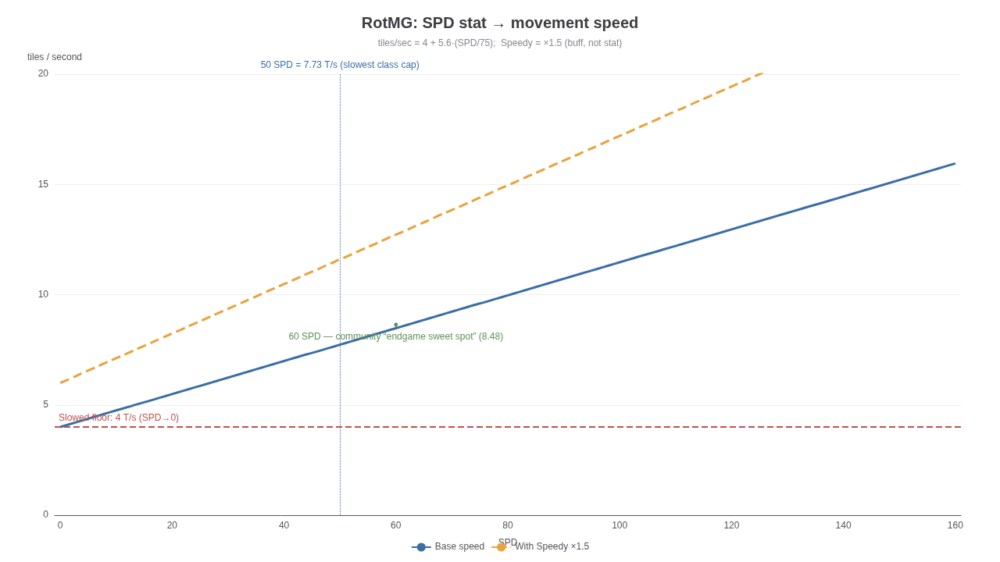
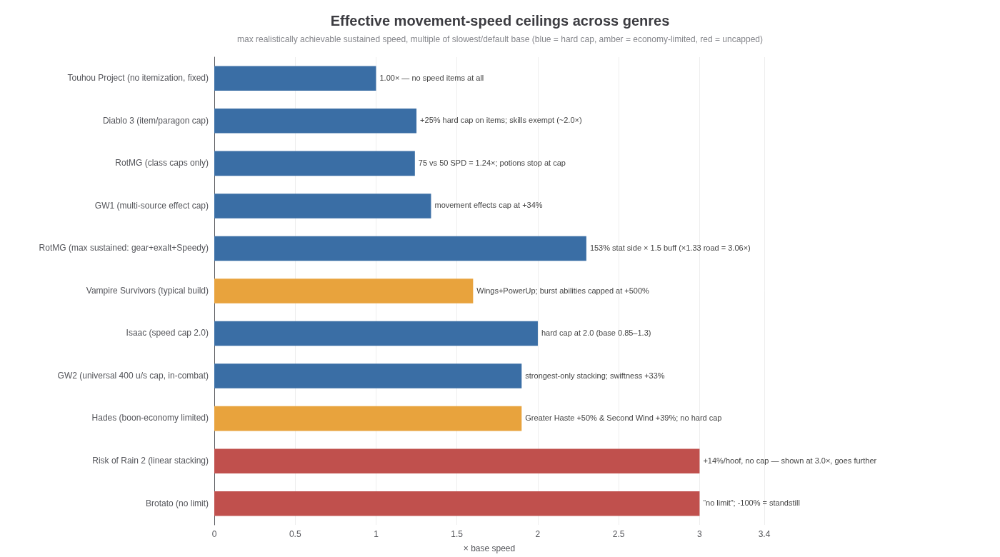
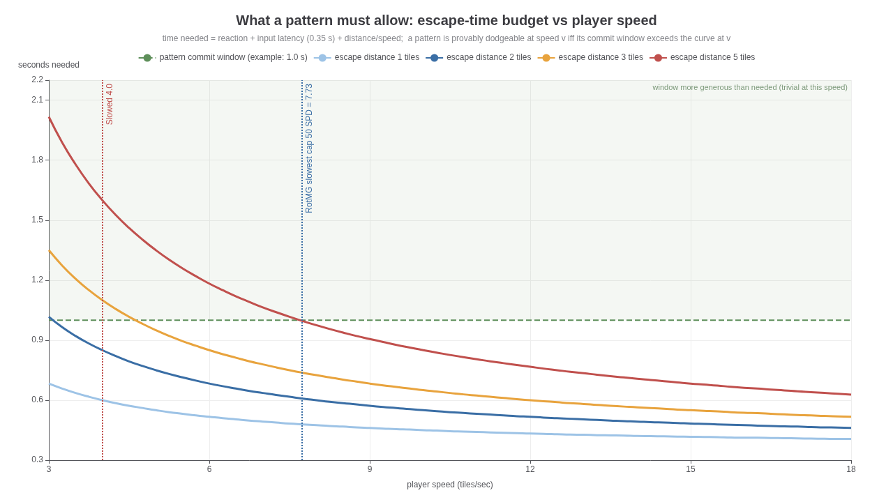
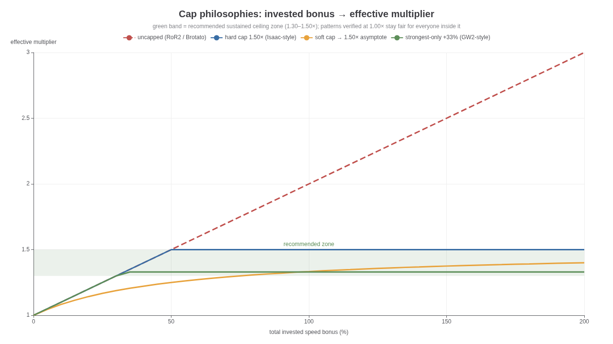

# Movement-Speed Itemization in Pure-Movement Dodging Games

*Sources, caps, typical ranges, uncapped failure modes, fairness across the speed range — and a cap philosophy for a game where every attack pattern must be provably dodgeable at the slowest class's base speed*

**TL;DR.** In movement-dodging games, +speed is the single most dangerous stat to itemize because it is simultaneously defense, mobility, and encounter-skip. Realm of the Mad God (the archetype) handles it with a **bounded stat axis** (class-capped SPD worth 7.73–9.6 tiles/sec, i.e., **100–124% of the slowest class**), a small inventory of flat +SPD gear, exactly **one dominant buff multiplier (Speedy, ×1.5)**, terrain multipliers (roads ×1.33), and a **status floor** (Slowed collapses you to 4 T/s regardless of investment). Games that leave speed uncapped (Risk of Rain 2, Brotato, Vampire Survivors' passive stat) accept pattern trivialization, control loss, and content-skipping as part of their power fantasy; games that must guarantee dodgeability (Touhou) remove speed itemization entirely. For a game where every pattern must be provably dodgeable at the slowest base speed, the recommended philosophy is: **verify every pattern at v_min, hard-cap sustained speed at 1.35–1.50× v_min, allow burst mobility on a separate cooldown-gated axis up to ~2× v_min, keep travel speed out of combat on its own axis, make all stacking strongest-wins or asymptotic, and never let a debuff push a player below the speed at which the current pattern was verified without re-verifying at that floor.**

---

## 1. The RotMG Archetype: Anatomy of a Bounded Speed Economy

Realm of the Mad God (RotMG) is the canonical case study because it is a *persistent-world, permadeath, class-based* game in which dodging is purely positional — there are no invincibility-frame dodge rolls, no blocks, and (outside of specific ability teleports and the Kensei's dash) no movement assists. Every bullet that kills you was a bullet you failed to walk away from. That makes its speed economy unusually instructive: the designers cannot hide behind an i-frame button, so the entire burden of fairness lands on the relationship between player speed, bullet speed, and pattern geometry.

### 1.1 The SPD scale and its class deltas

RotMG expresses movement through a character stat, SPD, which converts linearly to real speed: **tiles/sec = 4 + 5.6 × (SPD / 75)**. At SPD 0 a character still moves at 4 T/s; each point of SPD adds roughly 0.0747 T/s [^2^]. Two reference points anchor the entire economy: **50 SPD = 7.733 T/s** (the lowest class cap in the game — Knight, Warrior, Wizard, and others) and **75 SPD = 9.6 T/s** (Trickster, the highest class cap) [^2^][^5^]. The gap between the slowest and fastest class caps is therefore only **24% in actual speed**, even though 50→75 *sounds* like a 50% stat difference: the +4 T/s constant in the formula deliberately compresses the spread. This is the first and most subtle cap mechanism in the game — the stat scale is *affine*, not proportional, so class identity ("the fast class") can feel large while the dodgeability envelope stays narrow.

Class caps are enforced structurally. Stats grow with level to a class-specific ceiling and can then only be raised by permanent **Potions of Speed (+1 SPD each)**, which stop working at the cap [^15^]. The cap table itself is a balance lever that DECA actively adjusts: the Rogue, long the iconic 75-SPD class, was reduced to a **65 SPD cap in Exalt 5.0.0.0 (July 2024)**, compressing the dagger-class speed hierarchy [^11^]. The current spread of caps runs from 50 (Knight, Warrior, Wizard, Necromancer, Huntress) through 55–60 (most mid-tier classes) to 65 (Rogue, Assassin) and 75 (Trickster alone) [^5^]. Because potions are the long-tail progression system of the game, the speed cap is, in effect, a *hard ceiling on permanent character power along the defensive axis that matters most* — and the community noticed: the Potion of Speed was the **single most-consumed item in the entire game, 10.6% of all items consumed as of June 2020** [^15^].

### 1.2 Sources of +speed: the complete inventory

Everything that makes a RotMG character faster falls into five cleanly separated buckets, and the separation itself is the design lesson.

**Permanent stat sources** are bounded by the class cap: leveling, then Potions of Speed (+1 each) up to cap [^15^]. On top of the potion cap sits the account-wide **Exaltation** system: completing endgame dungeons on an 8/8-maxed character grants **+1 SPD per exaltation milestone, up to +5**, permanently, for that class [^20^]. **Equipment** grants flat SPD in small, tier-banded amounts: the standard ring line runs from +3 SPD (T1) to **+11 SPD (T7, Ring of Transcendent Speed)**, i.e., at most +0.82 T/s from the ring slot [^14^]; various untiered armors, abilities, and cloaks add a few more points (the wiki's theoretical maximum-stat build reaches **105 SPD = 11.84 T/s** by stacking +30 SPD from gear onto a 75-SPD class) [^13^]. **Consumable boosts** (tinctures, effusions) add temporary flat SPD, but RotMG's global buff rules defuse them: successive same-source boosts are halved each time, and cross-source boosts resolve strongest-wins rather than additively [^18^].

**The buff layer** is where the real multiplier lives: the **Speedy** status increases *movement speed by 50%* — explicitly a multiplier on computed speed, not +SPD stat [^18^][^2^]. Its sources are ability items: most Warrior helms, many Ninja stars, the Orb of Conflict, Soul of the Bearer, Book of Geb, Snake Charmer Pungi, Snake Eye Ring, the Speed Sprout consumable, and Mad Lab's green pools [^18^]. A 75-SPD character under Speedy moves at **14.4 T/s** [^2^]. **Terrain** adds a final multiplier: realm roads boost movement (the wiki's max-speed calculation uses **×1.333**), and dungeon hazards do the opposite — quicksand, webs, conveyor belts, and slowing water all reshape effective speed by zone [^13^][^78^][^95^]. Note the architectural pattern: *one* permanent axis with a hard cap, *one* temporary multiplicative buff, *one* environmental multiplier. Nothing else stacks into the computation.

### 1.3 The status layer: a designed floor below base speed

RotMG's negative status effects form the lower guardrail of the speed economy, and they are aggressively absolute. **Slowed does not reduce speed by a percentage — it sets the player's SPD to 0 during the movement calculation**, producing the 4 T/s floor and *nullifying Speedy outright* [^18^]. **Paralyzed renders the entity completely immobile**, and it is inflicted by a long list of endgame enemies (Tomb Thunder Turrets, the Marble Colossus, the Void Entity, Daichi the Fallen, and more) [^18^]. **Petrify** stops movement and weapon use (with 10% damage reduction as compensation), and **Confused** scrambles directional inputs, which at speed is often worse than being slowed [^18^].

This layer matters to itemization philosophy for two reasons. First, it is a **normalization mechanism**: no matter how much speed a player has itemized, the encounter designer can, at any moment, collapse them to a known velocity (4 T/s, or 0) and run a pattern that is tuned for exactly that velocity. The speed *range* the designer must handle is therefore not "whatever players bring" but "v_base…4 T/s, with telegraphed excursions." Second, it means **speed investment has no insurance value against the deadliest control effects** — which is precisely why the community treats raw speed as a weak endgame crutch: veterans routinely advise that endgame survival is micro-dodging and positioning, noting that "moving fast gets you away from danger" is a beginner's intuition that fails in practice [^34^]. The debuff layer also has its own inflation problem worth stealing a lesson from: most endgame bosses are now *immune* to stun/slow/paralyze/daze, a creep players explicitly call out as hollowing those status effects' usefulness [^75^].

### 1.4 The aggregate range, expressed as % of base

Putting the layers together, the practical speed envelope of a RotMG character — as a multiple of the slowest capped class (50 SPD, 7.733 T/s) — looks like this:

| Configuration | Computation | T/s | % of slowest capped class |
|---|---|---|---|
| **Slowed** (any character) | SPD→0 → 4 T/s | 4.00 | **51.7%** |
| 50 SPD (slowest class cap) | 4 + 5.6·(50/75) | 7.73 | **100%** |
| 60 SPD (community "endgame sweet spot" [^25^]) | 4 + 5.6·(60/75) | 8.48 | 109.7% |
| 65 SPD (Rogue/Assassin cap) | 4 + 5.6·(65/75) | 8.85 | 114.5% |
| 75 SPD (Trickster cap) | 4 + 5.6·(75/75) | 9.60 | **124.1%** |
| 75 + 5 exaltation | +5 SPD | 9.97 | 129.0% |
| 75 + 5 exalt + 11 ring | +16 SPD | 10.80 | 139.6% |
| Theoretical gear max (105 SPD) | per wiki max-stat build [^13^] | 11.84 | 153.1% |
| 50 SPD + Speedy | 7.733 × 1.5 | 11.60 | 150.0% |
| 105 SPD + Speedy | 11.84 × 1.5 | 17.76 | **229.7%** |
| 105 SPD + Speedy + road | 17.76 × 1.333 | 23.67 | **306.1%** |

The takeaway from the table is how *narrow the sustained in-combat band really is*. The permanent, always-on spread between a fresh slow-class character and a maximally-optimized speed build is roughly **100→153%**, and the one big combat multiplier (Speedy ×1.5) is class-locked, time-limited, and explicitly negated by the Slowed floor [^18^][^13^]. The headline 3× figure only exists on roads — i.e., as a *travel* multiplier in the overworld, where dodgeability is not the binding constraint [^13^][^78^]. RotMG's answer to "typical ranges as % of base" is thus: **class identity ±12%, full itemization up to ~+50%, one sanctioned temporary multiplier of 1.5×, travel-only multipliers beyond that, and a hard floor at ~52%** that the encounter design team can invoke on purpose. Every comparative game in Section 2 can be read as a different way of setting those same five numbers.

The figure makes the affine compression visible: doubling the stat from 50 to 100 SPD buys only ~47% more real speed, because the +4 T/s intercept dominates the low end. It also shows why Speedy dwarfs every itemization decision — the dashed line sits 1.5× above the solid one at every point, which is exactly why DECA keeps Speedy class-locked and lets Slowed veto it rather than letting it ride on top of an open-ended stat [^18^][^2^]. Finally, the red floor is the designer's escape hatch: any phase that Slows you is a phase tuned for 4 T/s, and the rest of your speed economy is irrelevant inside it.

---

## 2. Cross-Genre Survey: Who Caps Speed, Who Doesn't, and What It Buys Them

The design space across genres resolves into four stable archetypes: **hard numerical caps**, **strongest-wins stacking with a universal cap**, **economy-limited stacking** (no cap, but the drop/boon economy makes runaway stacking rare), and **fully uncapped stacking**. The table centralizes the systems that matter for a movement-dodging designer; the figure below it normalizes everything to multiples of each game's slowest/default base.

| Game | Speed model | Cap structure | Sustained ceiling (× base) | Burst ceiling | What stacking does |
|---|---|---|---|---|---|
| **RotMG** | Affine stat (4 + 5.6·SPD/75) → T/s [^2^] | Class-capped stat; potions stop at cap; exalt +5 [^5^][^20^] | ~1.24× class-to-class; ~1.53× max gear [^13^] | ×1.5 Speedy, negated by Slowed [^18^] | Same-source buffs halve; cross-source strongest-wins [^18^] |
| **Binding of Isaac** | Stat 0.1–2.0, base 0.85–1.3 by character [^36^] | **Hard cap 2.0**; only edge-case bugs exceed it [^41^][^45^] | 2.0× (≈154–235% of char base) | Berserk!/Dark Arts spikes [^36^] | Flat adds to the cap |
| **Guild Wars 2** | u/s, in-combat base 210, out 294 [^49^] | **Universal 400 u/s cap** (190% of in-combat base); **most bonuses don't stack — greatest value wins** [^49^][^54^] | 1.33× (Swiftness) | Superspeed +100% (in-combat) [^49^] | Strongest-wins; strafe/backpedal never improvable [^49^] |
| **Guild Wars 1** | % modifiers, multiplicative | **Effect cap +34% / −50%** across multi-source stacking [^51^] | 1.34× | Single sources may exceed cap [^51^] | Multiplicative within cap |
| **Diablo 3** | % from items/paragon vs skills | **Item+paragon hard cap +25%**; skills/legendary powers exempt, stack beyond [^55^] | 1.25× (items) | ~2.0×+ with skills [^55^] | Two-bucket: capped permanent, uncapped conditional |
| **Hades** | Boon % bonuses | No hard cap; **boon economy limits** (rarity-scaled, few slots) [^47^] | ~1.5–1.9× (Greater Haste +20–50%, Second Wind +30–39%) [^47^] | Hyper Sprint +100% post-dash [^47^] | Rush Delivery converts speed→damage (incentive loop) [^47^] |
| **Vampire Survivors** | Additive % of 100% base | **No upper limit** on the passive stat; stage multipliers ×1.1–2.0 apply separately [^35^][^42^] | ~1.6× typical (Wings +50%, PowerUp +10%) [^35^][^37^] | Burst abilities capped at **+500%** [^35^] | Additive; below −100% inverts controls [^35^] |
| **Risk of Rain 2** | +% items, linear per stack | **Uncapped** (Goat Hoof +14%/stack, Energy Drink +25% sprint/stack) [^38^][^39^] | Unbounded (3×+ common) | Sprint multiplier axis | Wiki: "excessive amount will make it more difficult to maneuver" [^39^] |
| **Brotato** | % Speed stat, base 450 u/s | **No limit** [^96^][^92^] | Unbounded | — | Additive; −100% = standstill [^96^] |
| **Enter the Gungeon** | Flat +1–2.5 to base 7 [^83^] | No stated cap; i-frame dodge roll is the real defense [^81^] | ~1.5× with several items | Jetpack/Turbo +40% [^83^] | Additive flats |
| **Touhou Project** | **Fixed** focused/unfocused speeds per shot type; Shift slows movement for precision [^66^][^105^] | No itemization at all | 1.00× (focus ≈ 0.5×) | — | N/A — speed is a designer constant |
| **Nova Drift** | Thrust/velocity physics | **Engine max speed cap** — a bug let negative friction (Slipstream) exceed it [^102^] | Cap-enforced | Strafe dart, 1.5s cooldown [^101^] | Physics-derived; cap enforced at sim level |

Three patterns fall out of the comparison. First, **the games with guaranteed-fairness constraints cluster at 1.25–2.0× ceilings**: RotMG's class spread is 1.24×, GW2's universal cap is 1.9× of the in-combat base, Isaac's is 2.0×, and D3's *itemized* cap is a mere 1.25× [^2^][^49^][^36^][^55^]. Second, the **uncapped games are all roguelites with self-scaling difficulty** — RoR2 and Brotato can afford uncapped speed because enemy density, damage, and scaling rise alongside player power, so speed reads as "power fantasy" rather than as a fairness exploit [^38^][^96^]. Third, almost every mature system converges on the **two-bucket split**: a strictly bounded *permanent/itemized* bucket plus a looser *conditional/burst* bucket (D3's 25% item cap vs skill stacking, GW2's Swiftness vs Superspeed, VS's passive stat vs its +500%-capped burst abilities) [^55^][^49^][^35^]. That convergence is not an accident; it is the industry rediscovering RotMG's structure from first principles.

A fourth observation belongs to the games that refused the problem. **Touhou — the genre where "provably dodgeable" is taken most seriously — simply does not itemize speed**: each character/shot type has a fixed unfocused speed and a fixed, slower focused speed, and the focus mode exists precisely so the player can *trade* speed for precision when threading dense patterns [^66^][^105^]. Danmaku pattern craft is correspondingly built on constants: gap design over bullet density ("bullet patterns are a design of gaps, not a design of bullets"), cycle-based rhythm, color-coded readability, and mandatory warnings before high-commitment attacks [^68^]. When speed is a constant, a pattern's dodgeability is a theorem the designer can prove at their desk; when speed is a variable, it becomes a claim that must hold across the whole itemized range. Section 6 turns that observation into the cap recommendation.

---

## 3. What Breaks When Speed Is Uncapped

Uncapped speed does not fail in one dramatic way; it fails in five quieter ways that compound. The order below is roughly the order in which a live game notices them.

### 3.1 Combat math: the pattern-threat function collapses

Every dodgeable pattern implicitly encodes a speed assumption. A bullet wall with a gap is only a threat if the wall reaches you before you can reach the gap; an aimed stream is only a threat if it can lead you faster than you can change direction. As player speed rises relative to bullet speed, three threshold effects trigger in sequence: **(1) margin trivialization** — the time buffer between "bullet arrives" and "player must start moving" grows until any competent player dodges by reflex rather than by reading; **(2) macro-escape** — the player can leave the pattern's entire area of coverage before it closes (in the taxonomy of pattern analysis, they stop *micro-dodging* within the pattern's lanes and simply *macro-dodge* out of it) [^60^]; and **(3) outrun-the-emitter** — the player becomes faster than the projectiles themselves, at which point no aimed or radial pattern can ever threaten them from behind, and the arena's geometry stops mattering altogether. RotMG's own rushing meta demonstrates threshold 2 in production: dedicated rushing classes (Trickster, Kensei, Rogue, Ninja, Warrior) run *past* enemies rather than through their patterns, and the rushing guide's first advice is to max Speed and Defense "since if you are not going fast enough, enemies can easily start to build up and kill you" [^95^]. Speed past a threshold doesn't make patterns easier — it *opts you out of the pattern system entirely*.

The mathematical core is the margin function. If a pattern commits at time zero and its threat reaches the player's corridor after a window T_w, and the player needs to cover escape distance d, then the dodge margin is **M(v) = T_w − (R + L) − d/v**, where R is human reaction (~0.25 s is the standard combat-design rule of thumb) and L is input/system latency (well-tuned action games target under 100 ms) [^62^]. M(v) rises monotonically with v but with **sharply diminishing returns** (dM/dv = d/v²): the jump from 4→8 T/s buys a full second of slack on a 2-tile escape, while 8→16 T/s buys only a quarter of that. This is why +speed feels transformative early and pointless late — and why, past the knee of the curve, designers must compensate with *more* bullets, *faster* bullets, or *tighter* gaps to restore difficulty, each of which punishes the slow classes far harder than the fast ones. The escape-time chart below shows the family of curves; the practical reading is that a pattern tuned so the slowest class barely clears it (window ≈ curve at v_min) sits deep in the "trivial" region for a player at 2× v_min.

### 3.2 Human factors: over-speed degrades precision instead of helping

The counterintuitive finding from the communities that allow runaway speed is that **players get worse at dodging past a comfort band**. Risk of Rain 2's official wiki warns on every speed item page that "grabbing an excessive amount will make it more difficult to maneuver" [^39^], and the subreddit is full of the same complaint — "every run I hit a point where my movement speed is too high and I can't control my character well" [^94^]. RotMG's veterans independently arrived at the same conclusion from the opposite direction: in endgame bullet-hell dungeons, small precise movements ("micro-dodging") beat raw speed, and the folk wisdom is explicit that moving fast is the beginner's mistake [^34^]; the community's recommended endgame speed settles around **60–70 SPD** ("60+ spd is enough… 70 is comfy") — i.e., only **110–119% of the slowest class**, far below what itemization allows [^82^][^25^].

The mechanism is geometric. Gap-threading requires stopping your hitbox inside a safe lane that may be under a tile wide; the overshoot distance of a direction change grows with velocity, so a faster character literally *cannot* make the same fine correction in the same lane width without a longer settling time. RotMG's 75-SPD debate makes the point from the class-balance side: players argued that giving Assassin 75 speed would push them "into more situations where that high amount of speed is crucial to dodging," i.e., high speed *creates* the situations that then demand high speed [^12^]. Over-speed is thus self-limiting *in feel* — but a designer should read that as a warning, not a solution: players respond by demanding speed they can feel, then routing around the content that makes speed uncomfortable, and both behaviors hollow out the intended difficulty band. A cap at the top of the human comfort band (~1.3–1.5×) keeps the stat desirable *and* keeps its absence survivable.

### 3.3 Engine and netcode: tunneling, rubber-banding, and client-trust exploits

At the implementation layer, high sustained speed stresses three systems. **Collision**: any discrete-step physics integration develops tunneling once per-tick displacement approaches the thickness of walls and hitboxes — projectiles and players begin passing through geometry unless you pay for continuous collision detection, whose cost scales with the fastest entity in the scene. **Netcode**: in a client-prediction/server-authoritative model, rubber-banding is the visible symptom when prediction and server state diverge and the correction is applied abruptly; the size of the snap is proportional to how far the client could drift between corrections, which scales directly with velocity and latency [^103^][^106^]. RotMG's cheat ecosystem shows the operational cost of getting this wrong: its hacked clients ship "Slow Walk" features that historically worked by *setting the player speed stat via proxy* (i.e., the server accepted client-asserted speed), alongside WASD autododge and autonexus, and the same tooling notes that aggressive automation creates "artificial client network lag & rubberbanding" [^79^][^80^]. The RealmEye anti-cheat discussion is blunt that the server cannot reliably distinguish hacked clients because they "look like normal clients to the server" [^73^].

The design-relevant lesson is that **a hard cap is also a security primitive**: a server-side rule "no legal entity may exceed V tiles/sec under these flags" turns speed-hacking from an undetectable client-side edit into a trivially checkable invariant, and it bounds the worst-case correction magnitude the reconciliation code must hide [^103^]. Nova Drift's patch history supplies the canonical cautionary tale: its *engine-enforced* maximum speed cap was silently defeated by an item interaction — excessive stacks of a friction-reducing mod produced negative friction that recomputed velocity above the cap — which the developers had to fix as a bug [^102^]. Caps that live only in the item spreadsheet and not in the movement integrator *will* leak.

### 3.4 Itemization economy: speed cannibalizes the other stats

Because speed in a pure-movement game is defense, offense-enabler (closing distance, orbiting), and time-saver at once, it exerts gravitational pull on every item decision. RotMG's data point is stark: the Potion of Speed became the most-consumed item in the game (10.6% of all consumption) [^15^], the standard rushing advice is to max Speed *first* alongside Defense [^95^], and endgame folk thresholds ("60+ SPD") function as a soft gear check [^82^]. When one stat is a prerequisite for both survival and clear speed, the itemization system around it collapses into a tax: every slot that isn't speed is a slot you spent wrong. RotMG contains this mostly through *scarcity of sources* — the ring slot caps at +11 SPD [^14^] and the big multiplier is class-locked — but even so, community build discussion treats sub-60 SPD characters as handicapped for endgame [^25^].

The secondary cannibalization is subtler: **speed synergies let speed convert into damage**, which removes the opportunity cost that normally balances it. Hades' Rush Delivery converts bonus move speed directly into bonus damage [^47^]; Nova Drift's Kinetic Boost scales global damage with speed [^101^]; Vampire Survivors lets several weapons scale with MoveSpeed and then had to cap the burst abilities at +500% anyway [^35^][^37^]. If your game has any speed→power conversion, the effective value of +1% speed is +1% defense *and* +X% damage, and the economy will not hold without an explicit cap on at least one side of the conversion.

### 3.5 Content structure: rushing, kiting, and the encounter-skip economy

The most expensive breakage is structural. When speed lets a player bypass fights rather than win them, the game's content pipeline inverts: players optimize for *avoiding* the encounters you spent budget building. RotMG's rushing culture is exactly this — and DECA's countermeasures are a catalog of what a live team ends up bolting on: dungeons where **teleportation is disabled** so the group can't be summoned past the crawl (Kogbold Steamworks), enemies with **anti-cloak measures** against the invisible Rogue, **anti-rush layouts** where "activating the miniboss before the rest of the group can arrive will only make entering the fight harder," and dense packs of status-inflicting minions (Pet Stasis, Paralyze, Slow) whose real job is to tax speed-based skipping [^95^]. Note that every one of those countermeasures is a *negative* design constraint — space the team can no longer use for interesting encounters.

Kiting is the ranged version of the same problem: if player speed ≥ enemy speed, any non-ranged enemy becomes free loot, so enemy speed inflates, which punishes slow classes, which demands more player speed — the creep cycle the Rogue/Assassin cap debates keep circling [^12^][^11^]. Risk of Rain 2 embraces the extreme end ("with enough speed you can just run back to the Contact Light and skip Mithrix entirely") [^99^] — acceptable in a scaling roguelite, fatal in a game whose contract is "every pattern is fairly dodgeable." The cap is what keeps "fast" meaning "nimbler inside the pattern" instead of "gone from the pattern."

---

## 4. Keeping Enemy Pattern Difficulty Fair Across the Speed Range

Fairness across a speed range is really two separate problems: making the floor survivable (the slow class can always clear the pattern) and keeping the ceiling engaged (the fast build cannot ignore the pattern). The genre has produced four families of solutions, which the strongest designs compose rather than choose between.

### 4.1 The Touhou solution: delete the range

The bullet-hell genre's most rigorous titles solve the problem by refusing it. Touhou gives every shot type exactly **two fixed speeds** — unfocused and the slower focused mode — with no items, stats, or progression touching either [^66^][^105^]. Danmaku craft then treats dodgeability as constructive: "design the gaps rather than the density," give every pattern a readable cycle, color-code bullet roles, and provide an explicit warning before high-commitment attacks [^68^]. Pattern analysis in this tradition distinguishes **aimed patterns** (which a continuously moving player can *stream* — the bullets always arrive where you were), **walls with gaps that widen as they travel from the emitter** (so retreating converts speed into clearance), and the distinction between **micro-dodging** within a pattern's lanes and **macro-dodging** out of its coverage entirely [^60^]. Each family has a known speed relationship, so with speed fixed, a designer can prove a pattern fair by construction and tune difficulty through density and bullet velocity rather than through the player's unknown stats.

The cost of the Touhou answer is the loss of an entire progression axis — and for a loot-driven game, giving up +speed as an item affix is giving up one of the highest-value drops in the economy (Section 3.4). RotMG's existence proves you can keep the axis if you bound it tightly enough; the Touhou precedent sets the *target*: the effective speed range at which patterns must be verified should be narrow enough that "verified at the floor" implies "fair everywhere."

### 4.2 RotMG's implicit contract: verify at the floor, treat speed as error margin

RotMG never published the contract, but its encounter craft reveals it. The RealmEye guide to Oryx 3's infamous Celestial phase — the densest attack in the game — does not say "bring speed"; it documents that the spiral fireballs have **"periodic and predictable large gaps"** whose locations rotate by a fixed 90° per revolution, and the winning strategy is to *pre-position at the expected gap locations* — a positioning solution, not a speed solution [^85^]. The same page's advice for the Bomb Rain phase is that "there are predictable gaps in each bomb cluster" at known clock positions [^85^]. Community consensus operationalizes the contract: ~60 SPD is "best speed for endgame all around" — barely 10% above the slowest cap [^25^] — and the micro-dodging doctrine explicitly devalues raw speed [^34^]. Patterns are built so that a 50-SPD character with *knowledge* clears them; itemized speed converts knowledge requirements into reaction-time slack. In margin terms (Section 3.1), the design target is **M(v_min) ≈ 0** with d/v_min dominating the budget, and player speed above v_min buys comfort, not access.

The unwritten contract has an important corollary about what speed is *for* in RotMG: not dodging the boss's pattern, but **choosing which pattern you're in** — disengaging from a bad overlap, out-running a chasing boss between phases ("60+ spd is enough to run away from oryx" [^82^]), or repositioning before a wall closes. That is a much healthier itemization target than raw dodge-speed, because it scales gracefully: faster players get more *discretion*, not more *immunity*.

### 4.3 Pattern families and their speed-sensitivity

A practical fairness toolkit starts by classifying patterns by how their difficulty responds to player speed, because the class determines whether a pattern stays fair across the range or bifurcates.

| Pattern family | Fairness behavior across speed | Speed-sensitivity | Design lever |
|---|---|---|---|
| **Aimed streams** (bullets fired at current position) | Self-balancing: always miss a continuously strafing player at *any* speed; difficulty is sustained attention | **Low** — but faster players restream more safely [^60^] | Fire rate, spread angle, screen edges (limit streaming space) [^60^] |
| **Radial bursts / rings with gaps** | Gap width at player radius vs hitbox is absolute; any speed that reaches the gap clears it | **Medium** — faster players reach *more* gaps per cycle | Angular gap size, bullet speed, ring count [^68^] |
| **Rotating spirals** | Require moving *with* the rotation; gap position is predictable | **Low–medium** — rotation does the work, not player speed [^85^] | Angular velocity vs player circumferential speed at arena radius |
| **Walls with a single gap** | Binary: reachable before the wall arrives or not — the sharpest speed check in the repertoire | **High** — the margin function M(v) lives here | Commit window T_w vs worst-case escape distance d [^62^] |
| **Telegraphed AoE strikes** (red circles, beam rows) | Reaction-gated; dodgeable at any speed if telegraph ≥ reaction + traversal | **Medium** — traversal term shrinks with speed | Telegraph duration (≥ 0.25 s reaction + traversal + buffer) [^62^] |
| **Lingering zones / area denial** | Speed-independent; they constrain *where* you may stand, not how fast you move | **Very low** | Zone size, duration, overlap with pattern lanes |
| **Chasers / melee pursuers** | Pure speed race: fair iff enemy speed < slowest player speed minus margin | **Extreme** — a 1% speed edge trivializes | Keep chaser speed below v_min; use telegraphed lunges instead |
| **Safe-spot patterns** (bullets never cover a region) | Positioning-gated; speed only affects time-to-reach | **Low** [^70^] | Intentional blind spots vs aimed coverage [^70^] |

The portfolio rule writes itself: **compose speed-insensitive families (streams, spirals, zones, safe-spots) for the base difficulty, and reserve the speed-sensitive ones (walls, chases) for moments where the game has already normalized player velocity** — either by telegraphing long enough that even v_min clears comfortably, or by the debuff layer doing the normalizing for you. RotMG's hardest phases are exactly this composition: Celestial layers a predictable spiral (rotation does the work), telegraphed beam AoEs (reaction does the work), and a circling radial barrage (gap geometry does the work) — no component demands more than v_min, but together they demand everything a human has [^85^].

### 4.4 Normalization levers: debuffs, terrain, and anti-rush architecture

When a pattern *does* want to be speed-sensitive, the mature solution is to **set the player's speed for the duration** rather than hope the build cooperated. RotMG's Slowed status is the aggressive version — SPD→0, 4 T/s, Speedy vetoed [^18^] — and its dungeon hazards are the zoned version: quicksand, webs, slowing water, and conveyor belts create local velocity regimes the designer controls [^95^]. The Guild Wars 2 parallel shows the same instinct in an MMO: entering combat cuts base speed by ~30%, sideways/backpedal speed can *never* be increased by any effect, and the universal 400 u/s cap binds every source [^49^]. The design principle is that **fair difficulty requires the player's velocity to be a known quantity at the moment the pattern executes** — whether by itemization caps (known max), by class design (known base), by debuffs (forced floor), or by terrain (zoned override).

The mirror-image levers protect content from the ceiling: teleport locks, anti-cloak enemies, and status-heavy minion packs function as *selective* speed taxes in skip-prone dungeons [^95^]. These are patch-ware, though — evidence of a cap that came too late. Building the ceiling into itemization from day one (Sections 6.2–6.3) is strictly cheaper than maintaining anti-rush architecture forever, because every negative lever you deploy is also a constraint on your own encounter vocabulary.

### 4.5 Where even RotMG breaks its own contract

Honesty about the archetype matters: RotMG does not always meet its own standard. The RealmEye Oryx 3 guide concedes that players "sometimes… are forced into an inescapable death or nexus, due to the RNG controlling how the beam walls spawn not taking into account anything about what Oryx is doing" — randomly layered telegraphed AoEs overlapping a chasing boss can produce genuinely unsurvivable overlaps [^85^]. The lesson generalizes: **provable dodgeability is a property of the whole threat ensemble, not of each pattern individually**. Two independently fair patterns, overlaid with unlucky phase alignment, can close every escape corridor at v_min. This is precisely why the recommendation in Section 6 insists on *ensemble-level* verification (agent simulation over the full phase space) rather than per-pattern review — the academic PCG literature reached the same conclusion when building bullet-hell generators, using A* agents as playability oracles because hand-checking layered patterns does not scale [^84^].

A second crack is the buff-permanence loophole: RotMG's Speedy is designed as a temporary ×1.5, but pet mana regeneration makes permabuffing realistic on Warrior (the class guide describes sustaining helm buffs indefinitely with enough pet MHeal) [^3^]. A "temporary" multiplier with ~100% uptime is a sustained multiplier, and the entire cap arithmetic of Section 1.4 shifts by 1.5× wherever it happens. If your cap philosophy tolerates conditional multipliers, **uptime is part of the cap**.

---

## 5. Pitfall Checklist

Distilled from Sections 1–4, the traps that actually ship:

| # | Pitfall | Symptom in production | Fix |
|---|---|---|---|
| 1 | **Percent-of-base vs percent-of-current ambiguity** in item text and stacking | Multiplicative stacking silently outruns the spreadsheet budget | Define one base; all itemized % are of that base; at most one multiplier buff [^18^] |
| 2 | **Uncapped same-source stacking** | Consumable spam (effusion-style) breaks the cap from inside [^13^] | Same-source successive boosts halve (RotMG rule) [^18^] |
| 3 | **"Temporary" buffs with ~100% uptime** | Permabuff converts burst budget into sustained budget [^3^] | Cap uptime (resource, cooldown > duration); count uptime in the ceiling |
| 4 | **Speed→damage conversions** (Rush Delivery, Kinetic Boost) | Speed becomes the best offensive *and* defensive stat; itemization collapses [^47^][^101^] | If conversion exists, cap one side; never both uncapped |
| 5 | **Cap enforced in items, not in physics** | Negative-friction/edge interactions exceed the engine cap (Nova Drift bug) [^102^] | Clamp velocity in the movement integrator; server-side validation |
| 6 | **Client-authoritative speed** | "Set speed stat via proxy" cheats; undetectable speed hacks [^79^][^73^] | Server-authoritative movement; cap as anti-cheat invariant [^103^] |
| 7 | **Terrain multipliers forgotten in the budget** | Road ×1.33 on top of everything → 3× headline speed [^13^] | Travel axis separate from combat axis; disable on combat entry (GW2 model) [^49^] |
| 8 | **Debuff floor not co-designed with patterns** | Slowed to 4 T/s inside a pattern tuned for 7.7 → unavoidable death | Re-verify affected patterns at the floor, or telegraph/cleanse the debuff [^18^] |
| 9 | **Class identity collapse** | Gear closes the class gap; "fast class" loses meaning (Rogue 75→65) [^11^] | Keep gear-side bonuses small relative to class deltas [^14^] |
| 10 | **Over-speed punished by feel, not by rule** | Players self-report control loss; demand speed then hate it [^94^][^39^] | Cap at the human comfort band (~1.3–1.5×), don't rely on self-limiting |
| 11 | **Verifying at the designer's build** | "Dodgeable" at dev speed ≠ dodgeable at v_min | CI/agent verification at v_min over the full ensemble [^84^] |
| 12 | **RNG-layered telegraphs** | Independent fair patterns overlap into inescapable states [^85^] | Constraint-solve phase alignments; ensemble-level proof, not per-pattern |
| 13 | **Speed as encounter-skip** | Rushing meta; anti-rush patch-ware (teleport locks) forever [^95^] | Low ceiling + speed-insensitive pattern families as base difficulty |
| 14 | **Negative speed edge cases** | −100% = standstill/inverted controls as joke outcomes [^96^][^35^] | Clamp at a designed minimum; make the clamp visible |

Two of these deserve emphasis because they are the ones design documents most often miss entirely. **Pitfall 8** (the debuff floor) is the mirror image of the cap: if Slowed sets you to 4 T/s, then any pattern active during a Slow window must be re-proven at 4 T/s — RotMG's 4 T/s floor is 52% of its slowest class speed, far outside the ±25% band its patterns assume [^18^][^2^]. RotMG gets away with it mostly because slow zones are telegraphed terrain and slow-inflicting phases are readable; an un-telegraphed slow inside a wall-check pattern is an unfair kill, full stop. **Pitfall 12** is the ensemble problem from Section 4.5: provable dodgeability does not compose across patterns for free. The verification artifact must cover *alignments*, which is exactly what agent-based playability oracles exist for [^84^].

---

## 6. Recommended Cap Philosophy

For a game whose contract is *"every attack pattern is provably dodgeable at the slowest class's base speed,"* the cap philosophy is not a number — it is a closed loop: a formal budget, a layered architecture that keeps real speed inside the budget, and a verification harness that proves the budget holds. The number falls out of the loop.

### 6.1 Formalize the dodgeability budget

Give every attack pattern, at design time, a **budget receipt** with three quantities: its commit window **T_w** (seconds from readable telegraph to threat occupying the escape corridor), its worst-case escape distance **d** (tiles from the worst legal starting position to the nearest safe lane), and its ensemble class (does it overlap other patterns). The pattern is *provably dodgeable* if and only if **M(v_min) = T_w − (R + L) − d/v_min ≥ B**, where R ≈ 0.25 s is the human reaction allowance, L ≤ 0.1 s the input-latency budget [^62^], and B is your difficulty buffer — the knob that sets how the game *feels* (B ≈ 0.5 s is forgiving; B ≈ 0.15 s is expert-tier). Note what this does to difficulty tuning: **bullet speed, gap size, and telegraph length set T_w and d; player speed is not in your hands** — it is in itemization's. The only way the contract survives itemization is if the range of real v is narrow enough that M(v) stays positive at the floor and M(v) − M(v_min) stays small at the ceiling.

The ceiling condition follows directly. The maximum escape envelope scales linearly in v, so with a sustained ratio **ρ = v_max_sustained / v_min**, every pattern's effective slack at the top end is multiplied by ρ. At ρ = 2, a pattern tuned tight at v_min has roughly double the margin for the top build — the "trivial region" of the escape-time chart. Empirically, the genre's successful fairness-constrained games all live at **ρ ≤ 1.5 sustained** (RotMG class spread 1.24× with Speedy at 1.5×; GW2 1.9× *universal* but with strongest-wins stacking; Isaac 2.0× in a single-player game with self-inflicted difficulty) [^2^][^49^][^36^]. The recommendation: **ρ_sustained ≤ 1.35–1.50, ρ_burst ≤ 2.0 for ≤ 2–3 s with cooldown, and travel speed (out-of-combat) on a separate axis up to ρ ≈ 3.** These are not arbitrary: 1.35–1.50 is the band where +speed remains a *desirable* affix (it visibly moves the margin curve), where overshoot does not yet destroy gap-threading (Section 3.2), and where a pattern verified at v_min degrades to "comfortable" rather than "ignore it" at the cap (Section 3.1).

### 6.2 The four-layer speed architecture

Structure the economy so the budget is *mechanically* enforceable, borrowing the best-proven component from each game surveyed:

**Layer 1 — a bounded stat axis (the RotMG layer).** One base stat per class, an *affine* conversion so class deltas feel bigger than they are (RotMG's 50→75 stat gap = 24% real speed) [^2^], permanent bonuses that stop at a class cap (potions) [^15^], and a small post-cap tail for long progression (exaltations, +5) [^20^]. Total Layer-1 spread: **≤ 1.25× from slowest class to fastest fully-invested build**. Gear-side flat bonuses stay small (RotMG's ring tops out at +11 SPD = +0.82 T/s) so that gear *flavors* class identity instead of replacing it (Pitfall 9) [^14^].

**Layer 2 — exactly one multiplicative buff, strongest-wins (the GW2/RotMG layer).** A sanctioned combat multiplier of **×1.25–1.5, duration-bounded, telegraphed, and non-stacking**: new applications override rather than add (GW2's greatest-value-wins rule) [^49^][^54^], same-source repeat boosts halve (RotMG's rule) [^18^], and uptime is part of the budget — if resource economies allow >70% uptime, the multiplier is *sustained* and must be counted in ρ_sustained (Section 4.5's permabuff lesson) [^3^].

**Layer 3 — burst mobility on a cooldown axis (the ability layer).** Dashes, blinks, and sprints live outside the sustained cap but inside a charge/cooldown economy: spikes to ~2× v_min for 1–3 s, or discrete teleports with clear costs (RotMG's Trickster teleport and Kensei dash — the latter notably carrying invulnerability, which is RotMG's one sanctioned crack in pure-movement purity) [^95^]. Because pure-movement design forbids i-frames as the *universal* answer, burst mobility should reposition, not phase through — and its availability during verified patterns must be part of the budget receipt.

**Layer 4 — travel speed, out of combat only (the road layer).** Mounts, roads, and overworld sprints may be generous (RotMG's road ×1.33; GW2's out-of-combat base is 40% faster than in-combat) [^13^][^49^], but they must **disengage on combat entry** so they never enter the dodgeability budget. Mixing Layer 4 into Layer 1–3 is Pitfall 7, and it is how "3× speed" headlines happen [^13^].

Two cross-cutting rules complete the architecture. **The floor rule**: any effect that reduces player speed below v_min (Slowed-style debuffs, terrain) must either be telegraphed and cleansable, or every pattern live during its window must be re-verified at that floor (Pitfall 8); RotMG's SPD→0 floor at 4 T/s is the existence proof that designers *can* tune phases for a forced velocity [^18^]. **The enforcement rule**: clamp velocity in the movement integrator and validate it server-side — the cap is simultaneously a fairness guarantee and the anti-cheat invariant that turns "set speed via proxy" from an invisible edit into a reject packet (Pitfalls 5–6) [^102^][^103^][^73^].

### 6.3 Putting numbers on it: the recommended ceilings

Translated into %-of-base terms (the question's requested units), with v_min = slowest class base = 100%:

| Axis | Source types allowed | Recommended ceiling | % of v_min | Precedent |
|---|---|---|---|---|
| Class base spread | innate class stats | fastest class ≤ **1.12×** slowest | 112% | RotMG class caps 100–124% (with affine compression) [^5^][^2^] |
| Permanent itemization | potions, gear flats, exalt-style tails | **+15–25%** on top of class base | ≤ **1.40×** overall | RotMG gear+exalt ≈ 140%; ring +11 SPD [^13^][^14^][^20^] |
| Sustained combat buff | one named multiplier, strongest-wins | **×1.25–1.5** on computed speed | ≤ **1.5×** overall (cap ρ at ~1.5) | Speedy ×1.5, vetoed by Slowed [^18^] |
| Burst mobility | dash/blink/sprint, cooldown-gated | spike ≤ **2×**, ≤ 2–3 s duration | ≤ 200% transient | GW2 Superspeed +100%; Hades Hyper Sprint +100% [^49^][^47^] |
| Travel (out of combat) | roads/mounts/sprint | ≤ **3×**, disabled in combat | 300% OOC only | RotMG roads ×1.33 → 3.06× headline [^13^] |
| Debuff floor | slows, terrain, petrify-family | never below **~0.65×** without re-verified patterns; absolute floor at designed minimum | ≥ 65% (else re-verify) | RotMG Slowed = 52% — only safe because phases are telegraphed [^18^] |

If forced to one sentence: **cap the product of everything a player can sustain at ~1.5× the slowest class's base speed, let nothing itemized stack multiplicatively with anything else, gate bursts by cooldown instead of magnitude, and treat any sub-base debuff window as a separate verification target.** The figure below shows the four candidate stacking rules against the recommended zone; the hard cap and the asymptotic soft cap both terminate inside it, while uncapped linear stacking leaves it immediately — and the strongest-wins rule (green) is the cheapest to implement correctly, since it makes most stacking bugs mathematically harmless.

Hard cap vs soft cap is a genuine choice, and the evidence splits. **Hard caps** (Isaac's 2.0, D3's 25%, GW2's 400 u/s) are simple, legible, and robust — players understand "the stat stops here," and overflow can be silently discarded or converted (overflow SPD→gold is a fine pressure valve) [^36^][^55^][^49^]. **Soft/asymptotic caps** (eff = 1 + C·x/(x+C), or RotMG's halving rule for same-source boosts) preserve the *feeling* that every drop matters — important for loot games — while guaranteeing the asymptote [^18^]. The recommendation for a fairness-critical game is a **hybrid**: soft-cap the *permanent* axis (so late-game drops still feel like progression) but hard-clamp the *computed result* in the movement code (so no interaction — negative friction, buff overlap, terrain — can exceed ρ_max in production) [^102^]. The soft cap is for the player's heart; the hard clamp is for the pattern designer's proof.

### 6.4 Proving it: verification harness, not playtest hope

"Provably dodgeable" should be a *build artifact*, not a QA anecdote. The practical harness has three components. **(1) Analytic pass**: every pattern's budget receipt (T_w, d) is checked against M(v_min) ≥ B at authoring time — this is arithmetic, and it catches the entire class of "wall arrives before slow class can cross" errors before they ship (Section 6.1). **(2) Agent simulation**: a scripted agent at exactly v_min, with R and L injected, runs every phase *and every phase alignment* thousands of times; the bullet-hell PCG literature already uses A* agents as playability oracles for exactly this, and notes that agent-based constraints are the only tractable way to verify layered patterns at scale [^84^]. The ensemble coverage is the point that per-pattern review misses (Pitfall 12, Section 4.5): RotMG's "inescapable death" beam-wall overlaps are what a missing alignment check looks like in a shipped game [^85^]. **(3) Telemetry regression**: track death positions/velocities against pattern IDs in production; a cluster of deaths at v_min inside one pattern is a budget violation discovered in the wild, and in a permadeath game your players file those bug reports with their characters.

Two governance habits keep the proof alive over years of content updates. First, **freeze v_min as a design constant** — the slowest class's base speed may not be nerfed, and any new class faster than it inherits the same verification burden; RotMG's class-cap table has been stable within a 50–75 band for over a decade precisely because the pattern library depends on it [^5^]. Second, **version the budget receipts**: when a pattern is re-tuned (bullet speed up, gaps narrower), its receipt changes, the margin at v_min is recomputed, and the verification suite re-runs — difficulty patches then become auditable transactions instead of vibes. The studios that treat danmaku as engineering (fixed-speed Touhou on one end, agent-verified generators on the other) already work this way [^66^][^84^]; a loot-driven movement-dodging game can have the same rigor, at the price of a 1.5× ceiling and a movement clamp — which is, not coincidentally, almost exactly the architecture RotMG arrived at through fifteen years of iteration.

---

[^2^]: https://www.realmeye.com/wiki/character-stats
[^3^]: https://www.realmeye.com/wiki/warrior-class-guide
[^5^]: https://www.realmeye.com/wiki/classes
[^11^]: https://www.realmeye.com/wiki/rogue
[^12^]: https://www.reddit.com/r/RotMG/comments/w8t72h/the_assassin_should_have_75_speed/
[^13^]: https://www.realmeye.com/wiki/highest-stats
[^14^]: https://www.realmeye.com/wiki/speed-rings
[^15^]: https://www.realmeye.com/wiki/potion-of-speed
[^18^]: https://www.realmeye.com/wiki/status-effects
[^20^]: https://www.realmeye.com/wiki/exaltation
[^25^]: https://www.reddit.com/r/RotMG/comments/1dn1zwu/learning_endgame_dungeons/
[^34^]: https://www.reddit.com/r/RotMG/comments/14jclw7/wtf_do_i_do_here/
[^35^]: https://vampire-survivors.fandom.com/wiki/Move_Speed
[^36^]: https://bindingofisaacrebirth.fandom.com/wiki/Speed
[^37^]: https://vampire-survivors.fandom.com/wiki/Wings
[^38^]: https://riskofrain2.fandom.com/wiki/Paul%27s_Goat_Hoof
[^39^]: https://riskofrain2.fandom.com/wiki/Energy_Drink
[^41^]: https://strategywiki.org/wiki/The_Binding_of_Isaac:_Repentance/Stats
[^42^]: https://vampire.survivors.wiki/w/Move_Speed
[^45^]: https://www.reddit.com/r/bindingofisaac/comments/xw0g4h/wait_how_did_i_break_the_speed_cap/
[^47^]: https://hades.fandom.com/wiki/Hermes/Boons_(Hades)
[^49^]: https://wiki.guildwars2.com/wiki/Movement_Speed
[^51^]: https://wiki.guildwars.com/wiki/Effect_stacking
[^54^]: https://wiki.guildwars2.com/wiki/Swiftness
[^55^]: https://us.forums.blizzard.com/en/d3/t/movement-speed-not-stacking/10971
[^60^]: https://www.patreon.com/posts/understanding-130261641
[^62^]: https://gdkeys.com/keys-to-combat-design-1-anatomy-of-an-attack/
[^66^]: https://touhou.fandom.com/wiki/Mountain_of_Faith/Gameplay
[^68^]: https://note.com/npaka/n/n5d38b7d84173?hl=en
[^70^]: https://sparen.github.io/ph3tutorials/ddsga2.html
[^73^]: https://www.realmeye.com/forum/t/deca-games-and-the-state-of-hacked-clients/82376
[^75^]: https://www.realmeye.com/forum/t/balancing-rotmgs-many-aspects/78824?page=2
[^78^]: https://www.realmeye.com/wiki/the-realm
[^79^]: https://realmstock.com/pages/exalt-multitool
[^80^]: https://github.com/Evergreen-Techworks/realm-engine-client
[^81^]: https://enterthegungeon.fandom.com/wiki/Dodge_Roll_(Move)
[^82^]: https://www.reddit.com/r/RotMG/comments/1szpkaa/postcelestial/
[^83^]: https://enterthegungeon.wiki.gg/wiki/Movement_Speed
[^84^]: https://arxiv.org/pdf/2107.02991
[^85^]: https://www.realmeye.com/wiki/oryx-the-mad-god-3
[^92^]: https://brotato.wiki.spellsandguns.com/Speed
[^94^]: https://www.reddit.com/r/riskofrain/comments/1jqvrf3/what_do_i_do_when_i_have_too_much_speed/
[^95^]: https://www.realmeye.com/wiki/rushing-dungeons
[^96^]: https://brotato.wiki.spellsandguns.com/Stats
[^99^]: https://www.reddit.com/r/riskofrain/comments/1dhnl2n/how_much_speed_is_to_much/
[^101^]: https://nova-drift.fandom.com/wiki/Upgrade_List
[^102^]: https://blog.novadrift.io/patch-notes/
[^103^]: https://bugnet.io/blog/how-to-fix-rubber-banding-in-your-multiplayer-game
[^105^]: https://medium.com/@dustsoft/how-to-add-a-focus-mode-feature-to-your-bullet-hell-game-ce592c20a49
[^106^]: https://medium.com/@geretti/netcode-series-part-3-player-movement-921f0aec661a
