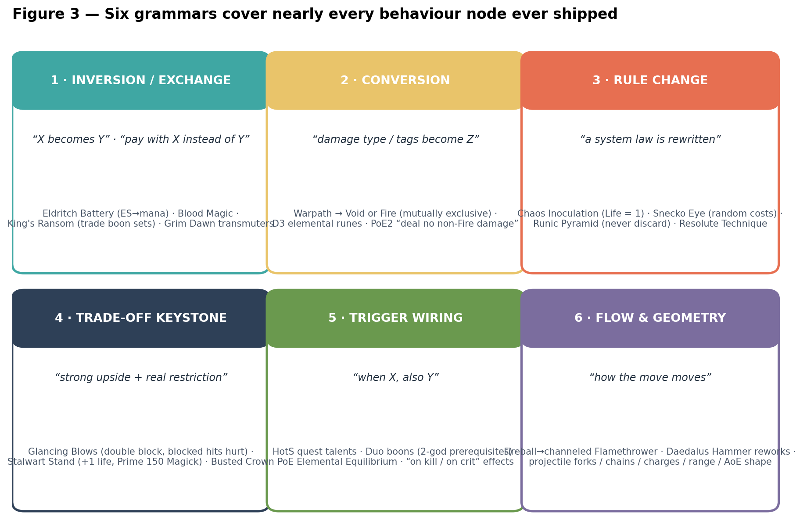
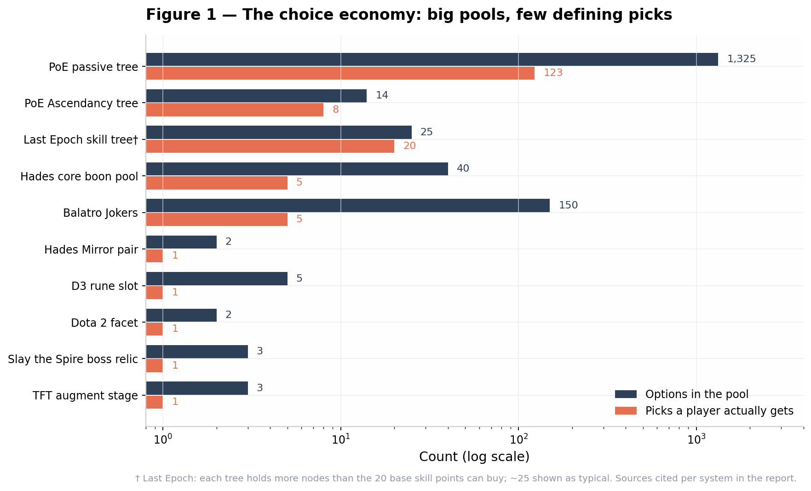
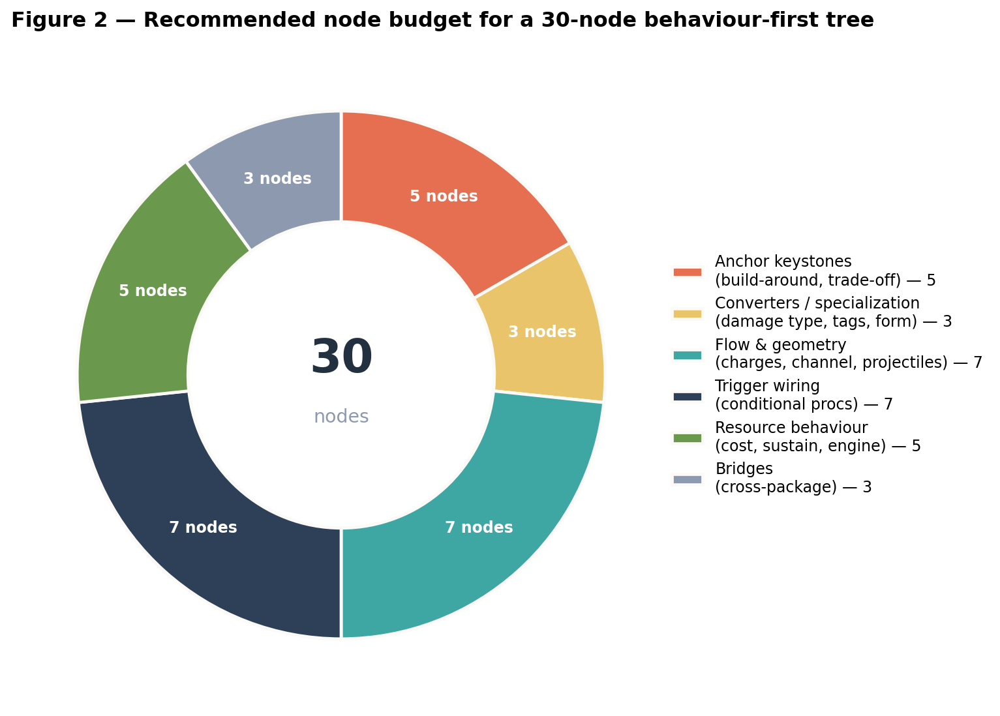
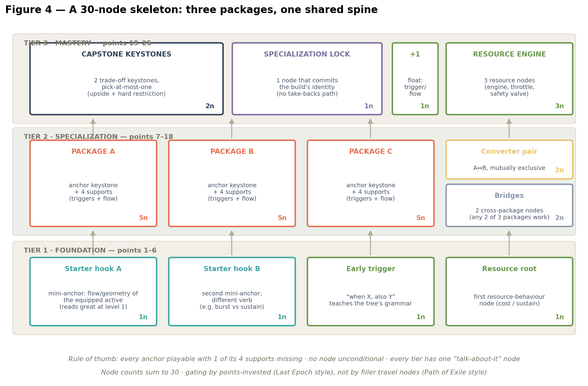

# Behaviour, Not Numbers: Skill-Tree Design for Three ~30-Node Class Trees

*A survey of behaviour-modifying node systems — Path of Exile keystones, Last Epoch skill trees, Hades boons, and nine adjacent reference points — distilled into design principles for small trees where every node changes how the game plays and none grant new actives or stack stats.*

---

## TL;DR — Direct Answers to the Three Questions

**1. What ratio of behaviour-nodes to support-nodes works?** In the reference systems that feel best, the *load-bearing* behaviour nodes — the ones players name their builds after — are always a minority: roughly **1 anchor per 5–7 nodes (15–20%)**, surrounded by **50–60% behaviour-supports** (triggers, flow/geometry, converters) and **20–30% conditional/contextual supports**. Path of Exile runs its entire build ecosystem on a few dozen keystones among **1,325** passive nodes [^6^]; a Hades run is defined by **5 core slot boons and 2 hammers** out of 15–25 pickups [^24^][^25^]. Since your constraint already bans pure "+X%" nodes, the ratio question is really *anchors : synergists : conditionals* — and the answer that keeps recurring across games is **~20 : 55 : 25**, with every support wired to a condition, a resource, or a tag rather than to a global multiplier.

**2. How few nodes can still create distinct builds?** Far fewer than intuition says. Build identity across every reference game is carried by **2–4 pivotal picks**, not by tree size: PoE's Ascendancy trees define builds with **8 points among 12–16 nodes** [^1^], Diablo 3 defined builds with **1 rune per skill** [^35^], Dota 2 facets do it with **1 pre-game choice of 2–3** [^65^]. A 30-node tree with **12–18 spendable points, ≥3 mutually exclusive anchor packages, and ≥4 synergists per anchor** can comfortably sustain **4–8 feel-distinct builds per class** — provided you measure distinctness by what the player *does*, not by permutation counts, which are mathematically huge and design-meaningless at any tree size [^9^].

**3. The known traps at small node counts.** Small trees amplify every classic failure: (a) **math-out dominance** — with no stat-noise to hide in, one node computes as best and the tree is solved; (b) **mandatory tax nodes** — a sustain node every build needs silently eats 10–20% of the tree; (c) **all-or-nothing packages** — synergy collapses if one node is missing; (d) **disguised stat nodes** — "+% in a trench coat"; (e) **combo explosion** from resource/echo nodes; (f) **illusion of breadth** — 30 nodes that play as 10 per build; (g) **gating and ordering errors** — front-loading filler or making capstones mandatory; (h) **legibility bloat** — behaviour nodes are text-heavy and 30 dense walls of text will not be read. Each is documented with shipped-game evidence and a mitigation in Section 5.

---

## 1. What "Behaviour Node" Actually Means

Before ratios and budgets, the term needs teeth, because most published "behaviour" nodes are secretly stat nodes. The working test used throughout this report is the **verb test**: a node is a behaviour node if and only if taking it changes *what the player presses, when they press it, where they stand, what they target, or how their resource flows*. If a node's entire effect can be factored out of the play pattern and into a damage spreadsheet — "enemies you hit deal 10% less damage," "your attacks are 15% faster" — it is a stat node wearing behaviour clothing, no matter how action-flavoured the wording. Blizzard's own retrospective on pre-Mists talent trees states the failure mode precisely: a model built on "tiny performance increases here and there" has "mathematically, nearly always a 'right' answer and a 'wrong' answer," and is "not a great model" [^45^]. The Mists redesign replaced those trees with six tiers of three mutually exclusive, playstyle-level choices — and the design conversation around it produced the most useful framing in the genre: old trees asked *what* your character can do (which always has a right answer), while good trees ask *how* your character does things (where three differently-shaped DPS options are all defensible) [^47^].

Surveying the shipped systems, nearly every behaviour node ever released fits **six grammars** — reusable sentence templates that designers can treat as a type system. **Inversion/exchange** nodes swap one axis for another ("spend Energy Shield before Mana," PoE's Eldritch Battery [^92^]). **Conversion** nodes rewrite damage type or tags, forcing gear and scaling to reorganize around them (Last Epoch's Warpath becoming Void or Fire [^17^]). **Rule changes** rewrite a system law (Chaos Inoculation setting maximum Life to 1 [^93^]; Slay the Spire's Snecko Eye randomizing all card costs [^53^]). **Trade-off keystones** pair a strong upside with a hard restriction (PoE2's Glancing Blows doubling block chance while blocked hits still deal 50% damage [^92^]). **Trigger wiring** attaches conditional effects ("when X, also Y"), from Heroes of the Storm quest talents [^74^] to Hades duo boons with two-god prerequisites [^26^]. **Flow & geometry** nodes alter the move itself — charges, channel behaviour, projectile count, range, area shape — the family that covers Diablo 3's skill runes [^35^], Hades' Daedalus Hammers [^25^], and Last Epoch's Fireball-to-channeled-Flamethrower transformation [^22^].

Two properties of this taxonomy matter for a 30-node project. The first is that **only three of the six grammars are unconditionally safe**: conversion, flow/geometry, and inversion change behaviour without directly printing power, which makes them the hardest to accidentally break. Trigger wiring and trade-off keystones are the most explosive — they compose multiplicatively with the rest of the system — and rule changes are the most fragile, because each one creates a precedent the rest of the design must respect forever (PoE's conversion-once rule in Grim Dawn exists precisely to stop rule-change nodes from double-dipping [^55^]). The second property is that **resource behaviour is a cross-cutting axis, not a seventh grammar**: Eldritch Battery is an inversion that happens to touch a resource; Hades II's "Prime" boons are trade-offs priced in maximum Magick [^33^]. Because your brief explicitly names resource behaviour as one of the three legal node domains, treat resource nodes as a budget line of their own — they are the single most common source of infinite-loop exploits in every game surveyed, and Section 5.5 is devoted to them.

---

## 2. How the Reference Systems Do It

### 2.1 Path of Exile: Keystones as Scarce, Double-Edged Rule-Changes

Path of Exile's passive tree is the genre's extreme case: **1,325 nodes** of which the overwhelming majority are small stat passives, with a character spending at most **123 points** (99 from levels, 23–24 from quests) [^6^][^7^][^2^]. The official description of keystones is the cleanest mission statement a behaviour node has ever had: they "fundamentally change the way a character is played by altering the game rules," and they "usually have one positive effect and one negative effect" — the cited example being Necromantic Aegis, which strips your shield's properties from you and grants them to your minions instead [^6^]. The paired downside is not decoration; it is the balance mechanism. Grinding Gear's own patch history shows the philosophy in motion: in version 3.11 the team relocated five of the most build-defining keystones out of rare Timeless Jewels and onto the tree itself, added three more keystones to support newer mechanics, and reworked clusters so that each would have "its own identity and function" rather than being interchangeable stat piles [^2^]. Modern PoE2 keystone text shows the grammar fully industrialized — a single node reads "75% of Damage Converted to Fire Damage; Deal no Non-Fire Damage; You have no Mana; Skill Mana Costs Converted to Life Costs," stacking conversion, restriction, and resource inversion into one build-around [^56^].

Three PoE sub-lessons transfer directly to a 30-node tree. First, **keystones are load-bearing enablers, not bonuses**: when a 2012 player argued Eldritch Battery was strictly the weakest of the Witch's three keystones, GGG designer Qarl responded that "by far the most abusive, overpowered character we have ever seen used Eldritch Battery (and no other keystone would have worked for what the build needed)" [^97^]. A behaviour node's value lies in what it *uniquely enables*, which is why nerfing such nodes by their median usage is a mistake — their power lives in the tail. Second, **keystones compose into engines**: documented builds stack Chaos Inoculation + Mind over Matter + Eldritch Battery + Divine Flesh into a single defensive economy where damage, recovery, and costs all route through one resource [^91^], and Chaos Inoculation alone reshapes gearing by freeing every chaos-resistance slot on equipment [^93^]. Third, PoE itself demonstrates the **small-tree proof** the user asked about: the Ascendancy system grants only **8 points** for trees of **12–16 passives**, where each notable costs 2 points (gated behind a lesser node) and marquee notables cost 4 — yet those 8 points are routinely "the central pillar of an entire build" [^1^]. Finally, the threshold-jewel lineage is a quiet warning: alternate quality gems, labyrinth enchants, and threshold jewels were three separate systems "trying to subtly modify the behaviour of skills," and GGG eventually merged all three into Transfigured Gems in 3.23 because behaviour-modifying content is so valuable that fragmenting it across systems was wasteful [^4^].

### 2.2 Last Epoch: A Whole Tree per Active Skill

Last Epoch is the closest structural match to the user's brief: every one of its 100+ skills carries **its own skill tree**, and a character may specialize in only **5 skills**, with each skill's tree fed by that skill's own XP track up to a base maximum of **20 points** (items can push the cap higher) [^11^][^13^]. Crucially, the trees were designed so that points "empower your Skills and can even transform them entirely" [^13^]. The transformation grammar is everywhere: Warpath can take Apocalypse Whirl or Earthscorcher — **mutually exclusive** nodes that strip the Physical tag and replace it with Void or Fire respectively, which immediately re-sorts every gear affix the player wants [^17^]; Hail of Arrows' Acid Rain converts base damage to Poison, swaps the tag, and converts all Bleed chance to Poison chance, turning a hit build into a DoT build [^14^]. An early promotional example remains the genre's clearest illustration of flow-grammar range on one skill: Fireball's Ghostfire makes it always pierce at reduced damage, while Flamethrower converts it into a channeled ability spewing seven projectiles per second with reduced range [^22^]. Community analysts have noted that a single Last Epoch skill tree "can offer what would be 5 or more different skill gems in PoE worth of variety" [^95^] — that is the economic argument for behaviour nodes in one sentence: one active plus a modifier tree replaces five separately-designed actives.

Last Epoch also ships two of the most instructive failure modes for small trees. The first is the **travel node problem**: players read the filler nodes required to path toward the interesting ones as a tax — "there is nothing really useful there but you need them to get where you want" [^15^]. In a 30-node tree where stats are banned outright, travel nodes cannot hide as "+10 dexterity"; any pure pathing cost will be instantly visible and instantly resented, which is why the blueprint in Section 6 replaces geographic gating with points-invested gating. The second is **inconsistent conversion rules**: Last Epoch's own community documentation warns that conversions "aren't handled consistently" across nodes — some convert base damage only, some convert added damage, some convert ailment chances — and that misunderstanding one "can be a costly and time consuming mistake" [^14^]. Behaviour nodes live or die on templating discipline; the exact scope of what changes must be mechanically identical in wording across the tree, or your 30 nodes will generate 30 FAQ threads. On process, Eleventh Hour's own dev blog describes prototyping each skill's numbers, effects, and parameters together with "how these things get integrated into other mechanics, specifically the skill tree" — the tree is designed *with* the skill, not after it [^18^].

### 2.3 Hades: Exclusivity, Replacement, and the Slot Economy

Hades solves the problem your brief poses — "modify the equipped active, never grant new ones" — with the most elegant mechanism in the survey: **five core slots** (Attack, Special, Cast, Dash, Call), each of which can hold **exactly one boon**. Taking Dionysus' cast means surrendering Aphrodite's; a god may offer to *replace* another's slot boon, bumping it one rarity tier while keeping its level [^24^]. The replacement rule converts what would be additive power creep into **forced lateral choice**: you can never have every core effect, so your five slots *are* your build. Builds are further disciplined by an invisible constraint — only four Olympian gods appear per run (Hermes sits outside the pool) — and by the community-documented "dead-end boon" trap, where defensive boons that occupy a god's slot without advancing toward tier-2, duo, or legendary boons quietly gut a run's damage [^99^]. Above the core layer sit the prerequisite-gated tiers: **12 Legendary boons** and the Duo boons are "Tier 3," each requiring specific earlier boons before they can even appear [^26^], and community analysis describes the best duos as ones that "change the mechanics of the game or a particular move in a way that is run-defining" — with the caveat that some duos are *so* load-bearing (Hunting Blades for Ares' cast) that their prerequisite core boon becomes a hidden mandatory pick [^99^].

The Daedalus Hammer is Hades' purest behaviour instrument and the closest analog to your "modify the equipped active" rule: a run offers at most **two Hammers** (three via a specific shop item), each weapon has its own private upgrade pool, some upgrades are **mutually exclusive**, and offerings cannot be re-rolled [^25^]. Hammer upgrades range from minor tweaks to ones that shift "the playstyle of the weapon entirely," and the community's selection doctrine is worth quoting as a design principle: the best Hammer "reinforces the move your build already leans on, not the one with the biggest number," and "a playstyle-shifting Hammer… usually beats a flat damage bump" [^28^]. The persistent Mirror of Night adds one more small-tree pattern: **twelve paired talents where only one version of each pair can be active**, switchable freely between runs [^41^] — a binary-choice grid that delivers twelve meaningful decisions from twenty-four node texts. Hades II kept the skeleton and hardened the trade-off grammar: many boons now **Prime** (permanently shrink your Magick pool) as their price [^33^], and the Zeus/Hera duo pair King's Ransom / Queen's Ransom literally asks you to *give up every boon of one god* to level the other's — the keystone trade-off grammar compressed into a shop decision [^33^]. Across both games, the meta-skill the system teaches is coherence: "pick one primary damage button" and let every later pickup scale it, protect it, or unlock a planned duo [^30^].

### 2.4 The Supporting Cast: Nine More Experiments in Few-Pick Builds

The headline three are corroborated by a strikingly consistent pattern elsewhere: **builds are defined by a handful of picks whose options are mutually exclusive**. Diablo 3 attached **five curated rune variants to every skill**, each redesigning the skill — converting elements, swapping cooldowns for resource costs, turning missiles into beams [^35^][^40^] — with free out-of-combat swapping; Polygon's retrospective argues the curation is exactly why it worked, producing "almost no default Rune picks in the game" [^34^]. Grim Dawn splits the difference with **3–5 Transmuters per mastery**, a dedicated class of modifier that "alters the basic function" of a skill and "can provide interesting trade-offs" [^50^]. Slay the Spire condenses the keystone into the boss relic — **one choice of three** — where Snecko Eye (+2 cards per turn, but all drawn cards cost a random 0–3) and Runic Pyramid (never discard at end of turn) rewrite the run's rules [^53^][^51^]; note that Runic Pyramid's explicit downside (−1 card per turn) was *removed* in a later patch, a reminder that trade-offs are tuned, not sacred [^51^]. Balatro builds its entire combo space on **5 Joker slots** against a 150-Joker pool [^44^], and its designer's published rules are the best node-writing guidelines available: descriptions of three lines or fewer, synergize with **general keywords, never specific other nodes**, and no "Exodia" combos that require an exact set [^49^]. TFT's augments (**one of three, three times per game**) are prized by Riot's own designers when they "change the way you have to approach building your team" so that boards "look SO different from what you'd normally see" [^68^][^60^]. Dota 2's 7.36 facets give every hero **2–3 locked pre-game options** that re-angle abilities [^65^]. Vampire Survivors hides its keystones behind **evolution recipes** — a maxed weapon plus a specific passive transforms into a new behaviour, and Unions even refund a slot [^61^][^62^]. Heroes of the Storm tiers, documented in Blizzard's own design post, reward **situational and combo-aware picks** (Thunder Burn "if I see two Warriors," Executioner "if I'm working well with someone like Malfurion") [^82^], while its failures were pruned outright — Li-Ming's Ess of Johan was removed when no tuning made it healthy [^85^].

World of Warcraft supplies the negative control: Cataclysm cut trees to 31 points explicitly to remove "filler talents you had to pick up to get to the next fun talent" [^36^], and Mists finished the job because tiny increases have "mathematically, nearly always a 'right' answer" [^45^]. Diablo 4's paragon boards show the complaint is still alive a decade later, with players calling the boards "a boring + stats node" grind [^96^] — the recurring lesson across all nine systems being that *fewer, mutually exclusive, behaviour-shaped picks* consistently outperform *many additive ones* at producing builds players can name.

| System | Pool size | Picks that define a build | Exclusivity mechanism | Trade-off present? | What the "anchor" is |
|---|---|---|---|---|---|
| PoE passive tree | 1,325 nodes [^6^] | ~123 pts; 0–3 keystones typical [^7^][^8^] | Tree distance / travel cost [^20^] | Yes — upside + downside by design [^6^] | Keystone (rule change) |
| PoE Ascendancy | 12–16 nodes [^1^] | 8 points [^1^] | Point gating (2- and 4-point notables) [^1^] | Rarely — mostly upside | Marquee notable |
| Last Epoch skill tree | ~20–30 nodes; 20 base points [^11^] | 5 specialization slots [^13^] | Mutually exclusive converters [^17^]; slot cap | Sometimes | Converter / transformer |
| Hades core boons | 8 gods × 5 core boons [^99^] | 5 slots [^24^] | One boon per slot, replacement [^24^] | Via H2 "Prime" costs [^33^] | Slot boon |
| Hades Hammers | ~10–15 per weapon [^28^] | 2 per run [^25^] | Mutually exclusive pairs [^25^] | Sometimes | Move rework |
| D3 skill runes | 5 per skill [^35^] | 1 per skill × 6 skills [^34^] | One rune per skill | Sometimes | Rune variant |
| Slay the Spire boss relic | 3 offered [^53^] | 1–2 per run | Choice-of-3, skip allowed | Almost always [^51^] | Rule-change relic |
| Balatro | 150 Jokers [^44^] | 5 slots [^44^] | Slot cap; duplicates banned [^44^] | Via econ cost | Engine Joker |
| TFT augments | 3 offered × 3 stages [^60^] | 3 per game | Choice-of-3 | Sometimes | Comp-warping augment |
| Dota 2 facets | 2–3 per hero [^65^] | 1, locked pre-game [^65^] | Locked choice | Sometimes | Facet |
| Grim Dawn transmuters | 3–5 per mastery [^50^] | 1 per skill line | One transmuter per skill | Yes, by design [^50^] | Transmuter |
| Vampire Survivors | ~15 weapon/passive pairs [^61^] | 2–4 evolutions per run | Recipe requires slot pair [^62^] | No | Evolution |
| Hades Mirror of Night | 12 pairs (24 versions) [^41^] | 1 per pair | Only one version active [^41^] | Rarely | Paired talent |

---

## 3. Principle One — The Ratio That Works: ~20% Anchors, ~55% Behaviour-Supports, ~25% Conditionals

Counting across the reference systems, a stable structural signature emerges: **the nodes that name builds are always a small minority, and they are always surrounded by a bench of synergists.** In a Hades run, the load-bearing picks are the 5 slot boons plus 2 hammers — call it 7 anchors — against a typical 15–25 total boons, with tier-2, duo, and legendary boons acting as the support layer that the anchors unlock [^24^][^25^][^26^]. In Last Epoch, a skill tree's identity is carried by one or two converter/transformer nodes, while the remaining 18-odd points buy triggers, flow modifiers, and scaling that re-organize around the conversion [^17^][^14^]. In PoE, a build might take 1–3 keystones out of 123 points — under 3% — yet those keystones dictate which of the tree's stat clusters are worth pathing to [^8^][^91^]. Even Balatro, where literally every card is a behaviour card, is community-solved into "engine Jokers" versus "support Jokers," with the 5-slot cap forcing roughly one engine, two scaling supports, and flex picks [^44^][^49^]. The ratio is not a target anyone designed toward; it is what survives contact with players, because **an anchor with no synergists is a dead pick, and synergists with no anchor are invisible**.

Translated to a 30-node tree where pure "+X%" is banned, the working budget is: **5 anchor keystones (~17%)** — build-around nodes with trade-offs or hard restrictions, each of which a player could name a build after; **3 converter/specialization nodes (~10%)**, ideally arranged as mutually exclusive pairs; **7 flow & geometry nodes (~23%)** — charges, channel behaviour, projectile count, range, area shape, the safest family for raw power-neutrality; **7 trigger-wiring nodes (~23%)** — "when X, also Y," each attached to a *specific* condition; **5 resource-behaviour nodes (~17%)** covering cost, sustain, and one engine interaction; and **3 bridge nodes (~10%)** that deliberately serve two packages at once. Grouped differently, that is roughly **20% anchors / 55% behaviour-supports / 25% conditional-and-resource supports**, and **zero unconditional global modifiers**. The historical argument for the zero rule is Blizzard's: unconditional small bonuses produce right answers, and right answers produce cookie-cutter trees [^45^]. Note that "support node" here does not mean weak — Hades' tier-2 boons and Last Epoch's post-conversion scaling nodes are frequently where a build's *power* lives; it means their job is to make an anchor's choice matter more, not to stand alone.

| Layer | Share of 30 | Grammar families | Job | Reference proof |
|---|---|---|---|---|
| Anchor keystones | 5 (~17%) | Trade-off, rule-change | Give the build a name and a restriction to build around | PoE keystones [^6^]; StS boss relics [^53^] |
| Converters / specialization | 3 (~10%) | Conversion, inversion | Re-sort scaling and gearing; mutually exclusive where possible | Warpath Void/Fire [^17^]; D3 element runes [^35^] |
| Flow & geometry | 7 (~23%) | Flow | Change how the equipped active moves and feels | Hammers [^25^]; Fireball→Flamethrower [^22^] |
| Trigger wiring | 7 (~23%) | Trigger | Create rotation and combo texture; unlock anchors | Duo/tier-2 boons [^26^]; HotS quest talents [^74^] |
| Resource behaviour | 5 (~17%) | Inversion, trade-off, trigger | Define the engine: how costs are paid and sustained | Eldritch Battery [^92^]; H2 Prime boons [^33^] |
| Bridges | 3 (~10%) | Any, dual-tagged | Let two packages share a bench; prevent siloed trees | Duo boons [^26^]; VS unions [^62^] |

One refinement separates trees that *read* build-defining from trees that *play* build-defining: **anchors must differ along orthogonal axes, not in magnitude.** Sid Meier's four characteristics of interesting decisions — trade-offs, situational relevance, personal/playstyle expression, and persistence — double as an anchor-design checklist [^84^]. If your five anchors are "five ways to deal damage," players will rank them and take the best; if they are *stationary-channel versus hit-and-run*, *spend-down versus build-up*, *self-buff versus enemy-debuff* — choices that "tie into the game situation" and "express your personal play style" — then no spreadsheet can settle them, which is exactly the property the Rollings & Morris formulation demands: no option clearly better, options not equally attractive, and enough information to choose [^79^]. Heroes of the Storm's documented tier design shows situational anchoring done right — the correct pick depended on map, enemy composition, and planned combos, so the answer literally could not be pre-computed [^82^]. Aim for anchors whose value is **context-dependent by construction**, and the ratio above becomes self-balancing: each anchor's situational niche is what justifies its five synergists.

## 4. Principle Two — Distinct Builds Come from 2–4 Pivotal Picks, Not from Tree Size

The single most liberating finding of the survey is how little it takes to define a build. Dota 2 does it with **one locked facet choice** per match [^65^]. Slay the Spire does it with **one boss relic** [^53^]. Diablo 3 does it with **one rune per skill** — and Polygon notes the system held up for over a decade with "almost no default picks" [^34^]. PoE's Ascendancy does it with **8 points**, of which typically one 4-point marquee notable is the actual foundation [^1^]. Hades does it with **5 slots and 2 hammers**, and veteran advice reduces the entire decision space to "pick one primary damage button" [^30^]. The theoretical reason is that builds are not counted, they are *recognized*: a PoE forum veteran, responding to someone computing astronomical passive-tree permutations, observed that "once you pass up perhaps 1000's of builds, the concept of builds starts becoming meaningless" — meaningful builds are build-categories crossed with keystones, and even in a system with millions of permutations, "only perhaps 10 will be top tier used by players" [^9^]. Distinctness lives in the **play pattern**, and a play pattern is established by a few pivotal commitments plus whatever scaffolding those commitments demand.

For a 30-node tree, the construction that guarantees felt distinctness is the **anchor-package model**: three or more anchor keystones, each orthogonally different (per Section 3), each attended by ≥4 synergist nodes, with mutual exclusivity doing the multiplicative work. Exclusivity is what turns few picks into many builds — Hades gets enormous variety from 5 picks because each slot excludes 7 alternatives [^24^]; Last Epoch's Warpath reads as three different skills because its two converters exclude each other [^17^]; the Mirror of Night gets 12 decisions from 24 texts because each pair excludes its sibling [^41^]. The arithmetic is encouraging: with 3 packages per class, a converter pair, and 2–3 bridge nodes enabling half-and-half hybrids, each class yields **4–8 genuinely different play patterns** (three pure packages, one converted variant of the favorite, two to three hybrids) — across three classes, **12–24 class-builds**, of which the meta will anoint perhaps 10, mirroring the reference games' funnel from possibility to viability [^9^]. The binding constraints are not node count but **bench depth** (each anchor needs ≥4 synergists or it cannot survive a bad matchup; Balatro's designer kills any card whose synergy is too narrow for the same reason [^49^]) and **bridging** (2–3 dual-purpose nodes so hybrid builds have something to buy; Hades' duo boons exist precisely to reward crossing packages [^26^]).

A caution about the opposite error completes the principle: **do not confuse node count with depth, and do not add nodes to look generous.** Rosewater's most cited lesson is that "Restrictions Breed Creativity" [^78^] — a 30-node tree with three sharp packages will produce more real builds than a 45-node tree whose extra 15 nodes are conditional mush, because mush dilutes every package's bench. PoE's own history shows the maintenance tax of the alternative: GGG had to rework clusters in 3.11 because "many passive skill clusters offered the same thing as other clusters, with the only differences being… location" [^2^]. The Mirror of Night is the standing proof that **twelve binary choices, freely swappable, can occupy players for hundreds of hours** [^41^]. If you find yourself wanting a 31st node, the survey's answer is unanimous: sharpen the 30 you have.

---

## 5. Principle Three — The Eight Traps at Small Node Counts

Small trees are unforgiving for one structural reason: **every node is a large percentage of the whole**. In PoE's 1,325-node tree a bad node is 0.08% of the design; in your 30-node tree it is 3.3%, and a bad *anchor* is a fifth of a package. Every failure below is documented in a shipped game, and every one is worse at 30 nodes than at 300.

| # | Trap | Signature symptom | Shipped evidence | Core mitigation |
|---|---|---|---|---|
| 5.1 | Math-out dominance | One node/pick on every build | WoW's "right answer" autopsy [^45^]; D3 rune-rank debate [^42^] | Trade-off grammar [^6^]; situational anchors [^84^] |
| 5.2 | Mandatory tax nodes | Sustain/travel node on 100% of builds | Hades dead-end boons [^99^]; LE travel nodes [^15^] | Fold into baseline or into an anchor |
| 5.3 | All-or-nothing packages | Archetype dead if one node skipped | Duo-prerequisite pain [^99^]; Balatro's anti-Exodia rule [^49^] | Graceful degradation; tag-level synergies |
| 5.4 | Disguised stat nodes | Nodes reduce to a DPS multiplier | D4 paragon backlash [^96^]; WoW filler purge [^36^] | The verb test; conditionals only |
| 5.5 | Combo explosion | One interaction breaks the economy | Qarl's "most abusive character" [^97^]; Runic Pyramid patch [^51^] | Mutual exclusion; conversion-once rules [^55^] |
| 5.6 | Illusion of breadth | 30 nodes play as ~10 per build | Pre-3.11 PoE cluster sameness [^2^] | Reachable-relevance audit per build |
| 5.7 | Gating & ordering errors | Boring first 5 points; mandatory capstone | Ascendancy 2-pointer structure [^1^]; hammer no-reroll rule [^25^] | Front-load identity; gate by investment |
| 5.8 | Legibility bloat | Players stop reading; FAQ storms | LocalThunk's 3-line rule [^49^]; LE conversion inconsistency [^14^] | One effect per node; rigid templates |

### 5.1 Math-Out Dominance

The defining risk of a no-stats tree is that behaviour nodes are *directly comparable in a way stat nodes never were*. A 1,325-node stat tree hides its balance behind noise — players argue about 5% efficiencies for years. A 30-node behaviour tree has no noise: each node's power is legible, and the best one gets identified within days. Blizzard's retrospective put it bluntly for stat trees — "mathematically, nearly always a 'right' answer and a 'wrong' answer" [^45^] — and the same logic applies to any node whose value is computable. Diablo 3's rune system shows both the danger and the solution: during beta, removing rune *ranks* provoked fears that one "equivalent-to-rank-5" effect per skill would be grossly overpowered and unsolvable [^42^], yet the shipped game escaped it largely through curation — five variants per skill that do *different jobs* (mobility, crowd control, damage type, cost structure), yielding "almost no default Rune picks" [^34^].

The mitigation toolkit has three layers, best used together. **Trade-off grammar** is the strongest: PoE's keystones have survived fifteen years of theorycrafting precisely because each carries "one positive effect and one negative effect," so the question is never "how strong is it?" but "can my build pay its price?" [^6^]. **Situational anchoring** is the second: Meier's "good decisions are situational" [^84^], executed literally in Heroes of the Storm where the right pick depends on map and enemy composition [^82^]. **Incomparable orthogonality** is the third: options that power along different axes (single-target burst vs. sustained area vs. utility) can't be ranked by one number. Where the game is a roguelike, a fourth layer appears for free — *offering variance masks imbalance*: Hades can ship boons of unequal median power because the slot-replacement economy and the four-god run pool mean players rarely get to pick the theoretical best [^24^][^99^]. In a persistent-character game with a static tree you do not have that cover, so the first three layers are mandatory.

### 5.2 Mandatory Tax Nodes

A tax node is one every build must buy regardless of identity — and at 30 nodes, a three-node tax is **10% of the entire tree** spent on a non-choice. The canonical examples: Last Epoch's travel nodes, which players describe as filler where "there is nothing really useful there but you need them to get where you want" [^15^]; PoE's attribute "roads," defended even by their defenders only as a "necessary evil" that exists to make traversal cost something [^20^]; and Hades' dead-end boons, which invert the pattern — they are *avoided* by experts because taking one stalls progression toward tier-2 and duo boons, a trap that punishes exactly the players who don't read wikis [^99^]. The most insidious tax in behaviour trees is the **mandatory sustain node**: the resource-regeneration or cost-reduction node that every functioning build needs. If one exists, every build has one fewer real choice, and — worse — the node's existence signals that the baseline resource economy is under-tuned.

Mitigation is subtraction, not balance: **if every build takes it, it should be baseline.** Bake universal sustain into the class or the active itself, and let resource nodes be *engines* (Eldritch Battery-style inversions that change what the resource *is* [^92^]) rather than *refills*. Hades II offers a subtler variant worth stealing: it prices strong boons in "Prime" — a permanent shrink of the Magick pool — converting a would-be tax into an explicit trade-off the player opts into [^33^]. And for pathing costs specifically, prefer **investment gating over geographic gating**: Last Epoch gates deep nodes by points already spent in that skill's tree [^11^], which costs the player nothing but commitment; PoE's model of charging filler nodes for distance is the expensive way to buy the same discipline [^20^]. At 30 nodes you cannot afford even one "+10 dexterity."

### 5.3 All-or-Nothing Packages

Synergy is the point of a behaviour tree, but packages that only function *complete* collapse catastrophically at small node counts, because each archetype's bench is shallow by definition. Hades documents both halves of this: the best duo boons are "run-defining" [^99^], yet chasing them means taking prerequisite boons "without knowing what duo you are chasing" is a named beginner failure [^30^] — and when a duo is *too* load-bearing (the community verdict that Hunting Blades is "almost necessary" for Ares' cast [^99^]), the package stops being a choice and becomes a script. Balatro's designer codified the defense as an actual rule: Jokers must "synergize with general keywords/stats, NOT specific Jokers," because a synergy that names one specific partner "will just make that synergy frustratingly rare" in a large pool — and the same arithmetic holds, amplified, in a small tree [^49^].

The working rule is **graceful degradation**: every anchor must remain playable with any one of its four synergists missing, and every synergist must do something legible without its anchor. Concretely, wire synergies to **tags and keywords** ("projectile," "fire," "channeled," "spent 30+ resource") rather than to sibling nodes; Last Epoch's tag system is the infrastructure-level version of this, where a conversion node re-tags the skill and thereby re-routes *every* external bonus, from gear to other nodes [^17^]. Reserve exact-pair effects for one or two deliberate "duo" moments per tree — Hades proves players treasure them [^26^] — and telegraph those clearly, ideally with the pair visible from the start so the chase is informed rather than blind [^30^].

### 5.4 Disguised Stat Nodes

The brief bans "just stacking numbers," but the ban is trivially evaded by wording: "enemies you hit are Slowed 15%" is a defensive stat node; "your attacks deal 20% of damage to a second target" is an offensive one. Neither changes what the player *does*. The genre's cautionary tale is Diablo 4's paragon system, which offers hundreds of nodes yet is received as "a boring + stats node" grind [^96^] — the same reception WoW's old trees earned before Blizzard pruned "filler talents you had to pick up to get to the next fun talent" [^36^]. The failure is not that the numbers are small; it is that the choice is fake. A slowed-enemies node never once changes a player's rotation, target priority, or positioning — it just silently widens the margin.

The **verb test** from Section 1 is the audit tool, but two refinements make it usable in practice. First, **procs collapse**: "on hit, X happens" is behaviour only if X changes follow-up decisions (Hades' knockback boons reposition enemies, which changes where you stand next [^24^]); if X is just more damage, the node is a multiplier with extra steps. Second, **conditional ≠ behaviour by itself** — "while above 70% resource, Y" is behaviour only if the player can and will manage the threshold (Slay the Spire's entire Watcher stance dance works because the player controls it). Hades' hammer doctrine is the tiebreaker to apply during review: prefer the node that "reworks a move" over "a flat damage bump," because the former "changes what your whole build can do" [^28^]. When a proposed node survives neither test, cut it — the tree is allowed to have fewer than 30 nodes; the market will not notice, but it will notice the one fake node.

### 5.5 Combo Explosion and Resource Loops

Behaviour nodes compose multiplicatively, and the composition surface grows faster than a 30-node tree can be playtested. The PoE Eldritch Battery anecdote is the permanent warning: players called the keystone weak for years while, in the designer's words, "by far the most abusive, overpowered character we have ever seen used Eldritch Battery (and no other keystone would have worked for what the build needed)" [^97^]. Documented endgame builds show the same compounding as a feature — Chaos Inoculation + Mind over Matter + Eldritch Battery + Divine Flesh fuse into a single-resource engine [^91^]. Resource-behaviour nodes are the repeat offenders because they feed themselves: cost-reduction enabling more casts enabling more triggers enabling more resource. Hades II's answer is to charge for the privilege in a finite currency — "Prime" maximum Magick — so every loop-enabling boon shrinks the very resource it exploits [^33^]. Slay the Spire's Runic Pyramid shows the live-tuning reality: its original downside (−1 card per turn) was later removed, and the relic's interaction with unplayable cards clogging a never-discarding hand remains the community's first lesson [^51^].

Containment mechanics from the survey, in order of reliability: **mutual exclusion** (Hades hammers simply cannot coexist with their most dangerous partners [^25^]; Mirror pairs make the choice binary [^41^]); **single-application rules** (Grim Dawn's conversion-once ordering, which exists specifically to prevent double-dipping through chained conversions [^55^]); **explicit cost spikes** (Prime [^33^]); and **internal caps** (Slay the Spire's ten-card hand limit quietly bounds Runic Pyramid [^51^]). One genre calibration matters here: in single-player roguelites, *breaking the game is a feature* — Balatro and Hades both let players assemble absurd engines because the run ends and resets [^44^][^24^]. In a persistent class-tree game, an exploded combo becomes the mandatory meta until nerfed, and nerfing a keystone whose power "lives in the tail" [^97^] destroys the build that loved it. At 30 nodes, budget for exclusion pairs *before* content lock: pick your three most dangerous node pairs and make them formally mutually exclusive.

### 5.6 The Illusion of Breadth

A 30-node tree advertises 30 choices; a given build actually sees the subset that is *reachable and relevant*, and that subset is routinely one-third of the tree. Tag-gating, converter locks, and package exclusivity all shrink the effective tree per build — which is exactly how the good systems work (Warpath's Fire and Void converters exclude each other, so no player ever uses both [^17^]), but it means **the design must be audited per-build, not in total**. The failure shape is the "silent third": three packages on paper where one package's nodes secretly also serve the dominant build, leaving the other two with benches of three. PoE hit this at scale before 3.11 — clusters that "offered the same thing as other clusters, with the only differences being the location" [^2^] — and fixed it by forcing each cluster to have "its own identity and function."

The audit is mechanical: for each intended build, list the nodes it would seriously consider, and require the count to be **≥60% of the tree** across builds, with **no node wanted by zero builds** and **no anchor wanted by all**. Nodes failing the second test are taxes (Section 5.2); builds failing the first are illusions. This is also where the three-class structure pays off: mechanics that can't fill a bench in one class tree may be a *bridge* in another — Hades' duo boons exist to make cross-package picks valuable, and they are deliberately rare (one or two per run) rather than a third of the pool [^26^].

### 5.7 Gating and Ordering Errors

Small trees are consumed fast, which makes *sequence* a first-class design variable. The reference systems front-load identity: Ascendancy's first two points arrive early and immediately open a notable path [^1^]; Hades can offer a hammer in the first room of a run, and because offerings cannot be re-rolled, that early choice already shapes the run [^25^]; Last Epoch hands out the first specialization slot almost immediately and staggers the rest to level 50, so the tree unfolds over the whole campaign [^13^]. The error to avoid is the inverse profile — five opening points of throat-clearing before anything interesting happens — which at 30 nodes means the first 15% of progression teaches the player that the tree is boring. Every tier should contain at least one node a player would screenshot to a friend.

The second ordering decision is **capstone discipline**. Deep nodes should be *worth* the investment without being *required* by it: Last Epoch gates by points-invested (deep nodes unlock as the skill levels [^11^]), and PoE's ascendancies price marquee notables at 4 of 8 points so that taking one forecloses a second until endgame [^1^] — a clean commitment mechanic. The third decision is **respec cost**, which is really a statement about how fast you expect the tree to be solved: PoE deliberately makes large respecs expensive because the designers "encourage players who want to try substantially divergent character builds to play a new character" [^6^]; Diablo 3 made swapping free and got endless experimentation within one character [^34^]. For a 30-node tree, free or cheap respec is the better default — the tree is small enough that players *will* solve it, and the retention comes from rotating between builds, not from being locked into the first one.

### 5.8 Legibility Bloat and Templating Drift

Behaviour nodes are text, and text is a budget. Balatro's designer scraps any Joker that can't be explained in **three lines**, on the theory that "if an idea takes too long to describe, I usually just scrap that idea entirely" — and, pointedly, that brevity *correlates with broader synergy potential* [^49^]. Thirty nodes of four-line abilities is a novella; thirty nodes of one-line abilities is a toy. The reference systems aim for one mechanical clause plus one number: "Your Specials fire +3 shots" (Hades II hammer [^29^]), "You are Blind; Blind does not affect your Light Radius; 25% more Melee Critical Strike Chance while Blinded" (PoE's Second Sight [^52^]). The second failure, templating drift, is slower and deadlier: Last Epoch's conversion nodes vary in exactly what they convert — base damage, added damage, ailment chances — and community guides warn that misreading one "can be a costly and time consuming mistake" [^14^]. In a 30-node tree, every node of the same grammar must use identical sentence structure, identical scope words, and identical ordering.

Two presentation techniques from the survey earn their place. **Visual re-skinning**: Diablo 3 changed each runed skill's textures and effects so the variant reads at a glance in play [^35^] — behaviour you can *see* needs no tooltip. **Guiding-light onboarding**: PoE's tree is famously overwhelming (its official page concedes the scale by teaching players to navigate via Notables and Keystones as landmarks [^6^]), and modern guides formalize the coping strategy — pick a keystone as a "checkpoint," path toward it, then ask "how do I mitigate the downside?" [^8^]. A 30-node tree can be learned whole in one read *if* its anchors are visually and spatially distinct: put the 5 anchors on large frames, the 3 converters on colored frames, and keep every support text under 15 words. The tutorialization budget you save is design capital you can spend on one more layer of depth where it matters.

---

## 6. The Applied Blueprint: One 30-Node Tree, End to End

Assembling the principles into a concrete skeleton: **three packages and a shared spine, gated by investment, in three tiers.** Tier 1 (points 1–6) sells the class fantasy immediately — two starter hooks that retune the equipped active's flow in different directions (one burst-flavoured, one sustain-flavoured), one early trigger that teaches the tree's "when X, also Y" grammar, and the first resource-behaviour node. Tier 2 (points 7–18) contains the build-defining mass: three packages of **anchor + 4 supports**, a mutually exclusive converter pair shared across packages, and 2 bridges. Tier 3 (points 19–25) holds commitment devices: two trade-off capstone keystones designed so a build takes **at most one**, one specialization lock, and the remaining resource-engine nodes. The counts sum to exactly 30, and — per Section 5.2 — gating is by points invested, Last Epoch style, so not one node exists to charge rent [^11^][^20^].

| Tier | Nodes | Contents | Design intent |
|---|---|---|---|
| 1 · Foundation (pts 1–6) | 4 | 2 starter hooks (flow), 1 early trigger, 1 resource root | Identity legible in the first session; no filler permitted |
| 2 · Specialization (pts 7–18) | 19 | 3 × (anchor + 4 supports), converter pair, 2 bridges | The build is chosen here; benches deep enough to survive Section 5.3 |
| 3 · Mastery (pts 19–25) | 7 | 2 capstone trade-offs (pick ≤1), 1 specialization lock, 3 resource-engine nodes, 1 flex | Commitment and engine completion; capstones optional, not mandatory |

The **three-class differentiation** should be grammatical, not cosmetic: give each class tree a different dominant grammar so the classes solve different problems. If Class A is resource-engine-centric (its anchors are inversions and trade-offs about how costs are paid — the Eldritch Battery lineage [^92^]), Class B is flow-centric (its anchors rework the geometry of the equipped active — the Hammer lineage [^25^]), and Class C is conversion/trigger-centric (its anchors re-tag and re-wire — the Warpath lineage [^17^]), then cross-class meta-discussion can't settle on a single "best tree pattern," and each class's balance levers are independent. Last Epoch's mastery structure shows the value of partial asymmetry: characters may invest in the first half of any mastery tree but only the second half of their chosen one, making the *deep* nodes the identity statement [^13^]. Your specialization-lock node plays the same role: it is the point past which the build is no longer pretending to be two things.

The **production workflow** that falls out of the survey is worth stating as a sequence, because several steps are audits that don't exist in stat-tree design. *(1) Verb inventory*: list what each equipped active physically does — projectiles, channels, charges, costs, cooldowns, tags — since every legal node must modify one of those verbs; Eleventh Hour prototypes the skill and its tree integration together for exactly this reason [^18^]. *(2) Anchor axes*: choose 3–5 orthogonal anchors per class and validate them against Meier's four characteristics (trade-off, situational, personal, persistent) [^84^]. *(3) Bench fill*: four synergists per anchor, keyword-wired, never sibling-wired [^49^]. *(4) Engine design*: the resource nodes as a closed loop with one deliberate throttle. *(5) Exclusion audit*: name the three most dangerous node pairs and make them formally exclusive [^25^]. *(6) Reachable-relevance audit* per build (≥60%, Section 5.6). *(7) Text pass*: 15-word supports, rigid templates, one clause per node [^49^][^14^]. *(8) Two-build playtest per class* — build the two most different packages and screenshot the play patterns; if the screenshots look alike, the builds aren't distinct. *(9) Tail review*: for each anchor, ask "what is the most abusive thing this enables?" before asking "how strong is it on median?" [^97^]. *(10) Kill-list review*: any node that survives two tuning passes unloved gets deleted, not re-tuned — Blizzard removed Ess of Johan rather than let a bad talent haunt the tier [^85^].

| Litmus test | Question asked | Pass condition |
|---|---|---|
| Verb test | Does it change what/when/where the player acts? | Yes, in one sentence |
| Spreadsheet test | Can it be factored into a DPS/EHP multiplier? | No (or it has a real restriction) |
| Trade-off test | What does taking it cost? | A named, felt price [^6^] |
| Degradation test | Is the anchor playable with any 1 support missing? | Yes [^49^] |
| Exclusivity test | Are the 3 most dangerous pairs formally exclusive? | Yes [^25^] |
| Relevance audit | Does each build see ≥60% of the tree? | Yes |
| Text audit | One clause, ≤15 words, strict template? | Yes [^49^] |
| Screenshot test | Do two builds look different in play? | Visibly |
| Tail audit | Is the worst-case combo known and priced? | Yes [^97^] |
| Kill-list audit | Has any node survived unloved twice? | Deleted [^85^] |

## 7. Caveats: Calibrating the Principles to Your Game

Everything above was derived from specific genres, and the calibration constants differ by context. **Roguelike versus persistent** is the largest: run-based games tolerate — even celebrate — broken combos because variance gates access (four gods per run [^99^], offerings that can't be re-rolled [^25^]) and the run resets the economy, whereas a persistent 30-node class tree has no variance to hide behind, so its anchors must be balanced by trade-off grammar and situational orthogonality alone (Sections 3 and 5.1). **Single-player versus competitive** is the second axis: rule-change nodes that would be delightful solo are pruned without mercy in competitive games — Heroes of the Storm deletes unhealthy talents [^85^], and Dota 2 locks facet choices before the match so opponents can at least reason about them [^65^]. If your three trees serve a co-op or PvP game, raise the weight of Section 5.5's exclusion audit and expect to own a kill list.

The third calibration is **swap cost as a design statement**. Diablo 3's free, out-of-combat rune swapping turns the tree into a loadout system — builds become situations, and experimentation is endless [^34^]; PoE's expensive respec turns the tree into identity — builds become commitments, and alt characters are the experimentation valve [^6^]. Neither is wrong, but they produce different 30-node trees: loadout-style trees want bigger benches and weaker locks (skip the specialization-lock node), while commitment-style trees want stronger locks and cheaper benches. Finally, a note on expectations: even the best systems funnel millions of theoretical builds into roughly ten played ones [^9^]. The design goal for your three trees is not maximal build *count*; it is that the handful of builds players actually run each feel like a different game — different verbs, different failures, different screenshots. That is the standard the reference games set, and 30 well-shaped nodes are more than enough to meet it.

---

[^1^]: https://pathofexile.fandom.com/wiki/Ascendancy_class
[^2^]: https://pathofexile.fandom.com/wiki/Passive_skill
[^4^]: https://www.poewiki.net/wiki/Threshold_jewel
[^6^]: https://www.pathofexile.com/passive-skill-tree
[^7^]: https://maxroll.gg/poe/getting-started/passive-skill-tree-for-beginners
[^8^]: https://mobalytics.gg/poe-2/guides/passive-skill-tree
[^9^]: https://www.pathofexile.com/forum/view-thread/57330/page/2
[^11^]: https://lastepoch.fandom.com/wiki/Skills
[^13^]: https://maxroll.gg/last-epoch/resources/passives-and-skills
[^14^]: https://maxroll.gg/last-epoch/resources/damage-explained
[^15^]: https://www.reddit.com/r/LastEpoch/comments/1kark7y/some_thoughts_on_the_skill_tree_design/
[^17^]: https://aggronaut.com/2024/03/05/last-epoch-and-skill-tags/
[^18^]: https://www.mmorpg.com/news/last-epoch-breaks-down-its-tedious-skill-design-process-in-new-dev-blog-2000135179
[^20^]: https://www.pathofexile.com/forum/view-thread/56793
[^22^]: https://odealo.com/articles/last-epoch-beginners-guide
[^24^]: https://hades.fandom.com/wiki/Boons
[^25^]: https://hades.fandom.com/wiki/Daedalus_Hammer
[^26^]: https://hades.fandom.com/wiki/Legendary_Boons
[^28^]: https://rogueranker.com/hades-2-daedalus-hammer/
[^29^]: https://hades2.wiki.fextralife.com/Daedalus+Hammer
[^30^]: https://hadesguides.com/hades/guides/boon-build-planning
[^33^]: https://hades2.wiki.fextralife.com/Boons
[^34^]: https://www.polygon.com/diablo-3-skill-runes/
[^35^]: https://diablo.fandom.com/wiki/Skill_Runes
[^36^]: https://worldofwarcraft.fandom.com/et/wiki/Talent
[^40^]: https://www.diablofans.com/forums/read-only-diablo-forums/diablo-iii-general-discussion/26194-recap-diablo-iii-skill-and-runes
[^41^]: https://hades.fandom.com/wiki/Mirror_of_Night
[^42^]: https://www.purediablo.com/no-more-rune-ranks-skill-balance-issues
[^44^]: https://balatrowiki.org/w/Jokers
[^45^]: https://www.wowhead.com/guide=5.0&talents
[^47^]: https://massivelyop.com/2022/07/18/the-soapbox-wows-talent-trees-dont-deserve-your-nostalgia/
[^49^]: https://www.reddit.com/r/balatro/comments/1czo9g0/guidelines_for_joker_design/
[^50^]: https://grimdawn.fandom.com/wiki/Masteries
[^51^]: https://slay-the-spire.fandom.com/wiki/Runic_Pyramid
[^52^]: https://pathofexile.fandom.com/wiki/Keystone
[^53^]: https://slaythespire.wiki.gg/wiki/Snecko_Eye
[^55^]: https://www.grimdawn.com/guide/gameplay/combat/
[^56^]: https://poe2db.tw/us/Keystone
[^60^]: https://leagueoflegends.fandom.com/wiki/Augment_(Teamfight_Tactics)
[^61^]: https://vampire-survivors.fandom.com/wiki/Evolution
[^62^]: https://vampire.survivors.wiki/w/Evolution
[^65^]: https://www.dota2.com/patches/7.36
[^68^]: https://teamfighttactics.leagueoflegends.com/en-us/news/game-updates/augments-augmented/
[^74^]: https://heroesofthestorm.fandom.com/wiki/Quest_Talent
[^78^]: https://www.youtube.com/watch?v=QHHg99hwQGY
[^79^]: https://critical-gaming.com/blog/2011/4/12/interesting-choices-interesting-gameplay-pt1.html
[^82^]: https://news.blizzard.com/en-us/article/14665104/from-the-bullpen-designing-the-talent-system
[^84^]: https://www.gamedeveloper.com/design/gdc-2012-sid-meier-on-how-to-see-games-as-sets-of-interesting-decisions
[^85^]: https://esportsedition.com/heroes-of-the-storm/heroes-of-the-storm-a-closer-look-at-the-talent-system/
[^91^]: https://pobarchives.com/build/RREnX4eR
[^92^]: https://www.rpgstash.com/blog/path-of-exile-2-best-keystone-passives-guide
[^93^]: https://www.aoeah.com/news/3735--poe-2-best-chaos-inoculation-builds--ci-mechanic-explained
[^95^]: https://www.reddit.com/r/LastEpoch/comments/190sq4j/skill_tree_design/
[^96^]: https://www.reddit.com/r/diablo4/comments/12yfqew/paragon_boardsam_i_missing_something/
[^97^]: https://www.pathofexile.com/forum/view-thread/19656
[^99^]: https://gamefaqs.gamespot.com/boards/253544-hades/80274981
